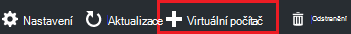
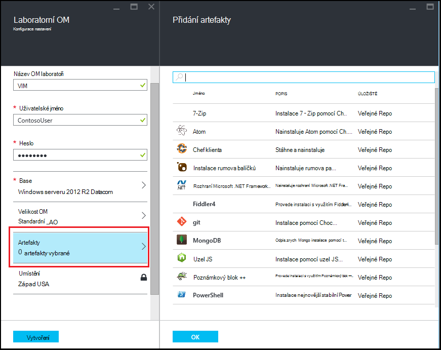
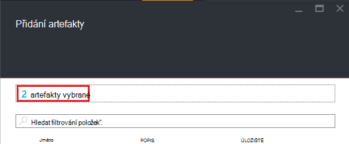

<properties
    pageTitle="Přidání OM s artefakty laboratorní v Azure DevTest Labs | Microsoft Azure"
    description="Naučte se přidávat OM s artefakty v Azure DevTest Labs"
    services="devtest-lab,virtual-machines"
    documentationCenter="na"
    authors="tomarcher"
    manager="douge"
    editor=""/>

<tags
    ms.service="devtest-lab"
    ms.workload="na"
    ms.tgt_pltfrm="na"
    ms.devlang="na"
    ms.topic="article"
    ms.date="08/30/2016"
    ms.author="tarcher"/>

# Přidání OM s artefakty laboratorní v Azure DevTest Labs

> [AZURE.VIDEO how-to-create-vms-with-artifacts-in-a-devtest-lab]

Vytvoření virtuálního počítače v laboratoři z *základní* , která je [vlastní obrázek](./devtest-lab-create-template.md), [vzorec](./devtest-lab-manage-formulas.md)nebo [Marketplace obrázek](./devtest-lab-configure-marketplace-images.md).

DevTest Labs *artefakty* umožňují určit *Akce* provádí při vytvoření OM. 

Artefakt akce můžete provádět postupů například pracovního skripty Windows Powershellu spuštění flám příkazů a instalaci softwaru. 

Artefakt *Parametry* umožňují přizpůsobit artefakt pro konkrétní nefunguje.

Tento článek popisuje, jak vytvořit virtuálního počítače v laboratoři s artefakty.

## Přidání OM s artefakty

1. Přihlaste se k [portálu Azure](http://go.microsoft.com/fwlink/p/?LinkID=525040).

1. Vyberte **Další služby**a pak vyberte **DevTest Labs** ze seznamu.

1. V seznamu labs vyberte médiu, ve kterém chcete vytvořit OM.  

1. Na zásuvné **Přehled** laboratoři vyberte **+ virtuální počítač**.  
    

1. Na zásuvné **Zvolit o základu** vyberte o základu OM.

1. Na zásuvné **virtuálního počítače** zadejte název nového virtuálního zařízení v textovém poli **název virtuálního počítače** .

    

1. Zadejte **Uživatelské jméno** , které se k ní mít udělený oprávnění správce v počítači virtuální.  

1. Pokud chcete použít heslo uložené ve vašem *tajná úložiště*, zaškrtněte políčko **použít tajemství z mé tajná úložiště**a zadejte hodnoty klíče, která odpovídá tajná (heslo). V opačném jednoduše hesla textového pole zadejte popisky **Zadejte hodnotu**.
 
1. Vyberte **velikost virtuálního počítače** a vyberte jednu z předdefinovaných položek, které určují jádra procesoru, RAM velikost a velikost pevného disku OM vytvořit.

1. Vyberte **virtuální sítě** a potom na požadovanou virtuální síť.

1. Vyberte **podsítě** a vyberte podsítě.

1. Pokud je laboratorní zásady nastaveno umožňuje veřejnou IP adres pro vybrané podsítě, určete, jestli mají IP adresu byl veřejný výběrem **Ano** nebo **Ne**. Tato možnost je v opačném zakázané a zúžený **č**. 

1. Vyberte **artefakty** - ze seznamu artefakty - a vyberte konfigurovat artefakty, které chcete přidat na základní obrázek. 
**Poznámka:** Pokud pro vás novinka DevTest Labs nebo konfigurace artefakty, přejděte k části [Přidání existující artefakt do virtuálního počítače](#add-an-existing-artifact-to-a-vm) a vraťte se tady po dokončení.

1. Pokud chcete zobrazit nebo zkopírovat správce prostředků Azure, přejděte k části [uložení správce prostředků Azure šablony](#save-arm-template) a sem vrátit po dokončení.

1. Výběrem možnosti **vytvořit** zadaný OM přidáte testovacím prostředí.

1. Laboratorní zásuvné zobrazí stav OM vytváření; nejdřív jako **vytváření**, pak jako **spuštěný** po OM byl spuštěn.

1. Přejděte k [Dalším krokům](#next-steps) . 

## Přidat existující artefakt do virtuálního počítače

Při vytváření virtuálního počítače, můžete přidat existující artefakty. Každý laboratorní obsahuje artefakty z veřejné DevTest Labs artefakt úložiště, stejně jako artefakty, které jste vytvořené a přidané do vlastního artefakt úložiště.
Zjistěte, jak vytvořit artefakty, najdete v tomto článku, [Naučte se vytvářet vlastní artefakty pro použití s DevTest Labs](devtest-lab-artifact-author.md).

1. Vyberte **artefakty**na zásuvné **virtuálního počítače** . 

1. Na zásuvné **Přidat artefakty** vyberte požadované artefakt.  

    

1. Zadejte požadovaný parametr hodnoty a nepovinných parametrů, které potřebujete.  

1. Vyberte **Přidat** k přidání artefakt a vraťte se na zásuvné **Přidat artefakty** .

1. Pokračujte v přidávání artefakty v případě potřeby pro vaše OM.

1. Po přidání vaší artefakty, můžete [změnit pořadí, ve kterém se mají spustit artefaktům](#change-the-order-in-which-artifacts-are-run). Můžete taky se vrátit k [zobrazení nebo úpravám artefaktem](#view-or-modify-an-artifact).

## Změna pořadí, ve kterém se mají spustit artefakty

Ve výchozím nastavení akce artefaktům provádějí v takovém pořadí, ve kterém se přidají angličtině. Následující kroky popisují, jak změnit pořadí, ve kterém se mají spustit artefaktům.

1. V horní části zásuvné **Přidat artefakty** zvolte odkaz udává počet artefakty, které byly přidány bude v angličtině.

    

1. Pokud chcete určit pořadí, ve kterém se mají spustit artefaktům, přetáhněte myší artefaktům do požadovaného pořadí. **Poznámka:** Pokud máte potíže přetáhnete artefakt, ujistěte se, že přetáhnete na levé straně artefakt. 

1. Klikněte na **OK** po dokončení.  

## Zobrazit nebo upravit artefaktem

Podle těchto kroků ukazují, jak zobrazit nebo upravit parametry artefaktem:

1. V horní části zásuvné **Přidat artefakty** zvolte odkaz udává počet artefakty, které byly přidány bude v angličtině.

    

1. Na zásuvné **Vybrané artefakty** vyberte artefaktu, který chcete zobrazit nebo upravit.  

1. Na zásuvné **Přidat artefakt** udělejte všechny potřebné změny a klikněte na **OK** zavřete zásuvné **Přidat artefakt** .

1. Klikněte na **OK** zavřete zásuvné **Vybrané artefakty** .

## Uložení šablony správce prostředků Azure

Správce prostředků Azure šablona poskytuje deklarativně definovat opakující nasazení. Následující kroky popisují, jak uložit šablonu správce prostředků Azure OM vzniku.
Po uložení můžete použít Správce prostředků Azure šablonu, kterou chcete [nasadit nové VMs s Azure Powershellu](../azure-resource-manager/resource-group-overview.md#template-deployment).

1. Na zásuvné **virtuálního počítače** vyberte **Zobrazit ARM šablonu**.

1. Na **zásuvné zobrazit Azure správce prostředků šablonu**vyberte text šablony.

1. Zkopírování vybraného textu do schránky.

1. Klikněte na **OK** zavřete **zásuvné zobrazit Azure správce prostředků šablonu**.

1. Otevřete textový editor.

1. Vložte text šablony ze schránky.

1. Uložení souboru pro pozdější použití.

[AZURE.INCLUDE [devtest-lab-try-it-out](../../includes/devtest-lab-try-it-out.md)]

## Další kroky

- Po vytvoření OM můžete připojit k OM výběrem **Připojit** na zásuvné OM.
- Zjistěte, jak [vytvořit vlastní artefakty pro vaše OM Labs DevTest](devtest-lab-artifact-author.md).
- Procházení [Galerie šablon DevTest Labs ARM rychlý úvod](https://github.com/Azure/azure-devtestlab/tree/master/ARMTemplates)