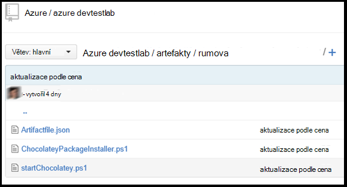

<properties 
    pageTitle="Vytvoření vlastní artefakty pro vaše OM Labs DevTest | Microsoft Azure"
    description="Zjistěte, jak vytvářet vlastní artefakty pro použití s DevTest Labs"
    services="devtest-lab,virtual-machines"
    documentationCenter="na"
    authors="tomarcher"
    manager="douge"
    editor=""/>

<tags
    ms.service="devtest-lab"
    ms.workload="na"
    ms.tgt_pltfrm="na"
    ms.devlang="na"
    ms.topic="article"
    ms.date="08/25/2016"
    ms.author="tarcher"/>

#Vytvoření vlastní artefakty pro vaše DevTest Labs OM

> [AZURE.VIDEO how-to-author-custom-artifacts] 

## Základní informace
**Artefakty** slouží k nasazení a konfiguraci aplikace po zřízení virtuálního počítače. Artefaktem se skládá ze souboru definice artefakt a jiné soubory skript, které jsou uložené ve složce v úložišti libovolná. Artefakt definice soubory obsahují JSON a výrazy, které můžete určit, co chcete nainstalovat virtuálního počítače. Můžete například definovat název artefakt, spuštění příkazu a parametrů, které jsou k dispozici při spuštění příkazu. Můžete odkázat na další soubory skript v souboru definice artefakt podle názvu.

##Formát souboru definice artefakt
Následující příklad ukazuje v částech, které tvoří základní struktura souboru definice.

    {
      "$schema": "https://raw.githubusercontent.com/Azure/azure-devtestlab/master/schemas/2015-01-01/dtlArtifacts.json",
      "title": "",
      "description": "",
      "iconUri": "",
      "targetOsType": "",
      "parameters": {
        "<parameterName>": {
          "type": "",
          "displayName": "",
          "description": ""
        }
      },
      "runCommand": {
        "commandToExecute": ""
      }
    }

| Název elementu | Povinné? | Popis
| ------------ | --------- | -----------
| $schema      | Ne        | Umístění souboru JSON schéma, které pomáhají při testování platnosti soubor definice.
| Název        | Ano       | Název artefakt zobrazené v testovacím prostředí.
| Popis  | Ano       | Popis artefakt zobrazené v testovacím prostředí.
| iconUri      | Ne        | Identifikátor URI Ikona zobrazená v testovacím prostředí.
| targetOsType | Ano       | Operační systém OM nainstalovanou artefakt. Jsou podporované možnosti: Windows a Linux.
| Parametry   | Ne        | Hodnoty, které jsou k dispozici při spuštění příkaz artefakt nainstalovat na počítač. Tato funkce umožňuje přizpůsobení vaší artefakt.
| SpustitPříkaz   | Ano       | Artefakt nainstalovat příkaz, který se spustí na virtuálního počítače.

###Parametry artefakt

V části Parametry souboru definice zadejte hodnoty, které uživatel může zadat při instalaci artefaktem. Můžete odkázat na tyto hodnoty v příkazu artefakt nainstalovat.

Definovat parametry budou následující strukturu.

    "parameters": {
        "<parameterName>": {
          "type": "<type-of-parameter-value>",
          "displayName": "<display-name-of-parameter>",
          "description": "<description-of-parameter>"
        }
      }

| Název elementu | Povinné? | Popis
| ------------ | --------- | -----------
| Typ         | Ano       | Typ hodnoty parametrů. Prohlédněte si seznam pod pro povolené typy:
| displayName Ano       | Název parametru, který se zobrazí uživateli v testovacím prostředí.
| Popis  | Ano       | Popis parametru, který se zobrazí v testovacím prostředí.

Jsou povolené typy:

- řetězec – libovolný platný řetězcový JSON
- Funkce INT – libovolné platné JSON celé číslo
- Logická hodnota – libovolný platný JSON logické
- matice – libovolný platný JSON matice

##Artefakt výrazech a funkcích

Můžete použít výraz a funkcí k vytvoření artefakt nainstalujte příkaz.
Výrazy jsou uzavřeny hranatých závorkách ([a]) a jsou vyhodnoceny je nainstalovaná artefakt. Výrazy můžete umístit na libovolné místo v hodnotu řetězce JSON a vždy vrátí jinou hodnotu JSON. Pokud je potřeba použít literál typu řetězec, který začíná závorek [, je nutné použít dva hranaté závorky [[.
Obvykle můžete pomocí výrazů s funkcemi vytvářet hodnotu. Stejně jako v JavaScript, volání funkce jsou formátované jako functionName(arg1,arg2,arg3)

Následující seznam obsahuje běžné funkce.

- Parameters(parameterName) – vrátí hodnotu parametru, který je k dispozici při spuštění příkazu artefakt.
- propojit (arg1, arg2, arg3,...) - spojí několik textových hodnot. Tato funkce může trvat libovolný počet argumentů.

Následující příklad ukazuje, jak vytvářet hodnoty pomocí funkcí a výrazů.

    runCommand": {
         "commandToExecute": "[concat('powershell.exe -File startChocolatey.ps1'
    , ' -RawPackagesList ', parameters('packages')
    , ' -Username ', parameters('installUsername')
    , ' -Password ', parameters('installPassword'))]"
    }

##Vytvořit vlastní artefakt

Vytvořte vlastní artefakt podle následujících kroků:

1. Instalace JSON editor - budete potřebovat editor JSON pro práci s definicemi artefakt. Doporučujeme používat [Visual Studio kód](https://code.visualstudio.com/), který je k dispozici pro Windows, Linux a OS X.

1. Ukázka artifactfile.json vstoupí rezervování souborů artefakty vytvořil Azure DevTest Labs týmu na naše [úložiště GitHub](https://github.com/Azure/azure-devtestlab) , kde jsme vytvořili bohaté knihovny artefakty, které vám pomohou vytvořit vlastní artefakty. Stáhněte si soubor definice artefakt a ho chcete vytvořit vlastní artefakty měnit.

1. Můžete využít technologie IntelliSense - technologie IntelliSense využití zobrazíte platné prvky, které lze použít k vytvoření souboru definice artefakt. Taky uvidíte různé možnosti pro hodnoty prvek. Například technologie IntelliSense vidíte dvě možnosti systému Windows nebo Linux při úpravě **targetOsType** element.

1. Úložiště artefakt v úložišti libovolná
    1. Vytvořte samostatný adresář pro každou artefakt název adresáře se shoduje s názvem artefakt.
    1. Uložte soubor definice artefakt (artifactfile.json) v adresáři, který jste vytvořili.
    1. Obsahují skriptů, které odkazují příkazu artefakt instalovat.

    Tady je příklad, jak může vypadat artefakt složky:

    

1. Přidání úložiště artefakty médiu - najdete pod odkazy v článku [Přidání úložiště artefakt libovolná k laboratoři](devtest-lab-add-artifact-repo.md).

[AZURE.INCLUDE [devtest-lab-try-it-out](../../includes/devtest-lab-try-it-out.md)]

## Související příspěvky
- [Jak řešit problémy s neúspěšný artefakty v AzureDevTestLabs](http://www.visualstudiogeeks.com/blog/DevOps/How-to-troubleshoot-failing-artifacts-in-AzureDevTestLabs)
- [Připojte virtuálního počítače do existující AD domény pomocí šablony ARM v Azure vývojářů laboratorní](http://www.visualstudiogeeks.com/blog/DevOps/Join-a-VM-to-existing-AD-domain-using-ARM-template-AzureDevTestLabs)

## Další kroky

- Zjistěte, jak [Přidat úložišti libovolná artefakt k laboratoři](devtest-lab-add-artifact-repo.md).
