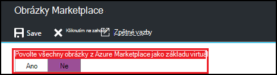
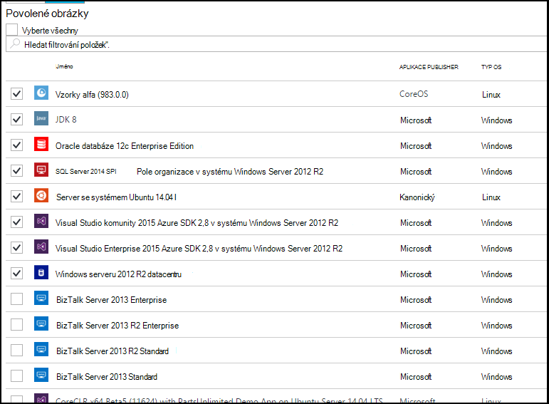

<properties
    pageTitle="Konfigurace nastavení obrázku z webu Azure Marketplace v Azure DevTest Labs | Microsoft Azure"
    description="Konfigurace, které obrázky z Azure Marketplace lze použít při vytváření virtuálního počítače v Azure DevTest Labs"
    services="devtest-lab,virtual-machines"
    documentationCenter="na"
    authors="tomarcher"
    manager="douge"
    editor=""/>

<tags
    ms.service="devtest-lab"
    ms.workload="na"
    ms.tgt_pltfrm="na"
    ms.devlang="na"
    ms.topic="article"
    ms.date="09/06/2016"
    ms.author="tarcher"/>

# Konfigurace nastavení obrázku z webu Azure Marketplace v Azure DevTest Labs

DevTest Labs podporuje vytváření VMs založené na Azure Marketplace obrázky v závislosti na konfiguraci Azure Marketplace obrázky se nemusí používat v vaší laboratoři. Tento článek ukazuje, jak určit, které případné obrázky z Azure Marketplace lze použít při vytváření VMs v laboratoři.

## Vyberte, které obrázky z Azure Marketplace jsou povoleny při vytváření virtuálního počítače

1. Přihlaste se k [portálu Azure](http://go.microsoft.com/fwlink/p/?LinkID=525040).

1. Vyberte **Další služby**a pak vyberte **DevTest Labs** ze seznamu.

1. V seznamu labs vyberte požadované testovacím prostředí. 

1. Na zásuvné laboratoři vyberte **konfiguraci**.
    
1. Na zásuvné **Konfigurace** v laboratoři vybíráte **obrázky Marketplace**

1. Určete, jestli chcete, aby všechny kvalifikovaný Azure Marketplace obrázky, které chcete být k dispozici pro použití jako základ nového OM. Pokud vyberete možnost **Ano**, jsou v testovacím prostředí povoleny všechny obrázky z Azure Marketplace, které splňují všechny následující podmínky:

    - Obrázek vytvoří jednu OM **a**
    - Obrázek používá k poskytování VMs **a** správce prostředků Azure
    - Obrázek nevyžaduje koupit další licence plán
    
    Pokud chcete žádné obrázky povoleno nebo chcete určit, které obrázky lze použít, vyberte **Ne**.
 
    
 
1. Pokud vyberete **Ne** předchozí krok, je povolený zaškrtávací políčko **Povolit obrázky nebo vybrat všechny** . Tuto možnost, můžete použít společně s vyhledávacím polem rychle zaškrtněte nebo zrušte výběr všech položek v seznamu zobrazeny.
Můžete také vybrat obrázky z Azure Marketplace, kterou chcete povolit pro vytvoření OM jednotlivě zaškrtněte odpovídající políčko jednotlivé obrázky.
Pokud nechcete, aby žádné obrázky z Azure Marketplace se nemusí používat v testovacím prostředí, vyberte nic ze seznamu.

    

[AZURE.INCLUDE [devtest-lab-try-it-out](../../includes/devtest-lab-try-it-out.md)]

## Další kroky

Nakonfigurované tak, jak jsou povoleny Azure Marketplace obrázků, při vytváření virtuálního počítače, dalším krokem je přidat [OM do vaší laboratoři](./devtest-lab-add-vm-with-artifacts.md).