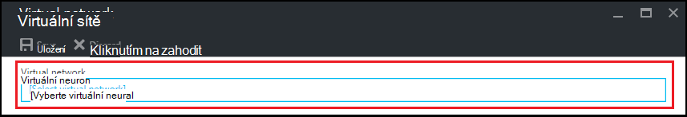

<properties
    pageTitle="Konfigurace virtuální sítě v Azure DevTest Labs | Microsoft Azure"
    description="Zjistěte, jak konfigurovat existující virtuální sítě a podsítě a jejich použití v OM s Azure DevTest Labs"
    services="devtest-lab,virtual-machines"
    documentationCenter="na"
    authors="tomarcher"
    manager="douge"
    editor=""/>

<tags
    ms.service="devtest-lab"
    ms.workload="na"
    ms.tgt_pltfrm="na"
    ms.devlang="na"
    ms.topic="article"
    ms.date="09/06/2016"
    ms.author="tarcher"/>

# Konfigurace virtuální sítě v Azure DevTest Labs

Se dozvíte v článku [Přidání OM s artefakty laboratoři](devtest-lab-add-vm-with-artifacts.md), když vytvoříte virtuálního počítače v laboratoři, můžete určit nakonfigurované virtuální síť. Jeden scénář to je, pokud potřebujete přístup k vaší síti corpnet zdrojů z vaší VMs pomocí virtuální síť, která byla nakonfigurována ExpressRoute nebo VPN k webu. Následující části ukazují, jak přidat existující virtuální síti do nastavení laboratoři virtuální sítě tak, aby byla k dispozici na výběr při vytváření VMs.

## Konfigurace virtuální sítě pro laboratorní pomocí portálu Azure
Následující kroky vás postupem přidání existující virtuální sítě (a podsítě) laboratoři tak, že jej lze použít při vytváření virtuálního počítače v testovacím prostředí stejné. 

1. Přihlaste se k [portálu Azure](http://go.microsoft.com/fwlink/p/?LinkID=525040).

1. Vyberte **Další služby**a pak vyberte **DevTest Labs** ze seznamu.

1. V seznamu labs vyberte požadované testovacím prostředí. 

1. Na zásuvné laboratoři vyberte **konfiguraci**.

1. Na zásuvné **Konfigurace** laboratoři vyberte **virtuální sítě**.

1. Na zásuvné **virtuální sítě** se zobrazí seznam virtuálních sítí nakonfigurován pro aktuální médiu, stejně jako výchozí virtuální síť, která se vytvoří vaší laboratoři. 

1. Zvolte **+ Přidat**.

    
    
1. Na zásuvné **virtuální sítě** vyberte **[vyberte virtuální sítě]**.

    
    
1. Na zásuvné **virtuální síť zvolte** vyberte požadované virtuální sítě. Zásuvné zobrazuje virtuální sítí, které jsou v oblasti stejné v předplatného jako testovacím prostředí.  

1. Po výběru virtuální sítě, vrátíte se na zásuvné **virtuální sítě** a některá pole jsou povolené.  

    

1. Zadejte popis virtuální sítě / laboratorní kombinaci.

1. Pokud chcete, aby podsítě se nemusí používat v laboratoři vytváření OM, vyberte **Použít ve počítače virtuální vytváření**.

1. Pokud chcete, aby veřejné IP adres v podsítě, vyberte **Povolit VEŘEJNOU IP**.

1. V poli **Maximální VIRTUÁLNÍCH počítačích uživatele** zadejte maximální VMs za uživatele pro všechny podsítě. Pokud budete potřebovat neomezený počet VMs, ponechejte toto pole prázdné.

1. Vyberte **Uložit**.

1. Teď je nakonfigurovaný virtuální sítě, mohou být vybrány při vytváření virtuálního počítače. Přečtěte si, jak vytvořit virtuálního počítače a určení virtuální sítě, najdete pod odkazy v článku [Přidání OM s artefakty laboratoři](devtest-lab-add-vm-with-artifacts.md). 

[AZURE.INCLUDE [devtest-lab-try-it-out](../../includes/devtest-lab-try-it-out.md)]

## Další kroky

Po přidání požadované virtuální sítě vaší laboratoři dalším krokem je přidat [OM do vaší laboratoři](devtest-lab-add-vm-with-artifacts.md).