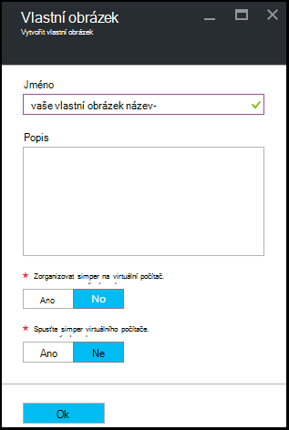

<properties
    pageTitle="Správa vlastní obrázky Azure DevTest Labs vytvořit VMs | Microsoft Azure"
    description="Naučte se vytvářet vlastní obrázek ze souboru virtuální pevný disk nebo z existující OM v Azure DevTest Labs"
    services="devtest-lab,virtual-machines"
    documentationCenter="na"
    authors="tomarcher"
    manager="douge"
    editor=""/>

<tags
    ms.service="devtest-lab"
    ms.workload="na"
    ms.tgt_pltfrm="na"
    ms.devlang="na"
    ms.topic="article"
    ms.date="09/07/2016"
    ms.author="tarcher"/>

# Správa vlastní obrázky Azure DevTest Labs vytvořit VMs

V Azure DevTest Labs vlastní obrázky umožňují rychle vytvořit VMs bez nutnosti čekání všechny software požadovaný do cílového počítače nainstalovat. Vlastní obrázky umožňují předem nainstalovat všechny software, který budete potřebovat v souboru virtuálního pevného disku a pak vytvořit virtuálního počítače pomocí souboru virtuální pevný disk. Protože je už nainstalovaná software, údaje o času vytvoření OM je mnohem rychlejší. Kromě toho vlastní obrázky slouží k klonovat VMs vytvořením vlastního obrázku z virtuálního počítače a pak vytvoření VMs z této vlastní obrázek.

V tomto článku se naučíte, jak:

- [Vytvořit vlastní obrázek ze souboru virtuálního pevného disku](#create-a-custom-image-from-a-vhd-file) , aby virtuálního počítače můžete pak vytvořit z této vlastní obrázek. 
- [Vytvořit vlastní obrázek z virtuálního počítače](#create-a-custom-image-from-a-vm) pro rychlé klonováním OM.

## Vytvoření vlastního obrázku ze souboru virtuální pevný disk

V této části najdete v článku jak vytvářet vlastní obrázek ze souboru virtuální pevný disk.
Musíte mít přístup k souboru platné virtuální pevný disk k provedení všech kroků v této části.   

1. Přihlaste se k [portálu Azure](http://go.microsoft.com/fwlink/p/?LinkID=525040).

1. Vyberte **Další služby**a pak vyberte **DevTest Labs** ze seznamu.

1. V seznamu labs vyberte požadované testovacím prostředí.  

1. Na zásuvné laboratoři vyberte **konfiguraci**. 

1. Na zásuvné **Konfigurace** laboratorní vyberte **vlastní obrázky**.

1. Na zásuvné **vlastní obrázky** vyberte **+ vlastní obrázek**.

    

1. Zadejte název vlastní obrázek. Tento název se zobrazí v seznamu základní obrázků, při vytváření virtuálního počítače.

1. Zadejte popis vlastní obrázek. Tento popis se zobrazí v seznamu základní obrázků, při vytváření virtuálního počítače.

1. Vyberte **soubor virtuální pevný disk**.

1. Pokud máte přístup k souboru virtuálního pevného disku, který není uvedený, přidejte ho podle pokynů uvedených v části [Odeslat soubor virtuálního pevného disku](#upload-a-vhd-file) a sem vrátit po dokončení.

1. Vyberte požadovaný soubor virtuální pevný disk.

1. Klikněte na **OK** zavřete zásuvné **Virtuální pevný disk soubor** .

1. Vyberte **OS konfiguraci**.

1. Na kartě **s operačním systémem konfigurace** vyberte **systému Windows** nebo **Linux**.

1. Pokud je vybrána **Windows** , určete pomocí zaškrtávacího políčka zda *Sysprep* byl spuštěn v počítači.

1. Klikněte na **OK** zavřete zásuvné **Konfigurace operačního systému** .

1. Kliknutím na **OK** vytvořte vlastní obrázek.

1. Přejděte k [Dalším krokům](#next-steps) .

###Nahrání souboru virtuální pevný disk

Pokud chcete přidat vlastní obrázek, musíte mít taky přístup k souboru virtuální pevný disk.

1. Na zásuvné **Soubor virtuálního pevného disku** klikněte na **Nahrát soubor virtuální pevný disk pomocí prostředí PowerShell**.

    

1. Další zásuvné zobrazí pokyny pro úpravy a systémem skript Powershellu, který, odešlou se vaše předplatné Azure souboru virtuální pevný disk. 
**Poznámka:** Tento postup může být delší v závislosti na velikosti souboru virtuálního pevného disku a rychlosti připojení.

## Vytvoření vlastního obrázku z virtuálního počítače
Pokud máte OM, které už nakonfigurovali, můžete vytvořit vlastní obrázek z této OM a poté použít tuto vlastní obrázek vytvořit další identickými VMs. Podle těchto kroků ukazují, jak vytvořit vlastní obrázek z virtuálního počítače:

1. Přihlaste se k [portálu Azure](http://go.microsoft.com/fwlink/p/?LinkID=525040).

1. Vyberte **Další služby**a pak vyberte **DevTest Labs** ze seznamu.

1. V seznamu labs vyberte požadované testovacím prostředí.  

1. Na zásuvné laboratoři vyberte **virtuálních počítačích**.
 
1. Na zásuvné **virtuálních počítačích** vyberte OM, ze kterého chcete vytvořit vlastní obrázek.

1. V OM zásuvné vyberte **vytvořit vlastní obrázek (virtuálního pevného disku)**.

    

1. Na zásuvné **Vytvořit obrázek** zadejte název a popis pro vlastní obrázek. Tyto informace se zobrazují v seznamu základů při vytváření virtuálního počítače.

    

1. Vyberte, jestli sysprep po spuštění v OM. Pokud sysprep nebyl spustit OM, určete, jestli mají sysprep spouštělo při virtuálního počítače je vytvořená z tento vlastní obrázek.

1. Kliknutím na **OK** po vytvoření vlastní obrázek.

[AZURE.INCLUDE [devtest-lab-try-it-out](../../includes/devtest-lab-try-it-out.md)]

## Související příspěvky

- [Vlastní obrázky nebo vzorců?](https://blogs.msdn.microsoft.com/devtestlab/2016/04/06/custom-images-or-formulas/)
- [Kopírování vlastní obrázky mezi Azure DevTest Labs](http://www.visualstudiogeeks.com/blog/DevOps/How-To-Move-CustomImages-VHD-Between-AzureDevTestLabs#copying-custom-images-between-azure-devtest-labs)

##Další kroky

Po přidání vlastní obrázek pro použití při vytváření virtuálního počítače, dalším krokem je přidat [OM do vaší laboratoři](./devtest-lab-add-vm-with-artifacts.md).