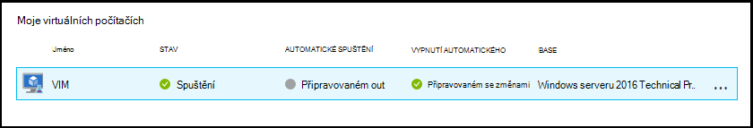
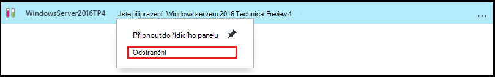

<properties
    pageTitle="Správa vzorce v Azure DevTest Labs vytvořit VMs | Microsoft Azure"
    description="Naučte se vytvářet, aktualizovat, odebrat Azure DevTest Labs vzorce a použít k vytvoření nové VMs."
    services="devtest-lab,virtual-machines"
    documentationCenter="na"
    authors="tomarcher"
    manager="douge"
    editor=""/>

<tags
    ms.service="devtest-lab"
    ms.workload="na"
    ms.tgt_pltfrm="na"
    ms.devlang="na"
    ms.topic="article"
    ms.date="08/30/2016"
    ms.author="tarcher"/>

# Správa DevTest Labs vzorce vytvořit VMs

Vzorec v Azure DevTest Labs je seznam výchozí hodnoty vlastností slouží k vytvoření virtuálního počítače (OM). Při vytváření virtuálního počítače vzorce, výchozí hodnoty mohou sloužit jako-je nebo upravit. Vzorce jako [vlastní obrázky](./devtest-lab-create-template.md) a [obrázky na Tržiště](./devtest-lab-configure-marketplace-images.md)poskytují mechanismus pro rychlé vytváření OM.  

V tomto článku se dozvíte, jak provádět následující úkoly:

- [Vytvoření vzorce](#create-a-formula)
- [Zřízení virtuálního počítače pomocí vzorce](#use-a-formula-to-provision-a-vm)
- [Úprava vzorce](#modify-a-formula)
- [Odstranění vzorce](#delete-a-formula)

> [AZURE.NOTE] Vzorce - jako [vlastní obrázky](./devtest-lab-create-template.md) – umožňují vytvořit základní obrázek ze souboru virtuální pevný disk. Základní obrázek pak lze vytvořit nové OM. Se můžete rozhodnout, které je nejlepší pro konkrétní prostředí, přečtěte si článek [Comparing vlastní obrázky a vzorců v DevTest Labs](./devtest-lab-comparing-vm-base-image-types.md).

## Vytvoření vzorce
Každý, kdo má oprávnění DevTest Labs *Uživatelé* je moct vytvářet VMs pomocí vzorce jako základ. Existují dva způsoby vytváření vzorců: 

- Z o základu - použijte, když chcete definovat všechny znaky vzorec.
- Z existující laboratorní OM - použijte, když chcete vytvořit vzorec na základě nastavení z existující OM.

### Vytvoření vzorce od základní
Podle těchto kroků vás provede jednotlivými kroky vytvoření vzorce z vlastního obrázku, Marketplace obrázek nebo jiný vzorec.

1. Přihlaste se k [portálu Azure](http://go.microsoft.com/fwlink/p/?LinkID=525040).

1. Vyberte **Další služby**a pak vyberte **DevTest Labs** ze seznamu.

1. V seznamu labs vyberte požadované testovacím prostředí.  

1. Na zásuvné laboratoři vyberte **vzorce (opakovaně použitelný základu)**.

    

1. Na zásuvné **laboratorní vzorce** vyberte **+ Přidat**.

    

1. Na zásuvné **Zvolit o základu** vyberte base (vlastní obrázek, Marketplace obrázek nebo vzorec), ze kterého chcete vytvořit vzorec.

    

1. Na zásuvné **vytvořit vzorec** zadejte tyto hodnoty:

    - **Vzorce název** : Zadejte název pro vzorce. Tato hodnota zobrazí se v seznamu základní obrázky při vytváření virtuálního počítače. Název proběhne, jak ho zadáte, a pokud není platný zpráva označí požadavky pro platný název.
    - **Popis** : Zadejte výstižný popis vzorec. Tato hodnota je k dispozici vzorce místní nabídka při vytváření virtuálního počítače.
    - **Uživatelské jméno** – zadejte jméno uživatele, který se k ní mít udělený oprávnění správce.
    - **Hesla** – zadejte - nebo vyberte z rozevíracího seznamu - hodnota, která je přidružená k tajná (heslo), který chcete použít pro zadaný uživatel.  
    - **Obrázek** – toto pole zobrazuje název základní obrázek, který jste vybrali na předchozí zásuvné. 
    - **Virtuální počítač velikost** – vyberte jednu z předdefinovaných položek, které určují jádra procesoru, RAM velikost a velikost pevný disk OM vytvořit.
    - **Virtuální sítě** - určete požadované virtuální sítě.
    - **Podsítě** - určete požadované podsítě.
    - **Veřejnou IP adresu** – Pokud je laboratorní zásady nastaveno povolit veřejnou IP adres pro vybrané podsítě, určete, jestli mají IP adresu byl veřejný výběrem **Ano** nebo **Ne**. Tato možnost je v opačném zakázané a zúžený **č**.
    - **Artefakty** – vyberte a konfigurace artefakty, které chcete přidat na základní obrázek. Zabezpečené řetězec, který se neuloží hodnoty pomocí vzorce. Proto nejsou zobrazeny artefakt parametrů, které jsou zabezpečené řetězce. 

        

1. Výběrem možnosti **vytvořit** vzorec vytvoříte.

### Vytvoření vzorce z virtuálního počítače
Podle těchto kroků vás provede jednotlivými kroky vytvoření vzorce založeného na existující OM. 

> [AZURE.NOTE] Pokud chcete vytvořit vzorec virtuálního počítače, OM musí vytvořených po 30 březen 2016. 

1. Přihlaste se k [portálu Azure](http://go.microsoft.com/fwlink/p/?LinkID=525040).

1. Vyberte **Další služby**a pak vyberte **DevTest Labs** ze seznamu.

1. V seznamu labs vyberte požadované testovacím prostředí.  

1. Na zásuvné **Přehled** laboratoři vyberte OM, ze kterého chcete vytvořit vzorec.

    

1. Na zásuvné OM vyberte možnost **vytvořit vzorec (opakovaně použitelný základní)**.

    

1. Na zásuvné **vytvořit vzorec** zadejte **název** a **Popis** pro nový vzorec.

    

1. Klikněte na **OK** vytvořte vzorec.

## Zřízení virtuálního počítače pomocí vzorce
Po vytvoření vzorce, můžete vytvořit OM založené na tento vzorec. V části [Přidání OM s artefakty](devtest-lab-add-vm-with-artifacts.md#add-a-vm-with-artifacts) vás provede procesu.

## Úprava vzorce
Chcete-li upravit vzorce, postupujte takto:

1. Přihlaste se k [portálu Azure](http://go.microsoft.com/fwlink/p/?LinkID=525040).

1. Vyberte **Další služby**a pak vyberte **DevTest Labs** ze seznamu.

1. V seznamu labs vyberte požadované testovacím prostředí.  

1. Na zásuvné laboratoři vyberte **vzorce (opakovaně použitelný základu)**.

    

1. Na zásuvné **laboratorní vzorce** vyberte vzorec, který chcete upravit.

1. Na zásuvné **aktualizace vzorec** proveďte požadované úpravy a vyberte **Aktualizovat**.

## Odstranění vzorce 
Odstranění vzorce, postupujte takto:

1. Přihlaste se k [portálu Azure](http://go.microsoft.com/fwlink/p/?LinkID=525040).

1. Vyberte **Další služby**a pak vyberte **DevTest Labs** ze seznamu.

1. V seznamu labs vyberte požadované testovacím prostředí.  

1. Na zásuvné laboratorní **Nastavení** klikněte na **vzorce**.

    

1. Na zásuvné **laboratorní vzorce** vyberte tři tečky napravo od vzorec, který chcete odstranit.

    

1. V dialogu vzorce místní nabídky vyberte **Odstranit**.

    

1. Dialog potvrzení odstranění vyberte **Ano** .

[AZURE.INCLUDE [devtest-lab-try-it-out](../../includes/devtest-lab-try-it-out.md)]

## Související příspěvky

- [Vlastní obrázky nebo vzorců?](https://blogs.msdn.microsoft.com/devtestlab/2016/04/06/custom-images-or-formulas/)

## Další kroky
Po vytvoření vzorce pro použití při vytváření virtuálního počítače, dalším krokem je přidat [OM do vaší laboratoři](./devtest-lab-add-vm-with-artifacts.md).