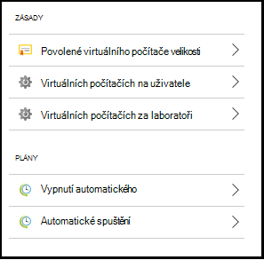
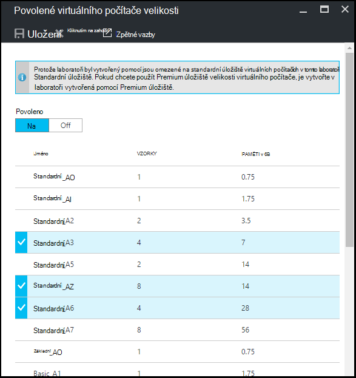
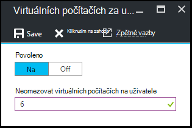
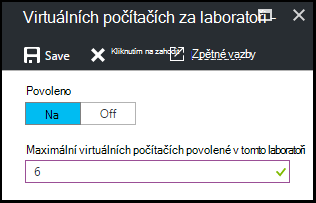
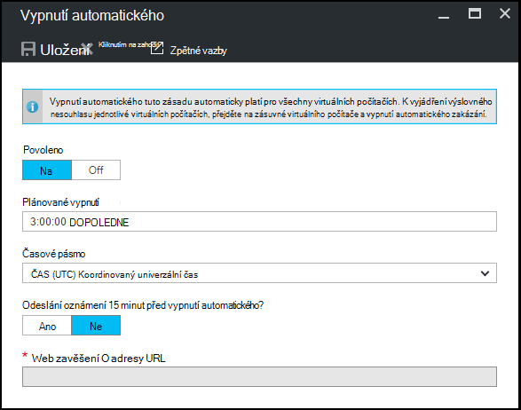
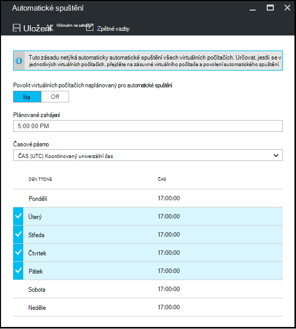

<properties
    pageTitle="Definování zásad laboratorní v Azure DevTest Labs | Microsoft Azure"
    description="Informace o definování zásad laboratorní například OM rozměrů, maximální VMs za uživatele a vypnutí automatizace."
    services="devtest-lab,virtual-machines"
    documentationCenter="na"
    authors="tomarcher"
    manager="douge"
    editor=""/>

<tags
    ms.service="devtest-lab"
    ms.workload="na"
    ms.tgt_pltfrm="na"
    ms.devlang="na"
    ms.topic="article"
    ms.date="09/12/2016"
    ms.author="tarcher"/>

# Definování zásad laboratorní v Azure DevTest Labs

> [AZURE.VIDEO how-to-set-vm-policies-in-a-devtest-lab]

Azure DevTest Labs umožňuje zadat klíčové zásad, které umožňují řídit náklady a minimalizovat odpady ve vaší labs. Tyto zásady laboratorní obsahují maximální počet VMs vytvořen za uživatele a laboratorní a různé možnosti vypnutí automatického a automatické spuštění. 

## Přístup k laboratoři zásady Azure DevTest Labs

Následující postup vám pomůže nastavení zásad pro laboratorní v Azure DevTest Labs:

Pokud chcete zobrazit (a změna) zásad pro laboratoři, postupujte takto:

1. Přihlaste se k [portálu Azure](http://go.microsoft.com/fwlink/p/?LinkID=525040).

1. Vyberte **Další služby**a pak vyberte **DevTest Labs** ze seznamu.

1. V seznamu labs vyberte požadované testovacím prostředí.   

1. Vyberte **Nastavení**.

1. **Nastavení zásad** zásuvné obsahuje nabídku nastavení, které můžete použít: 

    

    Další informace o nastavení zásad, vyberte ji z následujícího seznamu:

    - [Povoleno virtuálního počítače velikosti](#set-allowed-virtual-machine-sizes) – vyberte seznam formátů OM povolené v testovacím prostředí. Uživatel může vytvořit VMs pouze z tohoto seznamu.

    - [Virtuálních počítačích za uživatele](#set-virtual-machines-per-user) – zadejte maximální počet VMs vytvořené uživatelem. 

    - [Virtuálních počítačích za laboratorní](#set-virtual-machines-per-lab) – zadejte maximální počet VMs vytvořené pro laboratoři. 

    - [Vypnutí automatického](#set-auto-shutdown) – zadat dobu, kdy aktuální testovacím prostředí společnosti VMs automaticky vypnout.

    - [Automatické spuštění](#set-auto-start) - určete čas, kdy aktuální médiu VMs automaticky otevřou.

## Nastavení povolené velikosti virtuální počítač

Zásady pro nastavení povolené velikosti OM pomáhá při umožňuje určit, které OM velikosti jsou povoleny v testovacím prostředí minimalizovat laboratorní odpadu. Pokud aktivaci tuto zásadu pouze OM velikosti z tohoto seznamu mohou sloužit k vytvoření VMs.

1. Na zásuvné **nastavení zásad** laboratoři vyberte **povolených virtuálních počítačích velikosti**.

    
 
1. Vyberte **na** povolit tuto zásadu a **vypnutí** jak ho zakázat.

1. Pokud povolíte tuto zásadu, vyberte jeden nebo více velikosti OM, vytvořených ve vaší laboratoři.

1. Vyberte **Uložit**.

## Nastavení virtuálních počítačích na uživatele

Zásady pro **virtuálních počítačích za uživatele** vám umožní určit maximální počet VMs, které můžete vytvořit tak, že jednotlivé uživatele. Pokud uživatel se pokusí vytvořit virtuálního počítače při splnění omezení počtu uživatelů, označuje chybová zpráva, že OM nejde vytvořit. 

1. Na zásuvné **nastavení zásad** laboratoři vyberte **virtuálních počítačích za uživatele**.

    

1. Vyberte **na** povolit tuto zásadu a **vypnutí** jak ho zakázat.

1. Pokud povolíte tuto zásadu, zadejte číselnou hodnotu označující maximální počet VMs vytvořené uživatelem. Pokud zadáte číslo neplatnou předponou, v uživatelském rozhraní zobrazí maximální počet pro toto pole.

1. Vyberte **Uložit**.

## Nastavení virtuálních počítačích na laboratoři

Zásady pro **virtuálních počítačích za laboratorní** vám umožní určit maximální počet VMs vytvořené pro aktuální testovacím prostředí. Pokud uživatel se pokusí vytvořit virtuálního počítače při splnění limit laboratorní, chybová zpráva značí, nelze OM. 

1. Na zásuvné **nastavení zásad** laboratoři vyberte **virtuálních počítačích za laboratorní**.

    

1. Vyberte **na** povolit tuto zásadu a **vypnutí** jak ho zakázat.

1. Pokud povolíte tuto zásadu, zadejte číselnou hodnotu označující maximální počet VMs vytvořené pro aktuální testovacím prostředí. Pokud zadáte číslo neplatnou předponou, v uživatelském rozhraní zobrazí maximální počet pro toto pole.

1. Vyberte **Uložit**.

## Nastavení automatického vypnutí

Vypnutí automatického zásad pomáhá minimalizovat laboratorní odpadu umožňuje zadat údaj o čase, vypněte tento laboratorní VMs.

1. Na zásuvné **nastavení zásad** laboratoři vyberte **Automatické vypnutí**.

    

1. Vyberte **na** povolit tuto zásadu a **vypnutí** jak ho zakázat.

1. Pokud povolíte tuto zásadu, zadejte místní čas na vypnout všechny VMs v aktuálním laboratoři.

1. Vyberte **Uložit**.

1. Ve výchozím nastavení po povolení platí tyto zásady pro všechny VMs v aktuálním laboratoři. Z konkrétní OM odebrat toto nastavení používají, otevřete OM zásuvné a změňte jeho **vypnutí automatické** nastavení 

## Nastavit automatické spuštění

Automatické spuštění zásad vám umožní určit při VMs v aktuálním laboratoři by měl být zahájen.  

1. Na zásuvné **nastavení zásad** laboratoři vyberte **Automatické spuštění**.

    

1. Vyberte **na** povolit tuto zásadu a **vypnutí** jak ho zakázat.

1. Pokud povolíte tuto zásadu zadejte místní naplánovaná počáteční čas a dny v týdnu, pro které platí čas. 

1. Vyberte **Uložit**.

1. Po povolení této zásady se nepoužije automaticky pro všechny VMs v aktuálním laboratoři. Použít toto nastavení používají konkrétní OM, otevřete OM zásuvné a změnit nastavení **Automatické spuštění** 

[AZURE.INCLUDE [devtest-lab-try-it-out](../../includes/devtest-lab-try-it-out.md)]

## Další kroky

Jakmile si definované a použít různé OM nastavení zásad pro vaší laboratoři, tady jsou některé věci zkusit další:

- [Konfigurace správy náklady](./devtest-lab-configure-cost-management.md) - ukazuje, jak používat graf **Měsíční trendů odhad nákladů**  
Pokud chcete zobrazit aktuální měsíc je odhadovanou nákladů k datu a plánované náklady na konci měsíce.
- [Vytvořit vlastní obrázek](./devtest-lab-create-template.md) – při vytváření virtuálního počítače, zadáte základ, který může být buď vlastní obrázek nebo Marketplace. Tento článek ukazuje, jak vytvořit vlastní obrázek ze souboru virtuální pevný disk.
- [Konfigurace Marketplace obrázků](./devtest-lab-configure-marketplace-images.md) - Azure DevTest Labs podporuje vytváření VMs založené na obrázky z Azure Marketplace. Tento článek ukazuje, jak určit, které případné obrázky z Azure Marketplace lze použít při vytváření VMs v laboratoři.
- [Vytvoření OM v laboratoři](./devtest-lab-add-vm-with-artifacts.md) - ukazuje, jak vytvořit virtuálního počítače z základní obrázku (buď vlastní nebo Marketplace) a jak pracovat s artefakty ve vaší OM.
