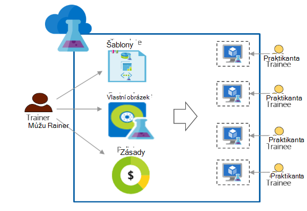

<properties
    pageTitle="Použití Azure DevTest Labs pro vzdělávání | Microsoft Azure"
    description="Naučte se používat Azure DevTest Labs školení scénářích."
    services="devtest-lab,virtual-machines"
    documentationCenter="na"
    authors="steved0x"
    manager="douge"
    editor=""/>

<tags
    ms.service="devtest-lab"
    ms.workload="na"
    ms.tgt_pltfrm="na"
    ms.devlang="na"
    ms.topic="article"
    ms.date="09/12/2016"
    ms.author="sdanie"/>

# Použití Azure DevTest Labs školení

Azure DevTest Labs mohou sloužit k provádění mnoha klíčové scénáře kromě vývojářů nebo zkoušení. Jednu z těchto scénářích je nastavení laboratorní pro vzdělávání. Azure DevTest Labs umožňuje vytvářet laboratorní kterého můžete přidat vlastní šablony, které každý praktikanta můžete použít k vytvoření identické a izolace prostředí pro vzdělávání. Zajistíte, že jsou školení prostředí k dispozici pro každý praktikanta pouze v případě potřeby a obsahují dost zdroje – například virtuálních počítačích - povinné pro vzdělávání. Nakonec můžete snadno sdílet médiu s posluchačů, které se můžou dostat k jediným kliknutím.   

Azure DevTest Labs splňuje následující požadavky, které jsou nutné zajistit školení v každém virtuální prostředí: 

-   Posluchačů nevidí VMs vytvořil další posluchačů
-   Každý počítač školení by měl být shodné.
-   Posluchačů můžete rychle vytvořit prostředí školení
-   Zajištění, aby posluchačů nemůže získat další VMs než potřebují pro školení a také vypnutí VMs, když je nepoužívají řídit náklady
-   Snadno nasdílet každý praktikanta médiu školení
-   Laboratorní školení opakovaně

V tomto článku informace o různých Azure DevTest Labs funkce, které mohou sloužit k splňovala požadavky bylo popsáno dříve školení a podrobné pokyny, které se dalo přejít k nastavení laboratorní pro vzdělávání.  

## Provádění školení Azure DevTest Labs

1. **Vytvoření laboratoři** 

    Labs jsou výchozím bodem v Azure DevTest Labs. Jakmile vytvoříte laboratoři, můžete provádět úkoly tak přidávání uživatelů (posluchačů) testovacím prostředí, nastavit zásady řízení nákladů, definujte OM obrázky, které můžete rychle vytvořit a další.   

    Další informace kliknutím na odkazy v následující tabulce:

  	| Úkol                                                            | Co jste se naučili                                                    |
|-----------------------------------------------------------------|----------------------------------------------------------------------|
| [Vytvoření laboratorní v Azure DevTest Labs](devtest-lab-create-lab.md) | Naučte se vytvářet laboratoři v Azure DevTest Labs Azure portálu. |

2. **Vytvořit školení VMs během několika minut pomocí předdefinovaných marketplace obrázky a vlastní obrázky** 
    
    Můžete vybrat předdefinované obrázky z mnoha různých obrázků v Azure Marketplace a zpřístupnit je tak pro posluchačů v testovacím prostředí. Jestliže připravených obrázky nevyhovují vašim požadavkům, můžete vytvořit vlastní obrázek tak, že vytvoříte laboratorní OM pomocí předdefinovaných obrázek z webu Azure Marketplace, nainstalujte všechny software, které potřebujete pro školení a ukládání OM jako vlastního obrázku v testovacím prostředí. 

    Další informace kliknutím na odkazy v následující tabulce:

  	| Úkol                                                                              | Co jste se naučili                                                                                                                                  |
|-----------------------------------------------------------------------------------|-------------------------------------------------------------------------------------------------------------------------------------------------|
| [Konfigurace obrázky z Azure Marketplace](devtest-lab-configure-marketplace-images.md) | Zjistěte, jak se dá obrázky z Azure Marketplace povolených; zpřístupnění pro výběr jenom obrázky se má pro vzdělávání.                 |
| [Vytvoření vlastního obrázku](devtest-lab-create-template.md)                           | Vytvoření vlastního obrázku díky předem instalaci softwaru, které potřebujete pro vzdělávání tak, aby posluchačů můžete rychle vytvořit OM pomocí vlastní obrázek. |

3. **Vytvoření opakovaně použitelného šablon pro vzdělávání počítačích** 

    Vzorec v Azure DevTest Labs je seznam výchozí nemovitostí s hodnotou použitá k vytvoření virtuálního počítače. Vytvoření vzorce v testovacím prostředí a vyberte obrázek, velikostí OM (kombinací vytížení procesoru a paměti RAM) a virtuální sítě. Každý praktikanta můžete zobrazit vzorec v testovacím prostředí a jeho použití k vytvoření virtuálního počítače. 

    Další informace kliknutím na odkazy v následující tabulce:

  	| Úkol                                                                         | Co jste se naučili                                                                                                          |
|------------------------------------------------------------------------------|-------------------------------------------------------------------------------------------------------------------------|
| [Správa DevTest Labs vzorce vytvořit VMs](devtest-lab-manage-formulas.md) | Zjistěte, jak můžete vytvořit vzorec tak, že vyberete obrázek, OM velikost (kombinací vytížení procesoru a paměti RAM) a virtuální síť. |

4. **Řízení nákladů**

    Azure DevTest Labs umožňuje nastavit zásady v laboratoři určit maximální počet VMs, které můžete vytvořit tak, že praktikanta v testovacím prostředí. 

    Pokud jsou provádění Vícedenní školení a chcete se zastaví všechny VMs na určitý čas a potom automaticky je znovu spustit následující den, můžete snadno dosáhnout, nastavením vypnutí automatického a automatické spuštění zásady v testovacím prostředí. 

    Nakonec po dokončení školení můžete odstranit všechny VMs najednou spuštěním jeden skript Powershellu. 

    Další informace kliknutím na odkazy v následující tabulce:

  	| Úkol                                                                                                                                    | Co jste se naučili                                                      |
|-----------------------------------------------------------------------------------------------------------------------------------------|---------------------------------------------------------------------|
| [Definování zásad laboratoři](devtest-lab-set-lab-policy.md)                                                                                    | Řízení nákladů pomocí nastavení zásad v testovacím prostředí.                       |
| [Odstranění všech testovacím prostředí VMs pomocí skriptu prostředí PowerShell](devtest-lab-faq.md#how-can-i-automate-the-process-of-deleting-all-the-vms-in-my-lab) | Po dokončení školení odstraňte všechny labs najednou. |

5. **Nasdílet každý praktikanta laboratoři**

    Labs přímo přístupná pomocí odkazu, který sdílíte s vaší posluchačů. Vaše posluchačů ještě nemáte účet Azure dlouhou, jak mají [účet Microsoft](devtest-lab-faq.md#what-is-a-microsoft-account). Posluchačů nevidí VMs vytvořil další posluchačů.  

    Další informace kliknutím na odkazy v následující tabulce:

  	| Úkol                                                                                                                                | Co jste se naučili                                                   |
|-------------------------------------------------------------------------------------------------------------------------------------|------------------------------------------------------------------|
| [Přidat praktikanta laboratorní v Azure DevTest Labs](devtest-lab-add-devtest-user.md)                                                     | Umožňuje přidat posluchačů na školení laboratorní portálu Azure.       |
| [Přidání posluchačů na testovacím prostředí pomocí skriptu prostředí PowerShell](devtest-lab-add-devtest-user.md#add-an-external-user-to-a-lab-using-powershell) | Použití Powershellu ke automatizovat přidávání posluchačů na školení laboratorní. |
| [Získat odkaz ke laboratoři](devtest-lab-faq.md#how-do-i-share-a-direct-link-to-my-lab)                                                  | Zjistěte, jak laboratoři přímo přístupný pomocí hypertextového odkazu.        |

6. **Médiu opakovaně** 

    Můžete automatizovat vytváření laboratorní, včetně vlastní nastavení, vytvoření šablony správce prostředků a použít k vytvoření identickými labs znovu a znovu. 

    Další informace kliknutím na odkazy v následující tabulce:

  	| Úkol                                                                                                                               | Co jste se naučili                                                      |
|------------------------------------------------------------------------------------------------------------------------------------|---------------------------------------------------------------------|
| [Vytvoření laboratorní pomocí šablony správce prostředků](devtest-lab-faq.md#how-do-i-create-a-lab-from-an-azure-resource-manager-template) | Vytvoření labs v Azure DevTest Labs pomocí šablon správce prostředků. |

[AZURE.INCLUDE [devtest-lab-try-it-out](../../includes/devtest-lab-try-it-out.md)]  

