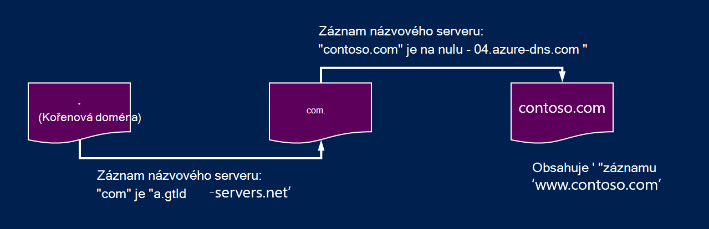
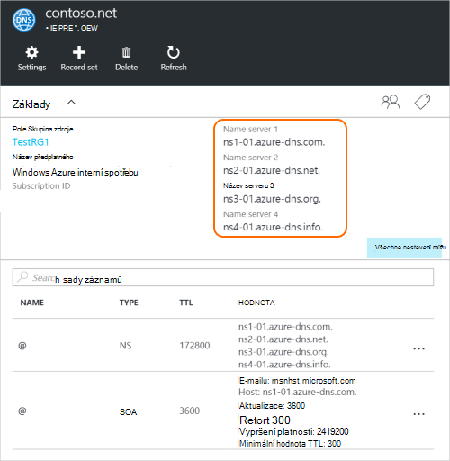

<properties
   pageTitle="Delegování domain Azure DNS | Microsoft Azure"
   description="Pochopte, jak změnit delegování domény a k zajištění hostingu doménu používají názvové servery Azure DNS."
   services="dns"
   documentationCenter="na"
   authors="sdwheeler"
   manager="carmonm"
   editor=""/>

<tags
   ms.service="dns"
   ms.devlang="na"
   ms.topic="get-started-article"
   ms.tgt_pltfrm="na"
   ms.workload="infrastructure-services"
   ms.date="06/30/2016"
   ms.author="sewhee"/>

# Delegát domain Azure DNS

Azure DNS můžete hostovat zóny DNS a spravovat záznamy DNS pro doménu v Azure. K tomu dotazy DNS pro doménu kontaktovat Azure DNS doména obsahuje třeba delegovat Azure DNS z nadřazené domény. Mějte na paměti Azure DNS není doménového registrátora. Tento článek vysvětluje fungování domén delegování a jak udělit oprávnění domény Azure DNS.

## Jak funguje DNS delegování

### Domény a zóny

Domain Name System je hierarchie domén. Hierarchie začíná "kořenovou" doménu, jejichž název je jednoduše**.**.  Pod to jsou domény nejvyšší úrovně, jako třeba "com", "čistý", "organizace", "Kanada" nebo "CF".  Pod to jsou domény druhé úrovně, jako třeba "org.uk" nebo "co.jp".  Atd. Domén v hierarchii DNS jsou hostovány pomocí samostatných zóny DNS. Tyto zóny globálně rozloženy, hostitelem názvové servery DNS ve světě.

**Zóny DNS**

Doména je jedinečný název do Domain Name System, například contoso.com. Zóny DNS slouží k hostovat záznamy DNS pro určité domény. Například domény "contoso.com" může obsahovat některé záznamy DNS jako "mail.contoso.com" (k poštovnímu serveru) a "www.contoso.com" (pro web).

**Doménového registrátora**

Doménovým registrátorem je společnost, kdo může poskytovat názvy domén Internet. Se ověří, pokud internetovou doménu, kterou chcete použít je k dispozici a umožňují ji zakoupit. Po registraci názvu domény budete mít právní vlastníkem názvu domény. Pokud už máte internetovou doménu, bude používat stávající doménový Registrátor delegovat Azure DNS.

>[AZURE.NOTE] Pokud chcete zjistit další informace o kdo vlastní název domény zadaného nebo informace o tom, jak doménu koupit najdete v článku [správy domény Internet Azure AD](https://msdn.microsoft.com/library/azure/hh969248.aspx).

### Řešení a delegování

Existují dva typy serverů DNS:

- _Autoritativní_ server DNS hostuje zóny DNS. Odpovídá dotazy DNS záznamy v těchto oblastech jenom.
- Server DNS _rekurzivní_ není hostitelem zóny DNS. Odpovídá všechny dotazy DNS tak, že zavoláte autoritativní servery DNS shromažďovat data, která potřebuje.

>[AZURE.NOTE] Azure DNS nabízí autoritativní služby DNS.  Neposkytuje rekurzivní služby DNS.

> Cloudovými službami a VMs v Azure se konfigurují samostatně používat rekurzivní služby DNS, který je k dispozici v rámci infrastruktury společnosti Azure.  Další informace o tom, jak změnit nastavení DNS, přečtěte si téma [Překlad v Azure](../virtual-network/virtual-networks-name-resolution-for-vms-and-role-instances.md#name-resolution-using-your-own-dns-server).

Klienti DNS ve počítače nebo mobilního zařízení obvykle zavolejte na server DNS rekurzivní provádět všechny dotazy DNS, které potřebujete klientské aplikace.

Pokud server DNS rekurzivní obdrží dotaz DNS záznamu, třeba "www.contoso.com", nejdřív musí zobrazíte názvového serveru, který je hostitelem zóny pro doménu "contoso.com". K tomuto účelu ho začíná kořenové názvové servery a odtud najde názvové servery hostingu zónu "com". Potom dotazy názvové servery "com" zobrazíte názvové servery hostingu zónu "contoso.com".  Nakonec je možné k vytvoření dotazu tyto názvové servery pro "www.contoso.com".

Je místo toho překládání DNS názvu. Sporná, i když řečeno služeb překládá názvy DNS obsahuje další kroky, například následující mají záznamy CNAME, ale není důležité k pochopení fungování delegování DNS.

Jak nadřazené zóny "přejděte na" názvové servery pro zónu podřízené? Je to pomocí speciální typ DNS záznamu, kterému se říká záznam názvového serveru (NS zastupuje názvový server). Například kořenová zóna obsahuje záznamy názvového serveru pro "com" a zobrazí názvové servery pro zónu "com". Zároveň "com" zóna obsahuje záznamy názvového serveru pro "contoso.com", který ukazuje názvové servery pro zónu "contoso.com". Nastavení záznamů názvového serveru pro zónu podřízené do nadřazené zóny se nazývá delegování doménu.

Každý delegování má ve skutečnosti dvě kopie záznamů názvového serveru. jedna v nadřazené zóně přejdete na podsložky a druhý samotné zóny podřízené. "Contoso.com" zóna obsahuje záznamy názvového serveru pro "contoso.com" (kromě záznamy názvového serveru v "com"). Nazývaných autoritativní záznamy názvového serveru a sednout ve vrcholu podřízené zóny.

## Právo k delegačnímu domain Azure DNS

Jakmile vytvoříte zóny DNS v Azure DNS, musíte nastavit záznamy názvového serveru v nadřazené zóny Azure DNS autoritativní zdroj pro překlad zóny. Pro domény koupili od registrátora svého registrátora nabídne možnost nastavení těchto záznamů názvového serveru.

>[AZURE.NOTE] Nemáte vlastní doménu k vytvoření zóny DNS pomocí tohoto názvu domény v Azure DNS. Ale potřebujete majiteli domény, kterou chcete nastavit delegování Azure DNS u registrátora.

Předpokládejme například, nákup domény "contoso.com" a vytvoření oblast s názvem contoso.com v Azure DNS. Jakožto vlastníka doménu svého registrátora nabídne vám možnosti pro nastavení názvové servery (to znamená záznamy názvového serveru) pro vaši doménu. Registrátorovi se uloží tyto záznamy názvového serveru domény nadřazené v tomto případě ".com". Klienti ve světě potom přesměrovaný na svoji doménu v Azure DNS zone při pokusu o vyřešení DNS záznamů na "contoso.com".

### Zjištění názvu serveru název

Před můžete delegovat DNS zónu DNS Azure, musíte nejdřív znáte názvy serverů název zóny. Azure DNS přidělí názvové servery z fondu každém zóny.

Nejjednodušší způsob, jak zobrazit názvové servery přiřazeny zóny spočívá ve využití portálu Azure.  V tomto příkladu zónu "contoso.net" přiřazené názvové servery "ns1-01.azure-dns.com", ns2 01.azure dns .net "ns3-01.azure-dns.org", a "ns4-01.azure-dns.info":

 

Azure DNS automaticky vytvoří autoritativní záznamy názvového serveru ve vašem pásmu obsahující přiřazené názvové servery.  Pokud chcete zobrazit názvy serverů název prostřednictvím Powershellu Azure nebo Azure rozhraní příkazového řádku, stačí k načtení tyto záznamy.

Pomocí prostředí PowerShell Azure, autoritativní záznamy názvového serveru můžete získat následujícím způsobem. Všimněte si, že název záznamu “@” slouží k odkazují na záznamy ve vrcholu zóny.

    PS> $zone = Get-AzureRmDnsZone –Name contoso.net –ResourceGroupName MyResourceGroup
    PS> Get-AzureRmDnsRecordSet –Name “@” –RecordType NS –Zone $zone

    Name              : @
    ZoneName          : contoso.net
    ResourceGroupName : MyResourceGroup
    Ttl               : 3600
    Etag              : 5fe92e48-cc76-4912-a78c-7652d362ca18
    RecordType        : NS
    Records           : {ns1-01.azure-dns.com, ns2-01.azure-dns.net, ns3-01.azure-dns.org,
                        ns4-01.azure-dns.info}
    Tags              : {}

Můžete také různé platformy Azure rozhraní příkazového řádku pro získání autoritativní záznamy názvového serveru a tedy Seznamte se s názvové servery přiřazeny zóny:

    C:\> azure network dns record-set show MyResourceGroup contoso.net @ NS
    info:    Executing command network dns record-set show
        + Looking up the DNS Record Set "@" of type "NS"
    data:    Id                              : /subscriptions/.../resourceGroups/MyResourceGroup/providers/Microsoft.Network/dnszones/contoso.net/NS/@
    data:    Name                            : @
    data:    Type                            : Microsoft.Network/dnszones/NS
    data:    Location                        : global
    data:    TTL                             : 172800
    data:    NS records
    data:        Name server domain name     : ns1-01.azure-dns.com.
    data:        Name server domain name     : ns2-01.azure-dns.net.
    data:        Name server domain name     : ns3-01.azure-dns.org.
    data:        Name server domain name     : ns4-01.azure-dns.info.
    data:
    info:    network dns record-set show command OK

### Nastavit delegování

Každý registrátora obsahuje vlastní nástroje pro správu DNS změnit záznamy názvového serveru pro doménu. Na stránce správy DNS svého registrátora upravit záznamy názvového serveru a nahradit těch, které vytvořili Azure DNS záznamy názvového serveru.

Při delegování domain Azure DNS, musíte použít názvy serverů název poskytovanou Azure DNS.  Měli byste vždy použít všechny 4 název názvy serverů, bez ohledu na název vaší domény.  Delegování domény nevyžaduje název serveru jako vaši doménu použít stejné doména nejvyšší úrovně.

Nepoužívejte "připevnění záznamy tak, aby ukazovaly Azure názvů DNS server IP adresy, protože tyto IP adresy může v budoucnosti změnit. Delegování pomocí názvy serverů název vlastní zóny někdy se jí říká "marnivost názvové servery", nejsou podporované aktuálně v Azure DNS.

### Ověření překlad práce

Po dokončení delegování, můžete ověřit, že překlad pracuje pomocí nástroje, například "nslookup" k vytvoření dotazu záznamu SOA zóny (což je vytvořen taky automaticky při zóny).

Všimněte si, že není nutné zadávat názvové servery Azure DNS, protože běžné rozlišení obrázku DNS najdete názvové servery automaticky pokud delegování nastavený správně.

    nslookup –type=SOA contoso.com

    Server: ns1-04.azure-dns.com
    Address: 208.76.47.4

    contoso.com
    primary name server = ns1-04.azure-dns.com
    responsible mail addr = msnhst.microsoft.com
    serial = 1
    refresh = 900 (15 mins)
    retry = 300 (5 mins)
    expire = 604800 (7 days)
    default TTL = 300 (5 mins)

## Právo k delegačnímu dílčích domén s v Azure DNS

Pokud chcete nastavit samostatné podřízené zóně, můžete delegovat domény u Azure DNS. Například s nastavení a delegované "contoso.com" v Azure DNS Předpokládejme, že chcete nastavit zónu samostatné podřízené "partners.contoso.com".

Nastavení domény sleduje podobné obrázku jako normální delegování. Jediný rozdíl je v kroku 3, vytvořené záznamy názvového serveru musí být v nadřazené zóně "contoso.com" v Azure DNS, spíše než nastaven prostřednictvím doménového registrátora.

1. Vytvoření podřízené zóny "partners.contoso.com" v Azure DNS.
2. Vyhledání autoritativní záznamy názvového serveru v zóně podřízené získat názvové servery hostingu podřízené zóny Azure DNS.
3. Delegování podřízené zóny nakonfigurováním záznamy názvového serveru v nadřazené zóně přejdete na podřízené zóny.

### Delegování domény

Následující příklad prostředí PowerShell ukazuje, jak to funguje. Stejné kroky lze provést pomocí portálu Azure nebo prostřednictvím platformy Azure rozhraní příkazového řádku.

#### Krok 1. Vytvoření nadřazené a podřízené zóny

Nejdřív vytvoříme nadřazené a podřízené zóny. Může se jednat ve stejné pole Skupina zdroje nebo jiné skupiny prostředků.

    $parent = New-AzureRmDnsZone -Name contoso.com -ResourceGroupName RG1
    $child = New-AzureRmDnsZone -Name partners.contoso.com -ResourceGroupName RG1

#### Krok 2. Záznamy názvového serveru načíst

Pak získáme autoritativní záznamy názvového serveru z podřízené zóny jak je vidět v následujícím příkladu.  Tato stránka obsahuje názvové servery přiřazeny k zóně podřízené.

    $child_ns_recordset = Get-AzureRmDnsRecordSet -Zone $child -Name "@" -RecordType NS

#### Krok 3. Delegát podřízené zóny

Vytvoření sady v nadřazené zóně dokončete delegování odpovídající záznamů názvového serveru. Všimněte si, že název sada záznamů v nadřazené zóně shoduje s názvem zóny podřízené v tomto případě "partnery".

    $parent_ns_recordset = New-AzureRmDnsRecordSet -Zone $parent -Name "partners" -RecordType NS -Ttl 3600
    $parent_ns_recordset.Records = $child_ns_recordset.Records
    Set-AzureRmDnsRecordSet -RecordSet $parent_ns_recordset

### Ověření překlad práce

Můžete ověřit, že všechno, co je správně nastavená můžete vyhledat záznam SOA podřízené zóny.

    nslookup –type=SOA partners.contoso.com

    Server: ns1-08.azure-dns.com
    Address: 208.76.47.8

    partners.contoso.com
        primary name server = ns1-08.azure-dns.com
        responsible mail addr = msnhst.microsoft.com
        serial = 1
        refresh = 900 (15 mins)
        retry = 300 (5 mins)
        expire = 604800 (7 days)
        default TTL = 300 (5 mins)

## Další kroky

[Správa zóny DNS](dns-operations-dnszones.md)

[Spravovat záznamy DNS.](dns-operations-recordsets.md)

