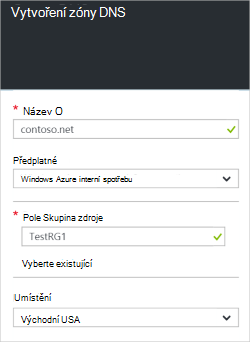

<properties
   pageTitle="Jak vytvořit a spravovat zóny DNS na portálu Azure | Microsoft Azure"
   description="Naučte se vytvářet zóny DNS pro službu Azure DNS. Toto je podrobný návod, jak vytvářet a spravovat první DNS a zahájení, který je hostitelem vašeho DNS domény pomocí portálu Azure."
   services="dns"
   documentationCenter="na"
   authors="sdwheeler"
   manager="carmonm"
   editor=""
   tags="azure-resource-manager"/>

<tags
   ms.service="dns"
   ms.devlang="na"
   ms.topic="article"
   ms.tgt_pltfrm="na"
   ms.workload="infrastructure-services"
   ms.date="08/16/2016"
   ms.author="sewhee"/>

# Vytvoření zóny DNS na portálu Azure

> [AZURE.SELECTOR]
- [Azure portálu](dns-getstarted-create-dnszone-portal.md)
- [Prostředí PowerShell](dns-getstarted-create-dnszone.md)
- [Azure rozhraní příkazového řádku](dns-getstarted-create-dnszone-cli.md)

Tento článek vás provede jednotlivými kroky vytvoření zóny DNS pomocí portálu Azure. Můžete taky vytvořit zóny DNS pomocí prostředí PowerShell nebo rozhraní příkazového řádku.

[AZURE.INCLUDE [dns-create-zone-about](../../includes/dns-create-zone-about-include.md)]

### Informace o značky pro Azure DNS

Značky jsou seznam párů název hodnota a používají Azure správcem na popisek materiály pro účely seskupení a fakturace. Další informace o značek naleznete v článku [použití značek k uspořádání Azure zdroje](../resource-group-using-tags.md).

Přidání značky v portálu Azure pomocí **Nastavení** zásuvné zóny DNS.

## Vytvoření zóny DNS

1. Přihlaste se k portálu Azure

2. V nabídce centrální klikněte na tlačítko a klikněte na **Nový > Síť >** a potom klikněte na **DNS zónu** otevřete zásuvné zóny DNS.

    

3. Na zásuvné **zóny DNS** klikněte na **vytvořit** dole. Otevře se zásuvné **zóny DNS vytvořit** .

    

4. Na zásuvné **Vytvoření DNS zone** název zóny DNS. Například *contoso.com*. V tématu [O DNS zóny jmen](#names) ve výše uvedeném oddílu.

5. Potom zadejte skupina zdroje, který chcete použít. Můžete vytvořit nové skupiny prostředků nebo vybrat tu, která už existuje.

6. V rozevíracím seznamu **umístění** zadejte umístění skupina zdroje. Všimněte si, že toto nastavení odkazuje na umístění skupina zdrojů, nikoli umístění pro zónu DNS. Skutečné zdroje zóny DNS se automaticky "globální" a není něco, co můžete (nebo potřebujete) zadejte na portálu.

7. Můžete ponechat **kód Pin pro řídicí panel** políčko zaškrtnuté, pokud chcete jednoduše vyhledat nové zóny na řídicím panelu. Klikněte na **vytvořit**.

    

8. Po klepnutí na tlačítko vytvořit, zobrazí se vaše nové zóny konfiguruje na řídicím panelu.

    

9. Po vytvoření nové zóny zásuvné pro novou zónu se otevře na řídicím panelu.

## Zobrazení záznamů

Vytvoření zóny DNS vytváří také následující záznamy:

- Záznam "Spustit z SOA" (Start). SOA je k dispozici u původního příspěvku každé zóny DNS.
- Záznamy autoritativní názvového serveru (NS). Tyto zobrazení, které názvové servery jsou hostingu zóny. Azure DNS pomocí fondu názvové servery a tak jiné názvové servery může přidělovat jiné oblasti v Azure DNS. Další informace najdete v tématu [delegáta domain Azure DNS](dns-domain-delegation.md) .

Zobrazení záznamů z portálu Microsoft Azure

1. Z vaší zásuvné **zóny DNS** klikněte na možnost **všechna nastavení** otevřete **Nastavení zásuvné** zóny DNS.

    

2. V dolní části podokna Essentials zobrazí se, že záznam nastaví pro zónu DNS.

    

## Test

Pomocí nástroje DNS například nslookup, Vykopat nebo [rutiny prostředí PowerShell vyřešit Název_dns](https://technet.microsoft.com/library/jj590781.aspx)můžete otestovat zóny DNS.

Pokud nebyly dosud delegované vaši doménu používat nové zóny Azure DNS, musíte se směrování dotazu DNS přímo na názvové servery zóny. Názvové servery zóny jsou uvedeny v záznamy názvového serveru, jak je uvedeno tak, že `Get-AzureRmDnsRecordSet` nad. Ujistěte se, náhradní správné hodnoty zóny do příkazu dole.

    nslookup
    > set type=SOA
    > server ns1-01.azure-dns.com
    > contoso.com

    Server: ns1-01.azure-dns.com
    Address:  208.76.47.1

    contoso.com
            primary name server = ns1-01.azure-dns.com
            responsible mail addr = msnhst.microsoft.com
            serial  = 1
            refresh = 900 (15 mins)
            retry   = 300 (5 mins)
            expire  = 604800 (7 days)
            default TTL = 300 (5 mins)

## Odstranění zóny DNS

Odstranění zóny DNS přímo na portálu. Před odstraněním zóny DNS v Azure DNS, musíte odstranit všechny sady záznamů, s výjimkou názvového serveru a SOA záznamy na kořenové úrovni zóny, které byly vytvořeny automaticky při vytvoření zóny.

1. Vyhledejte **zónu DNS** zásuvné zóny, které chcete odstranit a potom klikněte na příkaz **Odstranit** v horní části zásuvné.

2. Zobrazí se dát vědět, že je nutné odstranit všechny sady záznamů, s výjimkou záznamy názvového serveru a SOA automaticky vytvořené. Pokud jste odebrali sady záznamů, a klikněte na **Ano**. Všimněte si, že při odstraňování zóny DNS na portálu, skupina zdroje, kterému je přidružen zóny DNS se neodstraní.

## Další kroky

Po vytvoření zóny DNS vytvořte [sady záznamů a záznamů](dns-getstarted-create-recordset-portal.md) spustíte Překlad jmen pro vaši doménu Internet.
