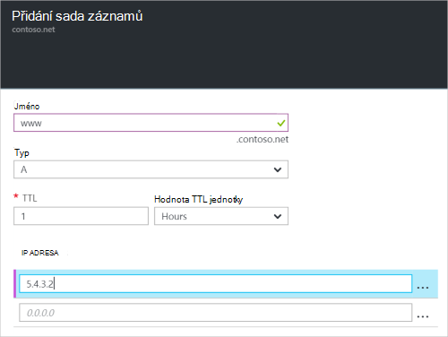

<properties
   pageTitle="Vytvoření sady záznamů a záznamy zóny DNS na Azure portálu | Microsoft Azure"
   description="Jak vytvořit záznamy hostitele DNS Azure a vytvoření sady záznamů a záznamů pomocí portálu Azure"
   services="dns"
   documentationCenter="na"
   authors="sdwheeler"
   manager="carmonm"
   editor=""
   tags="azure-resource-manager"/>

<tags
   ms.service="dns"
   ms.devlang="na"
   ms.topic="article"
   ms.tgt_pltfrm="na"
   ms.workload="infrastructure-services"
   ms.date="08/16/2016"
   ms.author="sewhee"/>

# Vytvoření sady záznamů DNS a záznamů pomocí portálu Azure

> [AZURE.SELECTOR]
- [Portál Azure](dns-getstarted-create-recordset-portal.md)
- [Prostředí PowerShell](dns-getstarted-create-recordset.md)
- [Azure rozhraní příkazového řádku](dns-getstarted-create-recordset-cli.md)

Tento článek vás provede proces vytváření záznamů a sady záznamů pomocí portálu Azure. Po vytvoření zóny DNS přidejte záznamy DNS pro vaši doménu. K tomuto účelu Nejdřív musíte znát záznamy DNS a sady záznamů.

[AZURE.INCLUDE [dns-about-records-include](../../includes/dns-about-records-include.md)]

## Vytvoření sada záznamů a záznam

Následující příklad vás provede proces vytváření sada záznamů a záznam pomocí portálu Azure. Použijeme typ záznamu DNS "A".

1. Přihlaste se k portálu.

2. Přejděte na zásuvné **zóny DNS** , ve kterém chcete vytvořit sadě záznamů.

3. V horní části zásuvné **zóny DNS** na příkaz **nastavit záznam** otevřete zásuvné **nastavit přidat záznam** .

    

4. Na zásuvné **Sada záznamů přidat** název sady záznamů. Je třeba název vaší sadě záznamů "**www**".

    

5. Vyberte požadovaný typ záznamu, který chcete vytvořit. Vyberte například **A**.

6. Nastavte **hodnotu TTL**. Výchozí time to live na portálu je hodinu.

7. Přidejte IP adres IP adres pro řádek. Když použijete navrhované sada záznamů název a typ záznamu popsané výše, přidáte IP adres protokolu IPv4 **záznam pro sady záznamů www** .

8. Po dokončení přidávání IP adresy, klikněte na **OK** v dolní části zásuvné. Sada záznamů DNS bude vytvořen.

## Další kroky

Ke správě sada záznamů a záznamy, najdete v článku [Správa DNS záznamů a záznam nastaví pomocí portálu Azure](dns-operations-recordsets-portal.md).

Další informace o službě DNS Azure najdete v článku [Přehled Azure DNS](dns-overview.md).
