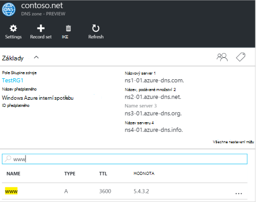
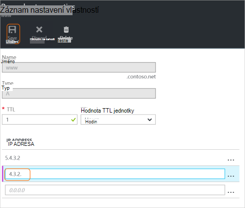

<properties
   pageTitle="Správa sady záznamů DNS a záznamů pomocí portálu Azure | Microsoft Azure"
   description="Správa DNS záznamu nastaví záznamů a pokud je hostitelem vaší domény na Azure DNS."
   services="dns"
   documentationCenter="na"
   authors="sdwheeler"
   manager="carmonm"
   editor=""
   tags="azure-resource-manager"/>

<tags
   ms.service="dns"
   ms.devlang="na"
   ms.topic="article"
   ms.tgt_pltfrm="na"
   ms.workload="infrastructure-services"
   ms.date="08/16/2016"
   ms.author="sewhee"/>

# Spravovat záznamy DNS a záznam nastaví pomocí portálu Azure

> [AZURE.SELECTOR]
- [Portál Azure](dns-operations-recordsets-portal.md)
- [Azure rozhraní příkazového řádku](dns-operations-recordsets-cli.md)
- [Prostředí PowerShell](dns-operations-recordsets.md)

Tento článek popisuje, jak spravovat sady záznamů a záznamy zóny DNS pomocí portálu Azure.

Je důležité pochopit rozdíl mezi sady záznamů DNS a jednotlivých záznamů DNS. Sada záznamů je sada záznamů v zóně, které mají stejný název a jsou stejného typu. Další informace najdete v tématu [Vytvoření DNS záznamu sady a záznamů pomocí portálu Azure](dns-getstarted-create-recordset-portal.md).

## Vytvoření nové sady záznamů a záznam

Vytvoření sady na portálu Azure záznamů najdete v tématu [Vytvoření záznamů DNS pomocí portálu Azure](dns-getstarted-create-recordset-portal.md).

## Zobrazení sada záznamů

1. Na portálu Azure přejděte na zásuvné **zóny DNS** .

2. Vyhledejte sady záznamů a vyberte ho. Otevře se vlastnosti sadě záznamů.

    

## Přidání nového záznamu do sady záznamů

Přidání až 20 záznamů do libovolné sadě záznamů. Sada záznamů nesmí obsahovat dva identickými záznamy. Prázdný sady záznamů (s nulovou záznamů) se dají vytvářet, ale na názvové servery Azure DNS nezobrazují. Sady záznamů typu CNAME může obsahovat maximálně jeden záznam.

1. Na zásuvné **záznamu nastavit vlastnosti** zóny DNS klikněte na nastavit záznam, který chcete přidat záznam, který chcete.

    

2. Určení záznam vlastností sady vyplněním pole.

    

2. Klepnutím na tlačítko **Uložit** v horní části zásuvné uložte nastavení. Zavřete zásuvné.

3. V rohu zobrazí se ukládá záznam.

    

Po uložení záznamu budou obsahovat hodnoty na zásuvné **zóny DNS** nový záznam.

## Aktualizujte záznam

Když třeba aktualizujete záznam v existující sada záznamů, pole, která lze aktualizovat, závisí na typu záznamu pracujete s.

1. Na zásuvné **záznam nastavení vlastností** pro sada záznamů vyhledejte záznam.

2. Upravte záznam. Při úpravě záznamu, můžete změnit nastavení k dispozici pro záznam. V následujícím příkladu je vybráno pole **IP adresa** a IP adresu právě upravuje.

    

3. Klepnutím na tlačítko **Uložit** v horní části zásuvné uložte nastavení. V pravém horním rohu zobrazí se upozornění, které uložení záznamu.

    

Po uložení záznamu budou obsahovat hodnoty záznamu na zásuvné **zóny DNS** nastavit aktualizovaný záznam.

## Odebrání záznamu z sada záznamů

Portál Azure slouží k odebrání záznamů v sadě záznamů. Všimněte si, že odeberete posledním záznamu v sadě záznamů se neodstraní sady záznamů.

1. Na zásuvné **záznam nastavení vlastností** pro sada záznamů vyhledejte záznam.

2. Klikněte na záznam, který chcete odebrat. Klikněte na **Odebrat**.

    

3. Klepnutím na tlačítko **Uložit** v horní části zásuvné uložte nastavení.

3. Po odebrání záznam budou obsahovat hodnoty záznamu na zásuvné **zóny DNS** odstranění.

## Odstranění sada záznamů

1. Na **záznamu nastavit vlastnosti** zásuvné vašeho záznamu nastavit, klikněte na **Odstranit**.

    

2. Zobrazí se zpráva s dotazem, pokud chcete odstranit sady záznamů.

3. Ověřte, že název odpovídá sady záznamů, který chcete odstranit a potom klikněte na **Ano**.

4. Na zásuvné **zóny DNS** zkontrolujte, že sady záznamů už viditelné.

## Práce se záznamy názvového serveru a SOA

Záznamy názvového serveru a SOA automaticky vytvořené je spravováno z jiných typů záznamů jinak.

### Úprava SOA záznamů

Nelze přidat nebo odebrat záznamy z automaticky vytvořené záznamu SOA rozmístěné po vrcholu zóny (název = "@"). Však můžete změnit libovolné parametrů záznamu SOA (s výjimkou "host (hostitel)") a záznam nastavte hodnotu TTL.

### Změna záznamů názvového serveru u vrcholu zóny

Nelze přidat, odebrat nebo změnit záznamy v automaticky vytvořené sady na vrcholu zóny záznamů názvového serveru (název = "@"). Pouze změny, které je povolen je upravit sady záznamů TTL.

### Odstranění SOA nebo NS sady záznamů

Nelze odstranit nebo SOA a sady záznamů názvového serveru na vrcholu zóny (název = "@") , který se automaticky vytvoří při vytvoření zóny. Budou odstraněny automaticky po odstranění zóny.

## Další kroky

-   Další informace o službě DNS Azure najdete v článku [Přehled Azure DNS](dns-overview.md).
-   Další informace o automatizaci DNS najdete v článku [vytváření DNS zones a záznam nastaví pomocí .NET SDK](dns-sdk.md).
-   Další informace o zpětném DNS záznamy najdete v tématu [Správa obráceném záznamy DNS pro služby pomocí Powershellu](dns-reverse-dns-record-operations-ps.md).
