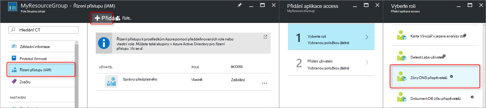
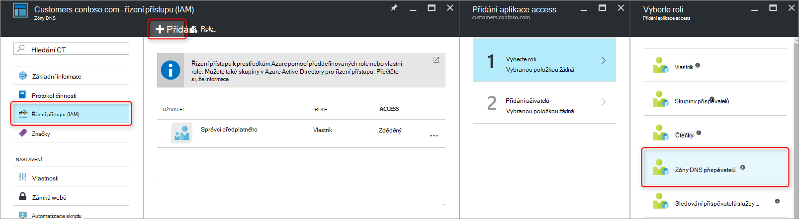
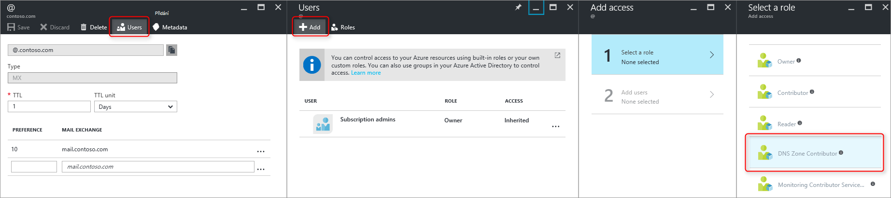
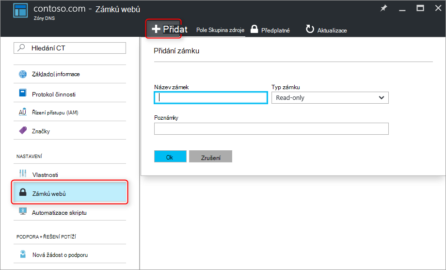

<properties 
   pageTitle="Ochrana zóny DNS a záznamy | Microsoft Azure" 
   description="Jak se chránit zóny DNS a sady záznamů ve službě Microsoft Azure DNS." 
   services="dns" 
   documentationCenter="na" 
   authors="jtuliani" 
   manager="carmonm" 
   editor=""/>

<tags
   ms.service="dns"
   ms.devlang="na"
   ms.topic="article"
   ms.tgt_pltfrm="na"
   ms.workload="infrastructure-services" 
   ms.date="10/20/2016"
   ms.author="jtuliani"/>

# Jak se chránit zóny DNS a záznamy

Zóny DNS a záznamy jsou důležité zdroje. Odstranění zóny DNS nebo jenom jeden záznam DNS můžete mít za následek výpadku celkové služby.  Proto je důležité, že kritické zóny DNS a záznamů jsou chráněny před neoprávněným nebo náhodné změny.

Tento článek vysvětluje, jak Azure DNS umožňuje chránit vaše zóny DNS a záznamy proti tyto změny.  Použijeme dvou výkonných funkcí k dispozici Azure správcem: [řízení přístupu na základě rolí](../active-directory/role-based-access-control-what-is.md) a [zámků webů zdroje](../resource-group-lock-resources.md).

## Řízení přístupu na základě rolí

Azure na základě rolí přístup ovládacího prvku (RBAC) umožňuje správu jemně odstupňovaná přístupu pro Azure uživatelé, skupiny a prostředky. Použití RBAC, můžete udělit přesně množství přístup, aby uživatelé provádět své práce. Další informace o RBAC vám pomůže Správa přístupu najdete v tématu [Co je řízení přístupu na základě rolí](../active-directory/role-based-access-control-what-is.md).

### Role "Přispěvatel zóny DNS"

Role "DNS Zone Přispěvatel" je předdefinované role poskytovanou Azure pro správu DNS prostředků.  Přiřazení oprávnění Přispěvatel zóny DNS na uživatele nebo skupinu umožňuje danou skupinu pro správu DNS zdroje, ale ne prostředky jiného typu.

Předpokládejme například, že skupina zdroje "myzones" obsahuje pět zóny společnosti Contoso. Udělení oprávnění "DNS Zone přispěvatelů" k této skupině zdrojů správce serveru DNS, umožňuje úplnou kontrolu nad zóny DNS. Zabrání taky udělování zbytečnými oprávnění, například Správce DNS nelze vytvořit nebo ukončení virtuálních počítačích.

Nejjednodušší způsob, jak přiřazovat oprávnění RBAC spočívá ve [využití portálu Azure](../active-directory/role-based-access-control-configure.md).  Otevřete zásuvné "Řízení přístupu (IAM)" skupiny prostředků, pak, klepněte na Přidat, a pak vyberte role "DNS Zone Přispěvatel" a vyberte požadované uživatelům nebo skupinám udělit oprávnění.

Oprávnění lze také [poskytuje pomocí Azure Powershellu](../active-directory/role-based-access-control-manage-access-powershell.md):

    # Grant 'DNS Zone Contributor' permissions to all zones in a resource group
    New-AzureRmRoleAssignment -SignInName <user email address> -RoleDefinitionName "DNS Zone Contributor" -ResourceGroupName <resource group name>

Příkaz odpovídající je také [k dispozici prostřednictvím Azure rozhraní příkazového řádku](../active-directory/role-based-access-control-manage-access-azure-cli.md):

    # Grant 'DNS Zone Contributor' permissions to all zones in a resource group
    azure role assignment create --signInName  <user email address> --roleName "DNS Zone Contributor" --resourceGroup <resource group name>

### Úroveň zóny RBAC

Pokud máte předplatné, skupina zdroje nebo konkrétního zdroje se dají použít Azure RBAC pravidla. V případě Azure DNS může být daný zdroj jednotlivé zóny DNS nebo i jednotlivé sadě záznamů.

Předpokládejme například, že skupina zdroje "myzones" obsahuje zóny contoso.com a subzone "customers.contoso.com" ve kterém se vytvářejí záznamy CNAME pro každý účet zákazníka.  Účet sloužící ke správě tyto záznamy CNAME by měly být přiřazeny oprávnění k vytváření záznamů v zóně "customers.contoso.com", neměli mít přístup do jiné zóny.

Pomocí portálu Azure lze udělit oprávnění na úrovni zóny RBAC.  Otevřete zásuvné "Řízení přístupu (IAM)" zóny, pak, klepněte na Přidat, a pak vyberte role "DNS Zone Přispěvatel" a vyberte požadované uživatelům nebo skupinám udělit oprávnění.

Oprávnění lze také [poskytuje pomocí Azure Powershellu](../active-directory/role-based-access-control-manage-access-powershell.md):

    # Grant 'DNS Zone Contributor' permissions to a specific zone
    New-AzureRmRoleAssignment -SignInName <user email address> -RoleDefinitionName "DNS Zone Contributor" -ResourceGroupName <resource group name> -ResourceName <zone name> -ResourceType Microsoft.Network/DNSZones

Příkaz odpovídající je také [k dispozici prostřednictvím Azure rozhraní příkazového řádku](../active-directory/role-based-access-control-manage-access-azure-cli.md):

    # Grant 'DNS Zone Contributor' permissions to a specific zone
    azure role assignment create --signInName <user email address> --roleName "DNS Zone Contributor" --resource-name <zone name> --resource-type Microsoft.Network/DNSZones --resource-group <resource group name>

### Záznam nastavit úroveň RBAC

Postupně po jednotlivých krocích jsme můžete přejít dále. Zvažte správce pošty společnosti Contoso, kdo potřebuje přístup k záznamy MX a TXT ve vrcholu zónu "contoso.com".  Anna nevyžaduje přístup s jinými TXT nebo MX záznamy, nebo všechny záznamy jiný typ.  Azure DNS umožňuje přiřadit oprávnění na úrovni sada záznamů přesně záznamy, které správce pošty potřebuje přístup k.  Správce pošty, která přesně ovládací prvek Anna potřebuje a nemůže proveďte požadované změny.
  
Sada záznamů oprávnění na úrovni RBAC možné konfigurovat pomocí portálu Azure pomocí tlačítka "Uživatelé" v sadě záznamů zásuvné:

Sada záznamů oprávnění na úrovni RBAC mohou být také [poskytuje pomocí Powershellu Azure](../active-directory/role-based-access-control-manage-access-powershell.md):

    # Grant permissions to a specific record set
    New-AzureRmRoleAssignment -SignInName <user email address> -RoleDefinitionName "DNS Zone Contributor" -Scope "/subscriptions/<subscription id>/resourceGroups/<resource group name>/providers/Microsoft.Network/dnszones/<zone name>/<record type>/<record name>" 

Příkaz odpovídající je také [k dispozici prostřednictvím Azure rozhraní příkazového řádku](../active-directory/role-based-access-control-manage-access-azure-cli.md):

    # Grant permissions to a specific record set
    azure role assignment create --signInName <user email address> --roleName "DNS Zone Contributor" --scope "/subscriptions/<subscription id>/resourceGroups/<resource group name>/providers/Microsoft.Network/dnszones/<zone name>/<record type>/<record name>"

### Vlastní role

Předdefinované role "DNS Zone přispěvatelů" umožňuje úplnou kontrolu nad prostředku DNS. Také je možné vytvářet vlastní zákazníka Azure role poskytnout i podrobně odstupňovaná ovládacího prvku.

Zvažte znovu příklad, ve kterém je vytvořen záznam CNAME v zóně "customers.contoso.com" pro každý účet zákazníka společnost Contoso.  Účet sloužící ke správě mají tyto záznamy CNAME by měl oprávnění ke správě jenom záznamy CNAME.  Je pak nelze měnit záznamy z jiných typů (například změnit záznamy MX) nebo provádět operace na úrovni zóny například zóny odstranit.

Následující příklad ukazuje definici vlastní role pro správu záznamů CNAME:

    {
        "Name": "DNS CNAME Contributor",
        "Id": "",
        "IsCustom": true,
        "Description": "Can manage DNS CNAME records only.",
        "Actions": [
            "Microsoft.Network/dnsZones/CNAME/*",
            "Microsoft.Network/dnsZones/read",
            "Microsoft.Authorization/*/read",
            "Microsoft.Insights/alertRules/*",
            "Microsoft.ResourceHealth/availabilityStatuses/read",
            "Microsoft.Resources/deployments/*",
            "Microsoft.Resources/subscriptions/resourceGroups/read",
            "Microsoft.Support/*"
        ],
        "NotActions": [
        ],
        "AssignableScopes": [
            "/subscriptions/ c276fc76-9cd4-44c9-99a7-4fd71546436e"
        ]
    }

Vlastnost akce definuje následující oprávnění specifických pro DNS:

- `Microsoft.Network/dnsZones/CNAME/*`příspěvky celé publikum nemůže ovládat záznamy CNAME
- `Microsoft.Network/dnsZones/read`udělí oprávnění ke čtení zóny DNS, ale nechcete upravovat, umožňuje zobrazit pásmo, ve kterém se vytváří záznamy CNAME.

Zbývající akce se zkopírují z [předdefinovaných role přispěvatele zóny DNS](../active-directory/role-based-access-built-in-roles.md#dns-zone-contributor).

>[AZURE.NOTE] Použití vlastní roli RBAC zabránit odstranění sady záznamů při umožnit, aby aktualizovat není efektivní řízení. Zabrání sady záznamů odstranit, ale nezabrání je měnit.  Povolení úprav o přidávání a odebírání záznamy ze sady záznamů, včetně odebrání všech záznamů a zavřete okno "prázdné" sadě záznamů. To je stejný výsledek jako odstranění sady z hlediska rozlišení DNS záznamů.

Definice vlastního rolí nemůžou být definované aktuálně prostřednictvím portálu Azure. Vlastní roli založené na této role definice lze vytvářet pomocí prostředí PowerShell Azure:

    # Create new role definition based on input file
    New-AzureRmRoleDefinition -InputFile <file path>

Také vytvořením přes Azure rozhraní příkazového řádku:

    # Create new role definition based on input file
    azure role create –inputfile <file path>

Role můžete pak přidělovat stejným způsobem jako předdefinovaný role způsobem popsaným v tomto článku.

Další informace o tom, jak vytvářet spravovat a přiřadit vlastní role najdete v tématu [Vlastní role v Azure RBAC](../active-directory/role-based-access-control-custom-roles.md).

## Uzamčení prostředků

Kromě RBAC správce prostředků Azure podporuje jiný typ ovládacího prvku zabezpečení, hlavně možnost 'lock' zdroje. Kde RBAC pravidla umožňují na ovládací prvek akce určitých uživatelů a skupin zámků webů zdroje, použijí se ke zdroji a platí ve všech uživatelů a rolí. Další informace najdete v tématu [Lock zdroje pomocí Správce prostředků Azure](../resource-group-lock-resources.md).

Existují dva typy zdrojů zámku: **DoNotDelete** a **jen pro čtení**. Tyto se dají použít zóny DNS, nebo jednotlivých sadě záznamů.  Následující části popisují několik běžných příčin a jak si je podporují pomocí uzamčení prostředků.

### Ochrana proti všechny změny

Nechcete, aby se provedené změny, použijte k zóně zámek jen pro čtení.  To zabrání nové sady záznamů vytvořené a existující sady záznamů z změnili nebo odstranili.

Uzamčení zóny vyrovnat zdroje se dají vytvořit pomocí portálu Azure.  Na zásuvné zóny DNS, klikněte na "Zámky", potom přidat:

Zóny úrovni zdroje, které zámků webů lze také vytvořit pomocí prostředí PowerShell Azure:

    # Lock a DNS zone
    New-AzureRmResourceLock -LockLevel <lock level> -LockName <lock name> -ResourceName <zone name> -ResourceType Microsoft.Network/DNSZones -ResourceGroupName <resource group name> 

Konfigurace uzamčení Azure prostředků není aktuálně podporován prostřednictvím rozhraní příkazového řádku Azure.

### Ochrana jednotlivých záznamů:
Nechcete, aby existující záznam DNS nastavit před poslední změny, platí jen pro čtení zámek pro sady záznamů.

>[AZURE.NOTE] Použití zámku DoNotDelete sada záznamů není efektivní řízení. Zabrání sady odstranění záznamů, ale nezabrání ho upravovat.  Povolení úprav o přidávání a odebírání záznamy ze sady záznamů, včetně odebrání všech záznamů a zavřete okno "prázdné" sadě záznamů. To je stejný výsledek jako odstranění sady z hlediska rozlišení DNS záznamů.

Sada záznamů vyrovnat zdroje zámky můžete aktuálně jenom se konfigurují Azure Powershellu.  Nejsou podporovány v Azure portál nebo Azure rozhraní příkazového řádku.

    # Lock a DNS record set
    New-AzureRmResourceLock -LockLevel <lock level> -LockName <lock name> -ResourceName <zone name>/<record set name> -ResourceType Microsoft.Network/DNSZones/<record type> -ResourceGroupName <resource group name> 

### Ochrana proti odstranění zóny

Když je v Azure DNS zónu, odstraní se taky všechny sady záznamů v oblasti.  Tuto operaci nelze vzít zpět.  Omylem odstranění důležitých zóny vypnuta, může mít vliv významné business.  Je proto pro ochranu před nechtěným zóny odstranění velmi důležité.

Použití zámku DoNotDelete k zóně zabrání odstranění zóny.  Však od zámků webů dědí podřízené zdroji, zabrání také všechny sady záznamů v zóně před odstraněním, což může nežádoucí.  Dále podle popisu v poznámce výše, je také neefektivní od záznamy stále je možné odebrat z existující sady záznamů.

Jako alternativu zvažte použití zámku DoNotDelete záznamu nastavit v zóně, jako je sada záznamů SOA.  Protože zónu nelze odstranit bez také odstranění sady záznamů zabraňuje odstranění zóny zároveň sady záznamů uvnitř pásma libovolně změnit. Pokud je pokus o odstranění zóny, správce prostředků Azure zjistí to by také odstranit sady záznamů SOA a blokuje volání, protože SOA je uzamčený.  Odstraní se žádné sady záznamů.

Následujícího příkazu Powershellu vytvoří zámek DoNotDelete proti záznamu SOA dané oblasti:

    # Protect against zone delete with DoNotDelete lock on the record set
    New-AzureRmResourceLock -LockLevel DoNotDelete -LockName <lock name> -ResourceName <zone name>/@ -ResourceType Microsoft.Network/DNSZones/SOA -ResourceGroupName <resource group name> 

Další způsob, jak zabránit odstranění náhodné zóny je pomocí vlastní roli zajistit operátor a služby sloužící ke správě zóny, nebudou mít účty zóny odstranění oprávnění. Když budete potřebovat k odstranění zóny, můžete vynutit odstranit dvěma kroky, první udělení oprávnění zóny odstranit (v oboru zóny zabránit odstranění nepovedlo zóny) a druhé odstranění zóny.

Tento druhý přístup má tu výhodu, který bude vyhovovat všechny zóny používána účty, aniž byste museli nezapomeňte vytvořit všechny zámky. Má nevýhodou všechny účty s oprávněními pro odstranění zóny, například vlastník předplatného můžete pořád neúmyslně odstraníte zónu kritické.

Je možné používat oba přístupy - uzamčení prostředků a vlastní role - ve stejnou dobu jako obrana v název hloubkové přístup k ochraně zóny DNS.

## Další kroky

- Další informace o práci s RBAC najdete v článku [Začínáme s řízení přístupu na portálu Azure](../active-directory/role-based-access-control-what-is.md). 
- Další informace o práci s uzamčení prostředků tématech [Zámek pomocí Správce prostředků Azure](../resource-group-lock-resources.md).
- Další informace o zabezpečení Azure materiály najdete v článku [otázky bezpečnosti pro správce prostředků Azure](../best-practices-resource-manager-security.md).
