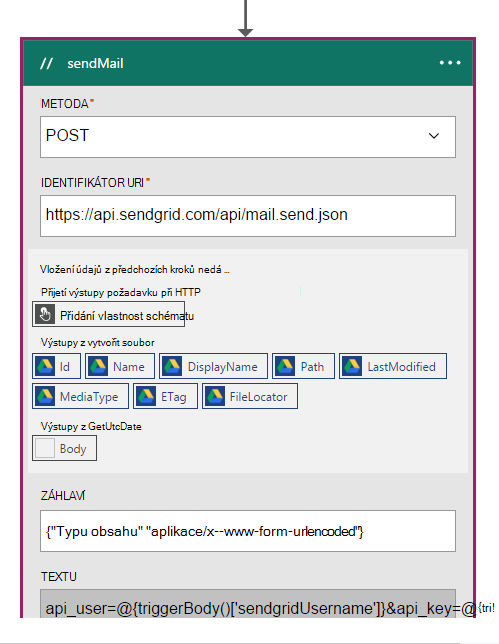
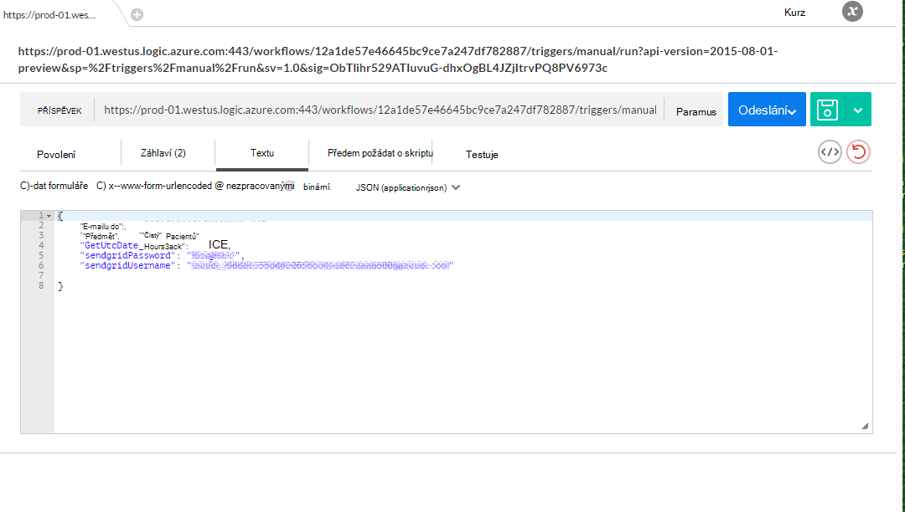

<properties 
    pageTitle="DocumentDB změnit oznámení pomocí aplikace logiky | Microsoft Azure" 
    description="." 
    keywords="upozornění na změnu"
    services="documentdb" 
    authors="hedidin" 
    manager="jhubbard" 
    editor="mimig" 
    documentationCenter=""/>

<tags 
    ms.service="documentdb" 
    ms.workload="data-services" 
    ms.tgt_pltfrm="na" 
    ms.devlang="rest-api" 
    ms.topic="article" 
    ms.date="09/23/2016" 
    ms.author="b-hoedid"/>

# <a name="notifications-for-new-or-changed-documentdb-resources-using-logic-apps"></a>Oznámení pro nové nebo změněné DocumentDB zdrojů pomocí aplikace logiky

Tento článek pochází dotazu zobrazilo odeslala jednu z komunitních fór Azure DocumentDB. Na otázku byl **znamená DocumentDB podporu pro oznámení změny zdrojů**?

Můžu jste pracovali Admin.systému mnoho let a toto je velmi běžné situace při použití [WCF LOB adaptér](https://msdn.microsoft.com/library/bb798128.aspx). To můžu rozhodl zobrazit, pokud se může duplicitní tuto funkci DocumentDB pro nové nebo změněné dokumenty.

Tento článek obsahuje přehled součástí řešení oznámení změny, který obsahuje [aktivační události](documentdb-programming.md#trigger) a [Logika aplikace](../app-service-logic/app-service-logic-what-are-logic-apps.md). Důležité: fragmenty kódu jsou k dispozici vložené a je k dispozici na [GitHub](https://github.com/HEDIDIN/DocDbNotifications)celé řešení.

## <a name="use-case"></a>Případ použití

Následující článek je případ použití tohoto článku.

DocumentDB slouží jako úložiště pro dokumenty stavu úroveň sedm mezinárodní (HL7) rychlé zdravotní péče Interoperability zdroje (FHIR). Předpokládejme, že databázi DocumentDB společně s vaší rozhraní API a logika App tvoří HL7 FHIR Server.  Zdravotní péče zařízení ukládání pacienta dat v DocumentDB "Pacientů" databáze. Existuje několik kolekce v rámci pacienta databázi. Lékařské, identifikace, atd. V části identifikační spadá pacienta informace.  Máte kolekci s názvem "Pacienta".

Oddělení kardiologie je sledování osobních údajů zdraví a výkon. Vyhledání nové nebo změněné pacienta záznamů je časově náročný. Se zobrazí dotaz, oddělení IT Pokud bylo možné, že se může dostávat oznámení o nové nebo změněné pacienta záznamy.  

Oddělení IT říká, že by mohly snadno poskytují to. Jsou taky říká, že se můžou nabízená dokumenty k [Úložišti objektů Blob Azure](https://azure.microsoft.com/services/storage/) tak oddělení kardiologie může snadno se k nim.

## <a name="how-the-it-department-solved-the-problem"></a>Jak oddělení IT vyřešit problém

K vytvoření tuto aplikaci, oddělení IT rozhodli, že nejdřív model.  Hodní věc týkající se používání Business Process Modeling a standardu BPMN (Notation), je, aby lidé technické a netechnických snadno pochopili ho. Tento proces celé oznámení se považuje za obchodních procesů. 

## <a name="high-level-view-of-notification-process"></a>Souhrnné zobrazení proces upozornění

1. Začnete s aplikací použití logických operátorů, který obsahuje aktivační časovače. Ve výchozím nastavení aktivační události spustí každou hodinu.
2. Pak udělejte HTTP příspěvek do aplikace logiky.
3. Použití logických operátorů aplikace provádí všechny.


### <a name="lets-take-a-look-at-what-this-logic-app-does"></a>Podívejme se na co znamená tuto aplikaci použití logických operátorů
Když se podíváte na následujícím obrázku je v pracovním postupu LogicApp několik kroků.


Tyto kroky jsou následujícím způsobem:

1. Potřebujete k získání aktuálního data a času UTC z aplikace pro rozhraní API.  Výchozí hodnota je 1 hodinu předchozí.

2. Data a času UTC se převede na formátu Unix časové razítko. Toto je výchozí formát pro časová razítka v DocumentDB.

3. Rozhraní API aplikace, které nemá DocumentDB ZVEŘEJŇUJETE hodnotu dotazu. Hodnota se používá v dotazu.

    ```SQL
        SELECT * FROM Patients p WHERE (p._ts >= @unixTimeStamp)
    ```

    > [AZURE.NOTE] _Ts představuje časové razítko metadat pro všechny zdroje DocumentDB.

4. Pokud jsou nalezených dokumentů, obsah odpovědí odeslaný k úložišti objektů Blob Azure.

    > [AZURE.NOTE] Úložiště objektů BLOB vyžaduje účet Azure úložiště. Potřebujete zřízení účtu úložiště objektů Blob Azure a přidávání nových objektů Blob s názvem pacientů. Další informace najdete v tématu [účty adresářové služby Azure o úložiště](../storage/storage-create-storage-account.md) a [začít pracovat s úložiště objektů Blob Azure](../storage/storage-dotnet-how-to-use-blobs.md).

5. Nakonec se odešle e-mail, který upozornění příjemce požadovanou velikost nalezených dokumentů. Pokud nebyly zjištěny žádné dokumenty, bude text e-mailu "0 dokumenty nalezen". 

Teď, když máte zjistit, k čemu slouží pracovní postup, Podívejme se na tom, jak implementovat.

### <a name="lets-start-with-the-main-logic-app"></a>Začněme s hlavním aplikace použití logických operátorů

Pokud znáte není aplikace použití logických operátorů, jsou k dispozici v [Azure Marketplace](https://portal.azure.com/)a další informace o nich v [Jaké aplikace logiky?](../app-service-logic/app-service-logic-what-are-logic-apps.md)

Při vytváření nové aplikace logiky se zobrazí dotaz, **jak chcete začít?**

Když klepnete do textového pole, máte na výběr události. Tato aplikace logiky vyberte **přijetí příručka – žádost při HTTP** jak je ukázáno v následujícím příkladu.


### <a name="design-view-of-your-completed-logic-app"></a>Návrh zobrazení aplikace dokončený logiky
Pojďme přeskočit a podívejte se na dokončení návrhového zobrazení pro aplikaci použití logických operátorů, která se nazývá DocDB.


Když upravujete dokument akce v návrháři aplikace použití logických operátorů, máte možnost výběru **výstupy** z žádost HTTP nebo z předchozí akci, jak je znázorněno níže sendMail akce.



Před každý akce v pracovním postupu uděláte rozhodnutí; **Přidat akci** nebo **Přidat podmínku** jak je znázorněno na následujícím obrázku.


Pokud při výběru možnosti **Přidat podmínku**, se zobrazí formulář, jak je znázorněno na následujícím obrázku, k zadání logiky.  Toto je v podstatě obchodního pravidla.  Když kliknete do pole, máte na výběr z výběru parametry z předchozí akci. Hodnoty můžete také zadat přímo.


> [AZURE.NOTE] Máte taky možnost zadejte všechno, co v zobrazení kódu.

Podívejme se na aplikaci dokončené logiky v zobrazení kódu.  

```JSON
   
    "$schema": "https://schema.management.azure.com/providers/Microsoft.Logic/schemas/2015-08-01-preview/workflowdefinition.json#",
    "actions": {
        "Conversion": {
            "conditions": [
                {
                    "dependsOn": "GetUtcDate"
                }
            ],
            "inputs": {
                "method": "post",
                "queries": {
                    "currentdateTime": "@{body('GetUtcDate')}"
                },
                "uri": "https://docdbnotificationapi-debug.azurewebsites.net/api/Conversion"
            },
            "metadata": {
                "apiDefinitionUrl": "https://docdbnotificationapi-debug.azurewebsites.net/swagger/docs/v1",
                "swaggerSource": "custom"
            },
            "type": "Http"
        },
        "Createfile": {
            "conditions": [
                {
                    "expression": "@greater(length(body('GetDocuments')), 0)"
                },
                {
                    "dependsOn": "GetDocuments"
                }
            ],
            "inputs": {
                "body": "@body('GetDocuments')",
                "host": {
                    "api": {
                        "runtimeUrl": "https://logic-apis-westus.azure-apim.net/apim/azureblob"
                    },
                    "connection": {
                        "name": "@parameters('$connections')['azureblob']['connectionId']"
                    }
                },
                "method": "post",
                "path": "/datasets/default/files",
                "queries": {
                    "folderPath": "/patients",
                    "name": "Patient_@{guid()}.json"
                }
            },
            "type": "ApiConnection"
        },
        "GetDocuments": {
            "conditions": [
                {
                    "dependsOn": "Conversion"
                }
            ],
            "inputs": {
                "method": "post",
                "queries": {
                    "unixTimeStamp": "@body('Conversion')"
                },
                "uri": "https://docdbnotificationapi-debug.azurewebsites.net/api/Patient"
            },
            "metadata": {
                "apiDefinitionUrl": "https://docdbnotificationapi-debug.azurewebsites.net/swagger/docs/v1",
                "swaggerSource": "custom"
            },
            "type": "Http"
        },
        "GetUtcDate": {
            "conditions": [],
            "inputs": {
                "method": "get",
                "queries": {
                    "hoursBack": "@{int(triggerBody()['GetUtcDate_HoursBack'])}"
                },
                "uri": "https://docdbnotificationapi-debug.azurewebsites.net/api/Authorization"
            },
            "metadata": {
                "apiDefinitionUrl": "https://docdbnotificationapi-debug.azurewebsites.net/swagger/docs/v1",
                "swaggerSource": "custom"
            },
            "type": "Http"
        },
        "sendMail": {
            "conditions": [
                {
                    "dependsOn": "GetDocuments"
                }
            ],
            "inputs": {
                "body": "api_user=@{triggerBody()['sendgridUsername']}&api_key=@{triggerBody()['sendgridPassword']}&from=@{parameters('fromAddress')}&to=@{triggerBody()['EmailTo']}&subject=@{triggerBody()['Subject']}&text=@{int(length(body('GetDocuments')))} Documents Found",
                "headers": {
                    "Content-type": "application/x-www-form-urlencoded"
                },
                "method": "POST",
                "uri": "https://api.sendgrid.com/api/mail.send.json"
            },
            "type": "Http"
        }
    },
    "contentVersion": "1.0.0.0",
    "outputs": {
        "Results": {
            "type": "String",
            "value": "@{int(length(body('GetDocuments')))} Records Found"
        }
    },
    "parameters": {
        "$connections": {
            "defaultValue": {},
            "type": "Object"
        },
        "fromAddress": {
            "defaultValue": "user@msn.com",
            "type": "String"
        },
        "toAddress": {
            "defaultValue": "XXXXX@XXXXXXX.net",
            "type": "String"
        }
    },
    "triggers": {
        "manual": {
            "inputs": {
                "schema": {
                    "properties": {},
                    "required": [],
                    "type": "object"
                }
            },
            "type": "Manual"
        }
    
```

Pokud si nejste ničím reprezentuje v různých částech kód, můžete zobrazit v dokumentaci [Logiky aplikace pracovního postupu Definition Language](http://aka.ms/logicappsdocs) .

Pro tento pracovní postup používáte [HTTP Webhook aktivační událost](https://sendgrid.com/blog/whats-webhook/). Když se podíváte na kód pro výše uvedené, zobrazí se parametry jako v následujícím příkladu.

```C#

    =@{triggerBody()['Subject']}

```

`triggerBody()` Představuje parametrů, které jsou součástí textem příspěvku REST API ZBÝVAJÍCÍ aplikace použití logických operátorů. `()['Subject']` Představuje pole. Všechny tyto parametry tvoří ve formátu JSON formátu textu. 

> [AZURE.NOTE] Pomocí webového zavěšení můžete mít plný přístup k záhlaví a textu aktivační události žádosti o. V této aplikaci chcete do textu.

Jak jsme zmínili dříve, můžete přiřadit parametry nebo to udělat v zobrazení kódu návrháře.
Pokud to udělat v zobrazení kódu, pak definujete vlastnosti, které vyžadují hodnotu, jak je vidět v následujícím příkladu. 

```JSON

    "triggers": {
        "manual": {
            "inputs": {
            "schema": {
                "properties": {
            "Subject": {
                "type" : "String"   

            }
            },
                "required": [
            "Subject"
                 ],
                "type": "object"
            }
            },
            "type": "Manual"
        }
        }
```

Co byste vytváří schématu JSON, který bude předán v z textem příspěvku na HTTP.
Jak spustit aktivační událost, budete potřebovat zpětné URL.  Naučíte se generování dál v tomto kurzu.  

## <a name="actions"></a>Akce
Zjistěme, k čemu slouží jednotlivé akce v naší logiky aplikace.

### <a name="getutcdate"></a>GetUTCDate

**Zobrazení návrhu**


**Zobrazení kódu**

```JSON

    "GetUtcDate": {
            "conditions": [],
            "inputs": {
            "method": "get",
            "queries": {
                "hoursBack": "@{int(triggerBody()['GetUtcDate_HoursBack'])}"
            },
            "uri": "https://docdbnotificationapi-debug.azurewebsites.net/api/Authorization"
            },
            "metadata": {
            "apiDefinitionUrl": "https://docdbnotificationapi-debug.azurewebsites.net/swagger/docs/v1"
            },
            "type": "Http"
        },

```

Tato akce HTTP provádí operace získat.  Volá metodu GetUtcDate rozhraní API aplikace. Identifikátor Uri používá vlastnost "GetUtcDate_HoursBack" předaným textu aktivační událost.  V aplikaci první použití logických operátorů nastavenou hodnotu "GetUtcDate_HoursBack". Informace o aplikaci logických spouštěcí dozvíte dál v tomto kurzu.

Tato akce hovorů rozhraní API aplikace až vrátí hodnotu řetězce datum UTC.

#### <a name="operations"></a>Operace

**Žádost o**

```JSON

    {
        "uri": "https://docdbnotificationapi-debug.azurewebsites.net/api/Authorization",
        "method": "get",
        "queries": {
          "hoursBack": "24"
        }
    }

```

**Odpověď**

```JSON

    {
        "statusCode": 200,
        "headers": {
          "pragma": "no-cache",
          "cache-Control": "no-cache",
          "date": "Fri, 26 Feb 2016 15:47:33 GMT",
          "server": "Microsoft-IIS/8.0",
          "x-AspNet-Version": "4.0.30319",
          "x-Powered-By": "ASP.NET"
        },
        "body": "Fri, 15 Jan 2016 23:47:33 GMT"
    }

```

Dalším krokem je pro převod hodnoty data a času UTC se systémem Unix časového razítka, což je typ double .NET.

### <a name="conversion"></a>Převod

##### <a name="designer-view"></a>Zobrazení návrhu


##### <a name="code-view"></a>Zobrazení kódu

```JSON

    "Conversion": {
        "conditions": [
        {
            "dependsOn": "GetUtcDate"
        }
        ],
        "inputs": {
        "method": "post",
        "queries": {
            "currentDateTime": "@{body('GetUtcDate')}"
        },
        "uri": "https://docdbnotificationapi-debug.azurewebsites.net/api/Conversion"
        },
        "metadata": {
        "apiDefinitionUrl": "https://docdbnotificationapi-debug.azurewebsites.net/swagger/docs/v1"
        },
        "type": "Http"
    },

```

V tomto kroku předáte v hodnota vrácená v GetUTCDate.  Je podmínka dependsOn, což znamená, že musíte akce GetUTCDate úspěšně dokončena. V opačném případě pak tuto akci vynechán. 

Tato akce hovorů rozhraní API aplikace ke zpracování převodu.

#### <a name="operations"></a>Operace

##### <a name="request"></a>Žádost o

```JSON

    {
        "uri": "https://docdbnotificationapi-debug.azurewebsites.net/api/Conversion",
        "method": "post",
        "queries": {
        "currentDateTime": "Fri, 15 Jan 2016 23:47:33 GMT"
        }
    }   
```

##### <a name="response"></a>Odpověď

```JSON

    {
        "statusCode": 200,
        "headers": {
          "pragma": "no-cache",
          "cache-Control": "no-cache",
          "date": "Fri, 26 Feb 2016 15:47:33 GMT",
          "server": "Microsoft-IIS/8.0",
          "x-AspNet-Version": "4.0.30319",
          "x-Powered-By": "ASP.NET"
        },
        "body": 1452901653
    }
```

V další akci provedete operace příspěvek na naše rozhraní API aplikace.

### <a name="getdocuments"></a>GetDocuments 

##### <a name="designer-view"></a>Zobrazení návrhu


##### <a name="code-view"></a>Zobrazení kódu

```JSON

    "GetDocuments": {
        "conditions": [
        {
            "dependsOn": "Conversion"
        }
        ],
        "inputs": {
        "method": "post",
        "queries": {
            "unixTimeStamp": "@{body('Conversion')}"
        },
        "uri": "https://docdbnotificationapi-debug.azurewebsites.net/api/Patient"
        },
        "metadata": {
        "apiDefinitionUrl": "https://docdbnotificationapi-debug.azurewebsites.net/swagger/docs/v1"
        },
        "type": "Http"
    },

```

GetDocuments akce, které chcete předat v těle odpovědi od akce převodu. Jedná se o parametr v identifikátor Uri:

 
```C#

    unixTimeStamp=@{body('Conversion')}

```

Akce dokumenty dotazu se operace HTTP příspěvek na rozhraní API aplikace. 

Metoda s názvem je **QueryForNewPatientDocuments**.

#### <a name="operations"></a>Operace

##### <a name="request"></a>Žádost o

```JSON

    {
        "uri": "https://docdbnotificationapi-debug.azurewebsites.net/api/Patient",
        "method": "post",
        "queries": {
        "unixTimeStamp": "1452901653"
        }
    }
```

##### <a name="response"></a>Odpověď

```JSON

    {
        "statusCode": 200,
        "headers": {
        "pragma": "no-cache",
        "cache-Control": "no-cache",
        "date": "Fri, 26 Feb 2016 15:47:35 GMT",
        "server": "Microsoft-IIS/8.0",
        "x-AspNet-Version": "4.0.30319",
        "x-Powered-By": "ASP.NET"
        },
        "body": [
        {
            "id": "xcda",
            "_rid": "vCYLAP2k6gAXAAAAAAAAAA==",
            "_self": "dbs/vCYLAA==/colls/vCYLAP2k6gA=/docs/vCYLAP2k6gAXAAAAAAAAAA==/",
            "_ts": 1454874620,
            "_etag": "\"00007d01-0000-0000-0000-56b79ffc0000\"",
            "resourceType": "Patient",
            "text": {
            "status": "generated",
            "div": "<div>\n      \n      <p>Henry Levin the 7th</p>\n    \n    </div>"
            },
            "identifier": [
            {
                "use": "usual",
                "type": {
                "coding": [
                    {
                    "system": "http://hl7.org/fhir/v2/0203",
                    "code": "MR"
                    }
                ]
                },
                "system": "urn:oid:2.16.840.1.113883.19.5",
                "value": "12345"
            }
            ],
            "active": true,
            "name": [
            {
                    "family": [
                        "Levin"
                    ],
                    "given": [
                        "Henry"
                    ]
                }
            ],
            "gender": "male",
            "birthDate": "1932-09-24",
            "managingOrganization": {
                "reference": "Organization/2.16.840.1.113883.19.5",
                "display": "Good Health Clinic"
            }
        },

```

Příští akcí má být uložení dokumentů do [úložiště Azure blogu](https://azure.microsoft.com/services/storage/). 

> [AZURE.NOTE] Úložiště objektů BLOB vyžaduje účet Azure úložiště. Potřebujete zřízení účtu úložiště objektů Blob Azure a přidávání nových objektů Blob s názvem pacientů. Další informace najdete v tématu [Začínáme s úložiště objektů Blob Azure](../storage/storage-dotnet-how-to-use-blobs.md).

### <a name="create-file"></a>Vytvoření souboru

##### <a name="designer-view"></a>Zobrazení návrhu


##### <a name="code-view"></a>Zobrazení kódu

```JSON

    {
    "host": {
        "api": {
            "runtimeUrl": "https://logic-apis-westus.azure-apim.net/apim/azureblob"
        },
        "connection": {
            "name": "subscriptions/fxxxxxc079-4e5d-b002-xxxxxxxxxx/resourceGroups/Api-Default-Central-US/providers/Microsoft.Web/connections/azureblob"
        }
    },
    "method": "post",
    "path": "/datasets/default/files",
    "queries": {
        "folderPath": "/patients",
        "name": "Patient_17513174-e61d-4b56-88cb-5cf383db4430.json"
    },
    "body": [
        {
            "id": "xcda",
            "_rid": "vCYLAP2k6gAXAAAAAAAAAA==",
            "_self": "dbs/vCYLAA==/colls/vCYLAP2k6gA=/docs/vCYLAP2k6gAXAAAAAAAAAA==/",
            "_ts": 1454874620,
            "_etag": "\"00007d01-0000-0000-0000-56b79ffc0000\"",
            "resourceType": "Patient",
            "text": {
                "status": "generated",
                "div": "<div>\n      \n      <p>Henry Levin the 7th</p>\n    \n    </div>"
            },
            "identifier": [
                {
                    "use": "usual",
                    "type": {
                        "coding": [
                            {
                                "system": "http://hl7.org/fhir/v2/0203",
                                "code": "MR"
                            }
                        ]
                    },
                    "system": "urn:oid:2.16.840.1.113883.19.5",
                    "value": "12345"
                }
            ],
            "active": true,
            "name": [
                {
                    "family": [
                        "Levin"
                    ],
                    "given": [
                        "Henry"
                    ]
                }
            ],
            "gender": "male",
            "birthDate": "1932-09-24",
            "managingOrganization": {
                "reference": "Organization/2.16.840.1.113883.19.5",
                "display": "Good Health Clinic"
            }
        },

```

Kód je generováno z akce v návrháři. Nemusíte upravit kód.

Pokud není znáte pomocí rozhraní API objektů Blob Azure, přečtěte si článek [Začínáme s úložišti objektů blob Azure rozhraní API](../connectors/connectors-create-api-azureblobstorage.md).

#### <a name="operations"></a>Operace

##### <a name="request"></a>Žádost o

```JSON

    "host": {
        "api": {
            "runtimeUrl": "https://logic-apis-westus.azure-apim.net/apim/azureblob"
        },
        "connection": {
            "name": "subscriptions/fxxxxxc079-4e5d-b002-xxxxxxxxxx/resourceGroups/Api-Default-Central-US/providers/Microsoft.Web/connections/azureblob"
        }
    },
    "method": "post",
    "path": "/datasets/default/files",
    "queries": {
        "folderPath": "/patients",
        "name": "Patient_17513174-e61d-4b56-88cb-5cf383db4430.json"
    },
    "body": [
        {
            "id": "xcda",
            "_rid": "vCYLAP2k6gAXAAAAAAAAAA==",
            "_self": "dbs/vCYLAA==/colls/vCYLAP2k6gA=/docs/vCYLAP2k6gAXAAAAAAAAAA==/",
            "_ts": 1454874620,
            "_etag": "\"00007d01-0000-0000-0000-56b79ffc0000\"",
            "resourceType": "Patient",
            "text": {
                "status": "generated",
                "div": "<div>\n      \n      <p>Henry Levin the 7th</p>\n    \n    </div>"
            },
            "identifier": [
                {
                    "use": "usual",
                    "type": {
                        "coding": [
                            {
                                "system": "http://hl7.org/fhir/v2/0203",
                                "code": "MR"
                            }
                        ]
                    },
                    "system": "urn:oid:2.16.840.1.113883.19.5",
                    "value": "12345"
                }
            ],
            "active": true,
            "name": [
                {
                    "family": [
                        "Levin"
                    ],
                    "given": [
                        "Henry"
                    ]
                }
            ],
            "gender": "male",
            "birthDate": "1932-09-24",
            "managingOrganization": {
                "reference": "Organization/2.16.840.1.113883.19.5",
                "display": "Good Health Clinic"
            }
        },….


```

##### <a name="response"></a>Odpověď

```JSON

    {
        "statusCode": 200,
        "headers": {
        "pragma": "no-cache",
        "x-ms-request-id": "2b2f7c57-2623-4d71-8e53-45c26b30ea9d",
        "cache-Control": "no-cache",
        "date": "Fri, 26 Feb 2016 15:47:36 GMT",
        "set-Cookie": "ARRAffinity=29e552cea7db23196f7ffa644003eaaf39bc8eb6dd555511f669d13ab7424faf;Path=/;Domain=127.0.0.1",
        "server": "Microsoft-HTTPAPI/2.0",
        "x-AspNet-Version": "4.0.30319",
        "x-Powered-By": "ASP.NET"
        },
        "body": {
        "Id": "0B0nBzHyMV-_NRGRDcDNMSFAxWFE",
        "Name": "Patient_47a2a0dc-640d-4f01-be38-c74690d085cb.json",
        "DisplayName": "Patient_47a2a0dc-640d-4f01-be38-c74690d085cb.json",
        "Path": "/Patient/Patient_47a2a0dc-640d-4f01-be38-c74690d085cb.json",
        "LastModified": "2016-02-26T15:47:36.215Z",
        "Size": 65647,
        "MediaType": "application/octet-stream",
        "IsFolder": false,
        "ETag": "\"c-g_a-1OtaH-kNQ4WBoXLp3Zv9s/MTQ1NjUwMTY1NjIxNQ\"",
        "FileLocator": "0B0nBzHyMV-_NRGRDcDNMSFAxWFE"
        }
    }
```

Posledním krokem je poslat e-mailové oznámení

### <a name="sendemail"></a>OdeslatE-mail

##### <a name="designer-view"></a>Zobrazení návrhu


##### <a name="code-view"></a>Zobrazení kódu

```JSON


    "sendMail": {
        "conditions": [
        {
            "dependsOn": "GetDocuments"
        }
        ],
        "inputs": {
        "body": "api_user=@{triggerBody()['sendgridUsername']}&api_key=@{triggerBody()['sendgridPassword']}&from=@{parameters('fromAddress')}&to=@{triggerBody()['EmailTo']}&subject=@{triggerBody()['Subject']}&text=@{int(length(body('GetDocuments')))} Documents Found",
        "headers": {
            "Content-type": "application/x-www-form-urlencoded"
        },
        "method": "POST",
        "uri": "https://api.sendgrid.com/api/mail.send.json"
        },
        "type": "Http"
    }
```

V této akce můžete poslat e-mailové oznámení.  Používáte [SendGrid](https://sendgrid.com/marketing/sendgrid-services?cvosrc=PPC.Bing.sendgrib&cvo_cid=SendGrid%20-%20US%20-%20Brand%20-%20&mc=Paid%20Search&mcd=BingAds&keyword=sendgrib&network=o&matchtype=e&mobile=&content=&search=1&utm_source=bing&utm_medium=cpc&utm_term=%5Bsendgrib%5D&utm_content=%21acq%21v2%2134335083397-8303227637-1649139544&utm_campaign=SendGrid+-+US+-+Brand+-+%28English%29).   

Kód pro tento vygenerované pomocí šablony pro použití logických operátorů aplikace a SendGrid, který je v [101 logiky aplikace sendgrid Github úložiště](https://github.com/Azure/azure-quickstart-templates/tree/master/101-logic-app-sendgrid).
 
Operace protokolu HTTP se příspěvek. 

Parametry se tak mohli ověřovat jsou ve vlastnostech aktivační událost

```JSON

    },
        "sendgridPassword": {
             "type": "SecureString"
         },
         "sendgridUsername": {
            "type": "String"
         }

        In addition, other parameters are static values set in the Parameters section of the Logic App. These are:
        },
        "toAddress": {
            "defaultValue": "XXXX@XXXX.com",
            "type": "String"
        },
        "fromAddress": {
            "defaultValue": "XXX@msn.com",
            "type": "String"
        },
        "emailBody": {
            "defaultValue": "@{string(concat(int(length(actions('QueryDocuments').outputs.body)) Records Found),'/n', actions('QueryDocuments').outputs.body)}",
            "type": "String"
        },

```

EmailBody je zřetězení počet vrácených z dotazu, který může být "0" nebo další, spolu s, "Záznamy nebyl nalezen" dokumentů. Z parametrů aktivační událost jsou nastavené zbytek parametry.

Tato akce závisí na **GetDocuments** akce.

#### <a name="operations"></a>Operace

##### <a name="request"></a>Žádost o
```JSON

    {
        "uri": "https://api.sendgrid.com/api/mail.send.json",
        "method": "POST",
        "headers": {
        "Content-type": "application/x-www-form-urlencoded"
        },
        "body": "api_user=azureuser@azure.com&api_key=Biz@Talk&from=user@msn.com&to=XXXX@XXXX.com&subject=New Patients&text=37 Documents Found"
    }

```

##### <a name="response"></a>Odpověď

```JSON

    {
        "statusCode": 200,
        "headers": {
        "connection": "keep-alive",
        "x-Frame-Options": "DENY,DENY",
        "access-Control-Allow-Origin": "https://sendgrid.com",
        "date": "Fri, 26 Feb 2016 15:47:35 GMT",
        "server": "nginx"
        },
        "body": {
        "message": "success"
        }
    }
```

Nakonec chcete neuvidíte výsledky z aplikace pro použití logických operátorů na portálu Azure. Aby je dostala, přidání parametru do oddílu výstupy.


```JSON

    "outputs": {
        "Results": {
            "type": "String",
            "value": "@{int(length(actions('QueryDocuments').outputs.body))} Records Found"
        }

```

To vrátí stejnou hodnotu odesílané v textu e-mailu. Následující obrázek ukazuje příklad kde "29 záznamy nebyl nalezen".


## <a name="metrics"></a>Metriky
Můžete nakonfigurovat sledování hlavní logiky aplikace na portálu. Umožňuje zobrazit latence spustit a dalších událostí jak vidět na následujícím obrázku.


## <a name="docdb-trigger"></a>DocDb aktivační událost

Tato aplikace logiky je aktivační událost, která spuštění pracovního postupu na hlavní logiky aplikace.

Následující obrázek ukazuje zobrazení návrháře.


```JSON

    {
        "$schema": "https://schema.management.azure.com/providers/Microsoft.Logic/schemas/2015-08-01-preview/workflowdefinition.json#",
        "actions": {
        "Http": {
            "conditions": [],
            "inputs": {
            "body": {
                "EmailTo": "XXXXXX@XXXXX.net",
                "GetUtcDate_HoursBack": "24",
                "Subject": "New Patients",
                "sendgridPassword": "********",
                "sendgridUsername": "azureuser@azure.com"
            },
            "method": "POST",
            "uri": "https://prod-01.westus.logic.azure.com:443/workflows/12a1de57e48845bc9ce7a247dfabc887/triggers/manual/run?api-version=2015-08-01-preview&sp=%2Ftriggers%2Fmanual%2Frun&sv=1.0&sig=ObTlihr529ATIuvuG-dhxOgBL4JZjItrvPQ8PV6973c"
            },
            "type": "Http"
        }
        },
        "contentVersion": "1.0.0.0",
        "outputs": {
        "Results": {
            "type": "String",
            "value": "@{body('Http')['status']}"
        }
        },
        "parameters": {},
        "triggers": {
        "recurrence": {
            "recurrence": {
            "frequency": "Hour",
            "interval": 24
            },
            "type": "Recurrence"
        }
        }
    }

```

Aktivační událost je nastavena pro opakování 24 hodin. Tato akce je HTTP příspěvku, který používá adresu URL zpětné hlavní logiky aplikace. Parametry určených ve schématu JSON obsahuje text. 

#### <a name="operations"></a>Operace

##### <a name="request"></a>Žádost o

```JSON

    {
        "uri": "https://prod-01.westus.logic.azure.com:443/workflows/12a1de57e48845bc9ce7a247dfabc887/triggers/manual/run?api-version=2015-08-01-preview&sp=%2Ftriggers%2Fmanual%2Frun&sv=1.0&sig=ObTlihr529ATIuvuG-dhxOgBL4JZjItrvPQ8PV6973c",
        "method": "POST",
        "body": {
        "EmailTo": "XXXXXX@XXXXX.net",
        "GetUtcDate_HoursBack": "24",
        "Subject": "New Patients",
        "sendgridPassword": "********",
        "sendgridUsername": "azureuser@azure.com"
        }
    }

```

##### <a name="response"></a>Odpověď

```JSON

    {
        "statusCode": 202,
        "headers": {
        "pragma": "no-cache",
        "x-ms-ratelimit-remaining-workflow-writes": "7486",
        "x-ms-ratelimit-burst-remaining-workflow-writes": "1248",
        "x-ms-request-id": "westus:2d440a39-8ba5-4a9c-92a6-f959b8d2357f",
        "cache-Control": "no-cache",
        "date": "Thu, 25 Feb 2016 21:01:06 GMT"
        }
    }
```

Teď Pojďme se podívat na rozhraní API aplikace.

## <a name="docdbnotificationapi"></a>DocDBNotificationApi

Sice několika operací v aplikaci přecházíte pouze tři použít.

* GetUtcDate
* ConvertToTimeStamp
* QueryForNewPatientDocuments

### <a name="docdbnotificationapi-operations"></a>Operace DocDBNotificationApi
Podívejme se na dokumentace Swagger

> [AZURE.NOTE] Aby bylo možné zavolat operace externě, budete muset přidat CORS povolenou hodnotu původ "*" (bez uvozovek) v nastavení aplikace rozhraní API, jak je znázorněno na následujícím obrázku.


#### <a name="getutcdate"></a>GetUtcDate


#### <a name="converttotimestamp"></a>ConvertToTimeStamp


#### <a name="queryfornewpatientdocuments"></a>QueryForNewPatientDocuments


Podívejme se na kód pro tuto operaci.

#### <a name="getutcdate"></a>GetUtcDate

```C#

    /// <summary>
    /// Gets the current UTC Date value
    /// </summary>
    /// <returns></returns>
    [H ttpGet]
    [Metadata("GetUtcDate", "Gets the current UTC Date value minus the Hours Back")]
    [SwaggerOperation("GetUtcDate")]
    [SwaggerResponse(HttpStatusCode.OK, type: typeof (string))]
    [SwaggerResponse(HttpStatusCode.InternalServerError, "Internal Server Operation Error")]
    public string GetUtcDate(
       [Metadata("Hours Back", "How many hours back from the current Date Time")] int hoursBack)
    {


        return DateTime.UtcNow.AddHours(-hoursBack).ToString("r");
    }
```

Vrátí operaci jednoduše vrátí aktuální datum a čas UTC mínus HoursBack hodnota.

#### <a name="converttotimestamp"></a>ConvertToTimeStamp

``` C#

        /// <summary>
        ///     Converts DateTime to double
        /// </summary>
        /// <param name="currentdateTime"></param>
        /// <returns></returns>
        [Metadata("Converts Universal DateTime to number")]
        [SwaggerResponse(HttpStatusCode.OK, null, typeof (double))]
        [SwaggerResponse(HttpStatusCode.BadRequest, "DateTime is invalid")]
        [SwaggerResponse(HttpStatusCode.InternalServerError)]
        [SwaggerOperation(nameof(ConvertToTimestamp))]
        public double ConvertToTimestamp(
            [Metadata("currentdateTime", "DateTime value to convert")] string currentdateTime)
        {
            double result;

            try
            {
                var uncoded = HttpContext.Current.Server.UrlDecode(currentdateTime);

                var newDateTime = DateTime.Parse(uncoded);
                //create Timespan by subtracting the value provided from the Unix Epoch
                var span = newDateTime - new DateTime(1970, 1, 1, 0, 0, 0, 0).ToLocalTime();

                //return the total seconds (which is a UNIX timestamp)
                result = span.TotalSeconds;
            }
            catch (Exception e)
            {
                throw new Exception("unable to convert to Timestamp", e.InnerException);
            }

            return result;
        }

```

Tuto operaci převede odpovědi z operace GetUtcDate na hodnotu typu double.

#### <a name="queryfornewpatientdocuments"></a>QueryForNewPatientDocuments

```C#

        /// <summary>
        ///     Query for new Patient Documents
        /// </summary>
        /// <param name="unixTimeStamp"></param>
        /// <returns>IList</returns>
        [Metadata("QueryForNewDocuments",
            "Query for new Documents where the Timestamp is greater than or equal to the DateTime value in the query parameters."
            )]
        [SwaggerOperation("QueryForNewDocuments")]
        [SwaggerResponse(HttpStatusCode.OK, type: typeof (Task<IList<Document>>))]
        [SwaggerResponse(HttpStatusCode.BadRequest, "The syntax of the SQL Statement is incorrect")]
        [SwaggerResponse(HttpStatusCode.NotFound, "No Documents were found")]
        [SwaggerResponse(HttpStatusCode.InternalServerError, "Internal Server Operation Error")]
        // ReSharper disable once ConsiderUsingAsyncSuffix
        public IList<Document> QueryForNewPatientDocuments(
            [Metadata("UnixTimeStamp", "The DateTime value used to search from")] double unixTimeStamp)
        {
            var context = new DocumentDbContext();
            var filterQuery = string.Format(InvariantCulture, "SELECT * FROM Patient p WHERE p._ts >=  {0}",
                unixTimeStamp);
            var options = new FeedOptions {MaxItemCount = -1};


            var collectionLink = UriFactory.CreateDocumentCollectionUri(DocumentDbContext.DatabaseId,
                DocumentDbContext.CollectionId);

            var response =
                context.Client.CreateDocumentQuery<Document>(collectionLink, filterQuery, options).AsEnumerable();

            return response.ToList();
    }

```

Tato operace používá [DocumentDB.NET SDK](documentdb-sdk-dotnet.md) k vytvoření dotazu dokumentu. 

```C#
     CreateDocumentQuery<Document>(collectionLink, filterQuery, options).AsEnumerable();
```

Předaná odpovědi z ConvertToTimeStamp operace (unixTimeStamp). Operace vrátí seznam dokumentů, `IList<Document>`.

Dříve jsme kontakt o CallbackURL. K spuštění pracovního postupu v aplikaci hlavní použití logických operátorů, budete potřebovat zavolat pomocí CallbackURL.

## <a name="callbackurl"></a>CallbackURL

Začněte, musíte se vaše Azure AD tokenu.  Může být obtížné získat to token. Můžu hledání pro snadný způsob a Jan Hollan, kdo je správce aplikace logiky Azure program, doporučuje pomocí [armclient](http://blog.davidebbo.com/2015/01/azure-resource-manager-client.html) v prostředí PowerShell.  Nainstalovat pomocí pokynů uvedených.

Operace, které chcete použít jsou přihlášení a rozhraní API ARM zavolat.
 
Přihlášení: Použít stejné přihlašovací údaje pro přihlášení k portálu Azure. 

Operace volání rozhraní Api ARM je ten, který bude vytvářet svůj CallBackURL.

V prostředí PowerShell můžete volat ho následujícím způsobem:  

```powershell

    ArmClient.exe post https://management.azure.com/subscriptions/[YOUR SUBSCRIPTION ID/resourcegroups/[YOUR RESOURCE GROUP]/providers/Microsoft.Logic/workflows/[YOUR LOGIC APP NAME/triggers/manual/listcallbackurl?api-version=2015-08-01-preview

```

Výsledek by měl vypadat takto:

```powershell

    https://prod-02.westus.logic.azure.com:443/workflows/12a1de57e48845bc9ce7a247dfabc887/triggers/manual/run?api-version=2015-08-01-prevaiew&sp=%2Ftriggers%2Fmanual%2Frun&sv=1.0&sig=XXXXXXXXXXXXXXXXXXX

```

Nástroj jako [pošťák](http://www.getpostman.com/) slouží k testování hlavní logiky aplikace jak je znázorněno na následujícím obrázku.



Následující tabulka uvádí parametry aktivační události, které tvoří textu aplikaci DocDB aktivační událost logiky.

Parametr | Popis 
--- | --- 
GetUtcDate_HoursBack | Slouží k nastavení počet hodin datum zahájení hledání
sendgridUsername | Slouží k nastavení počet hodin datum zahájení hledání
sendgridPassword | Uživatelské jméno pro e-mail odešlete mřížky
E-mail | E-mailovou adresu, dostanou e-mailového oznámení
Předmět | Předmět e-mailu

## <a name="viewing-the-patient-data-in-the-azure-blob-service"></a>Zobrazení pacienta dat ve službě objektů Blob Azure

Přejděte na váš účet Azure úložiště a vyberte objektů BLOB ve skupinovém rámečku služby, jak je znázorněno na následujícím obrázku.

 

Bude moct zobrazení informací o souboru pacienta objektů blob jak je ukázáno v následujícím příkladu.


## <a name="summary"></a>Souhrn

V tomto návodu jste se naučili takto:

* Je možné provádět oznámení v DocumentDB.
* Pomocí aplikace logiky můžete automatizovat procesu.
* Použití logických operátorů aplikace můžete snížit dobu potřebnou k předvádění aplikace.
* Pomocí protokolu HTTP můžete snadno využívat aplikace rozhraní API v aplikaci použití logických operátorů.
* Můžete snadno vytvářet CallBackURL, který nahradí posluchače HTTP.
* S aplikací Návrhář použití logických operátorů mohli snadno vytvářet vlastní pracovní postupy.

Klíč je Plánujte předem a modelovat pracovní postup.

## <a name="next-steps"></a>Další kroky
Stáhněte si a použijte kód aplikace použití logických operátorů uvedené na [Github](https://github.com/HEDIDIN/DocDbNotifications). Můžu pozvat vycházejí aplikace a odešlete změny repo. 

Další informace o DocumentDB, navštěvujte blog o [Naučná stezka](https://azure.microsoft.com/documentation/learning-paths/documentdb/).
