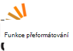

<properties
  pageTitle="DocumentDB komunity a příspěvky | Microsoft Azure"
  description="Připojit se ke komunitě Azure DocumentDB k vytvoření relace, prezentovat svou práci a zostření své dovednosti."
  services="documentdb"
  documentationCenter=""
  authors="aliuy"
  manager="johnmac"
  editor="mimig"/>

<tags
  ms.service="documentdb"
  ms.devlang="na"
  ms.topic="article"
  ms.tgt_pltfrm="na"
  ms.workload="data-services"
  ms.date="09/26/2016"
  ms.author="andrl"/>

# Portál komunity

## Vybrané komunity

Dejte nám podporovat projektu! Zobrazit Super projektu, na kterém pracujete s DocumentDB a můžeme vám pomůže váš genius nasdílet na světě. Odeslání projektu, napište nám e-mailu na: [askdocdb@microsoft.com](mailto:askdocdb@microsoft.com).

### documentdb-lumenize

*podle Larry Maccherone*

Agregace (Group-by kontingenční tabulka a datových krychlích N) a časové řady transformace jako uložené procedury v DocumentDB.

Podívejte se na [Github](https://github.com/lmaccherone/documentdb-lumenize) a [npm](https://www.npmjs.com/package/lumenize).

### DocumentDB Studio

*tak, že jde Liu*

Klienta správy prohlížeč/explorer informace o službě Microsoft Azure DocumentDB.

Podívejte se na [Github](https://github.com/mingaliu/DocumentDBStudio).

### DoQmentDB

*podle Ariel Mashraki*

DoQmentDB je Node.js na základě promise klient, poskytující vrstvě MongoDB profesionálové nad DocumentDB.

Podívejte se na [Github](https://github.com/a8m/doqmentdb) a [npm](https://www.npmjs.com/package/doqmentdb).

### Swagger rozhraní REST API pro DocumentDB

*podle Howard Edidin*

DocumentDB REST API Swagger soubor, který můžete snadno nasazený jako rozhraní API aplikace.

Podívejte se na [Github](https://github.com/HEDIDIN/DocumentDB-REST/tree/master/DocumentDBRestApi).

### Fluent documentdb modulu plug-in

*podle Yoichi Kawasaki*

Fluent documentdb modul plug-in je Fluentd modul plug-in pro výstup Azure DocumentDB.

Podívejte se na [Github](https://github.com/yokawasa/fluent-plugin-documentdb) a [rubygems](https://rubygems.org/gems/fluent-plugin-documentdb).

*Vyhledání více otevřít zdroj DocumentDB projektů na [GitHub](https://github.com/search?p=4&q=documentdb&type=Repositories).*

## Zprávy, blogy a články

Vám umožní být aktuální a mají nejnovější informace DocumentDB a funkce podle [našeho blogu](https://azure.microsoft.com/blog/tag/documentdb/).

**Příspěvky komunity:**

- [**Přejdete sociální s DocumentDB**](https://blogs.msdn.microsoft.com/mvpawardprogram/2016/03/15/going-social-with-documentdb/) - *tak, že Matias Quarantaas*

- [**UWP, služby Azure aplikace a pak DocumentDB polévky: V aplikaci pro sdílení fotografií**](https://blogs.windows.com/buildingapps/2016/03/17/uwp-azure-app-services-and-documentdb-soup-a-photo-sharing-app/) - *tak, že Tomáš Langland*

- [**Oznámení pro nové nebo změněné DocumentDB zdrojů pomocí aplikace logiky**](documentdb-change-notification.md) - *tak, že Howard Edidin*

- [**Shromáždění protokolů ve DocumentDB Azure pomocí fluent modul plug-in documentdb**](http://unofficialism.info/posts/collecting-logs-into-azure-documentdb-using-fluent-plugin-documentdb/) - *tak, že Yoichi Kawasaki*

- [**DocumentDB znovu obrácena pozornost část 1/2 – teorie**](https://peterintheazuresky.wordpress.com/2016/02/19/documentdb-revisited-part-12-the-theory/) - *tak, že Mannerhult SV*

- [**Co se má používat a nenávistná o společnosti Azure DocumentDB**](http://blog.falafel.com/4-what-to-love-and-hate-about-azures-documentdb/) - *tak, že Jirka Saadeh*

- [**Azure DocumentDB serverový skriptování**](https://www.simple-talk.com/cloud/cloud-data/azure-documentdb-server-side-scripting/) - *tak, že Robert Sheldon*

- [**DocumentDB jako datového dřez pro službu Azure toku Analytics**](http://janatdevelopment.com/2015/12/11/documentdb-as-a-data-sink-for-azure-stream-analytics/?utm_source=twitterfeed&utm_medium=twitter) - *tak, že ledna Hentschel*

- [**Azure DocumentDB ve výrobním!** ](http://blog.nexapp.ca/2015/11/30/azure-documentdb-in-production/)  -  *Alexandre Walsh a Marc Olivier Duval*

- [**Indexování Azure hledání – DocumentDB dotazy (Španělsko)**](http://www.ealsur.com.ar/wp/index.php/2015/11/19/azure-search-indexers-documentdb-queries/) - *tak, že Matthias Quaranta*

- [**Azure DocumentDB SQL dotazu základy (japonština)**](http://beachside.hatenablog.com/entry/2015/12/06/000045) - *tak, že Atsushi Yokohoma*

- [**Datové body - Aurelia splňuje DocumentDB: Cesty Matchmaker**](https://msdn.microsoft.com/magazine/mt620011.aspx) - *tak, že Julie Lerman*

- [**Infrastruktura jako kód a nepřetržitý nasazení Node.js + Azure řešení DocumentDB**](http://www.talmeida.net/blog/2015/10/26/infrastructure-as-code-and-continuous-deployment-of-a-nodejs-azure-documentdb-solution) - *tak, že Thiago Almedia*

- [**Proč DocumentDb smysl dobrý Business pro některé projekty**](http://www.iquestllc.com/blogs/read/405/why-documentdb-makes-good-business-sense-for-some-projects) - *tak, že Samuel Uresin*

- [**Azure DocumentDB vývoj přesunutí vpřed – vývoj třídy klienta (1 2) (japonština)**](http://beachside.hatenablog.com/entry/2015/10/01/202734) - *tak, že Atsushi Yokohoma*

- [**Co byste měli vědět při použití Azure DocumentDB (japonština)**](http://beachside.hatenablog.com/entry/2015/10/01/202734) - *tak, že Atsushi Yokohoma*

- [**Práce s chybami RequestRateTooLarge v Azure DocumentDB a testování výkonu**](http://blogs.msdn.com/b/bigdatasupport/archive/2015/09/02/dealing-with-requestratetoolarge-errors-in-azure-documentdb-and-testing-documentdb-performance.aspx) - *tak, že Azim Uddin*

- [**Datové body – základní informace o Microsoft Azure DocumentDB**](https://msdn.microsoft.com/magazine/mt147238.aspx) - *tak, že Julie Lerman*

- [**Pomocí DocumentDB F #**](https://jamessdixon.wordpress.com/2014/12/30/using-documentdb-with-f/) - *tak, že pracovník Štys*

- [**Protokoly analýzu aplikací s DocumentDB**](http://vincentlauzon.com/2015/09/06/analysing-application-logs-with-documentdb/) - *tak, že Vincent Philippe Lauzon*

- [**Azure DocumentDB – zálohy bodů v čase**](http://softwarejuancarlos.com/2015/09/06/azure-documentdb-point-in-time-backups/) - *tak, že Sanchez Juan Roman*

*Máte příspěvek na blog, ukázka kódu nebo Případová studie, který chcete sdílet? [Dejte nám vědět](mailto:askdocdb@microsoft.com)!*

## Události a záznamy

### Poslední a nadcházející události

| Název události                                                                                                                 | Reproduktor                                                     | Umístění             | Datum                     | Značka |
| -------------------------------------------------------------------------------------------------------------------------- | ----------------------------------------------------------- | -------------------- | ------------------------ | ------- |
| [Nevznítí 2016](https://myignite.microsoft.com/sessions?q=documentdb)  [Hlavní: Povolení digitální transformace množství účinnosti A.C.I.D pomocí Joseph Sirosh](https://myignite.microsoft.com/sessions/34953)  [Relace: Azure DocumentDB ve velkém měřítku rozsáhlé: vzorky úspěch a návrh zákazníků s Syam Kumar Nair a Andrew Liu](https://myignite.microsoft.com/sessions/3066)  [Relace: Správa aktiv IoT pomocí Node.js a DocumentDB s Josef Chvojková](https://myignite.microsoft.com/sessions/39704)  [Relace: Vytváření aplikací efektivněji a scalable prostřednictvím služby databáze Microsoft Azure Tara Jana Moshe Gutman](https://myignite.microsoft.com/sessions/2633)| Andrew Liu Syam Kumar Nair a Tara Jana | Plzeň, GA | Září 26-30, 2016 | [#MSIgnite](https://twitter.com/MS_Ignite) |
| [Meetup na Ignite: DocumentDB: pokročilé funkce rozsáhlých aplikací](http://www.meetup.com/Azure-in-the-ATL/events/234252070/) | Andrew Liu Syam Kumar Nair |  Plzeň, GA | 27 září 2016 | [#MSIgnite](https://twitter.com/MS_Ignite)[@FlatironCity](https://twitter.com/FlatironCity) |
| [Vrstvy + Hadoop světě](http://conferences.oreilly.com/strata/hadoop-big-data-ny/?cmp=kn-data-confreg-home-stny16_bing_branded) | Přijďte, navštivte naše stánku! | New York, NY | Září 26 – 29, 2016 | [#StrataConf](https://twitter.com/strataconf) |
| [Velké město .NET uživatelé skupiny](http://www.meetup.com/tally-dot-net/events/233768568/) | Santosh Hari | Tallahassee, FL | 3 listopad 2016 | není k dispozici |

*Jsou mluvit u nebo hostingu události? [Dejte nám vědět,](mailto:askdocdb@microsoft.com) jak můžeme pomoct!*

### Předchozí události a záznamy

| Název události                                                                                                                 | Reproduktor                                                     | Umístění             | Datum                   | Nahrávání |
| -------------------------------------------------------------------------------------------------------------------------- | ----------------------------------------------------------- | -------------------- | ---------------------- | --------- |
| [DevTeach](http://devteach.com/) | Cenerelli Kena  | Montrealský, Kanada | Červenec 4-8, 2016 | [NoSQL, není problém pomocí Azure DocumentDB](http://www.slideshare.net/KenCenerelli) |
| [Integrace a IoT](http://www.btug.be/events) | Eldert Grootenboer | Kontich, Belgie | 30. června 2016 | není k dispozici |
| [MongoDB světě 2016](https://www.mongodb.com/world16) | Kirill Gavrylyuk | New York, New York | Června 28 – 29, 2016 | není k dispozici |
| [Skupiny uživatelů integrace](http://www.integrationusergroup.com/do-logic-apps-support-error-handling/) | Howard S. Edidin | Webové vysílání | 20 června 2016 | [Použití logických operátorů aplikace podporují zpracování chyb?](http://www.integrationusergroup.com/do-logic-apps-support-error-handling/) |
| [Meetup: Skupiny uživatelů Azure UK](http://www.meetup.com/UKAzureUserGroup/events/229673468/)| Andrew Liu  | Londýn, Spojené království | 12 květen 2016 | není k dispozici
|[Meetup: ONETUG - Orlandu .NET uživatele skupinu](http://www.meetup.com/ONETUG/events/230797164/)| Santosh Hari| Orlandu, FL| 12 květen 2016| není k dispozici 
| [SQLBits XV](https://sqlbits.com/)                                                                                         | Andrew Liu Aravind Ramachandran                            | Liverpoolu, Spojené království        | Květen 4-7, 2016            | není k dispozici| 
| [Meetup: Skupina vývojáři .NET NYC](http://www.meetup.com/NYC-NET-Developers/events/230396260/)                            | Leonardem Lobel                                               | New Yorku, NY    | 21 Duben 2016           | není k dispozici |
| [Skupiny uživatelů integrace](http://www.integrationusergroup.com/#)                                                            | Howard Edidin                                               | Webinář              | 25 duben 2016           | není k dispozici |
| [Globální Azure Bootcamp: SoCal](http://xprs.imcreator.com/free/vishalishere/gab2016)                                        | Leonardem Lobel                                               | Oranžové, CA           | 16 duben 2016           | není k dispozici |
| [Globální Azure Bootcamp: Redmond](https://www.eventbrite.com/e/2016-global-azure-bootcamp-redmond-wa-tickets-21387752343)   | David Makogon                                               | Redmond, WA          | 16 duben 2016           | není k dispozici |
| [SQL sobota #481 – 2016 Israel (ישראל)](http://www.sqlsaturday.com/481/Sessions/Details.aspx?sid=40912)                          | Leonardem Lobel                                               | HaMerkaz, Izrael     | 04 duben 2016         | není k dispozici |
| [Sestavení 2016](https://build.microsoft.com/)                                                                                 | Jan Macintyre                                              | San Francisca, CA    | 31 březen 2016         | [Předvádění aplikace ve velkém měřítku s DocumentDB, databázi NoSQL dokumentu na Azure](https://channel9.msdn.com/Events/Build/2016/B840)
| [SQL sobota #505 - Belgie 2016](http://www.sqlsaturday.com/505/Sessions/Details.aspx?sid=44217)                         | Mihail Mateev                                               | Antverpy, Belgie     | 19 březen 2016         | není k dispozici |
| [Meetup: CloudTalk](http://www.meetup.com/CloudTalk/events/227963695/)                                                     | Kirat Pandya                                                | Pardubicích, WA         | 3 březen 2016          | není k dispozici |
| [Meetup: Azure Hodonín](http://www.meetup.com/azureaustin/events/228209275/)                                                | Merwan Chinta                                               | Hodonín, TX           | 28 leden 2016       | není k dispozici |
| [Meetup: msdevmtl](http://www.meetup.com/msdevmtl/events/223839818/)                                                       | Vincent Philippe Lauzon                                     | Montrealský QC, Kanadě | 1 dne 2015       | není k dispozici |
| [Meetup: SeattleJS](http://www.meetup.com/seattlejs/events/220102664/)                                                     | David Makogon                                               | Olomouc, WA          | 12 listopad 2015      | není k dispozici |
| [PŘEDÁNÍ Summit 2015](http://www.sqlpass.org/summit/2015/)                                                                    | Jan Renz Andrew Hoh, Aravind Ramachandran, Jan Macintyre | Olomouc, WA          | Říjen 27-30 2015    | [Vývoj moderní aplikace na Azure](https://www.youtube.com/watch?v=k5Z24HX-RyQ) |
| [CloudDevelop 2015](http://www.clouddevelop.org/)                                                                          | David Makogon Ryan Crawcour                                | Kolumbův, OH         | 23 říjen 2015       | není k dispozici |
| [SQL sobota #454 - Turín 2015](http://www.sqlsaturday.com/454/Sessions/Details.aspx?sid=40130)                           | Marco De Nittis                                             | Turín, Itálie         | 10 říjen 2015       | není k dispozici |
| [SQL sobota #430 - Sofie 2015](http://www.sqlsaturday.com/430/Sessions/Details.aspx?sid=36090)                           | Leonardem Lobel                                               | Sofie, Bulharsko      | 10 říjen 2015       | není k dispozici |
| [SQL sobota #444 - Kansas City 2015](http://www.sqlsaturday.com/444/Sessions/Details.aspx?sid=38576)                     | Jan Renz                                                   | Kansas City, měsíc      | 3 říjen 2015        | není k dispozici |
| [SQL sobota #429 - portu 2015](http://www.sqlsaturday.com/429/Sessions/Details.aspx?sid=36089)                          | Leonardem Lobel                                               | Portu, Portugalsko     | 3 říjen 2015        | není k dispozici |
| [AzureCon](https://azure.microsoft.com/azurecon/)                                                                          | David Makogon, Ryan Crawcour, Jan Macintyre                | Virtuální akce        | 29 září 2015     | [Azure platformu dat a analýzy](https://channel9.msdn.com/events/Microsoft-Azure/AzureCon-2015/ACON207) [Práce s daty NoSQL ve DocumentDB](https://channel9.msdn.com/Events/Microsoft-Azure/AzureCon-2015/ACON338) |
| [SQL sobota #434 - Holandsko 2015](http://www.sqlsaturday.com/434/Sessions/Details.aspx?sid=36413)                         | Leonardem Lobel                                               | Utrecht, Nizozemsko | 26 září 2015     | [Úvod k Azure DocumentDB](https://channel9.msdn.com/Blogs/Windows-Azure/SQL-Saturday-Holland-2015-Introduction-to-Azure-DocumentDB) |
| [SQL sobota #441 - Ostravě 2015](http://www.sqlsaturday.com/441/Sessions/Details.aspx?sid=39191)                          | Jan Renz                                                   | Ostravě, CO           | 19 září 2015     | není k dispozici |
| [Meetup: Oblast San Francisco pozice vývojáři Azure](http://www.meetup.com/bayazure/events/223943785/)                        | Andrew Liu                                                  | San Francisca, CA    | 15 září 2015     | není k dispozici |
| [Skupiny uživatelů Azure Bělorusko nakreslenými schůzky](https://www.facebook.com/events/786540124800276/)                                       | Uživatele ADAM Zyl                                                    | Minsk, Bělorusko       | 9 září 2015      | [Úvod k DocumentDB koncept přehled, konzistenci úrovně a sharding strategie](https://www.youtube.com/watch?v=Uc_qwWzJKH8) |
| [Nyní NoSQL!](http://nosql2015.dataversity.net/)                                                                            | David Makogon Ryan Crawcour                                | San José, CA         | Srpen 18-20 2015     | není k dispozici |
| [@ScaleOlomouc](http://www.atscaleconference.com/)                                                                        | Shukla (Dharma)                                               | Olomouc, WA          | 17 června 2015          | [Bez ohledu na schéma indexování s Azure DocumentDB](https://www.youtube.com/watch?v=VJQ_5qFFVP4) |
| [Aktualizace Odborný 2015](https://channel9.msdn.com/Events/DXPortugal/Tech-Refresh-2015)                                         | Bruno Lopes                                                 | Lisabonu, Portugalsko     | 15 června 2015          | [DocumentDB 101](https://channel9.msdn.com/Events/DXPortugal/Tech-Refresh-2015/DPDEV01) |
| [SQL sobota #417 - Srílanská 2015](http://www.sqlsaturday.com/417/Sessions/Details.aspx?sid=21415)                       | Mihail Mateev                                               | Colombo, Srílanská   | 06 června 2015          | není k dispozici |
| [Meetup: Meetup škálovatelnost Seattlu](http://www.meetup.com/Seattle-Scalability-Meetup/events/204010442/)                    | Shukla (Dharma)                                               | Olomouc, WA          | 27 květen 2015           | není k dispozici |
| [SQL sobota #377 - Kyjev 2015](http://www.sqlsaturday.com/377/Sessions/Details.aspx?sid=20322)                            | Mihail Mateev                                               | Kyjev, Ukrajina        | 23 květen 2015           | není k dispozici |
| [Databáze měsíc](http://www.databasemonth.com/database/azure-documentdb)                                                   | Shukla (Dharma)                                               | New York, NY         | 19 květen 2015           | [Azure DocumentDB: Databáze služby datových Scalable, více klienta dokumentů](https://www.youtube.com/watch?v=iZsqBc3Dkbk) |
| [Meetup: Skupiny uživatelů Londýn SQL serveru](http://www.meetup.com/London-SQL-Server-User-Group/events/221525058/)               | Allan burian                                              | Londýn, Spojené království           | 19 květen 2015           | není k dispozici |
| [DevIntersection](https://devintersection.com/)                                                                            | Andrew Liu                                                  | Scottsdale, AZ       | 18 21 květen 2015        | není k dispozici |
| [Meetup: Seattlu webové aplikace vývojáři skupiny](http://www.meetup.com/Seattle-Web-App-Developers-Group/events/220591071/)       | Andrew Liu                                                  | Olomouc, WA          | 14 květen 2015           | není k dispozici |
| [Nevznítí](http://ignite.microsoft.com/)                                                                                     | Andrew Hoh, Jan Macintyre                                  | Ostrava, IL          | 4-8 květen 2015          | [Vyberte nejnovější z DocumentDB videa](https://azure.microsoft.com/documentation/videos/microsoft-ignite-2015-select-latest-from-microsoft-azure-documentdb/) [DocumentDB a dat Azure HDInsight: společně lépe video](https://azure.microsoft.com/documentation/videos/microsoft-ignite-2015-microsoft-azure-documentdb-and-azure-hdinsight-better-together/) |
| [Sestavení 2015](http://www.buildwindows.com/)                                                                                 | Ryanu Crawcour                                               | San Francisca, CA    | Duben 29-1 květen 2015 | [Vytvořit další velký možnost NoSQL službou Azure společnosti: DocumentDB](https://channel9.msdn.com/Events/Build/2015/2-729) |
| [Globální Azure Bootcamp 2015 - Španělsko](http://azurebootcamp.es/)                                                             | Leoš Ruiz Pavon Roberto Gonzales                           | Madrid, Španělsko        | 25 duben 2015         | [#DEAN DocumentDB Express + AngularJS + NodeJS provozu v Azure](https://channel9.msdn.com/events/Developers-Spain-Events/Global-Azure-Bootcamp-2015/DEAN-DocumentDB--Express--AngularJS--NodeJS-running-on-Azure) |
| [Meetup: Dánsko Azure Usergroup](http://www.meetup.com/Azure-Usergroup-Denmark/events/221026670/)                         | Tomáš Holm Diget                                        | Copenhagen, Dánsko  | 16 duben 2015         | není k dispozici |
| [Meetup: Cloudu společnosti Microsoft Charlotte](http://www.meetup.com/Charlotte-Microsoft-Cloud/events/221503519/)                     | Pracovník Rance                                                 | Charlotte, NC        | 8 duben 2015          | není k dispozici |
| [SQL sobota #375 - křemíku sedla 2015](http://www.sqlsaturday.com/375/Sessions/Details.aspx?sid=15289)                  | IKE Ellis                                                   | Mountain zobrazení, CA    | 28. březnem 2015         | není k dispozici |
| [Meetup: Istanbul Azure Meetup](http://www.meetup.com/istanbul-azure-meetup/events/220325538/)                             | Daron Yondem                                                | Istanbul, Turecko     | 7 březen 2015          | není k dispozici |
| [Meetup: skupiny uživatelů .net oblasti výborně jezera](http://www.meetup.com/Great-Lakes-Area-NET-User-Group-MIGANG/events/220364576/) | Jan Collier                                             | Southfield, MI       | 18 únor 2015      | není k dispozici |
| [TechX Azure](https://www.youtube.com/channel/UCDRlI2E4z5qmHsBXTrFOE2Q)                                                    | Magnus Mårtensson                                           | Stockholm, Švédsko    | Ledna 2015 28 – 29    | [DocumentDB v Azure nové NoSQL možnost cloudu](https://www.youtube.com/watch?v=Hw7hDYoChNI) |

### Videa a podcasty

| Zobrazení                                        | Reproduktor                     | Datum               | Dílu |
| ------------------------------------------- | --------------------------- | ------------------ | ------- |
| Kanál 9: Microsoft + otevřít zdroj          | Lukáš Miguel Parrella         | 14 duben 2016    | [Od střední hodnoty DEAN v Azure s Bitnami, OM měřítko sady a DocumentDB](https://channel9.msdn.com/Blogs/Open/From-MEAN-to-DEAN-in-Azure-with-Bitnami-VM-Scale-Sets-and-DocumentDB) |
| Wired2WinWebinar                            | Sai Sankar Kunnathukuzhiyil | 9. březnem 2016      | [Vývoj řešení s Azure DocumentDB](https://www.youtube.com/watch?v=xKttEwXv_bs)
| Skupiny uživatelů integrace                      | Hanu Wong                    | 17 únor 2016  | [Analýza a vizualizace – relačních dat pomocí DocumentDB + Power BI](http://www.integrationusergroup.com/analyze-visualize-non-relational-data-documentdb-power-bi/) |
| Azure podcastu                           | Menšit Teeter                 | 14 leden 2016   | [Dílu 110: Hledání a použití DocumentDB](http://azpodcast.azurewebsites.net/post/Episode-110-Using-DocumentDB-Search) |
| Kanál 9: Moderní aplikace              | Tara Shankar Jana           | 13 prosinec 2016  | [Prohlédněte moderní přístup k datům v aplikací](https://channel9.msdn.com/Series/Modern-Applications/Take-a-modern-approach-to-data-in-your-apps) |
| NinjaTips                                   | Miguel Quintero             | 10 prosinec 2015  | [DocumentDB – zrušením zaškrtnutí vistazo obecné](https://channel9.msdn.com/Series/Ninja-Tips/31-NinjaTips-Desarrollo-DocumentDB-1-Vistazo-general) |
| Skupiny uživatelů integrace                      | Howard Edidin               | 9 listopad 2015   | [Azure DocumentDB zdravotní péče integrace – část 2](http://www.integrationusergroup.com/azure-documentdb-for-healthcare-integration-part-2/) |
| Skupiny uživatelů integrace                      | Howard Edidin               | 5 říjen 2015    | [Azure DocumentDB zdravotní péče integrace](http://www.integrationusergroup.com/?event=azure-documentdb-and-biztalk) |
| DX Itálie – #TecHeroes                       | Alessandro Melchiori        | 2 říjen 2015    | [#TecHeroes - DocumentDB](https://channel9.msdn.com/Shows/TecHeroes/TecHeroes-DocumentDB) |
| Zobrazit cloudu společnosti Microsoft – podcastu              | Andrew Liu                  | 30 září 2015 | [Dílu 099 - Azure DocumentDB s Andrew Liu](http://www.microsoftcloudshow.com/podcast/Episodes/099-azure-documentdb-with-andrew-liu) |
| .NET skály!  -Podcastu                      | Ryanu Crawcour               | 29 září 2015 | [Údaje o DocumentDB s Ryan CrawCour](https://www.dotnetrocks.com/?show=1197) |
| Data vystavená                                | Ryanu Crawcour               | 28 září 2015 | [Co je nového v Azure DocumentDB od GA](https://channel9.msdn.com/Shows/Data-Exposed/Whats-New-with-Azure-DocumentDB-Since-GA) |
| Azure podcastu                           | Menšit Teeter                 | 17 září 2015 | [Dílu 94: azpodcast.com nové architektura](http://azpodcast.azurewebsites.net/post/Episode-94-azpodcastcom-re-architecture) |
| Titulní cloudu                                 | Ryanu Crawcour               | 4 září 2015  | [Dílu 185: Aktualizace DocumentDB s Ryan CrawCour](https://channel9.msdn.com/Shows/Cloud+Cover/Episode-185-DocDB-Updates-with-Ryan-CrawCour) |
| CodeChat 033                                | Gregu Doerr                  | 28 červenec 2015      | [Gregu Doerr na Azure DocumentDB](https://channel9.msdn.com/Shows/codechat/033) |
| Centrální NoSql                               | Král Wilder                 | 25 květen 2015       | [Souhrn sloupců Golf sledování – video přehled o tom, jak vytvořit webovou aplikaci nad AngularJS, WebApi 2 a DocumentDB.](http://www.nosqlcentral.net/Story/Details/videos/kahanu/1-documentdb-golf-tracker-overview) |
| Virtuální kapitoly v paměti technologie PRŮCHODU | Stephen Baron               | 25 květen 2015       | [Ahoj DocumentDB](https://www.youtube.com/watch?v=itFXQCd9-dI) |
| Data vystavená                                | Ryanu Crawcour               | 8 duben 2015      | [Obecné dostupnosti DocumentDB a co je nového?](https://channel9.msdn.com/Shows/Data-Exposed/DocumentDB-General-Availability-and-Whats-New) |
| Data vystavená                                | Andrew Liu                  | 17 březen 2015     | [Java SDK DocumentDB](https://channel9.msdn.com/Shows/Data-Exposed/Java-SDK-for-DocumentDB) |
| #DevHangout                                 | Gustavo Alzate Sandoval     | 11 březen 2015     | [DocumentDB, la základní de datos NoSql de Microsoft Azure](https://www.youtube.com/watch?v=8Ud3jB8KOBA) |
| Data Architektura virtuální kapitola PRŮCHODU      | IKE Ellis                   | 25 únor 2015  | [Úvod k DocumentDB](https://www.youtube.com/watch?v=7BQYdFUkz6s) |

### Online třídy

| Výukové partnera                                                                                                                                                                      | Popis |
| ------------------------------------------------------------------------------------------------------------------------------------------------------------------------------------- | ----------- |
|  | [**Microsoft Virtual Academy**](https://mva.microsoft.com/en-US/training-courses/deploying-web-apps-to-azure-app-service-16629) nabízí školení od lidí, kterým sestavení Azure DocumentDB. |
|                                                       | [**Pluralsight**](http://www.pluralsight.com/courses/azure-documentdb-introduction) je klíčové nabízející Azure školení partnera společnosti Microsoft. Pokud jste MSDN odběratelů, pomocí své výhody pro přístup k školení Microsoft Azure. |
|                                                  | [**OpsGility**](https://www.opsgility.com/courses/player/introduction_to_azure_documentdb) poskytuje tmavě technické školení na Microsoft Azure. Pokud potřebujete kurzů vedených instruktorem vzdělávání na místě pomocí vzdálené classroom podle jejich potvrzeno odvětví učitelů. |

## Diskuse

### Twitter

V následujících článcích na twitter [@DocumentDB](https://twitter.com/DocumentDB) a upozorňovat na nové zprávy s poslední konverzace na značka [#DocumentDB](https://twitter.com/hashtag/DocumentDB) .

### Fóra online

| Fórum komunity poskytovatele                                                                                                                  | Popis |
| ------------------------------------------------------------------------------------------------------------------------------- | ----------- |
|  | Jazyk nezávislým společně upravit otázku a odpověď webu programátorům. Postupujte podle našeho značku: [azure documentdb](http://stackoverflow.com/questions/tagged/azure-documentdb) |
|                                 | Vhodným místem pro podporu a názory na Microsoft Azure funkce a služby, jako třeba webů, DocumentDB atd. |

## Obraťte se na tým

Potřebujete technickou pomoc? Máte další otázky? Chcete vědět, jestli NoSQL je přesně hodí pro vás? Je možné [plán 1:1 konverzace přímo se na tým technické DocumentDB](http://www.askdocdb.com/). Můžete taky čistou nám [e-mailu](mailto:askdocdb@microsoft.com) nebo tweet nás v [@DocumentDB](https://twitter.com/DocumentDB). 

## Otevřít zdroj projekty

Tyto projekty jsou aktivně vyvinutý konsorciem Azure DocumentDB týmu ve spolupráci s naší komunity otevřít zdroj.

### SDK

| Platformy | Github                                                                      | Balíčku |
| -------- | --------------------------------------------------------------------------- | ------- |
| Node.js  | [Azure documentdb uzel](https://github.com/Azure/azure-documentdb-node)     | [npm](https://www.npmjs.com/package/documentdb) |
| Java     | [Azure documentdb java](https://github.com/Azure/azure-documentdb-java)     | [Maven](http://search.maven.org/#search%7Cga%7C1%7Ca%3A%22azure-documentdb%22) |
| Python   | [Azure documentdb python](https://github.com/Azure/azure-documentdb-python) | [PyPI](https://pypi.python.org/pypi/pydocumentdb) |

### Jiné projekty

| Jméno                | Github                                                                                            | Web |
| ------------------- | ------------------------------------------------------------------------------------------------- | ------- |
| Si přečtěte následující dokumentaci       | [Azure obsahu](https://github.com/Azure/azure-content/tree/master/articles/documentdb)           | [Přečtěte následující dokumentaci pro web](https://azure.microsoft.com/documentation/services/documentdb/) |
| Hadoop spojnice    | [Azure documentdb hadoop](https://github.com/Azure/azure-documentdb-hadoop)                       | [Maven](http://search.maven.org/#search%7Cga%7C1%7Ca%3A%22azure-documentdb-hadoop%22) |
| Nástroje pro migraci dat | [Azure documentdb datamigrationtool](https://github.com/Azure/azure-documentdb-datamigrationtool) | [Stažení softwaru společnosti Microsoft](http://www.microsoft.com/en-us/download/details.aspx?id=46436) |

## Průvodce DocumentDB

Průvodci DocumentDB jsou vedoucí komunity, které jste prokázáno EXEMPLÁRNÍ potvrzení pomáhá ostatní využívejte svoje zkušenosti s Azure DocumentDB. S komunity a týmu DocumentDB sdílejí své výjimečné nadšení reálný knowledge a odborných.

Průvodce | Obrázek 
 --- | --- 
 [Allan burian](https://twitter.com/allansqlis) |  
 [Jen Stirrup](https://twitter.com/jenstirrup) |             
 [Lenni Lobel](https://twitter.com/lennilobel) |  |          
 [Mihail Mateev](https://twitter.com/mihailmateev) |  |
 [Larry Maccherone](https://twitter.com/lmaccherone) |  
 [Howard Edidin](https://twitter.com/hsedidin) |  
 [Santosh Hari](https://twitter.com/_s_hari) |  

Má být průvodce DocumentDB? Při žádné srovnávacích pro stále DocumentDB Průvodce kritéria, která vyhodnocení patří vliv kandidát příspěvky online fóra například StackOverflow a MSDN; Wikiweby a online obsah; konference a skupin uživatelů; podcasty, weby, blogy a sociální média; a články a publikace. Tak, [že nám e-mailu](mailto:askdocdb@microsoft.com)můžete jmenovat sami nebo někdo jiný.
