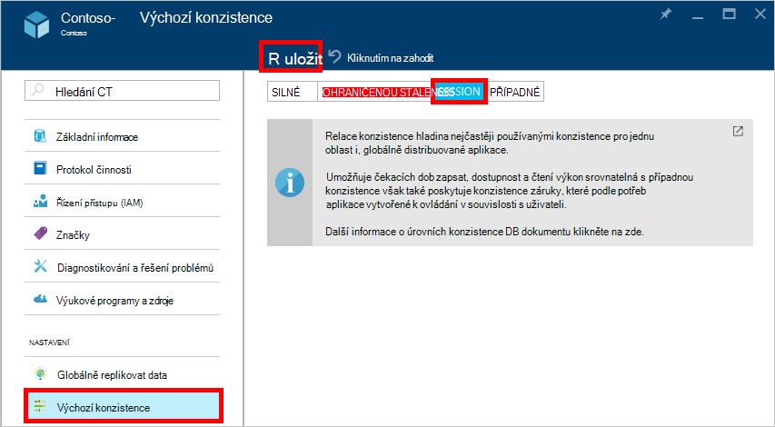

<properties
    pageTitle="Soulad úrovní v DocumentDB | Microsoft Azure"
    description="DocumentDB má čtyři úrovně konzistence případné konzistence rozložení, dostupnost a latence střídání."
    keywords="případné konzistence documentdb azure, Microsoft azure"
    services="documentdb"
    authors="syamkmsft"
    manager="jhubbard"
    editor="cgronlun"
    documentationCenter=""/>

<tags
    ms.service="documentdb"
    ms.workload="data-services"
    ms.tgt_pltfrm="na"
    ms.devlang="na"
    ms.topic="article"
    ms.date="08/24/2016"
    ms.author="syamk"/>

# Soulad úrovní v DocumentDB

Azure DocumentDB je navržen tak z důvodu nahoru globální rozdělení na paměti. Je určená nabízejí předvídatelná zhoršeným latence záruky, SLA dostupnost 99,99 % a více dobře definovaný naleznete konzistence modelů. V současné době DocumentDB nabízí čtyři úrovně konzistence: silných ohraničených staleness, relace a případné. Kromě **silných** a **případné konzistence** modely běžně zaměstnanecké, které dalších databází NoSQL DocumentDB také nabízí dva modely pečlivě kódovanou a operationalized konzistence – **ohraničených staleness** a **relace**a potvrdil jejich užitečnost proti případy použití skutečném světě. Tyto čtyři konzistence úrovně souhrnně umožňují provést dobře odůvodněnou střídání mezi konzistence, dostupnost a latence. 

## Rozsah konzistence

Rozlišení konzistence má obor vymezený na žádost o jednoho uživatele. Žádost o zápisu můžete odpovídat insert, nahradit, upsert nebo odstranit transakce (s nebo bez spuštění přidružené před nebo po aktivační události pro). Nebo žádost o zápisu může odpovídají transakční provádění JavaScript uložené procedury prostřednictvím více dokumentů, které tvoří oddíl. Stejně jako u zápisy, transakce pro čtení, dotaz má taky obor vymezený na žádost o jednoho uživatele. Uživatel může být nutné přejdete myší velkou sadu výsledků, která trvá více oddílů, ale každý přečíst transakce obor vymezený na jednu stránku a podávané množství od v rámci jeden oddíl.

## Soulad úrovně

Výchozí úroveň konzistence můžete nakonfigurovat ve vašem účtu databáze, která se vztahuje ke všem kolekcím (ve všech databází), pod svým účtem databáze. Ve výchozím nastavení použije čtení a dotazy vystavený zdroje uživatelem definované výchozí úroveň konzistence zadanou v účet databázi. Můžete však zmírnit konzistence úroveň žádost o specifické pro čtení, dotaz zadáním hlavičky [[x ms konzistence úrovně]](https://msdn.microsoft.com/library/azure/mt632096.aspx) . Existují čtyři typy úrovně konzistence nepodporuje DocumentDB replikace Protocol (protokol), které jsou zdrojem vymazat poměr konkrétní konzistence záruky a výkonu, jak je popsáno níže.

![DocumentDB nabízí víc, dobře definované (naleznete) konzistence modely můžete vybírat][1]

**Silné**: 

- Směrový konzistence nabízí záruky [linearizability](https://aphyr.com/posts/313-strong-consistency-models) s čtení zaručené k vrácení poslední verzi dokumentu. 
- Směrový konzistence zaručuje, že zápisu je viditelné pouze po je potvrzena trvale tak, že většina kvora repliky. Zápis buď synchronní vyvíjí trvale tak, že primární a kvora druhotné nebo je přerušen. Čtení vždy rozpozná většina číst kvora, klienta nikdy vidí nepotvrzené nebo část zapsat a je vždy zaručena přečíst nejnovější potvrzené zápisu. 
- Účty DocumentDB nakonfigurované používat silných konzistence nelze přidružit účtem DocumentDB víc než jedné oblasti Azure. 
- Náklady operace čtení (z hlediska [žádost o jednotky](documentdb-request-units.md) spotřebované množství) s silných konzistence je vyšší než relace a případné, ale stejný jako ohraničenou staleness.
 

**Bounded staleness**: 

- Ohraničených staleness konzistence záruky, která načte může zpoždění za zápisy maximálně *K* verzí nebo předpony dokumentu nebo *t* časový interval. 
- Proto při výběru ohraničených staleness, "staleness" možné konfigurovat dvěma způsoby: 
    - Počet verzí *K* dokumentu prodloužením doby načte prodlevy za zápisu
    - Časový interval *t* 
- Svázán staleness nabízí celkové globální pořadí kromě v okně"staleness". Všimněte si, že monotónní číst zaručuje existuje v oblasti vnitřní i vnější "staleness okna". 
- Ohraničenou staleness poskytuje silnější záruky konzistence než relace nebo případné konzistence. Globálně distribuované aplikace doporučujeme že používáte ohraničenou staleness scénáře místo, kam chcete mít silných konzistence ale hodit 99,99 % dostupnost a nízké latence. 
- DocumentDB účty, které budou nakonfigurována ohraničenou staleness konzistence přidružit účtem DocumentDB libovolný počet Azure oblastí. 
- Náklady operace čtení (z hlediska RUs spotřebované množství) s ohraničenou staleness je vyšší než relace a případné konzistence, ale stejný jako silných konzistence.

**Relace**: 

- Na rozdíl od modelů globální konzistence nabízená silných, ohraničená staleness konzistence úrovně má obor vymezený konzistence relace na relace. 
- Relace konzistence je ideální pro všechny scénáře místo, kam se účastní relaci zařízení nebo uživatele od zaručuje monotónní čtení, monotónní zápisy a číst zaručuje vlastní zápisy (RYW). 
- Relace konzistence poskytuje předvídatelná konzistence relace a maximální číst výkon při nabízející nejnižších latence zápisy a čtení. 
- DocumentDB účty, které budou nakonfigurována konzistence relace můžete přidružit účtem DocumentDB libovolný počet Azure oblastí. 
- Náklady operace čtení (z hlediska RUs spotřebované množství) k relaci konzistence úrovni je menší než silných, ohraničená staleness, ale více než případné konzistence
 

**Případné**: 

- Případné konzistence zaručuje, že v nepřítomnosti všech dalších zápisu postupně bude konvergovat repliky v rámci skupiny. 
- Případné konzistence je nejslabších formulář konzistence kde klienta se může zobrazit hodnoty, které nejsou starší než těch, které bylo vidět před.
- Případné konzistence poskytuje nejslabších čtení konzistence ale nabízí nejnižší latence pro čtení i zápis.
- DocumentDB účty, které budou nakonfigurována případnému konzistence přidružit účtem DocumentDB libovolný počet Azure oblastí. 
- Náklady operace čtení (z hlediska RUs spotřebované množství) s případnou konzistence je nejnižší všech úrovní konzistence DocumentDB úroveň.

## Záruky konzistence

V následující tabulce jsou zaznamenány různých konzistence záruky odpovídající úrovně čtyři konzistence.

| Záruky                                                         |    Silné                                       |    Ohraničenou Staleness                                                                           |    Relace                                       |    Případné                                 |
|----------------------------------------------------------|-------------------------------------------------|------------------------------------------------------------------------------------------------|--------------------------------------------------|--------------------------------------------------|
|    **Celkový globální objednávky**                                |    Ano                                          |    Ano, nejsou v okně"staleness"                                                      |    Ne, pořadí částečné "relace"                   |    Ne                                            |
|    **Záruky konzistentní předpony**                       |    Ano                                          |    Ano                                                                                         |    Ano                                           |    Ano                                           |
|    **Monotónní čtení**                                   |    Ano                                          |    Ano, v oblasti mimo okno staleness a v oblasti vždy.     |    Ano pro dané relace                    |    Ne                                            |
|    **Monotónní zápisy**                                  |    Ano                                          |    Ano                                                                                         |    Ano                                           |    Ano                                           |
|    **Přečtěte si svůj zápisy**                                  |    Ano                                          |    Ano                                                                                         |    Ano (v oblasti zápisu)                      |    Ne                                            |

## Konfigurace výchozí úroveň konzistence

1.  V [Azure portal](https://portal.azure.com/)v Jumpbar klikněte na **DocumentDB (NoSQL)**.

2. V zásuvné **DocumentDB (NoSQL)** vyberte databázi účet, který chcete upravit.

3. V zásuvné účtu klikněte na **výchozí konzistence**.

4. **Výchozí konzistence** zásuvné vyberte novou úroveň konzistenci a na tlačítko **Uložit**.

    

## Úrovně konzistence pro dotazy

Ve výchozím nastavení pro definované uživatelem zdroje úroveň konzistence dotazů je stejná jako úroveň konzistence pro čtení. Index je ve výchozím nastavení synchronní aktuální informace o jednotlivých insert, nahradit nebo odstranit dokumentu v kolekci. Díky dotazů přijmout stejné úrovni konzistence jako čtení dokumentu. Během DocumentDB je zapsat optimalizované a podporuje trvalý svazky zápisy dokumentu, údržbu synchronní index a poskytování konzistentní dotazů, můžete nakonfigurovat některé kolekce pomalu aktualizovat jejich index. Pustí indexování dále zvyšuje výkon zápisu a je ideální pro hromadné požití scénáře převážně ke čtení těžké po úlohu.  

Indexování režimu|  Čtení|  Dotazy  
-------------|-------|---------
Konzistentní (výchozí)|   Výběr od silných, ohraničenou staleness relace, nebo případné|    Výběr od silných, ohraničenou staleness relace, nebo případné|
Pustí|   Výběr od silných, ohraničenou staleness relace, nebo případné|    Případné  

Jako s žádostí o čtení, můžete snížit úroveň konzistence konkrétní dotaz zadáním hlavičky [x ms konzistence úrovně](https://msdn.microsoft.com/library/azure/mt632096.aspx) .

## Další kroky

Pokud chcete udělat další čtení o konzistence úrovních a poměry, doporučujeme v následujících zdrojích:

-   Doug Terry. Replikovanou konzistence dat vysvětlení prostřednictvím baseballovou (video).   
[https://www.YouTube.com/watch?v=gluIh8zd26I](https://www.youtube.com/watch?v=gluIh8zd26I)
-   Doug Terry. Replikovanou konzistence dat vysvětlení prostřednictvím baseballovou.   
[http://Research.microsoft.com/pubs/157411/ConsistencyAndBaseballReport.PDF](http://research.microsoft.com/pubs/157411/ConsistencyAndBaseballReport.pdf)
-   Doug Terry. Relace záruky mírně konzistentní replikovanou Data.   
[http://DL.ACM.org/CITATION.cfm?id=383631](http://dl.acm.org/citation.cfm?id=383631)
-   ADAM Abadi. Poměry konzistence v moderní Distributed návrhu databáze systémy: Zakončení je jenom část textu ".   
[http://Computer.org/CSDL/mags/co/2012/02/mco2012020037-ABS.HTML](http://computer.org/csdl/mags/co/2012/02/mco2012020037-abs.html)
-   Sv Bailis Shivaram Venkataraman, Jan J. Franklin, Joseph M. Hellerstein, Ion Stoica. Pravděpodobnosti svázán Staleness (PBS) pro praktická část kvor.   
[http://vldb.org/pvldb/vol5/p776_peterbailis_vldb2012.PDF](http://vldb.org/pvldb/vol5/p776_peterbailis_vldb2012.pdf)
-   Wernerovi Vogels. Případné konzistentní – znovu obrácena pozornost.    
[http://allthingsdistributed.com/2008/12/eventually_consistent.HTML](http://allthingsdistributed.com/2008/12/eventually_consistent.html)

[1]: ./media/documentdb-consistency-levels/consistency-tradeoffs.png
