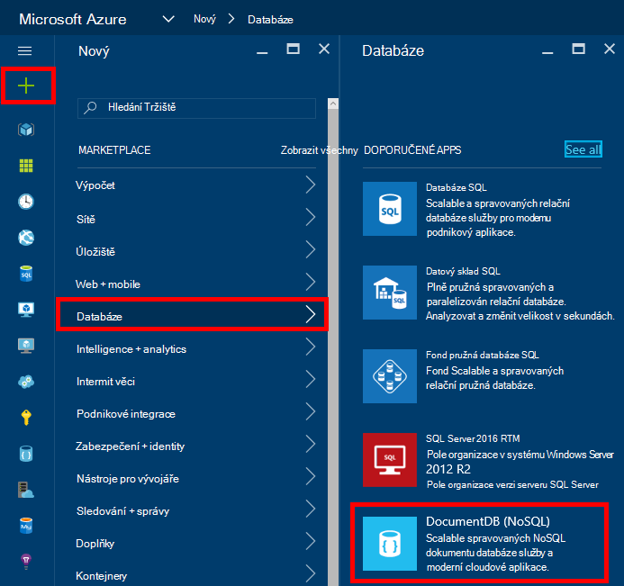
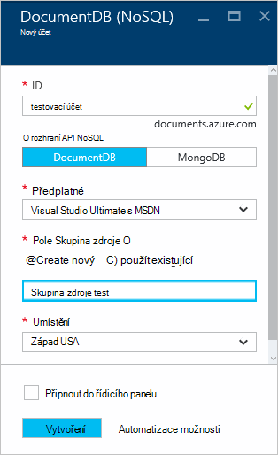
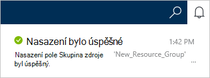
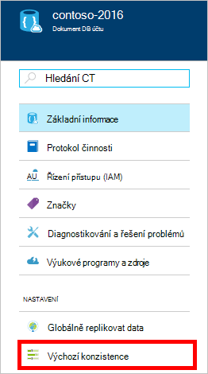
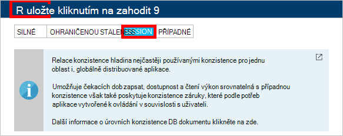

<properties
    pageTitle="Jak vytvořit účet DocumentDB | Microsoft Azure"
    description="Vytvoření databáze NoSQL s Azure DocumentDB. Postupujte podle těchto pokynů a vytvořte účet DocumentDB začít vytvářet oslnivý rychlé, globální měřítko NoSQL databázi." 
    keywords="Vytvoření databáze"
    services="documentdb"
    documentationCenter=""
    authors="mimig1"
    manager="jhubbard"
    editor="monicar"/>

<tags
    ms.service="documentdb"
    ms.workload="data-services"
    ms.tgt_pltfrm="na"
    ms.devlang="na"
    ms.topic="get-started-article"
    ms.date="10/17/2016"
    ms.author="mimig"/>

# Jak vytvořit účet DocumentDB NoSQL pomocí portálu Azure

> [AZURE.SELECTOR]
- [Azure portálu](documentdb-create-account.md)
- [Azure rozhraní příkazového řádku a Azure správce zdrojů](documentdb-automation-resource-manager-cli.md)

Pokud chcete vytvořit databázi pomocí Microsoft Azure DocumentDB, musíte:

- Máte účet Azure. Pokud už nemáte, můžete získat [bezplatný účet Azure](https://azure.microsoft.com/free) . 
- Vytvoření účtu DocumentDB.  

Vytvořit účet DocumentDB některým Azure portál, správce prostředků Azure šablony nebo Azure rozhraní příkazového řádku (rozhraní příkazového řádku). Tento článek ukazuje, jak vytvořit účet DocumentDB pomocí portálu Azure. Účet vytvořte pomocí Správce prostředků Azure nebo Azure rozhraní příkazového řádku, najdete v článku [Vytvoření účtu automatizovat DocumentDB databáze](documentdb-automation-resource-manager-cli.md).

Začínáte pracovat s DocumentDB? [V tomto](https://azure.microsoft.com/documentation/videos/create-documentdb-on-azure/) videu čtyři minutu tak, že Jiří Hanselman zobrazíte postup dokončete nejčastější úlohy na online portálu.

1.  Přihlaste se k [portálu Azure](https://portal.azure.com/).
2.  V Jumpbar klikněte na **Nový**, klikněte na **databáze**a pak klikněte na **DocumentDB (NoSQL)**. 

      

3. Do **nového účtu** zásuvné zadejte požadovaná konfigurace účtu DocumentDB.

    

    - Do pole **ID** zadejte název DocumentDB účet identifikovat.  Po ověření **ID** se zobrazí v poli **ID** zelená značka zaškrtnutí. **ID** změní se název hostitele v rámci identifikátor URI. **ID** může obsahovat pouze malá písmena, číslice a "-" znaků a musí mít 3 až 50 znaků. Poznámka: Tento *documents.azure.com* připojen k koncového bodu název, který jste si vybrali, výsledek bude koncový bod DocumentDB účtu.

    - V dialogovém okně **Rozhraní API NoSQL** vyberte model programování používat:
        - **DocumentDB**: DocumentDB API je k dispozici prostřednictvím .NET, Java, Node.js, Python a JavaScript [SDK](documentdb-sdk-dotnet.md), stejně jako HTTP [ZBÝVAJÍCÍ](https://msdn.microsoft.com/library/azure/dn781481.aspx)a nabízí programový přístup ke všem funkcím DocumentDB. 
       
        - **MongoDB**: DocumentDB také nabízí [úroveň protokolu podporu](documentdb-protocol-mongodb.md) pro **MongoDB** rozhraní API. Když vyberete možnost MongoDB API, můžete existující MongoDB SDK a [Nástroje](documentdb-mongodb-mongochef.md) Pokud chcete mluvit DocumentDB. Můžete [Přesunout](documentdb-import-data.md) stávající aplikace MongoDB používat DocumentDB, [žádné změny kód potřeby](documentdb-connect-mongodb-account.md)a využít plně spravovaných databáze jako služba, neomezený počet měřítko, globální replikace a další možnosti.

    - U **předplatného**vyberte Azure předplatné, které chcete použít pro účet DocumentDB. Pokud váš účet obsahuje jenom jedno předplatné, tento účet vybrané ve výchozím nastavení.

    - **Pole Skupina zdroje**vyberte nebo vytvořte skupina zdroje pro váš účet DocumentDB.  Ve výchozím nastavení se vytvoří nové skupiny prostředků. Další informace najdete v tématu [použití Azure portálu pro správu Azure prostředků](../articles/azure-portal/resource-group-portal.md).

    - Umožňuje zadat zeměpisné polohy v jakém hostovat svůj účet DocumentDB **umístění** . 

4.  Po konfiguraci účtu DocumentDB možností klikněte na **vytvořit**. Stav nasazení, zaškrtněte centru oznámení.  

      

    

5.  Po vytvoření účtu DocumentDB je připraven k použití s výchozím nastavením. Výchozí konzistence účtu DocumentDB je nastavena na **relace**.  Po kliknutí na **Výchozí konzistence** v nabídce zdrojů můžete upravit výchozí konzistence. Další informace o úrovních konzistence nabízená DocumentDB najdete v tématu [konzistence úrovní v DocumentDB](documentdb-consistency-levels.md).

      

      

[How to: Create a DocumentDB account]: #Howto
[Next steps]: #NextSteps
[documentdb-manage]:../articles/documentdb/documentdb-manage.md

## Další kroky

Teď, když máte účet DocumentDB, dalším krokem je vytvoření DocumentDB shromažďování a databáze. 

Můžete vytvořit novou kolekci a databáze pomocí jedné z následujících akcí:

- Azure portálu způsobem popsaným v části [vytvořit kolekci DocumentDB pomocí portálu Azure](documentdb-create-collection.md).
- Nezadaných kurzy, které zahrnují vzorová data: [.NET](documentdb-get-started.md) [.NET MVC](documentdb-dotnet-application.md), [Java](documentdb-java-application.md), [Node.js](documentdb-nodejs-application.md)nebo [Python](documentdb-python-application.md).
- [.NET](documentdb-dotnet-samples.md#database-examples), [Node.js](documentdb-nodejs-samples.md#database-examples)nebo [Python](documentdb-python-samples.md#database-examples) ukázkový kód v GitHub k dispozici.
- [.NET](documentdb-sdk-dotnet.md) [Node.js](documentdb-sdk-node.md), [Java](documentdb-sdk-java.md), [Python](documentdb-sdk-python.md)a [ZBÝVAJÍCÍ](https://msdn.microsoft.com/library/azure/mt489072.aspx) SDK.

Po vytvoření shromažďování a databáze, budete muset [přidávání dokumentů](documentdb-view-json-document-explorer.md) do kolekcí.

Po dokumenty v kolekci můžete provést [dotazy](documentdb-sql-query.md#executing-queries) [DocumentDB SQL](documentdb-sql-query.md) proti dokumentů. Pomocí [Průzkumníka dotazu](documentdb-query-collections-query-explorer.md) v portálu, [Rozhraní REST API](https://msdn.microsoft.com/library/azure/dn781481.aspx)nebo nějakého [SDK](documentdb-sdk-dotnet.md)můžete provést dotazy.

### Víc se uč

Další informace o DocumentDB, prostudujte si tyto materiály:

-   [Naučná stezka DocumentDB](https://azure.microsoft.com/documentation/learning-paths/documentdb/)
-   [Model hierarchické prostředků DocumentDB a koncepty](documentdb-resources.md)
