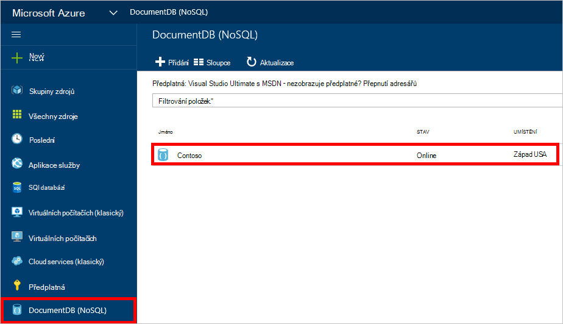
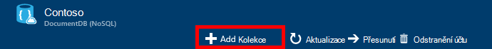
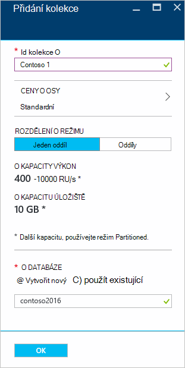
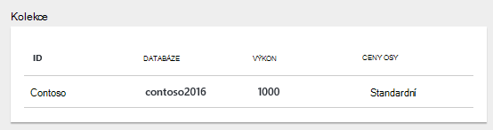
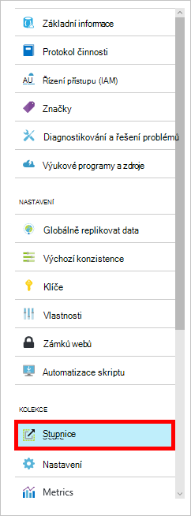

<properties 
    pageTitle="Vytvoření databáze DocumentDB a kolekce | Microsoft Azure" 
    description="Naučte se vytvářet NoSQL databází a JSON kolekce dokumentu pomocí portálu online služby Azure DocumentDB obláčkem založená dokumentu databáze. Získejte ještě dnes bezplatnou zkušební verzi." 
    services="documentdb" 
    authors="mimig1" 
    manager="jhubbard" 
    editor="monicar" 
    documentationCenter=""/>

<tags 
    ms.service="documentdb" 
    ms.workload="data-services" 
    ms.tgt_pltfrm="na" 
    ms.devlang="na" 
    ms.topic="article" 
    ms.date="10/17/2016" 
    ms.author="mimig"/>

# Jak vytvořit DocumentDB shromažďování a databáze pomocí portálu Azure

Pokud chcete používat Microsoft Azure DocumentDB, musí mít [DocumentDB účtu](documentdb-create-account.md), databáze, kolekce a dokumenty. Toto téma popisuje, jak vytvořit kolekci DocumentDB Azure portálu. 

Nevíte, jaký kolekce je? V tématu [Co je kolekce DocumentDB?](#what-is-a-documentdb-collection)

1.  V [Azure portál](https://portal.azure.com/), v Jumpbar klikněte na **DocumentDB (NoSQL)**a v zásuvné **DocumentDB (NoSQL)** vyberte účet, ke které chcete přidat kolekce. Pokud už nemáte žádné účty uvedené, musíte [vytvořit účet DocumentDB](documentdb-create-account.md).

    
    
    Pokud není zobrazená v Jumpbar **DocumentDB (NoSQL)** , klikněte na **Další služby** a klikněte na **DocumentDB (NoSQL)**. Pokud už nemáte žádné účty uvedené, musíte [vytvořit účet DocumentDB](documentdb-create-account.md).

2. V **účtu DocumentDB** zásuvné pro vybraný účet klikněte na **Přidat kolekce**.

    

3. V **Přidání kolekce** zásuvné do pole **ID** zadejte ID pro nové kolekce. Názvy kolekce musí být v rozsahu 1 až 255 znaků a nesmí obsahovat `/ \ # ?` nebo koncové mezery. Po ověření názvu se zobrazí v poli ID zelená značka zaškrtnutí.

    

4. Ve výchozím nastavení **Ceny osy** nastavenou **Standardní** tak, aby výkon a úložiště můžete přizpůsobit pro svou kolekci. Další informace o cenách osy najdete v článku [výkon úrovně v DocumentDB](documentdb-performance-levels.md).  

5. Výběr **režimu Partitioning** kolekce, **Jeden oddíl** nebo **Partitioned**. 

    **Jeden oddíl** má rezervovaný kapacitou 10 GB a může mít výkon úrovně z 400-10 000 jednotek žádost o/druhá (RU/ne). Jeden RU odpovídá výkonu čtení dokumentu 1KB. Další informace o žádosti o jednotky najdete v článku [žádost o jednotky](documentdb-request-units.md). 

    **Rozdělený kolekce** můžete přizpůsobit pro zpracování neomezené množství úložiště přes více oddílů a nemůže mít výkon úrovně počínaje 10,100 RU/s. Na portálu největší úložiště, které můžete rezervovat je 250 GB a většina výkon, které můžete rezervovat je 250 000 RU/s. Zvýšit buď kvóty, soubor žádost o podle popisu v [žádosti o lepší DocumentDB účtu kvóty](documentdb-increase-limits.md). Další informace o rozdělený kolekce najdete v článku [jeden oddíl a oddíly kolekcí](documentdb-partition-data.md#single-partition-and-partitioned-collections).

    Ve výchozím nastavení výkon pro novou kolekci jeden oddíl nastavenou RU 1000/s kapacitou 10 GB. Kolekce rozdělený výkon kolekce nastavenou 10100 RU/s kapacitou 250 GB. Po vytvoření kolekce můžete změnit výkon a prostor úložiště pro kolekci. 

6. Pokud vytváříte kolekce oddíly, vyberte **Klíč oddílu** kolekce. Výběr klíč správné oddílu je důležité při vytváření kolekce performant. Další informace o výběru klíč oddílu najdete v článku [návrhu pro rozdělení](documentdb-partition-data.md#designing-for-partitioning).

7. V zásuvné **databáze** vytvořte novou databázi nebo použít existující. Názvy databází musí být v rozsahu 1 až 255 znaků a nesmí obsahovat `/ \ # ?` nebo koncové mezery. Ověření názvu, klikněte na mimo textové pole. Po ověření název se zobrazí v poli zelená značka zaškrtnutí.

8. Klikněte na **OK** v dolní části obrazovky můžete vytvořit novou kolekci. 

9. Novou kolekci se zobrazí v **kolekcích** lens na zásuvné **Přehled** .
 
    

10. **Volitelné:** Chcete-li změnit výkon kolekce webů na portálu **měřítka** v nabídce klikněte na zdroje. 

    

## Co je kolekce DocumentDB? 

Kolekce je kontejner JSON dokumentů a přidružené aplikace logickou JavaScript. Kolekce je fakturaci entitu, kde je určen [náklady](documentdb-performance-levels.md) zřizování výkon kolekce. Kolekce může zahrnovat jeden nebo více oddílů/servery a lze přizpůsobit zpracovat prakticky neomezené množství úložiště nebo výkon.

Kolekce jsou automaticky rozdělit na jeden nebo více fyzické serverů tak, že DocumentDB. Když vytvoříte kolekci, můžete určit zřizování výkon z hlediska žádost o jednotky za sekundu a vlastnost klíče oddíl. Hodnota vlastnosti použijí DocumentDB k distribuci dokumentů mezi oddíly a směrování požadavků jako dotazů. Hodnoty klíče oddílu taky slouží jako hranici transakce pro uložené procedury a aktivace. Jednotlivé kolekce má rezervovaný počtu výkon specifické pro tuto kolekci, které není nasdílel ostatních kolekcí ve stejném účtu. Proto rozšiřování aplikace jak z hlediska úložiště a výkon. 

Kolekce nejsou stejné jako tabulky v relační databáze. Kolekce nebudou vynucovat schématu, ve skutečnosti DocumentDB není jejímu vynucení všechny schémata, ale bez schématu databáze. Proto se mohou být uloženy různých typů dokumentů s různorodého schémata ve stejné kolekce. Je možné kolekce objekty uložit pomocí jednoho typu jako pomocí tabulek. Nejlepší modelu závisí pouze data se vzhledem pohromadě v dotazech a transakce.

## Další způsoby, jak vytvořit kolekci DocumentDB

Kolekce vytvářených pomocí portálu nemáte, můžete taky vytvořit pomocí [DocumentDB SDK](documentdb-sdk-dotnet.md) a rozhraní REST API. 

- Příklad C# kódu najdete v článku [kolekce ukázky C#](documentdb-dotnet-samples.md#collection-examples). 
- Ukázka kódu Node.js najdete v článku [Node.js kolekce vzorky](documentdb-nodejs-samples.md#collection-examples).
- Příklad kódu Python prohlédněte [Python kolekce](documentdb-python-samples.md#collection-examples).
- Rozhraní REST API vzorku najdete v článku [Vytvoření kolekci](https://msdn.microsoft.com/library/azure/mt489078.aspx).

## Řešení potíží

Pokud **Přidat kolekce** je zakázané v portálu Azure, to znamená, že váš účet je aktuálně zakázán, které obvykle dojde k se používají všech výhod přeplatky za měsíc.   

## Další kroky

Teď, když máte kolekci, dalším krokem je přidat dokumenty nebo importovat dokumenty do kolekce. Když přijde na přidávání dokumentů do kolekce, máte několik možností:

- Můžete [přidávat dokumenty](documentdb-view-json-document-explorer.md) pomocí Průzkumníka dokumentu na portálu.
- Můžete [importovat dokumenty a data](documentdb-import-data.md) pomocí DocumentDB dat nástroje pro migraci, která umožňuje import JSON a CSV souborů, jakož i dat z SQL serveru, MongoDB, úložiště tabulek Azure a jiných kolekcích DocumentDB. 
- Nebo můžete přidat dokumentů pomocí jedné z [DocumentDB SDK](documentdb-sdk-dotnet.md). DocumentDB má .NET Java, Python, Node.js a JavaScript rozhraní API SDK. C# ukázky znázorňující, jak pracovat s dokumenty pomocí DocumentDB .NET SDK najdete v článku [ukázky dokumentu C#](documentdb-dotnet-samples.md#document-examples). Node.js ukázky znázorňující, jak pracovat s dokumenty pomocí DocumentDB Node.js SDK najdete v článku [Ukázky Node.js dokumentu](documentdb-nodejs-samples.md#document-examples).

Po dokumenty v kolekci můžete [DocumentDB SQL](documentdb-sql-query.md) provést [dotazy](documentdb-sql-query.md#executing-queries) týkající se dokumentů pomocí [Průzkumníka dotazu](documentdb-query-collections-query-explorer.md) v portálu, [Rozhraní REST API](https://msdn.microsoft.com/library/azure/dn781481.aspx)nebo nějakého [SDK](documentdb-sdk-dotnet.md). 
