<properties 
    pageTitle="Nasazení DocumentDB a Azure aplikace služby Web Apps pomocí šablony správce prostředků Azure | Microsoft Azure" 
    description="Naučte se nasadit DocumentDB účet Azure aplikace služby Web Apps a ukázkové webové aplikace pomocí šablony správce prostředků Azure." 
    services="documentdb, app-service\web" 
    authors="h0n" 
    manager="jhubbard" 
    editor="monicar" 
    documentationCenter=""/>

<tags 
    ms.service="documentdb" 
    ms.workload="data-services" 
    ms.tgt_pltfrm="na" 
    ms.devlang="na" 
    ms.topic="article" 
    ms.date="08/02/2016" 
    ms.author="hawong"/>

# Nasazení DocumentDB a Azure aplikace služby Web Apps pomocí šablony správce prostředků Azure

Tento kurz se dozvíte, jak používat šablonu správce prostředků Azure k nasazení a integrace [Microsoft Azure DocumentDB](https://azure.microsoft.com/services/documentdb/), webové aplikace pro [Aplikaci služby Azure](http://go.microsoft.com/fwlink/?LinkId=529714) a ukázkové webové aplikace.

Pomocí Správce prostředků Azure šablon můžete snadno automatizovat nasazení a konfiguraci Azure prostředků.  Tento kurz ukazuje, jak nasazení webové aplikace a automatické konfigurace DocumentDB informace o připojení účtu.

Po dokončení tohoto kurzu, budou moct odpovězte na následující otázky:  

-   Jak můžu používat šablonu správce prostředků Azure nasadit a integrace účet DocumentDB nebo web app v aplikaci služby Azure?
-   Jak můžu používat šablonu správce prostředků Azure nasadit a integrace DocumentDB účet do webových aplikací ve webových aplikacích pro aplikaci služby a aplikace Webdeploy?

## Zjistit předpoklady pro
> [AZURE.TIP] Během tohoto kurzu není předpokládá zkušenosti s správce prostředků Azure šablony nebo JSON, by měl, kterou chcete upravit odkazované šablony nebo možnosti nasazení znalosti v každé z těchto oblastí bude potřeba.

Před postupujte podle pokynů v tomto kurzu, ověřte, jestli máte takto:

- Předplatné Azure. Azure je platforma na základě předplatného.  Další informace o získání předplatné najdete v článku [Možnosti nákupu](https://azure.microsoft.com/pricing/purchase-options/), [Nabízí člena](https://azure.microsoft.com/pricing/member-offers/)nebo [Bezplatnou zkušební verzi](https://azure.microsoft.com/pricing/free-trial/).

##Krok 1: Stažení šablony souborů ##
Začneme tím, že stahovat soubory šablon, které použijeme v tomto kurzu.

1. Stažení šablony [vytvořit účet DocumentDB Web Apps a nasazení aplikace výběru ukázku](https://portalcontent.blob.core.windows.net/samples/DocDBWebsiteTodo.json) do místní složky (například C:\DocumentDBTemplates). Tato šablona nasadí účet DocumentDB, webové aplikace pro aplikaci služby a webové aplikace.  Taky automaticky nakonfiguruje webovou aplikaci pro připojení k účtu DocumentDB.

2. Stažení šablony [vytvořit účet DocumentDB a ukázkové Web Apps](https://portalcontent.blob.core.windows.net/samples/DocDBWebSite.json) do místní složky (například C:\DocumentDBTemplates). Tato šablona nasadí účet DocumentDB webovou aplikaci aplikaci služby změní nastavení aplikace na web snadno zjistit informace o připojení DocumentDB, ale nezahrnuje webové aplikace.  

##Krok 2: Nasazení DocumentDB klienta, aplikaci služby web app a ukázku Ukázka aplikace

Teď Pojďme nasazení naše první šablony.

> [AZURE.TIP] Šablona nelze ověřit, že je web app jméno a název účtu DocumentDB zadali pod a) platných a b) k dispozici.  Důrazně doporučujeme ověřit dostupnost názvy, které chcete zadat před odesláním nasazení.

1. Přihlaste se k [Portálu Azure](https://portal.azure.com), klepněte na nový a vyhledejte "Nasazení šablony".
    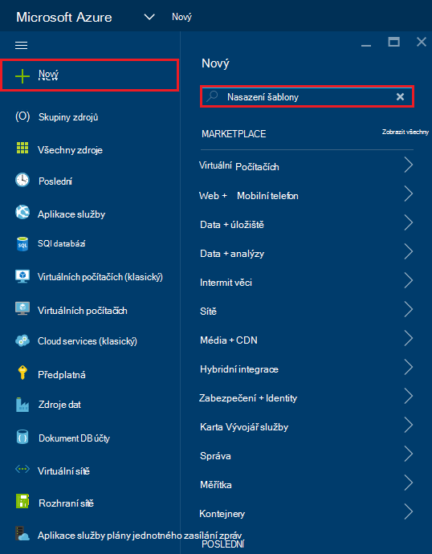

2. Vyberte příslušnou položku nasazení šablony a klikněte na **vytvořit**
    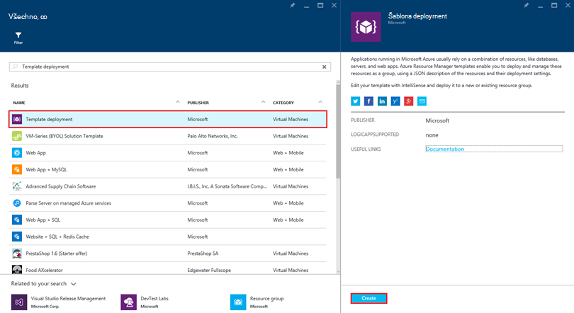

3.  Klikněte na **Upravit šablonu**, vložení obsahu ze souboru šablony DocDBWebsiteTodo.json a klikněte na tlačítko **Uložit**.
    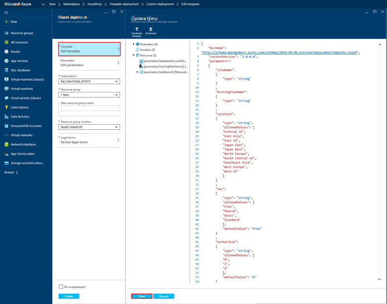

4. Klikněte na **Upravit parametry**, zadejte hodnoty pro jednotlivá pole povinné parametrů a klikněte na **OK**.  Parametry jsou následujícím způsobem:

    1. Název webu: Určuje název aplikace služby web app a slouží k vytváření adresy URL, kterou použijete pro přístup k web appu (například pokud zadáte "mydemodocdbwebapp" a pak adresu URL, kterým máte přístup k web appu bude mydemodocdbwebapp.azurewebsites.net).

    2. HOSTINGPLANNAME: Určuje název aplikace služba hostingu budete chtít vytvořit.

    3. UMÍSTĚNÍ: Určuje Azure umístění, ve které chcete vytvořit DocumentDB a webové aplikace zdroje.

    4. DATABASEACCOUNTNAME: Určuje název DocumentDB účet, který chcete vytvořit.   

    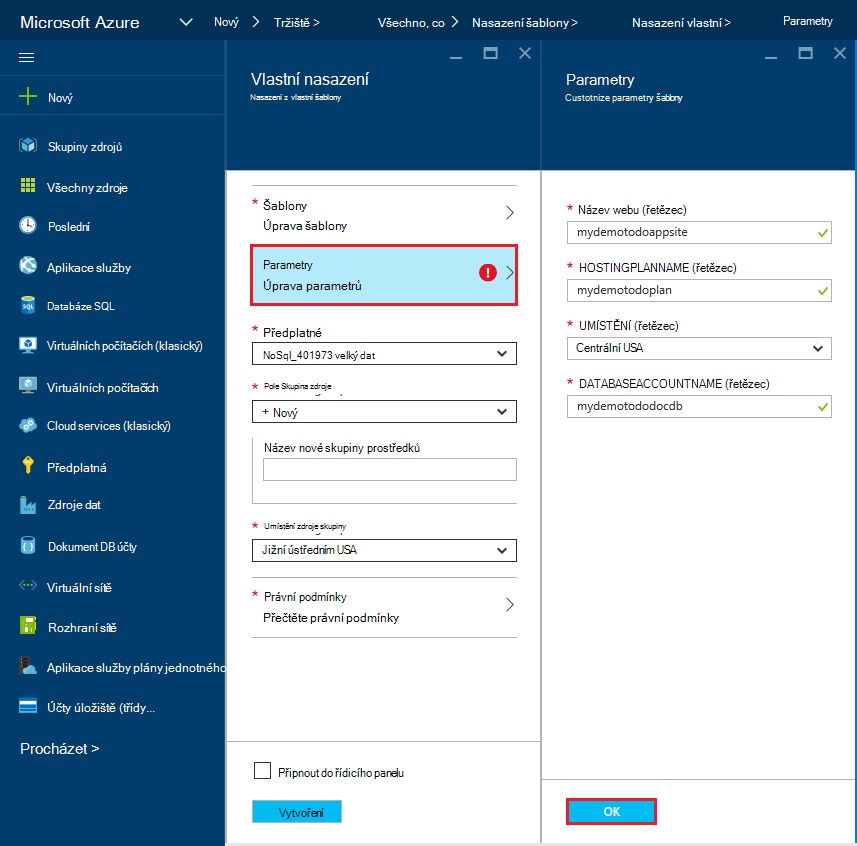

5. Zvolte existující skupiny zdroj nebo zadejte jméno, které chcete vytvořit nové skupiny prostředků a zvolte umístění skupina zdroje.
    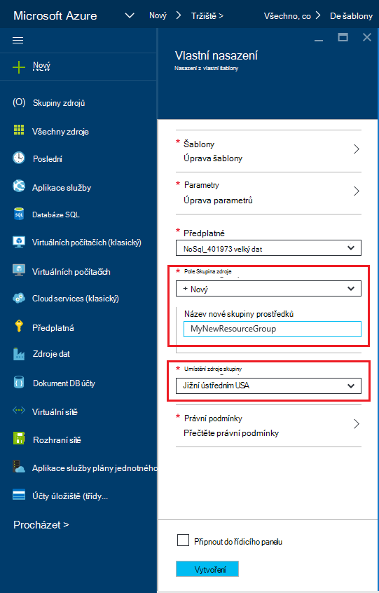
  
6.  Klikněte na **Revize právní podmínky**, **Nákup**a potom klikněte na **vytvořit** zahájíte nasazení.  Vyberte **Připnout na řídicí panel** tak, aby výsledné nasazení snadno viditelný na vaše Azure domovskou stránku portálu.
    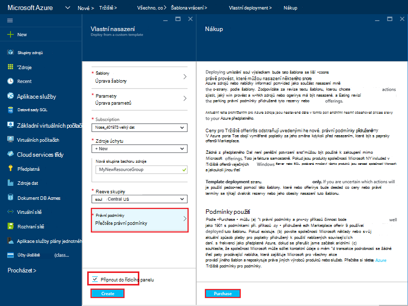

7.  Po dokončení nasazení se otevře zásuvné skupina zdroje.
    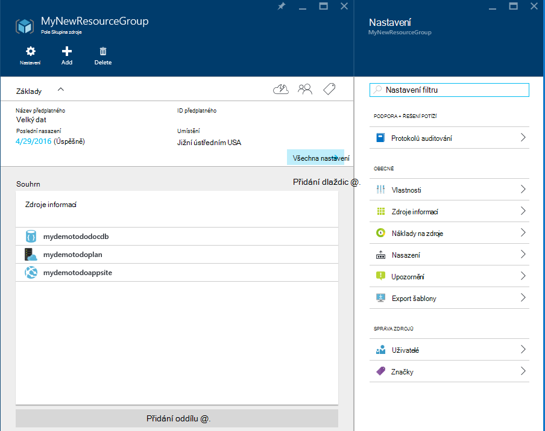  

8.  Použití aplikace, jednoduše přejděte na adresu URL webové aplikace (v předchozím příkladu adresa URL bude http://mydemodocdbwebapp.azurewebsites.net).  Zobrazí se následující webové aplikace:

    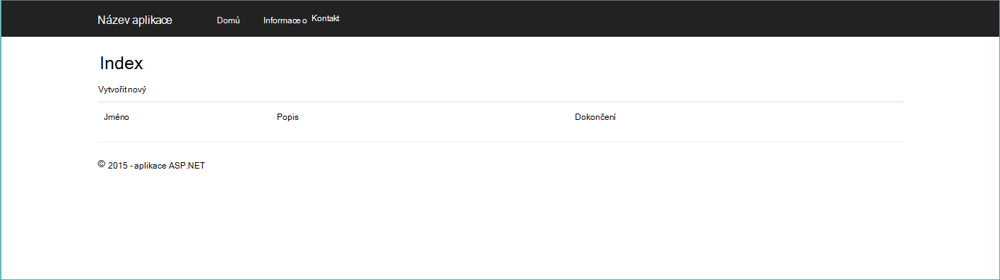

9. Pokračujte ve web appu vytvořit několik úkolů a vraťte se do skupiny zásuvné zdroje na portálu Azure. Klikněte na zdroj účtu DocumentDB v seznamu zdroje a potom klikněte na položku **Průzkumník dotazu**.
    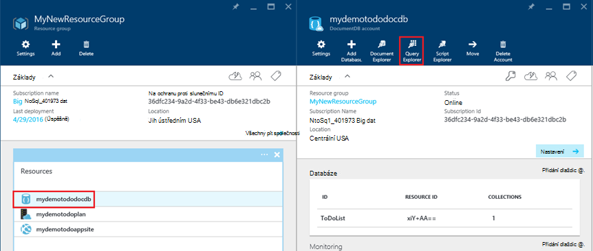  

10. Spusťte výchozího dotazu, "SELECT *FROM c" a Kontrola výsledků.  Všimněte si, že dotaz má získat znázornění JSON položek úkol, který jste vytvořili v předchozím kroku 7.  Neváhejte vyzkoušet dotazy; například, zkuste spuštěním vyberte* z c WHERE c.isComplete = true vrátit všechny položky úkol, které jsou označené jako dokončenou.

    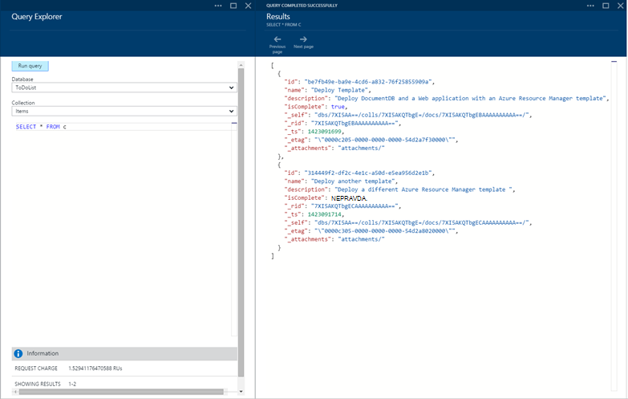

11. Neváhejte prozkoumání práce s portálem DocumentDB nebo změně aplikace úkol vzorku.  Jakmile budete připraveni, Pojďme nasazení jinou šablonu.
    
 
## Krok 3: Nasazení ukázku dokumentu účtu a webové aplikace

Teď Pojďme nasazení náš druhý šablony.  Tato šablona je vhodné zobrazit, jak můžete vložíte informace o připojení DocumentDB například účet koncového bodu a hlavní klíč do do webových aplikací jako nastavení aplikace nebo vlastní připojovací řetězec. Například případně máte vlastní webové aplikace, kterou chcete nasadit pod svým účtem DocumentDB a mít informace o připojení automaticky vyplní během nasazení.

> [AZURE.TIP] Šablona nelze ověřit, že je web app jméno a název účtu DocumentDB zadali pod a) platných a b) k dispozici.  Důrazně doporučujeme ověřit dostupnost názvy, které chcete zadat před odesláním nasazení.

1. Na [Portálu Azure](https://portal.azure.com)klikněte na nový a vyhledejte "Nasazení šablony".
    

2. Vyberte příslušnou položku nasazení šablony a klikněte na **vytvořit**
    

3.  Klikněte na **Upravit šablonu**, vložení obsahu ze souboru šablony DocDBWebSite.json a klikněte na tlačítko **Uložit**.
    

4. Klikněte na **Upravit parametry**, zadejte hodnoty pro jednotlivá pole povinné parametrů a klikněte na **OK**.  Parametry jsou následujícím způsobem:

    1. Název webu: Určuje název aplikace služby web app a slouží k vytváření adresy URL, kterou použijete pro přístup k web appu (například pokud zadáte "mydemodocdbwebapp" a pak adresu URL, kterým máte přístup k web appu bude mydemodocdbwebapp.azurewebsites.net).

    2. HOSTINGPLANNAME: Určuje název aplikace služba hostingu budete chtít vytvořit.

    3. UMÍSTĚNÍ: Určuje Azure umístění, ve které chcete vytvořit DocumentDB a webové aplikace zdroje.

    4. DATABASEACCOUNTNAME: Určuje název DocumentDB účet, který chcete vytvořit.   

    

5. Zvolte existující skupiny zdroj nebo zadejte jméno, které chcete vytvořit nové skupiny prostředků a zvolte umístění skupina zdroje.
    
  
6.  Klikněte na **Revize právní podmínky**, **Nákup**a potom klikněte na **vytvořit** zahájíte nasazení.  Vyberte **Připnout na řídicí panel** tak, aby výsledné nasazení snadno viditelný na vaše Azure domovskou stránku portálu.
    

7.  Po dokončení nasazení se otevře zásuvné skupina zdroje.
      

8. Klikněte na zdroj v prohlížeči v seznamu zdroje a potom klikněte na **Nastavení aplikace**
      

9. Všimněte si, jak jsou nastavení aplikace prezentovat DocumentDB koncového bodu a všech DocumentDB hlavní klíče.
    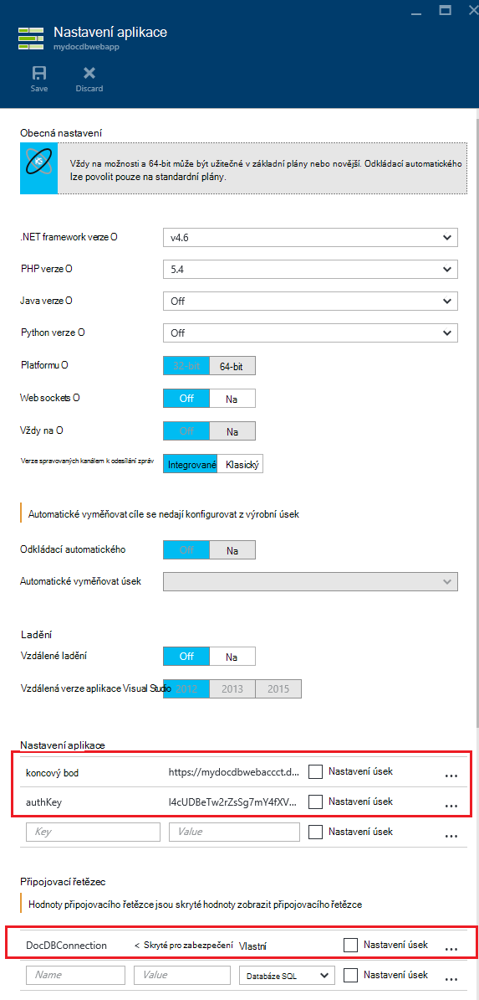  

10. Neváhejte pokračovat prozkoumání portálu Azure nebo postupujte podle jednoho z našich DocumentDB [vzorky](http://go.microsoft.com/fwlink/?LinkID=402386) k vytvoření vlastní aplikace DocumentDB.

    
    

## Další kroky

Blahopřejeme! Jste nasazené DocumentDB aplikaci služby web app a ukázkové webové aplikace pomocí Správce prostředků Azure šablon.

- Další informace o DocumentDB, klikněte [sem](http://azure.com/docdb).
- Další informace o webové aplikace služby Azure aplikace, klikněte [sem](http://go.microsoft.com/fwlink/?LinkId=325362).
- Další informace o šablonách správce prostředků Azure, klikněte [sem](https://msdn.microsoft.com/library/azure/dn790549.aspx).

## Co se změnilo
* Průvodce na změnu z webů pro aplikaci služby v tématu: [aplikaci služby Azure a jeho dopad na existující služby Azure](http://go.microsoft.com/fwlink/?LinkId=529714)
* Příručka k části Změna staré portálu na novém portálu najdete v tématu: [odkazy pro navigaci na portálu klasické Azure](http://go.microsoft.com/fwlink/?LinkId=529715)

>[AZURE.NOTE] Pokud chcete začít pracovat s aplikaci služby Azure před registrací účet Azure, přejděte na [Zkuste aplikaci služby](http://go.microsoft.com/fwlink/?LinkId=523751), které můžete okamžitě vytvořit web appu krátkodobý starter v aplikaci služby. Žádné povinné; kreditní karty žádné závazky.
 
