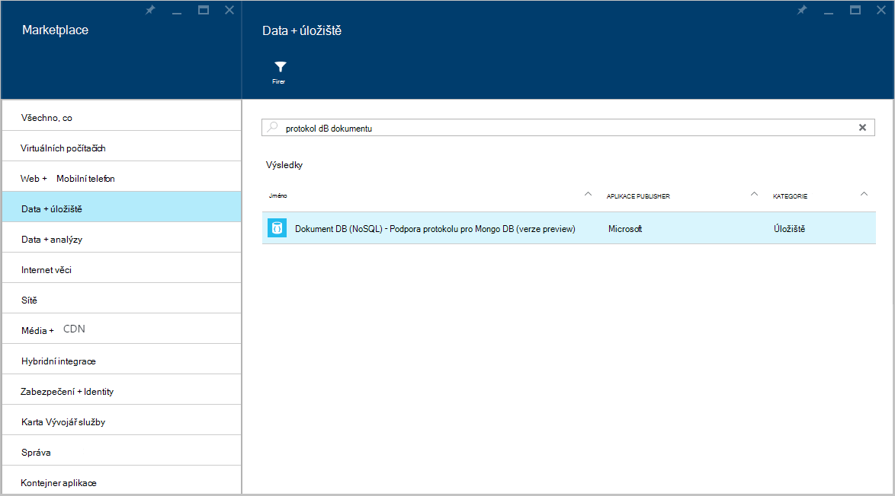
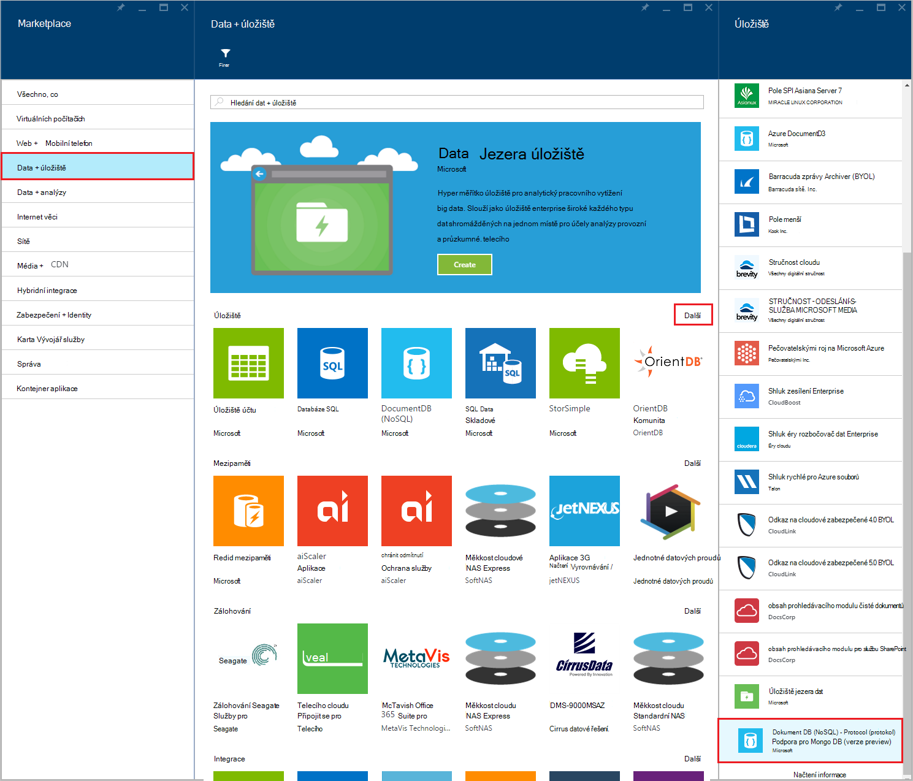
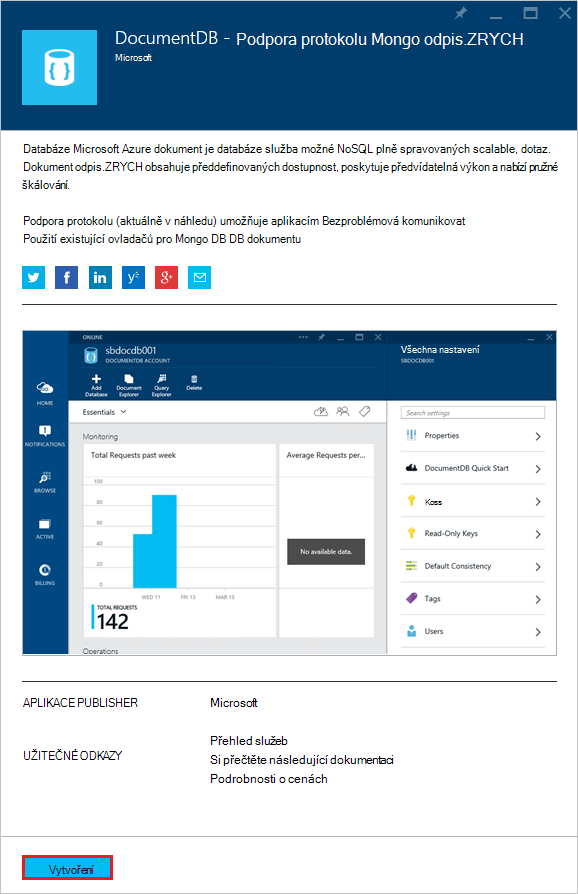
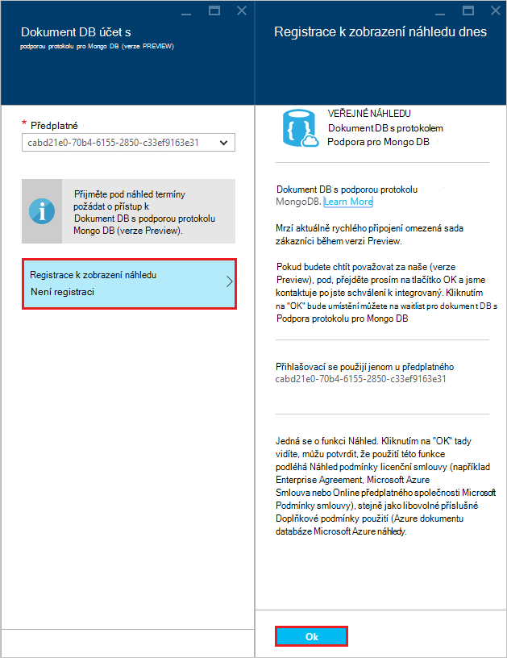
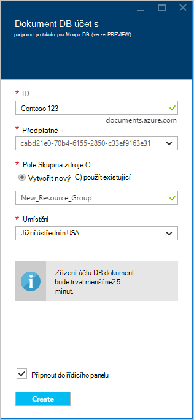
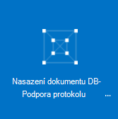
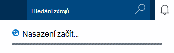
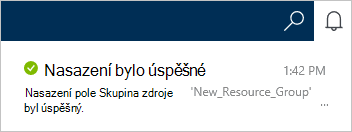
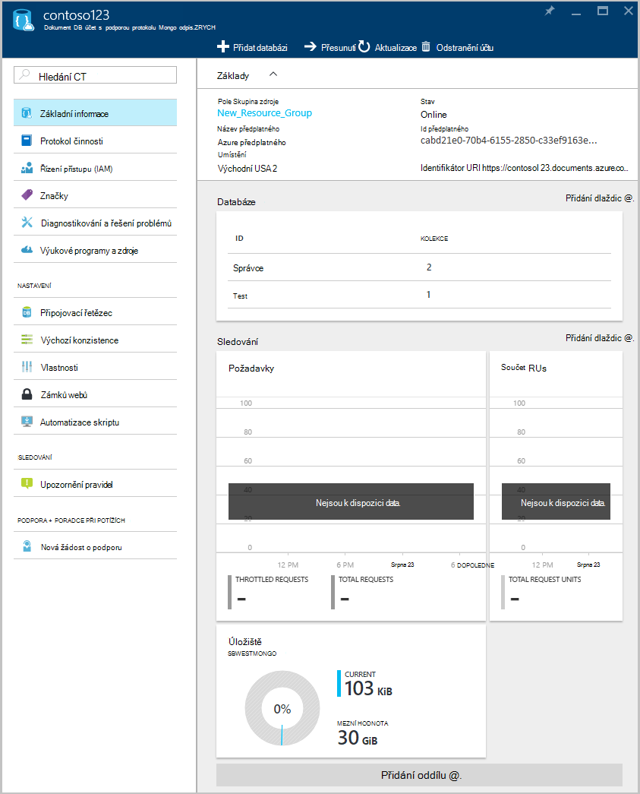

<properties 
    pageTitle="Vytvoření účtu DocumentDB s podporou protokolu MongoDB | Microsoft Azure" 
    description="Naučte se vytvořit DocumentDB účet s podporou protokolu MongoDB, teď k dispozici pro náhled." 
    services="documentdb" 
    authors="AndrewHoh" 
    manager="jhubbard" 
    editor="" 
    documentationCenter=""/>

<tags 
    ms.service="documentdb" 
    ms.workload="data-services" 
    ms.tgt_pltfrm="na" 
    ms.devlang="na" 
    ms.topic="article" 
    ms.date="10/20/2016" 
    ms.author="anhoh"/>

# Jak vytvořit účet DocumentDB s podporou protokolu MongoDB pomocí portálu Azure

Chcete-li vytvořit účet Azure DocumentDB s podporou protokolu MongoDB, postupujte takto:

- Máte účet Azure. Pokud už nemáte, můžete získat [bezplatný účet Azure](https://azure.microsoft.com/free/) .

## Vytvoření účtu  

Pokud chcete vytvořit účet DocumentDB s podporou protokolu MongoDB, proveďte následující kroky.

1. V novém okně Přihlaste se k [Portálu Azure](https://portal.azure.com).
2. Klikněte na **Nový**, klikněte na **Data + úložiště**, klikněte na **Zobrazit všechny**a vyhledejte kategorii **dat + úložiště** informací protokolu"DocumentDB". Klikněte na tlačítko **DocumentDB – podpora protokolu pro MongoDB**.

    

3. Můžete taky v kategorii **dat + úložiště** v části **úložiště**, klikněte na **Další**a potom klikněte na **načíst více** jednou nebo víckrát zobrazíte **DocumentDB – podpora protokolu pro MongoDB**. Klikněte na tlačítko **DocumentDB – podpora protokolu pro MongoDB**.

    

4. V zásuvné **DocumentDB – podpora protokolu pro MongoDB (verze preview)** klikněte na **vytvořit** spusťte proces zápisu náhled.

    

5. V zásuvné **DocumentDB účtu** klikněte na **Přihlásit se k zobrazení náhledu**. Přečtěte si informace a potom klikněte na **OK**.

    

6.  Po přijetí podmínek náhled, vrátíte se na zásuvné vytvořit.  V zásuvné **DocumentDB účtu** zadejte požadovaná konfigurace účtu.

    

    - Do pole **ID** zadejte název účet identifikovat.  Po ověření **ID** se zobrazí v poli **ID** zelená značka zaškrtnutí. **ID** změní se název hostitele v rámci identifikátor URI. **ID** může obsahovat pouze malá písmena, číslice a "-" znaků a musí mít 3 až 50 znaků. Poznámka: Tento *documents.azure.com* připojen k koncového bodu názvu, který jste si vybrali, výsledek nepůjde koncový bod účtu.

    - U **předplatného**vyberte Azure předplatné, které chcete použít pro účet. Pokud váš účet obsahuje jenom jedno předplatné, tento účet vybrané ve výchozím nastavení.

    - **Pole Skupina zdroje**vyberte nebo vytvořte skupina zdroje pro účet.  Ve výchozím nastavení bude vybrán existující skupiny zdrojů v části Azure předplatného.  Můžete však vybrat k vytvoření nové skupiny prostředků, ke kterému chcete přidat účet. Další informace najdete v tématu [použití Azure portálu pro správu Azure prostředků](resource-group-portal.md).

    - Pomocí **umístění** můžete určit zeměpisné polohy v jakém hostovat účet.
    
    - Volitelné: Zaškrtněte **Připnout do řídicího panelu**. Pokud připnuté na řídicí panel, postupujte podle **kroku 8** níže zobrazíte navigačních odkazech vlevo vašemu novému účtu.

7.  Když jsou nakonfigurovány nový účet možnosti, klikněte na **vytvořit**.  Může trvat několik minut, aby se účet vytvořil.  Pokud připnuté na řídicí panel, můžete sledovat zřizovací průběh Startboard.  
      

    Pokud není připnuté na řídicí panel, můžete sledovat průběh z centra oznámení.  

      

    

8.  Přístup k vašemu novému účtu, klikněte v levé nabídce **DocumentDB (NoSQL)** . V seznamu běžná DocumentDB a DocumentDB s účty podpory Mongo Protocol (protokol) klikněte na název nového účtu.

9.  Je nyní připravena k použití s výchozím nastavením. 

    
    

## Další kroky

- Zjistěte, jak chcete [Připojit](documentdb-connect-mongodb-account.md) k účtu DocumentDB s protokolem domovské stránce podpory pro MongoDB.

 
