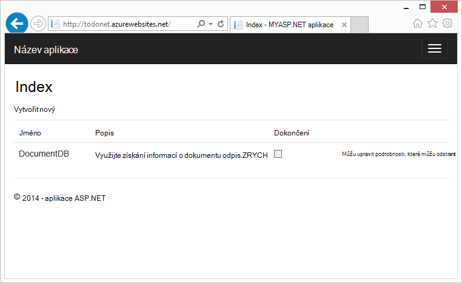
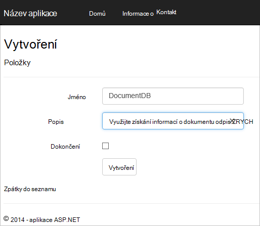
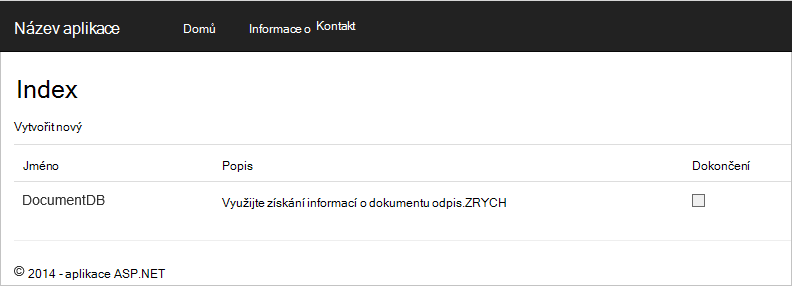

<properties 
    pageTitle="Kurz ASP.NET MVC pro DocumentDB: vývoj webových aplikací | Microsoft Azure" 
    description="ASP.NET MVC kurz vytvoření webové aplikace MVC pomocí DocumentDB. Budete ukládat JSON a přístup k datům z app úkol hostitelem Azure weby – kurz ASP čistého MVC krok za krokem." 
    keywords="kurz mvc ASP.NET vývoj webových aplikací, webové aplikace mvc, asp čisté mvc kurz krok za krokem"
    services="documentdb" 
    documentationCenter=".net" 
    authors="syamkmsft" 
    manager="jhubbard" 
    editor="cgronlun"/>

<tags 
    ms.service="documentdb" 
    ms.workload="data-services" 
    ms.tgt_pltfrm="na" 
    ms.devlang="dotnet" 
    ms.topic="hero-article" 
    ms.date="08/25/2016" 
    ms.author="syamk"/>

# ASP.NET MVC kurz: Vývoj webových aplikací s DocumentDB

> [AZURE.SELECTOR]
- [.NET](documentdb-dotnet-application.md)
- [Node.js](documentdb-nodejs-application.md)
- [Java](documentdb-java-application.md)
- [Python](documentdb-python-application.md) 

Tento článek obsahuje Pokud chcete zvýraznit, jak můžete efektivně využít DocumentDB Azure k ukládání a dotaz JSON dokumenty, začátku do konce walk-through znázorňující vytvářet aplikace úkol pomocí Azure DocumentDB. Úkoly se uloží jako JSON dokumenty v Azure DocumentDB.

Tento walk-through ukazuje, jak používat službu DocumentDB poskytovanou Azure moct ukládat a používat data z webové aplikace technologie ASP.NET MVC hostitelem Azure. Pokud hledáte kurz se zaměřuje pouze na DocumentDB a nejsou součástí ASP.NET MVC, najdete v článku [Vytvoření aplikace konzoly DocumentDB C#](documentdb-get-started.md).

> [AZURE.TIP] Tento kurz předpokládá, že máte zkušenosti pomocí technologie ASP.NET MVC a Azure weby. Pokud začínáte ASP.NET nebo [základní nástroje](#_Toc395637760), doporučujeme stahování celá ukázková projektu z [GitHub][] a sledování pokyny v tomto příkladu. Až budete mít ho vytvořené, můžete zkontrolovat tohoto článku získání přehledu o na kód v rámci projektu.

## Požadavky na tento kurz databáze

Před postupujte podle pokynů v tomto článku, se ujistěte, že máte takto:

- Účet Azure active. Pokud nemáte účet, můžete vytvořit bezplatný účet zkušební v jenom pár minut. Podrobnosti najdete v tématu [Bezplatnou zkušební verzi Azure](https://azure.microsoft.com/pricing/free-trial/).
- [Visual Studio 2015](http://www.visualstudio.com/) nebo Visual Studio 2013 aktualizace 4 nebo novější. Pokud používáte Visual Studio 2013, musíte nainstalovat [Microsoft.Net.Compilers nuget balíčku](https://www.nuget.org/packages/Microsoft.Net.Compilers/) přidat podporu pro C# 6.0. 
- Azure SDK pro .NET verze 2.5.1 nebo vyšší, která je dostupná prostřednictvím [Platformy Microsoft Web][].

Všechny snímky obrazovky v tomto článku jste byli přesměrováni pomocí aplikace Visual Studio 2013 aktualizace 4 použít a Azure SDK pro .NET verze 2.5.1. Pokud systému nakonfigurovaný s různými verzemi je možné obrazovky a možnosti neodpovídají úplně, že pokud splníte požadavky výše měli spolupracovat toto řešení.

## Krok 1: Vytvoření účtu DocumentDB databáze

Začneme tím, že vytvoření účtu DocumentDB. Pokud už máte nastavený účet, můžete přejít na téma [vytváření nové aplikace ASP.NET MVC](#_Toc395637762).

[AZURE.INCLUDE [documentdb-create-dbaccount](../../includes/documentdb-create-dbaccount.md)]

[AZURE.INCLUDE [documentdb-keys](../../includes/documentdb-keys.md)]

 
Teď můžeme provede jednotlivými postup vytvoření nové aplikace ASP.NET MVC základu zdola nahoru. 

## Krok 2: Vytvoření nové aplikace ASP.NET MVC

Teď máte nastavený účet, vytvoření našeho nového projektu ASP.NET.

1. Ve Visual Studiu, v nabídce **soubor** přejděte na **Nový**a potom klikněte na **projekt**.

    Zobrazí se dialogové okno **Nový projekt** .
2. V podokně **vlastního typu projektu** rozbalení **šablony** **Visual Basic**, **Web**a pak vyberte **Webová aplikace ASP.NET**.

    

3. Do pole **název** zadejte název projektu. Tento kurz používá název "úkol". Pokud se rozhodnete sdělit nám než to, pak místo, kam tento kurz pojednává o oboru úkol potřebujete upravit zadané ukázky používat něco jiného, co se s názvem aplikace. 

4. Klikněte na tlačítko **Procházet** a přejděte do složky, kde chcete vytvořit projekt a potom klikněte na **OK**.

    Zobrazí se dialogové okno **Nový projekt ASP.NET** .

    

5. V podokně šablony vyberte **MVC**.

6. Pokud nebudete chtít hostingu aplikace v Azure vyberte v pravém dolním mít Azure hostitelem aplikace **hostitele v cloudu** . Jsme vybrané hostovat v cloudu a spusťte aplikaci hostované webu Azure. Výběrem této možnosti preprovision webu Azure za vás a usnadnit život mnohem až přijde čas nasazení konečný aplikace fungovat. Chcete-li tento jinde hostovat nebo nechcete předem konfigurace Azure, stačí zrušte **hostitele v cloudu**.

7. Klikněte na tlačítko **OK** a zpřístupněte Visual Studio jeho dají kolem generování uživatelského rozhraní prázdné šablony ASP.NET MVC. 

8. Pokud jste se rozhodli to hostovat v cloudu zobrazí alespoň jednu další obrazovku s žádostí o přihlášení k účtu Azure a poskytovat některé hodnoty nového webu. Zadejte další hodnoty a pokračovat. 

    Můžu nevybrali "databázovým serverem" tady protože jsme nepoužíváte databázového serveru SQL Azure tady, ukážeme vytvářet nový účet Azure DocumentDB později na portálu Azure.

    Další informace o volbě **plán služeb aplikací** a **pole Skupina zdroje**najdete v článku [Přehled hloubkovou plány aplikaci služby Azure](../app-service/azure-web-sites-web-hosting-plans-in-depth-overview.md).

    

9. Po dokončení vytváření často používaný MVC aplikace Visual Studio máte prázdnou aplikaci ASP.NET, jehož spuštěním místně.

    Jsme přeskočit spuštění projektu místně, protože Nevím, můžu jsme všechny viděli ASP.NET "Ahoj světe" aplikace. Pojďme si teď rovnou k přidání DocumentDB do tohoto projektu a vytváření naše aplikace.

## Krok 3: Přidání DocumentDB projektu MVC webové aplikace

Teď, když máme většina ASP.NET MVC vodoinstalaci, potřebujeme pro toto řešení, nastavíme skutečné účel tohoto kurzu, přidání Azure DocumentDB naše MVC webové aplikace.

1. DocumentDB .NET SDK balíčku a distributed jako balíček NuGet. Balíček NuGet ve Visual Studiu, použijte Správce NuGet balíčků ve Visual Studiu pravým tlačítkem myši na projektu v **Okně Průzkumník** a potom klikněte na **Spravovat balíčků NuGet**.

    

    Zobrazí se dialogové okno **Spravovat balíčků NuGet** .

2. V dialogovém okně NuGet **Procházet** zadejte ***Azure DocumentDB***.
    
    Ve výsledcích nainstalujte balíček **Microsoft Azure DocumentDB klienta knihovny** . To bude stáhněte a nainstalujte balíček DocumentDB a také všechny závislosti, jako je Newtonsoft.Json. Klikněte na **OK** v okně **Náhled** a **můžu přijmout** v okně **Licenci přijetí** dokončete instalaci.

    

    Můžete taky můžete konzole Správce balíčků nainstalovat balíček. Postup, v nabídce **Nástroje** , klikněte na **Správce balíčků NuGet**a klikněte na **Správce balíčků konzoly**. Do příkazového řádku zadejte tento příkaz.

        Install-Package Microsoft.Azure.DocumentDB

3. Po instalaci balíčku řešení Visual Studio by měl vypadat takto se dvěma nové odkazy přidali, Microsoft.Azure.Documents.Client a Newtonsoft.Json.

    

##Krok 4: Nastavení technologie ASP.NET MVC aplikace
 
Teď Pojďme přidat modelů, zobrazení a řadiče k této aplikaci MVC:

- [Přidat modelu](#_Toc395637764).
- [Přidat řadiči](#_Toc395637765).
- [Přidání zobrazení](#_Toc395637766).

### Přidání JSON datový model

Pojďme začněte vytvořením **M** v MVC modelu. 

1. V **Okně Průzkumník řešení**klikněte pravým tlačítkem myši na složku **modely** , klikněte na **Přidat**a klikněte na **Onenotové**.

    Zobrazí se dialogové okno **Přidat novou položku** .

2. Pojmenování nové třídy **Item.cs** a klikněte na **Přidat**. 

3. Do tohoto nového souboru **Item.cs** přidejte následující po poslední *pomocí příkazu*.
        
        using Newtonsoft.Json;
    
4. Teď nahradit tento kód 
        
        public class Item
        {
        }

    Pomocí následujícího kódu.

        public class Item
        {
            [JsonProperty(PropertyName = "id")]
            public string Id { get; set; }
             
            [JsonProperty(PropertyName = "name")]
            public string Name { get; set; }

            [JsonProperty(PropertyName = "description")]
            public string Description { get; set; }

            [JsonProperty(PropertyName = "isComplete")]
            public bool Completed { get; set; }
        }

    Všechna data v DocumentDB je předaná než a uložených jako JSON. Určit způsob, jakým vaše objekty jsou serializován/rekonstruovány JSON.NET můžete použít atribut **JsonProperty** , jak je ukázáno v předmětu **položku** , kterou jsme vytvořili. Kterou nechcete **mít** tento avšak můžu chcete zajistěte, aby Moje vlastnosti používaly JSON camelCase konvence. 
    
    Nejen můžete ovládáte formát názvu vlastnosti přejde do JSON, ale můžete úplně přejmenovat .NET vlastností, jako se to bylo možné s vlastnosti **Popis** . 
    

### Přidání řadiče

Který má na starosti **M**teď Pojďme vytvořit **C** v MVC třídy řadiče.

1. V **Okně Průzkumník**klikněte pravým tlačítkem myši na složku **řadiče** , klikněte na **Přidat**a klikněte na **řadiče domény**.

    Zobrazí se dialogové okno **Přidat Scaffold** .

2. Vyberte **MVC 5 řadiče - prázdné** a potom klikněte na **Přidat**.

    

3. Pojmenování ovladači nové **ItemController.**

    

    Po vytvoření souboru řešení Visual Studio by měl vypadat následujícím novým ItemController.cs souborem v **Průzkumníku řešení**. Nový Item.cs soubor vytvořený se taky zobrazí.

    

    Zavřete ItemController.cs, doporučujeme se vraťte na ho později. 

### Přidat zobrazení

Teď Pojďme vytvořit **V** v MVC, zobrazení:

- [Přidání stránky na položku rejstříku](#AddItemIndexView).
- [Přidání nové položky zobrazení](#AddNewIndexView).
- [Přidat zobrazení upravit položku](#_Toc395888515).

#### Přidání stránky na položku rejstříku

1. V **Okně Průzkumník**rozbalte složku **zobrazení** , klikněte pravým tlačítkem na vyprázdnit složku **položky** , které Visual Studio vytvoří když jste dříve přidali **ItemController** , klikněte na tlačítko **Přidat**a potom klikněte na **zobrazení**.

    

2. V dialogovém okně **Přidat zobrazení** postupujte takto:
    - Do pole **název zobrazení** zadejte ***Index***.
    - V dialogovém okně **Šablona** vyberte ***seznam***.
    - V dialogovém okně **třídy modelu** vyberte ***položky (úkol. Modely)***.
    - **Datové kontextové třídy** políčko ponechte prázdné. 
    - Do pole stránky rozložení zadejte ***~/Views/Shared/_Layout.cshtml***.
    
    

3. Když jsou tyto hodnoty nastavená, klikněte na tlačítko **Přidat** a zpřístupněte Visual Studiu vytvořte nové šablony zobrazení. Po dokončení otevře cshtml soubor, který byl vytvořen. Jak můžeme se vraťte na ho později jsme můžete zavřít tento soubor ve Visual Studiu.

#### Přidání nové položky zobrazení

Podobně jako u jak jsme vytvořili zobrazení pro **Položku rejstříku** , teď vytvoříte nové zobrazení pro vytváření nových **položek**.

1. V **Okně Průzkumník**klikněte pravým tlačítkem **položku** složky, klikněte na **Přidat**a potom klikněte na **zobrazení**.

2. V dialogovém okně **Přidat zobrazení** postupujte takto:
    - Do pole **název zobrazení** zadejte ***vytvořit***.
    - V dialogovém okně **Šablona** vyberte ***vytvořit***.
    - V dialogovém okně **třídy modelu** vyberte ***položky (úkol. Modely)***.
    - **Datové kontextové třídy** políčko ponechte prázdné.
    - Do pole stránky rozložení zadejte ***~/Views/Shared/_Layout.cshtml***.
    - Klikněte na **Přidat**.

#### Přidání zobrazení upravit položku

A nakonec, přidejte jedno poslední zobrazení pro úpravy **položky** stejným způsobem jako před.

1. V **Okně Průzkumník**klikněte pravým tlačítkem **položku** složky, klikněte na **Přidat**a potom klikněte na **zobrazení**.

2. V dialogovém okně **Přidat zobrazení** postupujte takto:
    - Do pole **název zobrazení** zadejte ***Upravit***.
    - V dialogovém okně **Šablona** vyberte ***Upravit***.
    - V dialogovém okně **třídy modelu** vyberte ***položky (úkol. Modely)***.
    - **Datové kontextové třídy** políčko ponechte prázdné. 
    - Do pole stránky rozložení zadejte ***~/Views/Shared/_Layout.cshtml***.
    - Klikněte na **Přidat**.

Po dokončení, uzavřete všechny dokumenty cshtml ve Visual Studiu jako jsme se později vrátit, můžete tyto zobrazení.

## Krok 5: Vedení nahoru DocumentDB

Teď standardní MVC věci se stará, Pojďme hodit přidání kódu pro DocumentDB. 

V této části přidáme kód pro zpracování takto:

- [Neúplné položek](#_Toc395637770).
- [Přidání položek](#_Toc395637771).
- [Úpravy položek](#_Toc395637772).

### Neúplné položek ve webové aplikaci MVC

První věc, kterou chcete tady je přidání třídy, která obsahuje všechny logiku a připojení k DocumentDB. Pro účely tohoto návodu jsme budete zapouzdřují celé tento logiky do úložiště třídy s názvem DocumentDBRepository. 

1. V **Průzkumníku řešení**klikněte pravým tlačítkem myši na projektu, klikněte na **Přidat**a klikněte na **Onenotové**. Pojmenování nové třídy **DocumentDBRepository** a klikněte na **Přidat**.
 
2. V nově vytvořený **DocumentDBRepository** tříd a přidejte následující *pomocí příkazů* nad deklaraci *obor názvů*
        
        using Microsoft.Azure.Documents; 
        using Microsoft.Azure.Documents.Client; 
        using Microsoft.Azure.Documents.Linq; 
        using System.Configuration;
        using System.Linq.Expressions;
        using System.Threading.Tasks;

    Teď nahradit tento kód 

        public class DocumentDBRepository
        {
        }

    Pomocí následujícího kódu.

        public static class DocumentDBRepository<T> where T : class
        {
            private static readonly string DatabaseId = ConfigurationManager.AppSettings["database"];
            private static readonly string CollectionId = ConfigurationManager.AppSettings["collection"];
            private static DocumentClient client;
    
            public static void Initialize()
            {
                client = new DocumentClient(new Uri(ConfigurationManager.AppSettings["endpoint"]), ConfigurationManager.AppSettings["authKey"]);
                CreateDatabaseIfNotExistsAsync().Wait();
                CreateCollectionIfNotExistsAsync().Wait();
            }
    
            private static async Task CreateDatabaseIfNotExistsAsync()
            {
                try
                {
                    await client.ReadDatabaseAsync(UriFactory.CreateDatabaseUri(DatabaseId));
                }
                catch (DocumentClientException e)
                {
                    if (e.StatusCode == System.Net.HttpStatusCode.NotFound)
                    {
                        await client.CreateDatabaseAsync(new Database { Id = DatabaseId });
                    }
                    else
                    {
                        throw;
                    }
                }
            }
    
            private static async Task CreateCollectionIfNotExistsAsync()
            {
                try
                {
                    await client.ReadDocumentCollectionAsync(UriFactory.CreateDocumentCollectionUri(DatabaseId, CollectionId));
                }
                catch (DocumentClientException e)
                {
                    if (e.StatusCode == System.Net.HttpStatusCode.NotFound)
                    {
                        await client.CreateDocumentCollectionAsync(
                            UriFactory.CreateDatabaseUri(DatabaseId),
                            new DocumentCollection { Id = CollectionId },
                            new RequestOptions { OfferThroughput = 1000 });
                    }
                    else
                    {
                        throw;
                    }
                }
            }
        }

    > [AZURE.TIP] Při vytváření nové DocumentCollection můžete zadat volitelného parametru RequestOptions OfferType, které vám umožní určit úroveň výkonu novou kolekci. Pokud tento parametr není předaný výchozí nabídka typ se použijí. Další informace o DocumentDB typů nabídky získáte [DocumentDB výkonu úrovně](documentdb-performance-levels.md)

3. Jsme čtete některé hodnoty z konfigurace, takže otevřete **nastavení(Web.config)) aplikace** a přidejte následující řádky v části `<AppSettings>` oddíl.
    
        <add key="endpoint" value="enter the URI from the Keys blade of the Azure Portal"/>
        <add key="authKey" value="enter the PRIMARY KEY, or the SECONDARY KEY, from the Keys blade of the Azure  Portal"/>
        <add key="database" value="ToDoList"/>
        <add key="collection" value="Items"/>
    
4. Teď aktualizujte hodnoty *koncového bodu* a *authKey* pomocí klávesy zásuvné portálu Azure. Používat **URI** z zásuvné klíče jako hodnota nastavení koncového bodu a používat **PRIMÁRNÍHO klíče**nebo **Vedlejší klíč** z zásuvné klíče jako hodnota authKey nastavení.

    Přijímá péče vedení úložiště DocumentDB teď Pojďme přidat naše logiky aplikace.

5. První věc, kterou chcete mít možnost dělat s aplikací seznamu úkol je zobrazíte neúplné položky.  Zkopírujte a vložte následující fragment kódu kdekoli v rámci třídy **DocumentDBRepository** .

        public static async Task<IEnumerable<T>> GetItemsAsync(Expression<Func<T, bool>> predicate)
        {
            IDocumentQuery<T> query = client.CreateDocumentQuery<T>(
                UriFactory.CreateDocumentCollectionUri(DatabaseId, CollectionId))
                .Where(predicate)
                .AsDocumentQuery();

            List<T> results = new List<T>();
            while (query.HasMoreResults)
            {
                results.AddRange(await query.ExecuteNextAsync<T>());
            }

            return results;
        }

6. Otevřete **ItemController** jsme přidali výše a přidejte následující *pomocí příkazů* nad deklaraci názvů.

        using System.Net;
        using System.Threading.Tasks;
        using todo.Models;

    Pokud projektu není s názvem "úkol", pak budete muset aktualizovat s použitím "úkol. Modely"; podle názvu projektu.

    Teď nahradit tento kód

        //GET: Item
        public ActionResult Index()
        {
            return View();
        }

    Pomocí následujícího kódu.

        [ActionName("Index")]
        public async Task<ActionResult> IndexAsync()
        {
            var items = await DocumentDBRepository<Item>.GetItemsAsync(d => !d.Completed);
            return View(items);
        }
    
7. Otevřete **Global.asax.cs** a přidejte následující řádek metody **Application_Start** 
 
        DocumentDBRepository<todo.Models.Item>.Initialize();
    
V tomto okamžiku řešení soubory byste měli vytvářet bez chyb.

Pokud jste spustili aplikace nyní, by přejděte na **HomeController** a zobrazení **Index** , které řadiče domény. Toto je výchozí chování šablonu projektu MVC zvolená na začátku, ale nechceme! Nyní změníme směrování v této aplikaci MVC změnit toto chování.

Otevřít ***aplikace\_Start\RouteConfig.cs*** a vyhledejte řádek začínající "výchozí:" a změňte ho na vypadat takto.

        defaults: new { controller = "Item", action = "Index", id = UrlParameter.Optional }

Tento nyní říká ASP.NET MVC využívající případ, že ještě zadanou hodnotu do pole Adresa URL řídit činnosti směrování to místo **Domů** **položky** jako řadiče domény a uživatelů **Index** jako zobrazení.

Teď při spuštění aplikace budou volat do vaší **ItemController** , které budou volání do úložiště předmětu a použijte metodu GetItems všechny položky vrátit do neúplné mezi **zobrazeními**\\**položku**\\**Index** zobrazení. 

Pokud vytváříte a spustit tento projekt, teď byste měli vidět objekt, který vypadá takto.    

### Přidání položek

Pojďme zobrazovat některé položky do databáze, takže máme něco víc než prázdné tabulky můžete visiové.

Pojďme přidejte kód a DocumentDBRepository ItemController uchovávat v záznamu ve DocumentDB.

1.  Podle pokynů přidejte do svojí třídě **DocumentDBRepository** .

        public static async Task<Document> CreateItemAsync(T item)
        {
            return await client.CreateDocumentAsync(UriFactory.CreateDocumentCollectionUri(DatabaseId, CollectionId), item);
        }

    Tento způsob jednoduše trvá objektu do ní a trvá v DocumentDB.

2. Otevřete soubor ItemController.cs a přidejte následující fragment kódu v předmětu. Je to, jak ASP.NET MVC ví, co dělat, akce **vytvořit** . V tomto případě vykreslování jenom přidružené Create.cshtml zobrazení dříve vytvořili.

        [ActionName("Create")]
        public async Task<ActionResult> CreateAsync()
        {
            return View();
        }

    Teď potřebujeme některé další kód v této řadiče domény, která přijímá odeslání z **vytvořit** zobrazení.

2. Přidání dalšího časového kód třídy ItemController.cs, která sděluje ASP.NET MVC, co dělat s formulářem příspěvek pro tento řadiče domény.
    
        [HttpPost]
        [ActionName("Create")]
        [ValidateAntiForgeryToken]
        public async Task<ActionResult> CreateAsync([Bind(Include = "Id,Name,Description,Completed")] Item item)
        {
            if (ModelState.IsValid)
            {
                await DocumentDBRepository<Item>.CreateItemAsync(item);
                return RedirectToAction("Index");
            }

            return View(item);
        }

    Tento kód volání DocumentDBRepository a používá metodu CreateItemAsync uchovávat položky nového úkolu v databázi. 
 
    **Poznámka zabezpečení**: atribut **ValidateAntiForgeryToken** slouží tady se můžete pomoci chrá tuto aplikaci před útoky padělání žádosti o webů. Je víc než jenom přidání Tenhle atribut, v zobrazeních potřebujete pracovat se tento proti padělání token. Další informace o předmět a příklady, jak provádět to správně najdete v článku [Ochrana před vytvářením padělání požádat o webů][]. Zdrojový kód umístěna na [GitHub][] obsahují úplné provedení.

    **Poznámka zabezpečení**: také používáme atribut **svázat** na parametr metody se můžete pomoci chrá proti povolená účtování útoky. Další informace najdete v článku [Základní operace CRUD v ASP.NET MVC][].

Tímto dokončíte kód potřebný k přidání nové položky do naší databáze.

### Úpravy položek

Existuje jedno poslední nám chcete a to je přidáte možnost k úpravám **položek** v databázi a označit jako dokončený. Zobrazení pro úpravy byl přidanou projektu, proto jsme potřebujete jenom některé kód naše a třídy **DocumentDBRepository** znovu přidat.

1. Přidejte následující třídy **DocumentDBRepository** .

        public static async Task<Document> UpdateItemAsync(string id, T item)
        {
            return await client.ReplaceDocumentAsync(UriFactory.CreateDocumentUri(DatabaseId, CollectionId, id), item);
        }

        public static async Task<T> GetItemAsync(string id)
        {
            try
            {
                Document document = await client.ReadDocumentAsync(UriFactory.CreateDocumentUri(DatabaseId, CollectionId, id));
                return (T)(dynamic)document;
            }
            catch (DocumentClientException e)
            {
                if (e.StatusCode == HttpStatusCode.NotFound)
                {
                    return null;
                }
                else
                {
                    throw;
                }
            }
        }
    
    První z těchto postupů **GetItem** načte položky z DocumentDB, které se předávají funkcím zpět **ItemController** a potom k v zobrazení pro **Úpravy** .
    
    Druhé metody jsme přidali: slouží k nahrazení, který **dokument** v DocumentDB s verzí **dokumentu** předaný z **ItemController**.

2. Přidejte následující třídy **ItemController** .

        [HttpPost]
        [ActionName("Edit")]
        [ValidateAntiForgeryToken]
        public async Task<ActionResult> EditAsync([Bind(Include = "Id,Name,Description,Completed")] Item item)
        {
            if (ModelState.IsValid)
            {
                await DocumentDBRepository<Item>.UpdateItemAsync(item.Id, item);
                return RedirectToAction("Index");
            }

            return View(item);
        }

        [ActionName("Edit")]
        public async Task<ActionResult> EditAsync(string id)
        {
            if (id == null)
            {
                return new HttpStatusCodeResult(HttpStatusCode.BadRequest);
            }

            Item item = await DocumentDBRepository<Item>.GetItemAsync(id);
            if (item == null)
            {
                return HttpNotFound();
            }

            return View(item);
        }
    
    Metoda první zpracovává Http GET, která se stane, když uživatel klikne na odkaz **Upravit** v zobrazení **Index** . Tento způsob načte [**dokument**](http://msdn.microsoft.com/library/azure/microsoft.azure.documents.document.aspx) z DocumentDB a předá v zobrazení pro **Úpravy** .

    V zobrazení pro **Úpravy** bude proveďte Http příspěvek do **IndexController**. 
    
    Druhý způsob je teď nově přidaná úchyty předávání aktualizovaný objekt DocumentDB zachovat v databázi.

To je vše, který je všechno, co je třeba spustit aplikaci neúplné **položky**seznamu, přidávat nové **položky**a upravovat **položky**.

## Krok 6: Spustit aplikaci místně

Chcete-li otestovat aplikace na místním počítači, postupujte takto:

1. Přístupů F5 ve Visual Studiu k vytvoření aplikace v režimu ladění. Ho měli sestavení aplikace a spuštění prohlížeče se stránkou prázdné tabulky, kterou jsme viděli před:

    

    Pokud používáte Visual Studio 2013 a zobrazí chybová zpráva "Nelze očekávat v těle klauzuli skutečné." budete potřebovat k instalaci [Microsoft.Net.Compilers nuget balíčku](https://www.nuget.org/packages/Microsoft.Net.Compilers/). Můžete taky porovnat kódu proti ukázkový projekt na [GitHub][]. 

2. Klikněte na **Vytvořit nový** odkaz a přidaní hodnot do polí **název** a **Popis** . Opustit **dokončení** políčko nevybrané jinak novou **položku** pole bude přidán do dokončeného stavu a nezobrazí se v seznamu počáteční.

    

3. Klikněte na **vytvořit** a budete přesměrováni zpět do zobrazení **Index** a **Položka** se zobrazí v seznamu.

    

    Neváhejte přidat několik dalších **položek** do seznamu úkol.

3. Klikněte na tlačítko **Upravit** vedle **položky** v seznamu a přejdete do zobrazení pro **Úpravy** místo, kam můžete aktualizovat všechny vlastnosti objektu, včetně příznak **Dokončeno** . Pokud označení příznakem **dokončení** a klikněte na tlačítko **Uložit** **položku** odebrat ze seznamu seskupit.

    

4. Jednou po otestování aplikace, stiskněte kombinaci kláves Ctrl + F5 ukončíte ladění aplikace. Jste připraveni nasazení!

## Krok 7: Nasazení aplikace na weby Azure

Teď, když máte aplikaci dokončení, funguje zařízení správně s DocumentDB ukážeme, do kterých se nasadí tento web appu Azure weby. Pokud jste vybrali **hostitele v cloudu** , když jste vytvořili prázdný projekt ASP.NET MVC Visual Studio usnadňuje to opravdu a provede většinu práce za vás. 

1. Publikovat tuto aplikaci je třeba udělat stačí klikněte pravým tlačítkem myši na projektu v **Průzkumníku řešení** a klikněte na **Publikovat**.

    

2. Všechno, co by měly být již nakonfigurovány podle svých přihlašovacích údajů; ve skutečnosti webu již byly v Azure pro vás vytvořil na **Cílovou adresu URL** zobrazená, musíte udělat stačí klikněte na **Publikovat**.

    

Ve chvíli Visual Studio dokončete publikování webové aplikace a spuštění prohlížeče, kde navíc přehledně uvidíte po ruce práce spuštěné v Azure?

## Další kroky

Blahopřejeme! Stačí integrované první ASP.NET MVC webové aplikace pomocí Azure DocumentDB a publikované na Azure weby. Zdrojový kód pro dokončení aplikace, včetně podrobností a odstranit funkce, které nebyly součástí tohoto kurzu můžete stáhnout nebo klonovat z [GitHub][]. Pokud vás zajímá, které přidáte do aplikace, takže uchopte kód a přiřadit ji někomu této aplikace.

Chcete aplikaci přidat další funkce, zkontrolujte rozhraní API k dispozici v [Knihovně .NET DocumentDB](https://msdn.microsoft.com/library/azure/dn948556.aspx) a neváhejte přispět ke knihovně DocumentDB .NET na [GitHub][]. 

[\*]: https://microsoft.sharepoint.com/teams/DocDB/Shared%20Documents/Documentation/Docs.LatestVersions/PicExportError
[Visual Studio Express]: http://www.visualstudio.com/products/visual-studio-express-vs.aspx
[Microsoft Web platformy]: http://www.microsoft.com/web/downloads/platform.aspx
[Ochrana před vytvářením padělání žádost webů]: http://go.microsoft.com/fwlink/?LinkID=517254
[Operace CRUD základní v ASP.NET MVC]: http://go.microsoft.com/fwlink/?LinkId=317598
[GitHub]: https://github.com/Azure-Samples/documentdb-net-todo-app
