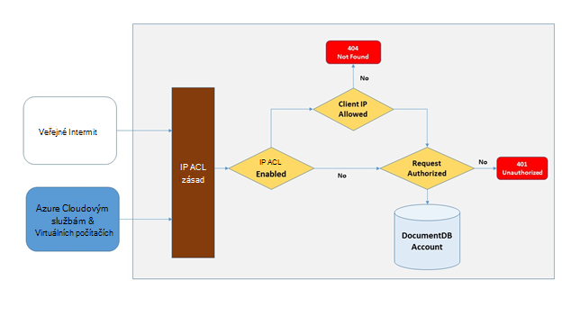
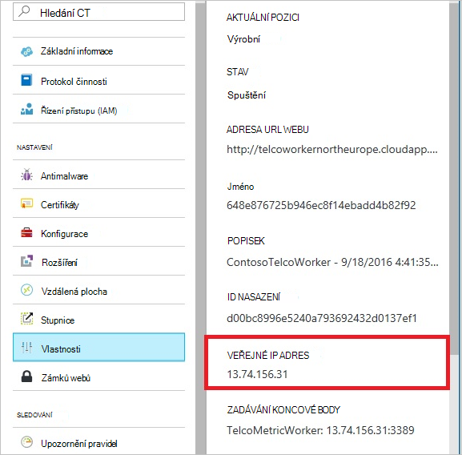
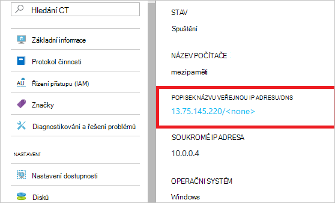
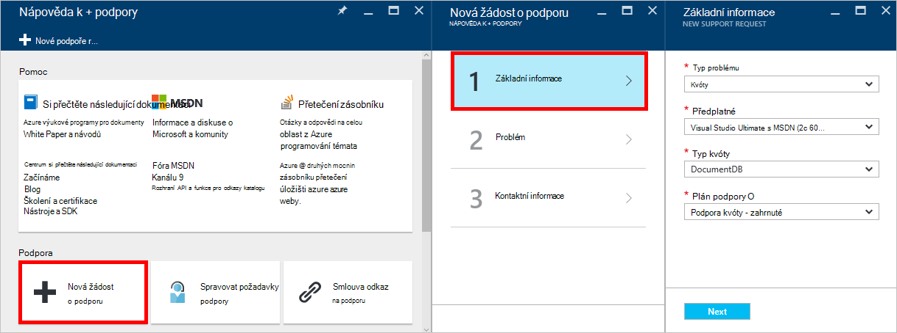
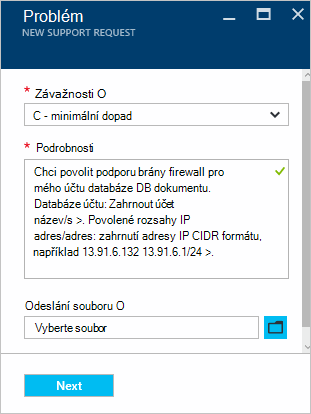

<properties
    pageTitle="Podporu brány firewall pro DocumentDB | Microsoft Azure"
    description="Naučte se používat IP zásady řízení přístupu pro podporu brány firewall pro Azure DocumentDB databáze účtů."
    keywords="Řízení přístupu k IP, podporu brány firewall"
    services="documentdb"
    authors="shahankur11"
    manager="jhubbard"
    editor=""
    tags="azure-resource-manager"
    documentationCenter=""/>

<tags 
    ms.service="documentdb" 
    ms.workload="data-services" 
    ms.tgt_pltfrm="na" 
    ms.devlang="na" 
    ms.topic="article" 
    ms.date="10/17/2016" 
    ms.author="ankshah; kraman"/>

# Podpora DocumentDB brána firewall

Zajistit dat uložených v databázi účet Azure DocumentDB DocumentDB dodala podpory pro skrytou založené [se tak mohli ověřovat modelu](https://msdn.microsoft.com/library/azure/dn783368.aspx) , který využívá silných zprávy na základě Hash ověřovací kód (HMAC). Teď kromě modelu tajné ověření používající podporuje DocumentDB zásad řízený úsilím přístupu na základě IP ovládací prvky pro podporu brány firewall pro příchozí. Tento model je velmi podobné pravidla brány firewall systému tradiční databází a poskytuje další úroveň zabezpečení účtu DocumentDB databáze. V tomto modelu můžete nakonfigurovat účet databáze DocumentDB přístupný pouze z schválené sady strojů a/nebo cloudových služeb. Přístup k prostředkům DocumentDB z těchto schválených sad počítače a služby přesto vyžadují, volající prezentovat token platné povolení.

## Přehled řízení přístupu IP

Ve výchozím nastavení účtu databáze DocumentDB přístupný z veřejné: internet, dokud se žádost spolu token platné povolení. Abyste mohli nakonfigurovat řízení přístupu na základě zásad IP, musí zadat sadu IP adresy nebo rozsahy IP adres ve formuláři CIDR jako seznamu povolených IP adresy klienta pro danou databázi účtu. Po použití této konfiguraci všechny žádosti o pocházející z počítače mimo tohoto seznamu povolených blokovány serveru.  Připojení zpracování tok pro řízení přístupu na základě IP je popsán v následujícím diagramu.

## Připojení z cloudu služeb

V Azure, což jsou cloudové služby velmi běžným způsobem pro hostování logiku služby střední úroveň pomocí DocumentDB. Povolit přístup k účtu databáze DocumentDB z cloudové služby, musí být veřejnou IP adresu cloudové služby přidat do seznamu povolených IP adres přidruženého k vašemu účtu databáze DocumentDB kontaktováním [podpory Azure](#configure-ip-policy).  Zajistíte tak, aby všechny výskyty role cloudovým službám měli přístup ke svému účtu DocumentDB databáze. Můžete získat IP adresy služby cloudu v portálu Azure jak ukazuje následující obrázek. 

Při měřítka, vaše cloudové služby přidáním další roli instance tyto nové instance bude mít automaticky přístup k tomuto účtu databáze DocumentDB protože jsou součástí stejné cloudové služby.

## Připojení z virtuálních počítačích

[Virtuálních počítačích](https://azure.microsoft.com/services/virtual-machines/) nebo [Nastaví virtuálního počítače měřítka](../virtual-machine-scale-sets/virtual-machine-scale-sets-overview.md) lze také hostovat střední úroveň služby pomocí DocumentDB.  Konfigurace DocumentDB databáze účet, který chcete povolit přístup z virtuálních počítačích, veřejnou IP adresy virtuálního počítače a/nebo nastavit měřítko virtuální počítač musí být nakonfigurované mezi povolené IP adresy účtu databáze DocumentDB kontaktováním [podpory Azure](#configure-ip-policy). IP adresy virtuálních počítačích na portálu Azure můžete získat, jak ukazuje následující obrázek.

Další virtuální počítač instance přidáte do skupiny, budou automaticky k dispozici přístup ke svému účtu DocumentDB databáze.

## Připojení z Internetu

Při přístupu k účtu databáze DocumentDB z počítače na Internetu, IP adresa klienta nebo rozsahu IP adres počítače musí přidat do seznamu povolených IP adres pro účet DocumentDB databázi. 

## Konfigurace zásad řízení přístupu IP

Pomocí portálu Azure poslat žádost s [Podporou Azure](https://portal.azure.com/?#blade/Microsoft_Azure_Support/HelpAndSupportBlade) povolit IP zásady řízení přístupu ke svému účtu databáze.

1. V zásuvné [nápovědy + podpory](https://portal.azure.com/?#blade/Microsoft_Azure_Support/HelpAndSupportBlade) vyberte **Nová žádost o podporu**.
2. V zásuvné **Nová žádost o podporu** vyberte **Základy**.
3. V zásuvné **Základy** pak udělejte toto:
    - **Typ problému**: kvóty
    - **Předplatné**: předplatné přidružené k účtu, ke které chcete přidat zásady řízení přístupu IP.
    - **Typ kvóty**: DocumentDB
    - **Plán podpory**: podpora kvóty - zahrnuté.
4. V zásuvné **problém** postupujte takto:
    - **Závažnosti**: Vyberte C - minimální dopad
    - **Podrobnosti o**: Zkopírujte následující text do pole a zahrnout účet název/s a IP adresy/es: "Chci zapnout podporu brány firewall pro svůj účet DocumentDB databázi. Databáze účtu: *název účtu zahrnout/s*. Povolené IP adresa nebo oblastí: *zahrnout rozsah IP adres nebo ve formátu CIDR, například 13.91.6.132, 13.91.6.1/24*. "
    - Klikněte na tlačítko **Další**. 
5. V zásuvné **kontaktních informací** vyplňte podrobnosti o kontaktu a klikněte na **vytvořit**. 

Po přijetí žádosti o řízení přístupu k IP používat 24 hodin. Zobrazí se oznámení po dokončení žádosti.

## Poradce při potížích s zásady řízení přístupu IP

### Portál operace

Povolením IP zásad řízení přístupu pro váš účet databáze DocumentDB povolen všechny přístup ke svému účtu databáze DocumentDB z počítačů mimo nakonfigurované blokované seznam rozsahů IP adres. Na základě tento model procházení rovině operace s daty z portálu Microsoft taky budou blokovány k zajištění integrity řízení přístupu. 

### SDK & Rest API

Pro bezpečnostních důvodů, aplikace access prostřednictvím SDK nebo rozhraní REST API z počítače na seznamu povolených vrátí obecný 404 Nenalezeno odpověď s žádné další podrobnosti. Zkontrolujte, zda IP povolené seznamu nakonfigurován pro váš účet databáze DocumentDB zajistit že konfigurace správné zásady se použije k vašemu účtu DocumentDB databáze.

## Další kroky

Informace o sítě výkonu tipy najdete v tématu [Tipy pro výkon](documentdb-performance-tips.md).