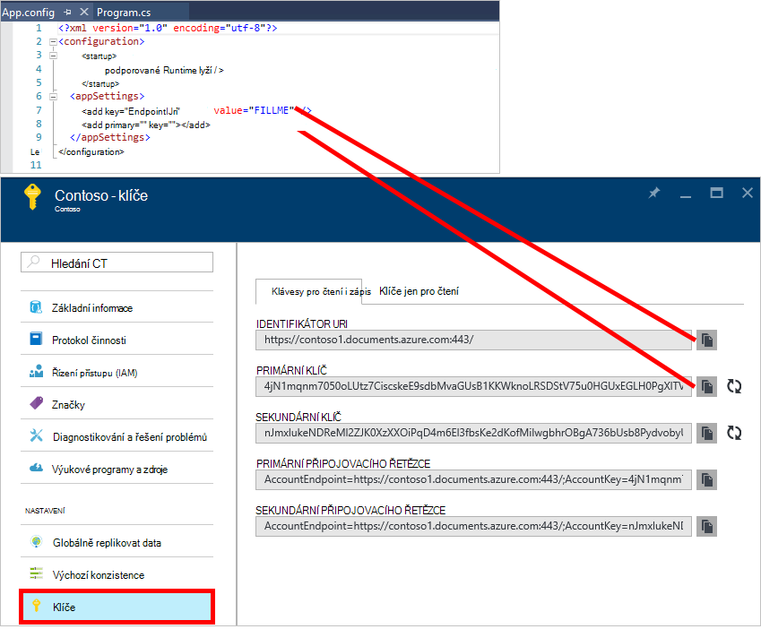
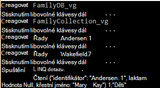
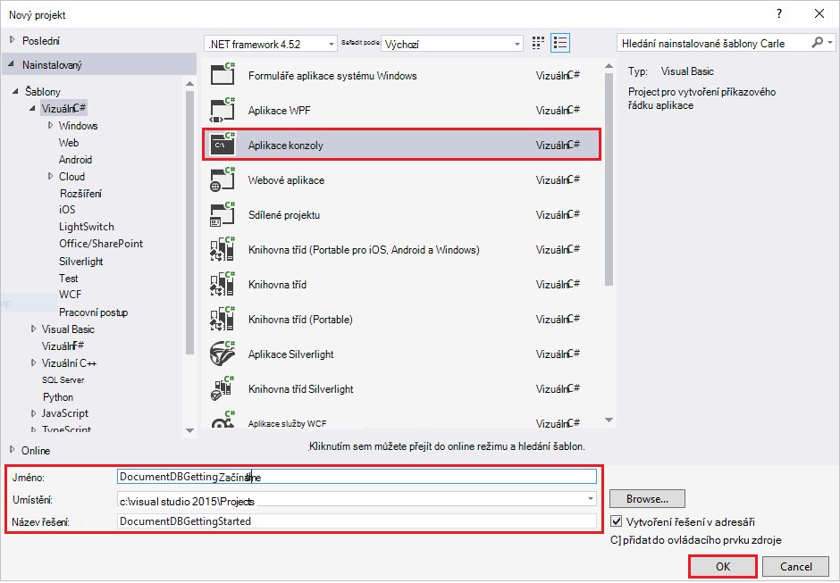
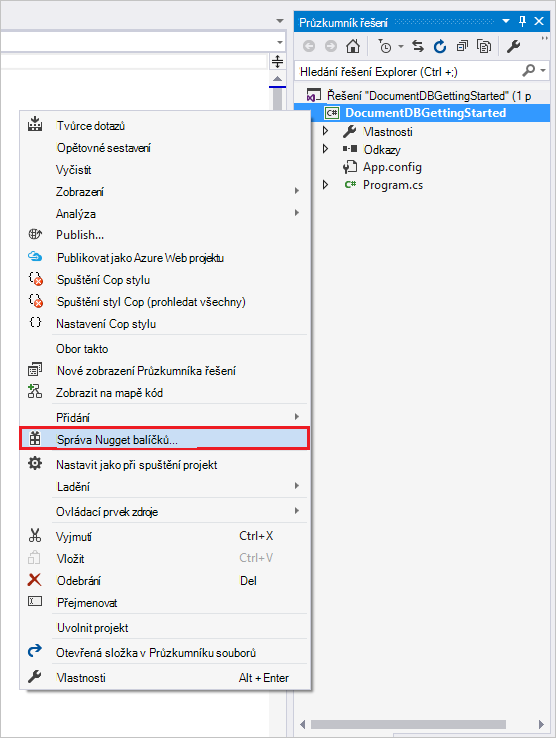
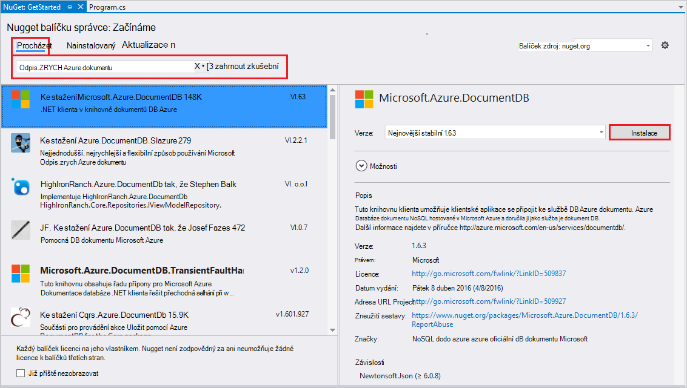
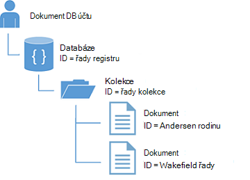
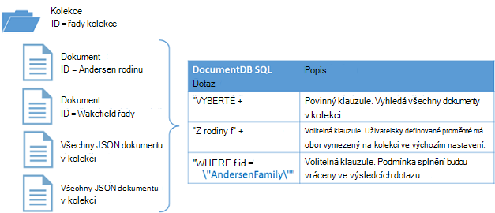

<properties
    pageTitle="Kurz NoSQL: DocumentDB .NET SDK | Microsoft Azure"
    description="Kurz NoSQL, který vytvoří online databázi a C# konzoly aplikaci DocumentDB .NET SDK. DocumentDB je NoSQL databáze pro JSON."
    keywords="nosql kurzu online databázi aplikace konzoly c#"
    services="documentdb"
    documentationCenter=".net"
    authors="AndrewHoh"
    manager="jhubbard"
    editor="monicar"/>

<tags
    ms.service="documentdb"
    ms.workload="data-services"
    ms.tgt_pltfrm="na"
    ms.devlang="dotnet"
    ms.topic="hero-article"
    ms.date="09/01/2016"
    ms.author="anhoh"/>

# NoSQL kurz: vytvoření DocumentDB C# konzoly aplikace

> [AZURE.SELECTOR]
- [.NET](documentdb-get-started.md)
- [Node.js](documentdb-nodejs-get-started.md)

Vítá vás kurz NoSQL pro Azure DocumentDB .NET SDK! Po získání rychlý úvod projektu nebo dokončování kurzu, budete mít aplikaci konzoly, která vytvoří a dotazů DocumentDB zdroje.

- **[Rychlý úvod](#quickstart)**: stáhnout ukázkový projekt, přidejte informace o připojení a být DocumentDB aplikace spuštěné v menší než 10 minut.
- **[Kurz](#tutorial)**: vytvoření aplikace rychlý úvod přímo za 30 minut.

## Zjistit předpoklady pro

- Účet Azure active. Pokud nemáte, můžete registraci [bezplatný účet](https://azure.microsoft.com/free/).
- [Visual Studio 2013 nebo Visual Studio 2015](http://www.visualstudio.com/).
- .NET framework 4.6

## Rychlý úvod

1. Stahování [GitHub](https://github.com/Azure-Samples/documentdb-dotnet-getting-started-quickstart/archive/master.zip) ZIP projektu vzorku nebo klonovat repo [documentdb-dotnet – Začínáme – Začínáme – rychlý úvod](https://github.com/Azure-Samples/documentdb-dotnet-getting-started-quickstart) .
2. Pomocí portálu Azure vytvořit [účet DocumentDB](documentdb-create-account.md).
3. V souboru App.config nahraďte hodnoty EndpointUri a vyhovoval hodnoty načtené z [Azure portál](https://portal.azure.com/)tak, že přejdete na zásuvné **DocumentDB (NoSQL)** a pak kliknete na **název účtu**a potom kliknete na **klávesy** nabídce zdroje.
    
4. Vytvoření projektu. Okno konzoly zobrazuje nové zdroje je vytvořen dotazovaném a potom vyčistí.
    
    

## Kurz

Tento kurz vás provede vystavením DocumentDB databáze, kolekci DocumentDB a JSON dokumenty. Budete pak dotazu v kolekci a vyčistit a odstranit databázi. Tento kurz vytvoří stejnou projekt jako rychlý úvod projekt, ale budete vytvářet postupně a dostanou vysvětlení kód, který přidáváte do projektu.

## Krok 1: Vytvoření účtu DocumentDB

Vytvoření účtu DocumentDB. Pokud už máte nastavený účet, který chcete použít, můžete přejít dále nastavit [Visual Studio řešení](#SetupVS).

[AZURE.INCLUDE [documentdb-create-dbaccount](../../includes/documentdb-create-dbaccount.md)]

## Krok 2: Nastavte řešení Visual Studio

1. Otevřete **aplikaci Visual Studio 2015** ve vašem počítači.
2. V nabídce **soubor** vyberte **Nový**a pak zvolte **projekt**.
3. V dialogovém okně **Nový projekt** vyberte **šablony** / **Visual Basic** / **Aplikace konzoly**název projektu a klikněte na **OK**.

4. V **Okně Průzkumník řešení**klikněte pravým tlačítkem na nový konzoly aplikace, která je ve Visual Studiu řešení.
5. Aniž byste museli opustit nabídku, klepněte na **Spravovat... NuGet balíčků** 
 
6. Na kartě **Nuget** klikněte na tlačítko **Procházet**a zadejte **azure documentdb** do vyhledávacího pole.
7. Ve výsledcích hledání **Microsoft.Azure.DocumentDB** a klikněte na tlačítko **nainstalovat**.
ID balíčku pro knihovnu DocumentDB klienta je [Microsoft.Azure.DocumentDB](https://www.nuget.org/packages/Microsoft.Azure.DocumentDB)

Skvělé! Teď můžeme dokončení nastavení Začněme psaní některé kódu. Vyhledání projektu Dokončený kód tohoto kurzu na [GitHub](https://github.com/Azure-Samples/documentdb-dotnet-getting-started/blob/master/src/Program.cs).

## Krok 3: Připojení k účtu DocumentDB

Nejdřív přidejte tyto odkazy na začátek aplikace C# Program.cs souboru:

    using System;
    using System.Linq;
    using System.Threading.Tasks;

    // ADD THIS PART TO YOUR CODE
    using System.Net;
    using Microsoft.Azure.Documents;
    using Microsoft.Azure.Documents.Client;
    using Newtonsoft.Json;

> [AZURE.IMPORTANT] Abyste mohli tento kurz NoSQL zkontrolujte, že přidáte závislosti výše.

Teď přidejte tyto dva konstanty a proměnná *klienta* pod veřejné třídy *aplikace*.

    public class Program
    {
        // ADD THIS PART TO YOUR CODE
        private const string EndpointUri = "<your endpoint URI>";
        private const string PrimaryKey = "<your key>";
        private DocumentClient client;

Další, najdete ji v [Portálu Azure](https://portal.azure.com) k načtení URI a primárního klíče. Identifikátor URI DocumentDB a primárního klíče jsou potřebné pro aplikaci Pokud chcete zjistit, kde se připojit k a pro DocumentDB s informacemi o důvěryhodnosti připojení aplikace.

Na portálu Azure přejděte ke svému účtu DocumentDB a klikněte na **klíče**.

Zkopírovat identifikátor URI z portálu Microsoft a vložit ho do `<your endpoint URI>` v souboru program.cs. Pak zkopírujte PRIMÁRNÍHO klíče z portálu Microsoft a vložit ho do `<your key>`.

![Snímek obrazovky s portálu Azure používaný NoSQL kurz vytvoření aplikace konzoly C#. Zobrazuje účet DocumentDB se aktivní centrální zvýrazněná, zvýrazněného na zásuvné účtu DocumentDB tlačítka klíče a hodnoty URI, PRIMÁRNÍHO klíče a vedlejší klíč zvýrazněná na zásuvné klíče][keys]

Začneme bude dosáhnout toho, aby Začínáme aplikace tak, že vytvoříte nové instance **DocumentClient**.

Pod metodu **hlavní** přidejte tento úkol asynchronní s názvem **GetStartedDemo**, které vytvoříte instanci našeho nového **DocumentClient**.

    static void Main(string[] args)
    {
    }

    // ADD THIS PART TO YOUR CODE
    private async Task GetStartedDemo()
    {
        this.client = new DocumentClient(new Uri(EndpointUri), PrimaryKey);
    }

Přidejte následující kód běžet způsobu **hlavní** asynchronní úkolu. Metoda **hlavní** zachytit výjimky a zapisovat do konzoly.

    static void Main(string[] args)
    {
            // ADD THIS PART TO YOUR CODE
            try
            {
                    Program p = new Program();
                    p.GetStartedDemo().Wait();
            }
            catch (DocumentClientException de)
            {
                    Exception baseException = de.GetBaseException();
                    Console.WriteLine("{0} error occurred: {1}, Message: {2}", de.StatusCode, de.Message, baseException.Message);
            }
            catch (Exception e)
            {
                    Exception baseException = e.GetBaseException();
                    Console.WriteLine("Error: {0}, Message: {1}", e.Message, baseException.Message);
            }
            finally
            {
                    Console.WriteLine("End of demo, press any key to exit.");
                    Console.ReadKey();
            }

Stisknutím klávesy **F5** spusťte aplikaci.

Blahopřejeme! Úspěšném připojení k účtu DocumentDB, teď Podívejme se při práci s DocumentDB zdroje.  

## Krok 4: Vytvoření databáze
Před přidáním kód k vytvoření databáze přidáte metodu Pomocník pro psaní ke konzole.

Kopírování a vkládání metodu **WriteToConsoleAndPromptToContinue** pod metodu **GetStartedDemo** .

    // ADD THIS PART TO YOUR CODE
    private void WriteToConsoleAndPromptToContinue(string format, params object[] args)
    {
            Console.WriteLine(format, args);
            Console.WriteLine("Press any key to continue ...");
            Console.ReadKey();
    }

DocumentDB [databázi](documentdb-resources.md#databases) lze vytvořit pomocí metody [CreateDatabaseAsync](https://msdn.microsoft.com/library/microsoft.azure.documents.client.documentclient.createdatabaseasync.aspx) třídy **DocumentClient** . Databázi je logické kontejner JSON ukládání dokumentů na oddíly v kolekcích.

Kopírování a vkládání metodu **CreateDatabaseIfNotExists** pod metodu **WriteToConsoleAndPromptToContinue** .

    // ADD THIS PART TO YOUR CODE
    private async Task CreateDatabaseIfNotExists(string databaseName)
    {
            // Check to verify a database with the id=FamilyDB does not exist
            try
            {
                    await this.client.ReadDatabaseAsync(UriFactory.CreateDatabaseUri(databaseName));
                    this.WriteToConsoleAndPromptToContinue("Found {0}", databaseName);
            }
            catch (DocumentClientException de)
            {
                    // If the database does not exist, create a new database
                    if (de.StatusCode == HttpStatusCode.NotFound)
                    {
                            await this.client.CreateDatabaseAsync(new Database { Id = databaseName });
                            this.WriteToConsoleAndPromptToContinue("Created {0}", databaseName);
                    }
                    else
                    {
                            throw;
                    }
            }
    }

Zkopírujte a vložte následující kód způsobu **GetStartedDemo** pod vytváření klienta. Tím vytvoříte databázi s názvem *FamilyDB*.

    private async Task GetStartedDemo()
    {
        this.client = new DocumentClient(new Uri(EndpointUri), PrimaryKey);

        // ADD THIS PART TO YOUR CODE
        await this.CreateDatabaseIfNotExists("FamilyDB_va");

Stisknutím klávesy **F5** spusťte aplikaci.

Blahopřejeme! Úspěšně jste vytvořili DocumentDB databáze.  

## Krok 5: Vytvoření kolekce  

> [AZURE.WARNING] **CreateDocumentCollectionAsync** vytvoří novou kolekci rezervovaná výkon, tato role má ceny důsledky. Podrobné informace navštivte naše [ceny stránky](https://azure.microsoft.com/pricing/details/documentdb/).

[Kolekce](documentdb-resources.md#collections) můžete vytvořený s využitím metodu [CreateDocumentCollectionAsync](https://msdn.microsoft.com/library/microsoft.azure.documents.client.documentclient.createdocumentcollectionasync.aspx) třídy **DocumentClient** . Kolekce je kontejner JSON dokumentů a přidružené aplikace logiky JavaScript.

Kopírování a vkládání metodu **CreateDocumentCollectionIfNotExists** pod způsobu **CreateDatabaseIfNotExists** .

    // ADD THIS PART TO YOUR CODE
    private async Task CreateDocumentCollectionIfNotExists(string databaseName, string collectionName)
    {
        try
        {
            await this.client.ReadDocumentCollectionAsync(UriFactory.CreateDocumentCollectionUri(databaseName, collectionName));
            this.WriteToConsoleAndPromptToContinue("Found {0}", collectionName);
        }
        catch (DocumentClientException de)
        {
            // If the document collection does not exist, create a new collection
            if (de.StatusCode == HttpStatusCode.NotFound)
            {
                DocumentCollection collectionInfo = new DocumentCollection();
                collectionInfo.Id = collectionName;

                // Configure collections for maximum query flexibility including string range queries.
                collectionInfo.IndexingPolicy = new IndexingPolicy(new RangeIndex(DataType.String) { Precision = -1 });

                // Here we create a collection with 400 RU/s.
                await this.client.CreateDocumentCollectionAsync(
                    UriFactory.CreateDatabaseUri(databaseName),
                    collectionInfo,
                    new RequestOptions { OfferThroughput = 400 });

                this.WriteToConsoleAndPromptToContinue("Created {0}", collectionName);
            }
            else
            {
                throw;
            }
        }
    }

Zkopírujte a vložte následující kód způsobu **GetStartedDemo** pod vytvoření databáze. Tím vytvoříte kolekci dokument s názvem *FamilyCollection_va*.

        this.client = new DocumentClient(new Uri(EndpointUri), PrimaryKey);

        await this.CreateDatabaseIfNotExists("FamilyDB_oa");

        // ADD THIS PART TO YOUR CODE
        await this.CreateDocumentCollectionIfNotExists("FamilyDB_va", "FamilyCollection_va");

Stisknutím klávesy **F5** spusťte aplikaci.

Blahopřejeme! Úspěšně vytvořili jste kolekci DocumentDB dokumentů.  

## Krok 6: Vytváření JSON dokumentů
[Dokument](documentdb-resources.md#documents) můžete vytvořený s využitím metodu [CreateDocumentAsync](https://msdn.microsoft.com/library/microsoft.azure.documents.client.documentclient.createdocumentasync.aspx) třídy **DocumentClient** . Dokumenty jsou definované uživatelem (libovolného) JSON obsah. Teď můžeme můžete vložit jeden nebo více dokumentů. Pokud už máte data, která chcete uložit do databáze, můžete je DocumentDB [Nástroje pro migraci dat](documentdb-import-data.md).

Nejdřív potřeba vytvoření **řady** předmětu, který bude zastupovat objektů uložených v rámci DocumentDB v tomto příkladu. Vytvoříme taky **nadřazené** **podřízené**, **Pet**, dílčí **adresy** , které se používají ve **stejné skupině**. Všimněte si, že dokumentů je třeba proceduru **Id** serializován jako **id** v JSON. Vytvoření těchto tříd přidáním následující interní dílčí třídy za metodu **GetStartedDemo** .

Kopírování a vkládání **řady**, **nadřazené**, **podřízené**, **Pet**a třídy **adres** pod metodu **WriteToConsoleAndPromptToContinue** .

    private void WriteToConsoleAndPromptToContinue(string format, params object[] args)
    {
        Console.WriteLine(format, args);
        Console.WriteLine("Press any key to continue ...");
        Console.ReadKey();
    }

    // ADD THIS PART TO YOUR CODE
    public class Family
    {
        [JsonProperty(PropertyName = "id")]
        public string Id { get; set; }
        public string LastName { get; set; }
        public Parent[] Parents { get; set; }
        public Child[] Children { get; set; }
        public Address Address { get; set; }
        public bool IsRegistered { get; set; }
        public override string ToString()
        {
                return JsonConvert.SerializeObject(this);
        }
    }

    public class Parent
    {
        public string FamilyName { get; set; }
        public string FirstName { get; set; }
    }

    public class Child
    {
        public string FamilyName { get; set; }
        public string FirstName { get; set; }
        public string Gender { get; set; }
        public int Grade { get; set; }
        public Pet[] Pets { get; set; }
    }

    public class Pet
    {
        public string GivenName { get; set; }
    }

    public class Address
    {
        public string State { get; set; }
        public string County { get; set; }
        public string City { get; set; }
    }

Kopírování a vkládání metodu **CreateFamilyDocumentIfNotExists** pod způsobu **CreateDocumentCollectionIfNotExists** .

    // ADD THIS PART TO YOUR CODE
    private async Task CreateFamilyDocumentIfNotExists(string databaseName, string collectionName, Family family)
    {
        try
        {
            await this.client.ReadDocumentAsync(UriFactory.CreateDocumentUri(databaseName, collectionName, family.Id));
            this.WriteToConsoleAndPromptToContinue("Found {0}", family.Id);
        }
        catch (DocumentClientException de)
        {
            if (de.StatusCode == HttpStatusCode.NotFound)
            {
                await this.client.CreateDocumentAsync(UriFactory.CreateDocumentCollectionUri(databaseName, collectionName), family);
                this.WriteToConsoleAndPromptToContinue("Created Family {0}", family.Id);
            }
            else
            {
                throw;
            }
        }
    }

A vložení dvou dokumentů, jedno pro rodinu Andersen a rodina Wakefield.

Zkopírujte a vložte následující kód způsobu **GetStartedDemo** pod kolekce vytvoření dokumentu.

    await this.CreateDatabaseIfNotExists("FamilyDB_va");

    await this.CreateDocumentCollectionIfNotExists("FamilyDB_va", "FamilyCollection_va");

    // ADD THIS PART TO YOUR CODE
    Family andersenFamily = new Family
    {
            Id = "Andersen.1",
            LastName = "Andersen",
            Parents = new Parent[]
            {
                    new Parent { FirstName = "Thomas" },
                    new Parent { FirstName = "Mary Kay" }
            },
            Children = new Child[]
            {
                    new Child
                    {
                            FirstName = "Henriette Thaulow",
                            Gender = "female",
                            Grade = 5,
                            Pets = new Pet[]
                            {
                                    new Pet { GivenName = "Fluffy" }
                            }
                    }
            },
            Address = new Address { State = "WA", County = "King", City = "Seattle" },
            IsRegistered = true
    };

    await this.CreateFamilyDocumentIfNotExists("FamilyDB_va", "FamilyCollection_va", andersenFamily);

    Family wakefieldFamily = new Family
    {
            Id = "Wakefield.7",
            LastName = "Wakefield",
            Parents = new Parent[]
            {
                    new Parent { FamilyName = "Wakefield", FirstName = "Robin" },
                    new Parent { FamilyName = "Miller", FirstName = "Ben" }
            },
            Children = new Child[]
            {
                    new Child
                    {
                            FamilyName = "Merriam",
                            FirstName = "Jesse",
                            Gender = "female",
                            Grade = 8,
                            Pets = new Pet[]
                            {
                                    new Pet { GivenName = "Goofy" },
                                    new Pet { GivenName = "Shadow" }
                            }
                    },
                    new Child
                    {
                            FamilyName = "Miller",
                            FirstName = "Lisa",
                            Gender = "female",
                            Grade = 1
                    }
            },
            Address = new Address { State = "NY", County = "Manhattan", City = "NY" },
            IsRegistered = false
    };

    await this.CreateFamilyDocumentIfNotExists("FamilyDB_va", "FamilyCollection_va", wakefieldFamily);

Stisknutím klávesy **F5** spusťte aplikaci.

Blahopřejeme! Úspěšně jste vytvořili dvěma DocumentDB dokumenty.  

##Krok 7: Dotazu DocumentDB zdroje

DocumentDB podporuje bohaté [dotazů](documentdb-sql-query.md) JSON dokumentů uložených v každé kolekce.  Následující ukázkový kód zobrazuje různé dotazů – pomocí obou syntaxe jazyka SQL DocumentDB i LINQ -, že nám můžete kontrolovat dokumenty jsme vložili v předchozím kroku.

Kopírování a vkládání metodu **ExecuteSimpleQuery** pod způsobu **CreateFamilyDocumentIfNotExists** .

    // ADD THIS PART TO YOUR CODE
    private void ExecuteSimpleQuery(string databaseName, string collectionName)
    {
        // Set some common query options
        FeedOptions queryOptions = new FeedOptions { MaxItemCount = -1 };

            // Here we find the Andersen family via its LastName
            IQueryable<Family> familyQuery = this.client.CreateDocumentQuery<Family>(
                    UriFactory.CreateDocumentCollectionUri(databaseName, collectionName), queryOptions)
                    .Where(f => f.LastName == "Andersen");

            // The query is executed synchronously here, but can also be executed asynchronously via the IDocumentQuery<T> interface
            Console.WriteLine("Running LINQ query...");
            foreach (Family family in familyQuery)
            {
                    Console.WriteLine("\tRead {0}", family);
            }

            // Now execute the same query via direct SQL
            IQueryable<Family> familyQueryInSql = this.client.CreateDocumentQuery<Family>(
                    UriFactory.CreateDocumentCollectionUri(databaseName, collectionName),
                    "SELECT * FROM Family WHERE Family.LastName = 'Andersen'",
                    queryOptions);

            Console.WriteLine("Running direct SQL query...");
            foreach (Family family in familyQueryInSql)
            {
                    Console.WriteLine("\tRead {0}", family);
            }

            Console.WriteLine("Press any key to continue ...");
            Console.ReadKey();
    }

Zkopírujte a vložte následující kód způsobu **GetStartedDemo** pod druhý vytvoření dokumentu.

    await this.CreateFamilyDocumentIfNotExists("FamilyDB_va", "FamilyCollection_va", wakefieldFamily);

    // ADD THIS PART TO YOUR CODE
    this.ExecuteSimpleQuery("FamilyDB_va", "FamilyCollection_va");

Stisknutím klávesy **F5** spusťte aplikaci.

Blahopřejeme! Máte úspěšně dotazovaném proti kolekce DocumentDB.

Následující obrázek znázorňuje, jak SQL DocumentDB syntaxe dotazu se nazývá proti kolekce, kterou jste vytvořili a stejné logiky slouží k použití u LINQ dotazu.

Klíčové slovo [FROM](documentdb-sql-query.md#from-clause) vynechán v dotazu, protože DocumentDB dotazů je už omezené do jednoho kolekce. Proto "Z rodiny f" můžete si místo se "Z kořenového r" nebo jiných proměnná Název zvolte. DocumentDB odvodit této skupiny, kořenovou nebo proměnná název, který jste se rozhodli, odkazovat aktuální kolekci ve výchozím nastavení.

##Krok 8: Nahrazení JSON dokumentu

DocumentDB podporuje nahrazení JSON dokumenty.  

Kopírování a vkládání metodu **ReplaceFamilyDocument** pod způsobu **ExecuteSimpleQuery** .

    // ADD THIS PART TO YOUR CODE
    private async Task ReplaceFamilyDocument(string databaseName, string collectionName, string familyName, Family updatedFamily)
    {
        try
        {
            await this.client.ReplaceDocumentAsync(UriFactory.CreateDocumentUri(databaseName, collectionName, familyName), updatedFamily);
            this.WriteToConsoleAndPromptToContinue("Replaced Family {0}", familyName);
        }
        catch (DocumentClientException de)
        {
            throw;
        }
    }

Zkopírujte a vložte následující kód způsobu **GetStartedDemo** pod spuštění dotazu. Po nahrazení dokument, tím se spustí stejný dotaz znova zobrazíte změněný dokument.

    await this.CreateFamilyDocumentIfNotExists("FamilyDB_va", "FamilyCollection_va", wakefieldFamily);

    this.ExecuteSimpleQuery("FamilyDB_va", "FamilyCollection_va");

    // ADD THIS PART TO YOUR CODE
    // Update the Grade of the Andersen Family child
    andersenFamily.Children[0].Grade = 6;

    await this.ReplaceFamilyDocument("FamilyDB_va", "FamilyCollection_va", "Andersen.1", andersenFamily);

    this.ExecuteSimpleQuery("FamilyDB_va", "FamilyCollection_va");

Stisknutím klávesy **F5** spusťte aplikaci.

Blahopřejeme! Jste nahradili úspěšně DocumentDB dokumentu.

##Krok 9: Odstranění JSON dokumentu

DocumentDB podporuje odstraňování JSON dokumenty.  

Kopírování a vkládání metodu **DeleteFamilyDocument** pod způsobu **ReplaceFamilyDocument** .

    // ADD THIS PART TO YOUR CODE
    private async Task DeleteFamilyDocument(string databaseName, string collectionName, string documentName)
    {
        try
        {
            await this.client.DeleteDocumentAsync(UriFactory.CreateDocumentUri(databaseName, collectionName, documentName));
            Console.WriteLine("Deleted Family {0}", documentName);
        }
        catch (DocumentClientException de)
        {
            throw;
        }
    }

Zkopírujte a vložte následující kód způsobu **GetStartedDemo** pod druhý spuštění dotazu.

    await this.ReplaceFamilyDocument("FamilyDB_va", "FamilyCollection_va", "Andersen.1", andersenFamily);

    this.ExecuteSimpleQuery("FamilyDB_va", "FamilyCollection_va");

    // ADD THIS PART TO CODE
    await this.DeleteFamilyDocument("FamilyDB_va", "FamilyCollection_va", "Andersen.1");

Stisknutím klávesy **F5** spusťte aplikaci.

Blahopřejeme! Odstranění dokumentu DocumentDB úspěšně.

##Krok 10: Odstranění databáze

Odstranění vytvořenou databázi odeberete databázi a všechny podřízené zdroje (kolekce, dokumenty, atd.).

Zkopírujte a vložte následující kód způsobu **GetStartedDemo** pod dokumentu odstranit na odstranit celou databázi a všechny podřízené zdroje.

    this.ExecuteSimpleQuery("FamilyDB_va", "FamilyCollection_va");

    await this.DeleteFamilyDocument("FamilyDB_va", "FamilyCollection_va", "Andersen.1");

    // ADD THIS PART TO CODE
    // Clean up/delete the database
    await this.client.DeleteDatabaseAsync(UriFactory.CreateDatabaseUri("FamilyDB_va"));

Stisknutím klávesy **F5** spusťte aplikaci.

Blahopřejeme! Úspěšně jste odstranili DocumentDB databáze.

##Krok 11: Spuštění aplikace C# konzoly najednou.

Přístupů F5 ve Visual Studiu k vytvoření aplikace v režimu ladění.

Měli byste vidět výstup Začínáme aplikace získání. Výstup zobrazí výsledky dotazů jsme přidali a by měly odpovídat následující příklad textu.

    Created FamilyDB_va
    Press any key to continue ...
    Created FamilyCollection_va
    Press any key to continue ...
    Created Family Andersen.1
    Press any key to continue ...
    Created Family Wakefield.7
    Press any key to continue ...
    Running LINQ query...
        Read {"id":"Andersen.1","LastName":"Andersen","District":"WA5","Parents":[{"FamilyName":null,"FirstName":"Thomas"},{"FamilyName":null,"FirstName":"Mary Kay"}],"Children":[{"FamilyName":null,"FirstName":"Henriette Thaulow","Gender":"female","Grade":5,"Pets":[{"GivenName":"Fluffy"}]}],"Address":{"State":"WA","County":"King","City":"Seattle"},"IsRegistered":true}
    Running direct SQL query...
        Read {"id":"Andersen.1","LastName":"Andersen","District":"WA5","Parents":[{"FamilyName":null,"FirstName":"Thomas"},{"FamilyName":null,"FirstName":"Mary Kay"}],"Children":[{"FamilyName":null,"FirstName":"Henriette Thaulow","Gender":"female","Grade":5,"Pets":[{"GivenName":"Fluffy"}]}],"Address":{"State":"WA","County":"King","City":"Seattle"},"IsRegistered":true}
    Replaced Family Andersen.1
    Press any key to continue ...
    Running LINQ query...
        Read {"id":"Andersen.1","LastName":"Andersen","District":"WA5","Parents":[{"FamilyName":null,"FirstName":"Thomas"},{"FamilyName":null,"FirstName":"Mary Kay"}],"Children":[{"FamilyName":null,"FirstName":"Henriette Thaulow","Gender":"female","Grade":6,"Pets":[{"GivenName":"Fluffy"}]}],"Address":{"State":"WA","County":"King","City":"Seattle"},"IsRegistered":true}
    Running direct SQL query...
        Read {"id":"Andersen.1","LastName":"Andersen","District":"WA5","Parents":[{"FamilyName":null,"FirstName":"Thomas"},{"FamilyName":null,"FirstName":"Mary Kay"}],"Children":[{"FamilyName":null,"FirstName":"Henriette Thaulow","Gender":"female","Grade":6,"Pets":[{"GivenName":"Fluffy"}]}],"Address":{"State":"WA","County":"King","City":"Seattle"},"IsRegistered":true}
    Deleted Family Andersen.1
    End of demo, press any key to exit.

Blahopřejeme! Dokončení tohoto kurzu NoSQL a pracovní C# konzoly aplikace?

## Další kroky

- Chcete složitější kurz ASP.NET MVC NoSQL? Zobrazit, [vytvořit webovou aplikaci pomocí technologie ASP.NET MVC pomocí DocumentDB](documentdb-dotnet-application.md).
- Chcete provést měřítko a výkonu testováním pomocí DocumentDB? Přečtěte si téma [výkonu a měřítko testováním pomocí Azure DocumentDB](documentdb-performance-testing.md)
-   Zjistěte, jak [Sledování DocumentDB účtu](documentdb-monitor-accounts.md).
-   Spouštění dotazů týkající se naší ukázkové datové sady v [Dotazu hřišť](https://www.documentdb.com/sql/demo).
-   Další informace o model programování v části vývoje [DocumentDB si přečtěte následující dokumentaci stránky](https://azure.microsoft.com/documentation/services/documentdb/).

[documentdb-create-account]: documentdb-create-account.md
[documentdb-manage]: documentdb-manage.md
[keys]: media/documentdb-get-started-quickstart/nosql-tutorial-keys.png

