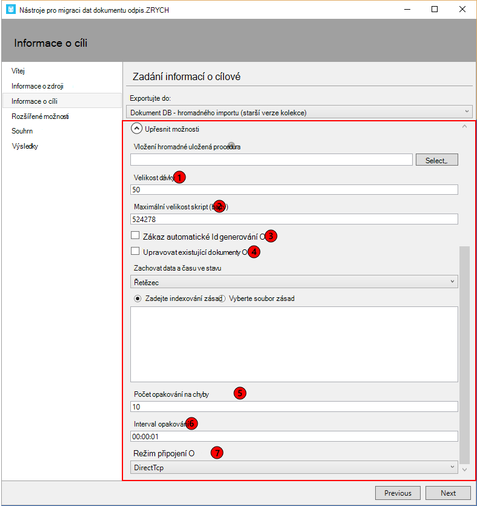

<properties
    pageTitle="Nástroje pro migraci databáze pro DocumentDB | Microsoft Azure"
    description="Naučte se používat nástroje pro migraci dat DocumentDB otevřít zdroj k importu dat do DocumentDB z různých zdrojů, včetně MongoDB SQL serveru, tabulka úložiště, Amazon DynamoDB, CSV a JSON souborů. CSV k převodu formátu JSON."
    keywords="CSV json, nástroje pro migraci z databáze, převést do formátu json csv"
    services="documentdb"
    authors="andrewhoh"
    manager="jhubbard"
    editor="monicar"
    documentationCenter=""/>

<tags
    ms.service="documentdb"
    ms.workload="data-services"
    ms.tgt_pltfrm="na"
    ms.devlang="na"
    ms.topic="article"
    ms.date="10/06/2016"
    ms.author="anhoh"/>

# Import dat do DocumentDB pomocí nástroje pro migraci databáze

V tomto článku se dozvíte, jak používat nástroje pro migraci dat DocumentDB oficiální otevřít zdroj k importu dat do [Microsoft Azure DocumentDB](https://azure.microsoft.com/services/documentdb/) z různých zdrojů, včetně JSON souborů CSV, SQL, MongoDB, úložiště tabulek Azure, Amazon DynamoDB a DocumentDB kolekcí.

Po přečtení v tomto článku si budete moct odpovězte na následující otázky:  

-   Jak můžete importovat soubor JSON, soubor CSV, data SQL serveru nebo MongoDB dat k DocumentDB?
-   Jak můžu naimportovat data z úložiště tabulek Azure, Amazon DynamoDB a HBase k DocumentDB?
-   Jak můžu migrovat dat mezi kolekcemi DocumentDB?

##Zjistit předpoklady pro

Před postupujte podle pokynů v tomto článku, zkontrolujte, jestli máte nainstalovat následující:

- [Rozhraní Microsoft .NET Framework 4.51](https://www.microsoft.com/download/developer-tools.aspx) nebo vyšší.

##Základní informace o nástroje pro migraci DocumentDB dat

Nástroje pro migraci dat DocumentDB je otevřít zdroj řešení, které slouží k importu dat do DocumentDB z různých zdrojů, včetně:

- JSON souborů
- MongoDB
- SQL Server
- Soubory CSV
- Úložiště tabulek Azure
- Amazon DynamoDB
- HBase
- Kolekce DocumentDB

Při importu nástroj obsahuje grafické uživatelské rozhraní (dtui.exe), můžete taky úsilím z příkazového řádku (dt.exe). Ve skutečnosti je možnost výstup příkaz přidružené po nastavení operaci importu prostřednictvím uživatelského rozhraní. Tabulkové zdrojová data (například SQL serveru nebo souboru CSV souborů) můžete transformovat tak, aby se při importu se dají vytvářet hierarchické vztahy (vnořené dokumenty). Čtěte dál a další informace o možnostech zdroje, přehrajte příkaz čar a umožňuje importovat z každý zdroj možnosti cílového a import zobrazení výsledků.

##Instalace nástroje pro migraci dat DocumentDB

Zdrojový kód nástroje pro migraci jsou k dispozici na GitHub [Toto úložiště](https://github.com/azure/azure-documentdb-datamigrationtool) a zkompilované verze je dostupná z [Webu služby Stažení softwaru](http://www.microsoft.com/downloads/details.aspx?FamilyID=cda7703a-2774-4c07-adcc-ad02ddc1a44d). Může kompilaci řešení nebo jednoduše stáhněte si a extrahovat zkompilované verze do adresáře podle svého výběru. Spusťte buď:

- **Dtui.exe**: grafického rozhraní verzi nástroje
- **Dt.exe**: příkazového řádku verzi nástroje

##Import JSON souborů

Možnost Import zdrojový soubor JSON umožňuje importovat jednu nebo více jeden dokument JSON soubory nebo JSON každý obsahovat maticových JSON dokumentů. Při přidávání složky, které obsahují JSON souborů, které chcete importovat, máte možnost zpětně vyhledávání souborů v podsložky.

Tady jsou některé vzorky příkazového řádku pro import JSON souborů:

    #Import a single JSON file
    dt.exe /s:JsonFile /s.Files:.\Sessions.json /t:DocumentDBBulk /t.ConnectionString:"AccountEndpoint=<DocumentDB Endpoint>;AccountKey=<DocumentDB Key>;Database=<DocumentDB Database>;" /t.Collection:Sessions /t.CollectionThroughput:2500

    #Import a directory of JSON files
    dt.exe /s:JsonFile /s.Files:C:\TESessions\*.json /t:DocumentDBBulk /t.ConnectionString:" AccountEndpoint=<DocumentDB Endpoint>;AccountKey=<DocumentDB Key>;Database=<DocumentDB Database>;" /t.Collection:Sessions /t.CollectionThroughput:2500

    #Import a directory (including sub-directories) of JSON files
    dt.exe /s:JsonFile /s.Files:C:\LastFMMusic\**\*.json /t:DocumentDBBulk /t.ConnectionString:" AccountEndpoint=<DocumentDB Endpoint>;AccountKey=<DocumentDB Key>;Database=<DocumentDB Database>;" /t.Collection:Music /t.CollectionThroughput:2500

    #Import a directory (single), directory (recursive), and individual JSON files
    dt.exe /s:JsonFile /s.Files:C:\Tweets\*.*;C:\LargeDocs\**\*.*;C:\TESessions\Session48172.json;C:\TESessions\Session48173.json;C:\TESessions\Session48174.json;C:\TESessions\Session48175.json;C:\TESessions\Session48177.json /t:DocumentDBBulk /t.ConnectionString:"AccountEndpoint=<DocumentDB Endpoint>;AccountKey=<DocumentDB Key>;Database=<DocumentDB Database>;" /t.Collection:subs /t.CollectionThroughput:2500

    #Import a single JSON file and partition the data across 4 collections
    dt.exe /s:JsonFile /s.Files:D:\\CompanyData\\Companies.json /t:DocumentDBBulk /t.ConnectionString:"AccountEndpoint=<DocumentDB Endpoint>;AccountKey=<DocumentDB Key>;Database=<DocumentDB Database>;" /t.Collection:comp[1-4] /t.PartitionKey:name /t.CollectionThroughput:2500

##Import z MongoDB

Možnost MongoDB zdroje import umožňuje importovat z jednotlivých kolekcí MongoDB a volitelně filtrovat dokumenty pomocí dotazu a/nebo upravit struktury dokumentu pomocí projekci.  

Připojovací řetězec je standardní formát MongoDB:

    mongodb://<dbuser>:<dbpassword>@<host>:<port>/<database>

> [AZURE.NOTE] Použijte příkaz ověření zajistit, že instance MongoDB zadané v poli řetězec připojení můžete k nim získat přístup.

Zadejte název kolekce, ze kterého se data importují. Můžete volitelně určete nebo zadat soubor pro dotaz (například {pop: {$gt: 5000}}) nebo projekci (například {loc:0}) filtrovat i obrazce data, která chcete importovat.

Tady jsou některé vzorky příkazového řádku pro import z MongoDB:

    #Import all documents from a MongoDB collection
    dt.exe /s:MongoDB /s.ConnectionString:mongodb://<dbuser>:<dbpassword>@<host>:<port>/<database> /s.Collection:zips /t:DocumentDBBulk /t.ConnectionString:"AccountEndpoint=<DocumentDB Endpoint>;AccountKey=<DocumentDB Key>;Database=<DocumentDB Database>;" /t.Collection:BulkZips /t.IdField:_id /t.CollectionThroughput:2500

    #Import documents from a MongoDB collection which match the query and exclude the loc field
    dt.exe /s:MongoDB /s.ConnectionString:mongodb://<dbuser>:<dbpassword>@<host>:<port>/<database> /s.Collection:zips /s.Query:{pop:{$gt:50000}} /s.Projection:{loc:0} /t:DocumentDBBulk /t.ConnectionString:"AccountEndpoint=<DocumentDB Endpoint>;AccountKey=<DocumentDB Key>;Database=<DocumentDB Database>;" /t.Collection:BulkZipsTransform /t.IdField:_id/t.CollectionThroughput:2500

##Import MongoDB exportu souborů

Příkaz Import souboru zdroje MongoDB exportovat JSON umožňuje importovat z nástroj mongoexport jeden nebo víc souborů JSON.  

Při přidávání složky, které obsahují MongoDB export JSON soubory pro import, máte možnost zpětně vyhledávání souborů v podsložky.

Tady je ukázka příkazového řádku pro import z MongoDB export JSON souborů:

    dt.exe /s:MongoDBExport /s.Files:D:\mongoemployees.json /t:DocumentDBBulk /t.ConnectionString:"AccountEndpoint=<DocumentDB Endpoint>;AccountKey=<DocumentDB Key>;Database=<DocumentDB Database>;" /t.Collection:employees /t.IdField:_id /t.Dates:Epoch /t.CollectionThroughput:2500

##Import ze serveru SQL Server

Možnost SQL zdroje import umožňuje importovat z jednotlivých databáze SQL serveru a volitelně filtrovat záznamy, které chcete importovat pomocí dotazu. Kromě toho můžete změnit struktury dokumentu tím, že zadáte oddělovače vnoření (podrobnosti o této ve chvíli).  

Formát připojovací řetězec je standardní formát SQL připojovacího řetězce.

> [AZURE.NOTE] Použijte příkaz ověření zajistit, že instanci systému SQL Server uvedený v poli řetězec připojení můžete k nim získat přístup.

Vlastnost vnoření oddělovač slouží k vytváření hierarchické vztahy (dílčí dokumenty) při importu. Zvažte následující dotaz SQL:

*Vyberte CAST (jako BusinessEntityID datová) jako Id, název, AddressType jako [Address.AddressType], AddressLine1 jako [Address.AddressLine1], Město jako [Address.Location.City], Názevstátuprovincie jako [Address.Location.StateProvinceName], PSČ jako [Address.PostalCode], CountryRegionName jako [Address.CountryRegionName] Sales.vStoreWithAddresses kde AddressType = hlavní Office*

Která vrací následující výsledky (částečné):

Poznámka: aliasy například Address.AddressType a Address.Location.StateProvinceName. Zadáním vnoření oddělovač ".", nástroj pro import vytvoří adresu a Address.Location vnořenými dokumenty během importu. Tady je příklad výsledný dokument v DocumentDB:

*{"identifikátor": "956", "název": "Jemnější a služby prodeje", "Adresa": {"AddressType": "Hlavní Office", "AddressLine1": "#500 75 O'Connor ulice", "Umístění": {"Město": "Ottawa", "Názevstátuprovincie": "Ontario"}, "Směrovacíčíslo": "K4B 1S2", "CountryRegionName": "Kanada"}}*

Tady jsou některé vzorky příkazového řádku pro import ze serveru SQL Server:

    #Import records from SQL which match a query
    dt.exe /s:SQL /s.ConnectionString:"Data Source=<server>;Initial Catalog=AdventureWorks;User Id=advworks;Password=<password>;" /s.Query:"select CAST(BusinessEntityID AS varchar) as Id, * from Sales.vStoreWithAddresses WHERE AddressType='Main Office'" /t:DocumentDBBulk /t.ConnectionString:" AccountEndpoint=<DocumentDB Endpoint>;AccountKey=<DocumentDB Key>;Database=<DocumentDB Database>;" /t.Collection:Stores /t.IdField:Id /t.CollectionThroughput:2500

    #Import records from sql which match a query and create hierarchical relationships
    dt.exe /s:SQL /s.ConnectionString:"Data Source=<server>;Initial Catalog=AdventureWorks;User Id=advworks;Password=<password>;" /s.Query:"select CAST(BusinessEntityID AS varchar) as Id, Name, AddressType as [Address.AddressType], AddressLine1 as [Address.AddressLine1], City as [Address.Location.City], StateProvinceName as [Address.Location.StateProvinceName], PostalCode as [Address.PostalCode], CountryRegionName as [Address.CountryRegionName] from Sales.vStoreWithAddresses WHERE AddressType='Main Office'" /s.NestingSeparator:. /t:DocumentDBBulk /t.ConnectionString:" AccountEndpoint=<DocumentDB Endpoint>;AccountKey=<DocumentDB Key>;Database=<DocumentDB Database>;" /t.Collection:StoresSub /t.IdField:Id /t.CollectionThroughput:2500

##Import souboru CSV souborů - převést CSV JSON

Možnost Import zdrojový soubor CSV umožňuje importovat jeden nebo víc souborů CSV. Při přidávání složky, ve kterých jsou soubory CSV pro import, máte možnost zpětně vyhledávání souborů v podsložek.

Podobně jako zdroj SQL vlastnost vnoření oddělovač můžou použít k vytvoření hierarchické vztahy (dílčí dokumenty) při importu. Vezměte v úvahu následující CSV záhlaví řádků a data řádků:

Poznámka: aliasy například DomainInfo.Domain_Name a RedirectInfo.Redirecting. Zadáním vnoření oddělovač ".", nástroj pro import se rozdělit DomainInfo a RedirectInfo během importu. Tady je příklad výsledný dokument v DocumentDB:

*{"DomainInfo": {"Název_domény": "ACUS.GOV", "Domain_Name_Address": "http://www.ACUS.GOV"}, "Federal subjekt": "pro správu konference z USA", "RedirectInfo": {"Přesměrování": "0", "Redirect_Destination": ""}, "identifikátor": "9cc565c5-ebcd-1c03-ebd3-cc3e2ecd814d"}*

Nástroj pro import se pokusí odvodit informace o typu nekotovaných hodnoty v souborech CSV (hodnoty v uvozovkách vždy považovány za řetězce).  Typy jsou označeny v následujícím pořadí: číslo, datum a čas, logická hodnota.  

Existují dvě věci, které je třeba o import souboru CSV:

1.  Ve výchozím nastavení jsou nekotovaných hodnoty vždy odstřihnuté karty a mezery, zatímco hodnoty v uvozovkách se zachovají jako-je. Toto chování můžete přepsat pomocí možnosti příkazového řádku /s.TrimQuoted nebo zaškrtávací políčko PROČISTIT hodnoty v uvozovkách.

2.  Ve výchozím nastavení nekotovaných null zpracován jako hodnotu null. Toto chování můžete přepsat (tedy považovat za nekotovaných null řetězec "null") s považovat nekotované NULL jako řetězec políčko nebo přepínač příkazového řádku možnost /s.NoUnquotedNulls.

Tady je ukázka příkazového řádku pro import souboru CSV:

    dt.exe /s:CsvFile /s.Files:.\Employees.csv /t:DocumentDBBulk /t.ConnectionString:"AccountEndpoint=<DocumentDB Endpoint>;AccountKey=<DocumentDB Key>;Database=<DocumentDB Database>;" /t.Collection:Employees /t.IdField:EntityID /t.CollectionThroughput:2500

##Import z úložiště tabulek Azure

Možnost Import zdroj úložiště tabulek Azure umožňuje importovat z jednotlivých úložiště tabulek Azure tabulky a volitelně filtrovat tabulky entity na import.  

Formát tabulky Azure úložiště připojovací řetězec je:

    DefaultEndpointsProtocol=<protocol>;AccountName=<Account Name>;AccountKey=<Account Key>;

> [AZURE.NOTE] Použijte příkaz ověření zajistit, že instance úložiště tabulek Azure zadané v poli řetězec připojení můžete k nim získat přístup.

Zadejte název Azure tabulky, ze kterého se data importují. Volitelně můžete zadat [Filtr](https://msdn.microsoft.com/library/azure/ff683669.aspx).

Možnost Import tabulky Azure úložiště zdroje obsahuje následující další možnosti:

1. Zahrnutí vnitřních pole
    2. Vše – zahrňte všechna vnitřní pole (PartitionKey RowKey a časové razítko)
    3. Žádná – vyloučit všechny interní pole
    4. RowKey - obsahovat pouze pole RowKey
3. Vyberte sloupce
    1. Azure filtry úložiště tabulky nepodporují prognózy. Pokud chcete importovat pouze specifické vlastnosti entity tabulky Azure, můžete je přidáte do seznamu vybrat sloupce. Všechny ostatní entity vlastnosti budou ignorovat.

Tady je ukázka příkazového řádku pro import z úložiště tabulek Azure:

    dt.exe /s:AzureTable /s.ConnectionString:"DefaultEndpointsProtocol=https;AccountName=<Account Name>;AccountKey=<Account Key>" /s.Table:metrics /s.InternalFields:All /s.Filter:"PartitionKey eq 'Partition1' and RowKey gt '00001'" /s.Projection:ObjectCount;ObjectSize  /t:DocumentDBBulk /t.ConnectionString:" AccountEndpoint=<DocumentDB Endpoint>;AccountKey=<DocumentDB Key>;Database=<DocumentDB Database>;" /t.Collection:metrics /t.CollectionThroughput:2500

##Import z Amazon DynamoDB

Možnost Amazon DynamoDB zdroje import umožňuje importovat z jednotlivých tabulek Amazon DynamoDB a volitelně filtrovat entity na import. Několik šablony jsou k dispozici tak, aby nastavení operaci importu je stejně snadná jako možné.

Formát Amazon DynamoDB připojovací řetězec je:

    ServiceURL=<Service Address>;AccessKey=<Access Key>;SecretKey=<Secret Key>;

> [AZURE.NOTE] Použijte příkaz ověření zajistit, že instance Amazon DynamoDB zadané v poli řetězec připojení můžete k nim získat přístup.

Tady je ukázka příkazového řádku pro import z Amazon DynamoDB:

    dt.exe /s:DynamoDB /s.ConnectionString:ServiceURL=https://dynamodb.us-east-1.amazonaws.com;AccessKey=<accessKey>;SecretKey=<secretKey> /s.Request:"{   """TableName""": """ProductCatalog""" }" /t:DocumentDBBulk /t.ConnectionString:"AccountEndpoint=<DocumentDB Endpoint>;AccountKey=<DocumentDB Key>;Database=<DocumentDB Database>;" /t.Collection:catalogCollection /t.CollectionThroughput:2500

##Import souborů z úložiště objektů Blob Azure

Soubor JSON, MongoDB exportovaného souboru a možnosti Import zdrojového souboru CSV umožňuje importovat jeden nebo víc souborů v úložišti objektů Blob Azure. Po zadání adresy URL kontejneru objektů Blob a klíč účtu, stačí zadejte regulárních výrazů vyberte soubory, které chcete importovat.

Tady je ukázka příkazového řádku pro import JSON soubory z úložiště objektů Blob Azure:

    dt.exe /s:JsonFile /s.Files:"blobs://<account key>@account.blob.core.windows.net:443/importcontainer/.*" /t:DocumentDBBulk /t.ConnectionString:"AccountEndpoint=<DocumentDB Endpoint>;AccountKey=<DocumentDB Key>;Database=<DocumentDB Database>;" /t.Collection:doctest

##Import z DocumentDB

Možnost DocumentDB zdroje import umožňuje import dat z jedné nebo více kolekcí DocumentDB a volitelně filtrovat dokumenty pomocí dotazu.  

Formát DocumentDB připojovací řetězec je:

    AccountEndpoint=<DocumentDB Endpoint>;AccountKey=<DocumentDB Key>;Database=<DocumentDB Database>;

DocumentDB, který účet připojovací řetězec můžete načtená z kontingenčního seznamu klíče zásuvné portálu Azure, podle popisu v [tom, jak spravovat účet DocumentDB](documentdb-manage-account.md), ale název databáze, musí připojen k připojovací řetězec do v tomto formátu:

    Database=<DocumentDB Database>;

> [AZURE.NOTE] Použijte příkaz ověření zajistit, že instance DocumentDB zadané v poli řetězec připojení můžete k nim získat přístup.

Import z jedné kolekce DocumentDB, zadejte název kolekce, ze kterého se data importují. Import z více kolekcí DocumentDB, poskytnutí regulárních výrazů podle jednoho nebo více názvů kolekce (například collection01 | collection02 | collection03). Můžete volitelně zadejte, nebo zadat soubor pro dotaz: Pokud chcete filtr a obrazec data, která chcete importovat.

> [AZURE.NOTE] Protože pole kolekce přijme regulárních výrazů, pokud importujete z jednoho kolekce jmenoval obsahuje znaky regulárních výrazů, musíte tyto znaky uvést příslušným způsobem.

Možnost Import DocumentDB zdroje obsahuje následující pokročilé možnosti:

1. Zahrnutí vnitřních polí: Určuje, jestli se mají zahrnout vlastnosti dokumentu systému DocumentDB ve exportovat (například _rid, _ts).
2. Počet opakování o chybě: Určuje počet opakování připojení k DocumentDB pro nečekané přechodná selhání (například přerušení připojení sítě).
3. Interval opakování: Určuje, jak dlouho se má čekat, mezi opakování připojení k DocumentDB pro nečekané přechodná selhání (například přerušení připojení sítě).
4. Režim připojení: Určuje připojení režim pro práci s DocumentDB. Dostupné možnosti jsou DirectTcp, DirectHttps a brány. Přímé připojení režimy jsou rychlejší při režimu brány další firewall popisný jako pouze používá port 443.

> [AZURE.TIP] Nástroj pro import výchozí režim připojení DirectTcp. Pokud máte problémy bránu firewall, přepněte do režimu připojení brány, protože pouze vyžaduje port 443.

Tady jsou některé vzorky příkazového řádku pro import z DocumentDB:

    #Migrate data from one DocumentDB collection to another DocumentDB collections
    dt.exe /s:DocumentDB /s.ConnectionString:"AccountEndpoint=<DocumentDB Endpoint>;AccountKey=<DocumentDB Key>;Database=<DocumentDB Database>;" /s.Collection:TEColl /t:DocumentDBBulk /t.ConnectionString:" AccountEndpoint=<DocumentDB Endpoint>;AccountKey=<DocumentDB Key>;Database=<DocumentDB Database>;" /t.Collection:TESessions /t.CollectionThroughput:2500

    #Migrate data from multiple DocumentDB collections to a single DocumentDB collection
    dt.exe /s:DocumentDB /s.ConnectionString:"AccountEndpoint=<DocumentDB Endpoint>;AccountKey=<DocumentDB Key>;Database=<DocumentDB Database>;" /s.Collection:comp1|comp2|comp3|comp4 /t:DocumentDBBulk /t.ConnectionString:"AccountEndpoint=<DocumentDB Endpoint>;AccountKey=<DocumentDB Key>;Database=<DocumentDB Database>;" /t.Collection:singleCollection /t.CollectionThroughput:2500

    #Export a DocumentDB collection to a JSON file
    dt.exe /s:DocumentDB /s.ConnectionString:"AccountEndpoint=<DocumentDB Endpoint>;AccountKey=<DocumentDB Key>;Database=<DocumentDB Database>;" /s.Collection:StoresSub /t:JsonFile /t.File:StoresExport.json /t.Overwrite /t.CollectionThroughput:2500

##Import z HBase

Možnost HBase zdroje import umožňuje importovat data z tabulky HBase a pokud chcete filtrovat data. Několik šablony jsou k dispozici tak, aby nastavení operaci importu je stejně snadná jako možné.

Formát HBase Stargate připojovací řetězec je:

    ServiceURL=<server-address>;Username=<username>;Password=<password>

> [AZURE.NOTE] Použijte příkaz ověření zajistit, že instance HBase zadané v poli řetězec připojení můžete k nim získat přístup.

Tady je ukázka příkazového řádku pro import z HBase:

    dt.exe /s:HBase /s.ConnectionString:ServiceURL=<server-address>;Username=<username>;Password=<password> /s.Table:Contacts /t:DocumentDBBulk /t.ConnectionString:"AccountEndpoint=<DocumentDB Endpoint>;AccountKey=<DocumentDB Key>;Database=<DocumentDB Database>;" /t.Collection:hbaseimport

##Import do DocumentDB (hromadného importu)

Import DocumentDB hromadné umožňuje importovat z libovolných pracovních možnosti k dispozici zdroje pomocí DocumentDB uložené procedury pro zvýšení efektivity. Nástroj podporuje importovat do jedné oddíly jednoduchým DocumentDB kolekce i sharded import kterým dat oddíly v kolekcích DocumentDB více oddílů jednou. Další informace o rozdělování dat najdete v tématu [Partitioning a stejné měřítko v Azure DocumentDB](documentdb-partition-data.md). Nástroj bude vytvořte, spustit a potom odstraňte uložená procedura z cílové kolekce.  

Formát DocumentDB připojovací řetězec je:

    AccountEndpoint=<DocumentDB Endpoint>;AccountKey=<DocumentDB Key>;Database=<DocumentDB Database>;

DocumentDB, který účet připojovací řetězec můžete načtená z kontingenčního seznamu klíče zásuvné portálu Azure, podle popisu v [tom, jak spravovat účet DocumentDB](documentdb-manage-account.md), ale název databáze, musí připojen k připojovací řetězec do v tomto formátu:

    Database=<DocumentDB Database>;

> [AZURE.NOTE] Použijte příkaz ověření zajistit, že instance DocumentDB zadané v poli řetězec připojení můžete k nim získat přístup.

Import do jedné kolekce, zadejte název kolekce, do kterého budou importovány dat a klikněte na tlačítko Přidat. Import do víc kolekcí, zadejte název každé kolekce jednotlivě nebo pomocí následující syntaxe můžete určit více kolekcí: *collection_prefix*[úvodní index - koncová hodnota]. Při zadávání více kolekcí pomocí výše uvedeného syntaxe, mějte na paměti následující:

1. Podporuje pouze celé číslo vzorů názvů oblast. Například určující kolekce [0-3] vytvoří následující kolekce: collection0, collection1, collection2, collection3.
2. Použijete zkrácený syntaxi: [3] kolekce bude posílat stejnou sadu kolekcí uvedené v kroku 1.
3. Víc nahrazení lze zadat. Například kolekce [0-1] [0 – 9] vygeneruje 20 kolekce názvy s úvodními nulami (collection01,... 02... 03).

Když se jména kolekce jste určili, vyberte požadovanou výkon kolekce (400 RUs na 10 000 RUs). Nejlepších výsledků dosáhnete importovat zvolte vyšší výkon. Další informace o úrovních výkonu najdete v článku [výkon úrovně v DocumentDB](documentdb-performance-levels.md).

> [AZURE.NOTE] Nastavení výkon výkonu platí jenom pro vytvoření kolekce. Pokud zadané kolekce již existuje, nebude možné změnit jeho výkon.

Při importu víc kolekcí, na základě hash podporuje import nástroj sharding. V tomto scénáři zadat vlastnosti dokumentu chcete použít jako klíč oddílu (Pokud klíč oddílu prázdné, dokumenty budou sharded náhodně v kolekcích cílové).

Můžete také je možné zadat, které pole ve zdroji import má být použit jako vlastnost id dokumentu DocumentDB při importu (Všimněte si, že pokud dokumenty neobsahují tato vlastnost, klikněte nástroj pro import vygeneruje GUID jako hodnotu id).

Při importu jsou k dispozici řadu Upřesnit možnosti. Nejdřív během nástroj obsahuje výchozí hromadného importu uložená procedura (BulkInsert.js), můžete zadat vlastní import uložené procedury:

 

Kromě toho při importu typy kalendářních dat (například z SQL serveru nebo MongoDB), si můžete vybrat mezi třemi možnostmi import:

 

-   Řetězec: Uchovat jako hodnotu řetězce
-   Epocha: Uchovat jako číselnou hodnotu epocha
-   Obě: Zachovat řetězce a epocha číselných hodnot. Tato možnost vytvoří vnořený dokument, například: "date_joined": {"Hodnotu": "2013-10 – 21T21:17:25.2410000Z", "epocha": 1382390245}

Import DocumentDB hromadné obsahuje následující další možnosti:

1. Velikost dávky: Nástroj ve výchozím nastavení velikosti dávku 50.  Pokud dokumentů, které mají být importovány rozsáhlé, zvažte snížení velikosti dávky. Naopak-li dokumentů, které mají být importovány malé, zvažte možnost zvýšit velikost dávky.
2. Maximální velikost skript (bajtů): nástroj ve výchozím nastavení velikosti maximální skriptu 512 kB
3. Zakázat automatické generování Id: Pokud každý dokument k importu obsahuje pole id, výběrem této možnosti můžete zvýšit výkon. Chybějící pole jedinečné id dokumentů nebudou importovány.
4. Aktualizace stávající dokumenty: Nástroj ve výchozím nastavení není nahrazení existující dokumenty id konflikty. Výběrem této možnosti budou povolit přepsání existující dokumenty s odpovídajícími ID. Tato funkce je užitečná plánovaná data v případě migrací, které upravovat existující dokumenty.
5. Počet opakování o chybě: Určuje počet opakování připojení k DocumentDB pro nečekané přechodná selhání (například přerušení připojení sítě).
6. Interval opakování: Určuje, jak dlouho se má čekat, mezi opakování připojení k DocumentDB pro nečekané přechodná selhání (například přerušení připojení sítě).
7. Režim připojení: Určuje připojení režim pro práci s DocumentDB. Dostupné možnosti jsou DirectTcp, DirectHttps a brány. Přímé připojení režimy jsou rychlejší při režimu brány další firewall popisné jako pouze používá port 443.

> [AZURE.TIP] Nástroj pro import výchozí režim připojení DirectTcp. Pokud máte problémy bránu firewall, přepněte do režimu připojení brány, protože pouze vyžaduje port 443.

##Import do DocumentDB (postupné záznam Import)

Import sekvenční záznam DocumentDB umožňuje importovat z libovolných pracovních možnosti k dispozici zdroje na základě záznamu podle. Tuto možnost, můžete zvolit, pokud importujete do existující kolekce, dosáhla kvóta uložené procedury. Nástroj podporuje importovat do jediného (jedním oddílem i více oddílů) DocumentDB kolekce, stejně jako sharded importovat kterým dat rozdělený napříč víc kolekcí DocumentDB jedním oddílem a/nebo více oddílů. Další informace o rozdělování dat najdete v tématu [Partitioning a stejné měřítko v Azure DocumentDB](documentdb-partition-data.md).

Formát DocumentDB připojovací řetězec je:

    AccountEndpoint=<DocumentDB Endpoint>;AccountKey=<DocumentDB Key>;Database=<DocumentDB Database>;

DocumentDB, který účet připojovací řetězec můžete načtená z kontingenčního seznamu klíče zásuvné portálu Azure, podle popisu v [tom, jak spravovat účet DocumentDB](documentdb-manage-account.md), ale název databáze, musí připojen k připojovací řetězec do v tomto formátu:

    Database=<DocumentDB Database>;

> [AZURE.NOTE] Použijte příkaz ověření zajistit, že instance DocumentDB zadané v poli řetězec připojení můžete k nim získat přístup.

Import do jedné kolekce, zadejte název kolekce, do kterého budou importovány dat a klikněte na tlačítko Přidat. Import do víc kolekcí, zadejte název každé kolekce jednotlivě nebo pomocí následující syntaxe můžete určit více kolekcí: *collection_prefix*[úvodní index - koncová hodnota]. Při zadávání více kolekcí pomocí výše uvedeného syntaxe, mějte na paměti následující:

1. Podporuje pouze celé číslo vzorů názvů oblast. Například určující kolekce [0-3] vytvoří následující kolekce: collection0, collection1, collection2, collection3.
2. Použijete zkrácený syntaxi: [3] kolekce bude posílat stejnou sadu kolekcí uvedené v kroku 1.
3. Víc nahrazení lze zadat. Například kolekce [0-1] [0 – 9] vygeneruje 20 kolekce názvy s úvodními nulami (collection01,... 02... 03).

Když se jména kolekce jste určili, vyberte požadovanou výkon kolekce (400 RUs na 250 000 RUs). Nejlepších výsledků dosáhnete importovat zvolte vyšší výkon. Další informace o úrovních výkonu najdete v článku [výkon úrovně v DocumentDB](documentdb-performance-levels.md). Všechny importu kolekcí s výkon > 10 000 RUs budou vyžadovat klíč oddílu. Pokud budete chtít mít víc než 250 000 RUs najdete v článku [požádejte zvýšení omezení DocumentDB účtů](documentdb-increase-limits.md).

> [AZURE.NOTE] Výkon nastavení platí jenom pro vytvoření kolekce. Pokud zadané kolekce již existuje, nebude možné změnit jeho výkon.

Při importu víc kolekcí, na základě hash podporuje import nástroj sharding. V tomto scénáři zadat vlastnosti dokumentu chcete použít jako klíč oddílu (Pokud klíč oddílu prázdné, dokumenty budou sharded náhodně v kolekcích cílové).

Můžete také je možné zadat, které pole ve zdroji import má být použit jako vlastnost id dokumentu DocumentDB při importu (Všimněte si, že pokud dokumenty neobsahují tato vlastnost, klikněte nástroj pro import vygeneruje GUID jako hodnotu id).

Při importu jsou k dispozici řadu Upřesnit možnosti. Nejdřív při importu typy kalendářních dat (například z SQL serveru nebo MongoDB), si můžete vybrat mezi třemi možnostmi import:

 

-   Řetězec: Uchovat jako hodnotu řetězce
-   Epocha: Uchovat jako číselnou hodnotu epocha
-   Obě: Zachovat řetězce a epocha číselných hodnot. Tato možnost vytvoří vnořený dokument, například: "date_joined": {"Hodnotu": "2013-10 – 21T21:17:25.2410000Z", "epocha": 1382390245}

DocumentDB - import sekvenční záznam obsahuje následující další rozšířené možnosti:

1. Počet paralelní požadavky: nástroj ve výchozím nastavení 2 souběžné žádosti. Jestliže dokumentů, které mají být importovány jsou malá, zvažte zvýšení počtu souběžné žádosti. Všimněte si, že pokud toto číslo je příliš, import setkat omezení.
2. Zakázat automatické generování Id: Pokud každý dokument k importu obsahuje pole id, výběrem této možnosti můžete zvýšit výkon. Chybějící pole jedinečné id dokumentů nebudou importovány.
3. Aktualizace stávající dokumenty: Nástroj ve výchozím nastavení není nahrazení existující dokumenty id konflikty. Výběrem této možnosti budou povolit přepsání existující dokumenty s odpovídajícími ID. Tato funkce je užitečná plánovaná data v případě migrací, které upravovat existující dokumenty.
4. Počet opakování o chybě: Určuje počet opakování připojení k DocumentDB pro nečekané přechodná selhání (například přerušení připojení sítě).
5. Interval opakování: Určuje, jak dlouho se má čekat, mezi opakování připojení k DocumentDB pro nečekané přechodná selhání (například přerušení připojení sítě).
6. Režim připojení: Určuje připojení režim pro práci s DocumentDB. Dostupné možnosti jsou DirectTcp, DirectHttps a brány. Přímé připojení režimy jsou rychlejší při režimu brány další firewall popisný jako pouze používá port 443.

> [AZURE.TIP] Nástroj pro import výchozí režim připojení DirectTcp. Pokud máte problémy bránu firewall, přepněte do režimu připojení brány, protože pouze vyžaduje port 443.

##Při vytváření DocumentDB kolekce zadat zásad indexování

Když povolíte nástroje pro migraci vytvořit kolekce při importu, můžete určit indexování zásad kolekce. Na kartě Upřesnit část DocumentDB hromadně importovat a DocumentDB sekvenční možností záznamu, přejděte do části indexování zásady.

Při použití zásad indexování Upřesnit možnosti můžete vyberete indexování soubor zásad, ruční zadání zásad indexování nebo vyberte některý ze sady výchozích šablonách (klepnutím pravým tlačítkem myši do textového pole indexování zásad).

Šablony zásad, které nástroj poskytuje jsou:

- Výchozí. Tuto zásadu je vhodné, když jste provádění dotazů rovnosti řetězce a pomocí Order oblast a rovnosti dotazů pro čísla. Tuto zásadu má nižší nároky úložiště rejstřík než rozsah.
- Oblast. Tuto zásadu je vhodné, že používáte order, rozsah a rovnosti dotazy na čísla a řetězce. Tuto zásadu má vyšší nároky úložiště index, než je výchozí nebo Hash.

> [AZURE.NOTE] Pokud nezadáte indexování zásad, bude použita výchozí zásady. Další informace o indexování zásad najdete v článku [DocumentDB indexování zásady](documentdb-indexing-policies.md).

## Export do souboru JSON

Vývozce DocumentDB JSON umožňuje některou z možností dostupných zdroj export do souboru JSON, který obsahuje maticových JSON dokumentů. Nástroj zpracuje export za vás, nebo můžete zobrazit výsledné příkaz migrace a spuštění příkazu. Výsledný soubor JSON mohou být uloženy místně, nebo v úložišti objektů Blob Azure.

Volitelně můžete prettify výsledné JSON, které vzroste velikost bude výsledný dokument při vytváření obsah, více čitelného.

    Standard JSON export
    [{"id":"Sample","Title":"About Paris","Language":{"Name":"English"},"Author":{"Name":"Don","Location":{"City":"Paris","Country":"France"}},"Content":"Don's document in DocumentDB is a valid JSON document as defined by the JSON spec.","PageViews":10000,"Topics":[{"Title":"History of Paris"},{"Title":"Places to see in Paris"}]}]

    Prettified JSON export
    [
    {
    "id": "Sample",
    "Title": "About Paris",
    "Language": {
      "Name": "English"
    },
    "Author": {
      "Name": "Don",
      "Location": {
        "City": "Paris",
        "Country": "France"
      }
    },
    "Content": "Don's document in DocumentDB is a valid JSON document as defined by the JSON spec.",
    "PageViews": 10000,
    "Topics": [
      {
        "Title": "History of Paris"
      },
      {
        "Title": "Places to see in Paris"
      }
    ]
    }]

## Upřesnit

Na obrazovce Upřesnit zadejte umístění souboru protokolu, ke které se mají všechny chyby napsané. Na této stránce platí následující pravidla:

1.  Pokud není zadán název souboru, budou všechny chyby vrácené na stránce výsledky.
2.  Pokud název souboru bez adresář klikněte na soubor bude vytvořena (nebo přepíšou) v adresáři aktuální prostředí.
3.  Pokud vyberete existující soubor a potom soubor přepíše, žádným způsobem připojit.

Potom vyberte, jestli chcete zaznamenat všechny, kritické, nebo bez chybové zprávy. Nakonec rozhodnete, jak často na zprávu přenosu obrazovky proběhne aktualizace průběhu.

    

## Potvrzení nastavení importu a zobrazení příkazového řádku

1. Po zadání informací o zdroji, cílové informace a Upřesnit, zkontrolujte souhrnné migrace a volitelně zobrazit/kopii příkazu výsledné migrace (kopírování příkazu slouží k automatizaci operace importu):

    

    

2. Až budete spokojeni s možností zdrojovém a cílovém, klikněte na **importovat**. Uplynulý čas, přenesených počet a selhání informace (Pokud jste se vlastně zadejte název souboru v Upřesnit konfiguraci) se aktualizuje je v procesu importu. Po dokončení můžete exportovat výsledky (například řešení selhání importu).

    

3. Nové import můžete taky začít zachovat stávající nastavení (například připojení řetězec informace, zdrojové a cílové volba atd.) nebo obnovit všechny hodnoty.

    

## Další kroky

- Další informace o DocumentDB najdete v tématu [Naučná stezka](https://azure.microsoft.com/documentation/learning-paths/documentdb/).
