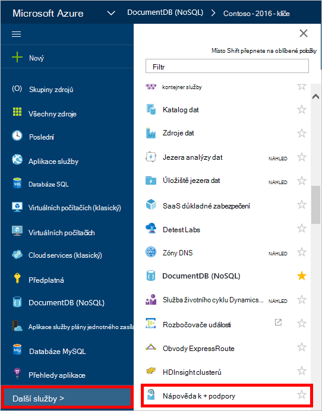

<properties
    pageTitle="Žádost o lepší DocumentDB účtu kvóty | Microsoft Azure"
    description="Zjistěte, jak požádat o úpravu DocumentDB databáze kvóty například ukládání dokumentů a výkon kolekce."
    services="documentdb"
    authors="AndrewHoh"
    manager="jhubbard"
    editor="monicar"
    documentationCenter=""/>

<tags
    ms.service="documentdb"
    ms.workload="data-services"
    ms.tgt_pltfrm="na"
    ms.devlang="na"
    ms.topic="article"
    ms.date="08/25/2016"
    ms.author="anhoh"/>

# Žádost o lepší omezení DocumentDB účtů

[Microsoft Azure DocumentDB](https://azure.microsoft.com/services/documentdb/) obsahuje sady výchozí kvóty, které lze upravovat, kontaktováním podpory Azure.  Tento článek ukazuje, jak požádat o zvýšení kvóty.

Po přečtení v tomto článku si budete moct odpovězte na následující otázky:  

-   Které kvóty databáze DocumentDB lze upravit kontaktováním podpory Azure?
-   Jak můžete požádat o úpravy kvóty účtu DocumentDB?

##DocumentDB účtu kvót

Následující tabulka popisuje DocumentDB kvóty. Kvóty, které obsahují hvězdičku (*) lze upravit kontaktováním Azure podpory:

[AZURE.INCLUDE [azure-documentdb-limits](../../includes/azure-documentdb-limits.md)]

##Žádost o kvóty úprav
Podle těchto kroků ukazují, jak požádat o kvóty úpravy.

1. [Azure portál](https://portal.azure.com)klikněte na **Další služby**a klikněte na **Nápověda + podpory**.

    

2. V zásuvné **nápovědy + podpory** klikněte na **Nová žádost o podporu**.

    

3. V zásuvné **Nová žádost o podporu** klikněte na **základní informace**. Další, nastavte **problému, zadejte** do **kvóty** **předplatné** k vašemu předplatnému, který je hostitelem vaší DocumentDB účtu **kvóty typ** **DocumentDB**a **plán podpory** **kvóty**podpoře – zahrnout. Potom klikněte na **Další**.

    

4. V zásuvné **problém** zvolte o závažnosti a obsahují informace o kvóty zvýšení v **Podrobnosti**. Klikněte na tlačítko **Další**.

    

5. Nakonec zadejte svoje kontaktní informace v zásuvné **kontaktní informace** a klikněte na **vytvořit**.

Po vytvoření požadavek podpory můžete mají dostávat číslo žádost o podporu prostřednictvím e-mailu.  Žádost o podporu můžete taky zobrazit kliknutím **požadavky podpory spravovat** zásuvné **nápovědy + podpory** .

##Další kroky
- Další informace o DocumentDB, klikněte [sem](http://azure.com/docdb).
