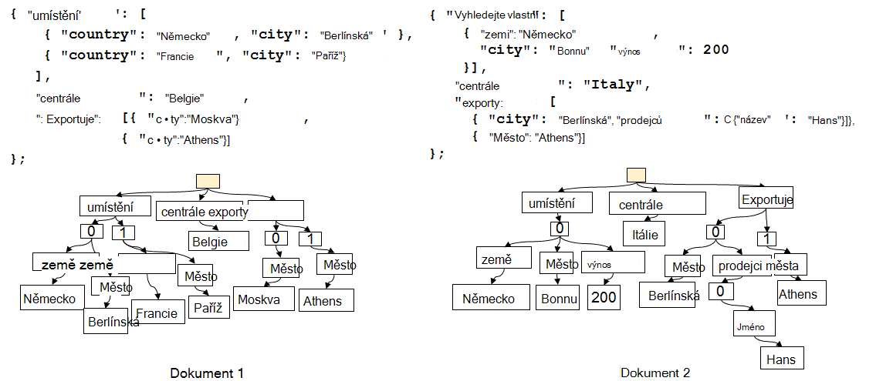
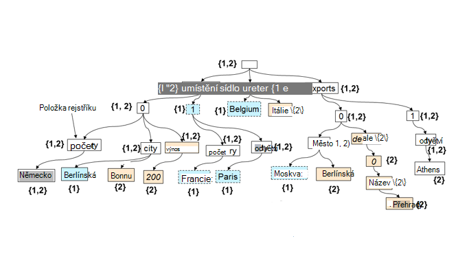

<properties 
    pageTitle="Automatické indexování v DocumentDB | Microsoft Azure" 
    description="Informace o tom, jak automatické indexování funguje v Azure DocumentDB." 
    services="documentdb" 
    authors="arramac" 
    manager="jhubbard" 
    editor="mimig" 
    documentationCenter=""/>

<tags 
    ms.service="documentdb" 
    ms.workload="data-services" 
    ms.tgt_pltfrm="na" 
    ms.devlang="na" 
    ms.topic="article" 
    ms.date="10/27/2016" 
    ms.author="arramac"/>
    
# Automatické indexování v Azure DocumentDB

Tento článek je výňatkem z papír ["bez ohledu na schéma indexování s Azure DocumentDB"](http://www.vldb.org/pvldb/vol8/p1668-shukla.pdf) zobrazí na [41st interní konference velmi velké databáze](http://www.vldb.org/2015/) mezi 31. srpna - 4 září 2015 a je indexování Úvod do jak funguje v Azure DocumentDB. 

Po přečtení to odpoví na následující otázky:

- Jak DocumentDB odvodit schéma z dokumentu JSON?
- Jak DocumentDB vytvářet rejstřík mezi různými dokumenty?
- Jak DocumentDB provádět automatické indexování ve velkém měřítku?

##Jak funguje DocumentDB indexování

[Microsoft Azure DocumentDB](https://azure.microsoft.com/services/documentdb/) je účel true uvolnit schématu databáze vytvořené pro JSON. Nemá očekávat nebo vyžadují schématu nebo vedlejší index definice indexovat data ve velkém měřítku. Můžete rychle definovat a zapracovávat ji do aplikace datové modely pomocí DocumentDB. Při přidávání dokumentů do kolekce DocumentDB tak, aby byly k dispozici a nelze dotazu automaticky indexy všechny vlastnosti dokumentu. Automatické indexování umožňuje ukládat dokumenty patřící do úplně libovolného schémata bez obav, schémat nebo vedlejší indexy.

S cílem eliminuje omezení neshodu mezi databází a modely programování aplikace DocumentDB zneužil jednoduché JSON a chybějící specifikace schéma. Žádné předpokladů o dokumentů a umožňuje otevírat dokumenty v rámci kolekce DocumentDB měnit ve schématu kromě instance určité hodnoty. Na rozdíl od jiných databází dokumentu pracuje na DocumentDB databázový stroj přímo na úrovni JSON gramatiky, která koncepci schématu dokumentu zbývající úkoly a rozostření na hranici mezi hodnoty struktury a instance dokumentů. V zapnout, umožňují ho automaticky indexovat dokumenty, aniž by bylo schématu nebo vedlejší indexy.

Indexování v DocumentDB využívá faktů JSON gramatiky umožňuje otevírat dokumenty být **tvaru stromy**. JSON dokumentu a nelze je jako strom formální kořenový uzel musí vytvořit které parents zbývající skutečné uzlů v dokumentu pod. Každý popisek včetně indexy polí v dokumentu JSON bude uzel stromu. Následující obrázek znázorňuje ukázkový JSON dokument a vyjádření odpovídající stromu.

>[AZURE.NOTE] Protože je s vlastním popisem JSON tedy každý dokument obsahuje schéma (metadata) a data, například `{"locationId": 5, "city": "Moscow"}` zjistí, že jsou dvě vlastnosti `locationId` a `city`, a aby byly řetězec a číselné hodnoty vlastností. DocumentDB je možné odvodit schéma dokumentů a jejich indexovat při byly vloženy nebo jiný nahradil, aniž by bylo dřív k definování schémat nebo vedlejší indexy.

**JSON dokumentů jako stromy:**

Například v předchozím příkladu:

- Vlastnost JSON `{"headquarters": "Belgium"}` vlastnosti ve výše uvedeném příkladu odpovídá cestu/headquarters/Belgie.
- Pole JSON `{"exports": [{"city": “Moscow"}`, `{"city": Athens"}]}` odpovídá cesty `/exports/[]/city/Moscow` a `/exports/[]/city/Athens`.

Automatické indexování (1) každé cestu ve stromové struktuře dokumentu indexováno (pokud vývojář explicitně nakonfiguroval indexování zásad vyloučíte určité vzorce cesta). (2) každé aktualizaci dokumentu do kolekce DocumentDB vede k aktualizaci struktury index (tedy příčiny přidávání nebo odebírání uzlů). Jednu primární požadavky automatické indexování dokumentů je zajistit, aby náklady na index a dotaz dokumentu s konci velký vnořenou strukturu, vyslovte 10 úrovní, je stejná jako ploché JSON dokument obsahující dvojice klíč jenom pro jednu úroveň. Tedy reprezentaci normalizovanou cestu foundation, na kterém jsou sestaveny obou automatické podsystémy indexování a dotazů.

Důležité důsledkem zpracovávání obě hodnoty schématu a instance rovnoměrně z hlediska cesty, je logicky, stejně jako jednotlivé dokumenty, rejstřík dvou dokumentů zobrazenými, která uchovává mapování mezi cesty a ID dokumentu obsahující tato cesta lze znázornit také jako strom. DocumentDB pomocí tuto skutečnost vytváří strom index, který je vytvořen mimo unie všech stromy představující jednotlivé dokumenty v rámci kolekce. Stromu index v kolekcích DocumentDB zvětšuje v čase nové dokumenty získání přidat nebo aktualizovat do kolekce.

**DocumentDB Index jako strom:**

Bez ohledu na právě schématu uvolnit, je DocumentDB SQL a JavaScript dotazu jazyky poskytují relační průzkumy a filtry, hierarchické navigaci různých dokumentů a prostorové operace a vyvolání funkce definované uživatelem napsaný úplně v JavaScriptu. Spuštění dotazu DocumentDB nebude podporovat tyto dotazy vzhledem k tomu můžete pracovat přímo proti tento index stromu znázornění dat.

Výchozí zásady indexování automaticky indexy všechny vlastnosti všechny dokumenty a poskytuje konzistentní dotazů (význam, který synchronní aktualizace indexu zápisu dokumentu). Jak podporuje DocumentDB konzistentní aktualizace stromu index ve velkém měřítku? DocumentDB používá zápisu optimalizované, lock bezplatná a protokolu strukturovanými index údržbu postupů. To znamená, že DocumentDB podporují trvalý objemu rychlé zápisy při pořád poskytování konzistentní dotazů. 

Indexování na DocumentDB slouží efektivity úložiště a zpracovat víceklientská. Náklady účinnosti nároky úložiště na disku indexu je nízké a předvídatelná. Aktualizace rejstříku provádí také v rámci rozpočtu přidělený na DocumentDB kolekce systémové prostředky.

##Další kroky
- Stáhněte si ["bez ohledu na schéma indexování s Azure DocumentDB"](http://www.vldb.org/pvldb/vol8/p1668-shukla.pdf)předávané 41st interní konference velmi velké databáze, 31. srpna - 4 září 2015.
- [Dotaz se DocumentDB SQL](documentdb-sql-query.md)
- Informace o tom, jak přizpůsobit DocumentDB index [tady](documentdb-indexing-policies.md)
 
