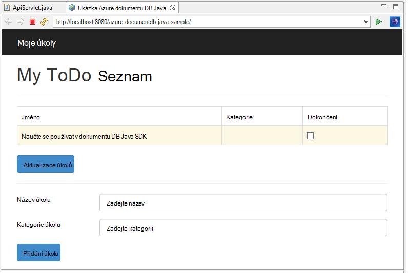
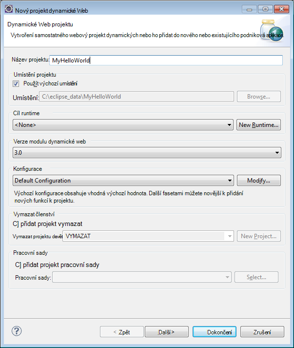
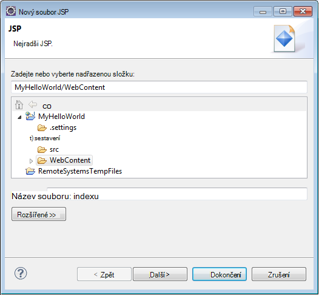
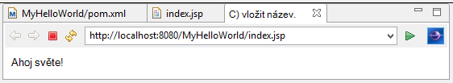
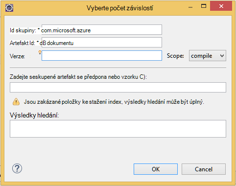

<properties
    pageTitle="Kurz vývoj aplikací Java pomocí DocumentDB | Microsoft Azure"
    description="Tento kurz Java webové aplikace se dozvíte, jak používat službu Azure DocumentDB k ukládání a přístup k datům z aplikace Java hostitelem Azure weby."
    keywords="Vývoj aplikací, databázi, aplikace java, java webové aplikace kurz, documentdb, azure, Microsoft azure"
    services="documentdb"
    documentationCenter="java"
    authors="dennyglee"
    manager="jhubbard"
    editor="mimig"/>

<tags
    ms.service="documentdb"
    ms.devlang="java"
    ms.topic="hero-article"
    ms.tgt_pltfrm="NA"
    ms.workload="data-services"
    ms.date="08/24/2016"
    ms.author="denlee"/>

# Vytvoření webové aplikace Java pomocí DocumentDB

> [AZURE.SELECTOR]
- [.NET](documentdb-dotnet-application.md)
- [Node.js](documentdb-nodejs-application.md)
- [Java](documentdb-java-application.md)
- [Python](documentdb-python-application.md)

Tento kurz Java webové aplikace se dozvíte, jak používat službu [Microsoft Azure DocumentDB](https://portal.azure.com/#gallery/Microsoft.DocumentDB) k ukládání a přístup k datům z aplikace Java hostitelem Azure weby. V tomto tématu se dozvíte:

- Jak vytvořit základní JSP aplikaci zatmění.
- Jak pracovat se službou Azure DocumentDB prostřednictvím [DocumentDB Java SDK](https://github.com/Azure/azure-documentdb-java).

Tento kurz aplikace Java znázorňuje vytvoření aplikace založené na web – Správa úkolů, který umožňuje vytvořit, načíst a označit jako dokončené úkoly, jak je znázorněno na následujícím obrázku. Všechny úkoly v seznamu úkol uložená jako JSON dokumentů v Azure DocumentDB.

> [AZURE.TIP] Tento kurz vývoj aplikací předpokládá, že máte zkušenosti pomocí jazyka Java. Pokud začínáte Java nebo [základní nástroje](#Prerequisites), doporučujeme stahování GitHub dokončení [úkol](https://github.com/Azure-Samples/documentdb-java-todo-app) projektu a vytvářením postupujte [podle](#GetProject)pokynů na konci tohoto článku. Až budete mít ho integrované, si můžete prohlédnout v článku získání přehledu o na kód v rámci projektu.  

##Požadavky na tento kurz Java webové aplikace
Před zahájením tohoto kurzu vývoj aplikací, musíte mít takto:

- Účet Azure active. Pokud nemáte účet, můžete vytvořit bezplatný účet zkušební v jenom pár minut. Podrobnosti najdete v tématu [Bezplatnou zkušební verzi Azure](https://azure.microsoft.com/pricing/free-trial/).
- [Java Development Kit (JDK) 7 +](http://www.oracle.com/technetwork/java/javase/downloads/index.html).
- [Zatmění integrovaném vývojovém prostředí pro vývojáře í Java.](http://www.eclipse.org/downloads/packages/eclipse-ide-java-ee-developers/lunasr1)
- [Web Azure pomocí jazyka Java runtime prostředí (například Tomcat nebo molo) povolené.](../app-service-web/web-sites-java-get-started.md)

Pokud instalujete těchto nástrojích poprvé, coreservlets.com poskytuje walk-through proces instalace v části úvodní jejich [kurz: instalace TomCat7 a jeho použití zatmění](http://www.coreservlets.com/Apache-Tomcat-Tutorial/tomcat-7-with-eclipse.html) článek.

##Krok 1: Vytvoření účtu DocumentDB databáze

Začneme tím, že vytvoření účtu DocumentDB. Pokud už máte nastavený účet, můžete přejít ke [Krok 2: vytvoření aplikace Java JSP](#CreateJSP).

[AZURE.INCLUDE [documentdb-create-dbaccount](../../includes/documentdb-create-dbaccount.md)]

[AZURE.INCLUDE [documentdb-keys](../../includes/documentdb-keys.md)]

##Krok 2: Vytvoření aplikace Java JSP

Vytvoření aplikace JSP:

1. Nejdřív budete začneme vytvořením Java projektu. Spusťte zatmění, a pak klikněte na **soubor**, klikněte na **Nový**a klepněte **Dynamické Web projektu**. Pokud nevidíte **Dynamické Web projektu** uvedené jako k dispozici projektového plánu, postupujte takto: klikněte na **soubor**, klikněte na **Nový**, klikněte na **projekt**…, rozbalte **Web**, **Dynamické Web projektu**a na tlačítko **Další**.

    

2. Zadejte název projektu do pole **název projektu** a v rozevírací nabídce **Runtime cílové** , pokud chcete vybrat hodnotu (například Apache Tomcat 7.0) a klikněte na tlačítko **Dokončit**. Výběr cílového runtime umožňuje místně projít zatmění projektu.
3. V části zatmění v zobrazení Průzkumník projektu rozbalte projektu. Klikněte pravým tlačítkem na **obsah webu**, klikněte na **Nový**a potom klikněte na **Soubor JSP**.
4. V dialogovém okně **Nový soubor JSP** zadejte název souboru **index.jsp**. Zachovat nadřazenou složku jako **obsah webu**, jak je znázorněno na následujícím obrázku a klikněte na tlačítko **Další**.

    

5. V dialogovém okně **Vybrat šablonu JSP** pro účely tohoto kurzu vyberte **Nový soubor JSP (html)**a potom klikněte na **Dokončit**.

6. Při otevření souboru index.jsp v zatmění, přidání textu k zobrazení **Vítáme!** ve stávající <body> prvek. Vaše aktualizované <body> obsah by měl vypadat následovně:

        <body>
            <% out.println("Hello World!"); %>
        </body>

8. Uložte soubor index.jsp.
9. Pokud jste nastavili cílové runtime v kroku 2, můžete kliknout na **projektu** a potom **Spustit** spusťte aplikaci JSP místně:

    

##Krok 3: Instalace DocumentDB Java SDK ##

Nejjednodušší způsob, jak získat DocumentDB Java SDK a závislými je prostřednictvím [Apache Maven](http://maven.apache.org/).

K tomuto účelu budete potřebovat k převodu projektu do projektu maven podle těchto kroků:

1. Klikněte pravým tlačítkem na projektu v okně Průzkumník projektu, klikněte na **Konfigurovat**, klikněte na **převést na Maven projektu**.
2. V okně **vytvořit nový POM** přijměte výchozí nastavení a klikněte na tlačítko **Dokončit**.
3. V programu **Průzkumník projektu**otevřete soubor pom.xml.
4. Na kartě **závislosti** v podokně **závislosti** klikněte na **Přidat**.
4. V okně **Vyberte závislost** postupujte takto:
 - V dialogovém okně **skupiny** zadejte com.microsoft.azure.
 - Do pole **Id artefaktů** zadejte azure documentdb.
 - Do pole **verze** zadejte 1.5.1.

    

    Nebo můžete přidat závislost XML pro skupiny a ArtifactId přímo do pom.xml prostřednictvím textovém editoru:

        <dependency>
            <groupId>com.microsoft.azure</groupId>
            <artifactId>azure-documentdb</artifactId>
            <version>1.5.1</version>
        </dependency>

5. Klikněte na **Ok** a Maven nainstaluje DocumentDB Java SDK.
6. Uložte soubor pom.xml.

##Krok 4: Pomocí služby DocumentDB v aplikaci Java

1. Nejdřív Pojďme definovat TodoItem objektu:

        @Data
        @Builder
        public class TodoItem {
            private String category;
            private boolean complete;
            private String id;
            private String name;
        }

    V tomto projektu používáme [Projektu Lombok](http://projectlombok.org/) generovat konstruktoru, mechanismy získání, nastavení a tvůrce. Můžete taky můžete napsat tento kód ručně nebo mají integrovaném vývojovém prostředí vygenerovat.

2. Vyvolat službu DocumentDB, musíte vytvořit instanci nové **DocumentClient**. Obecně doporučujeme znovu použít **DocumentClient** - než vytvořit nového klienta pro každý požadavek na pozdější. Jsme můžete znovu použít klienta obtékání klienta v **DocumentClientFactory**. To je také potřebujete-li vložit hodnoty URI a primární klíč, které jste uložili do schránky v [kroku 1](#CreateDB). Nahrazení [svoje\_koncový bod\_TADY] s URI a nahradit [svoje\_klíč\_TADY] se vaše primární klíč.

        private static final String HOST = "[YOUR_ENDPOINT_HERE]";
        private static final String MASTER_KEY = "[YOUR_KEY_HERE]";

        private static DocumentClient documentClient;

        public static DocumentClient getDocumentClient() {
            if (documentClient == null) {
                documentClient = new DocumentClient(HOST, MASTER_KEY,
                        ConnectionPolicy.GetDefault(), ConsistencyLevel.Session);
            }

            return documentClient;
        }

3. Teď Pojďme vytvořit objekt DAO (Data Access) abstraktní uchování naše úkol položky DocumentDB.

    Za účelem uložení položek úkol ke kolekci, klienta znát které databáze a kolekce uchovávat k (se odkazuje vlastním odkazů). Obecně doporučujeme do mezipaměti shromažďování Pokud je to možné, abyste se vyhnuli další opakované k databázi a databáze.

    Následující kód ukazuje, jak načíst naši stránku věnovanou databáze a kolekce, pokud existuje, nebo vytvořte nový účet, pokud ho neexistuje:

        public class DocDbDao implements TodoDao {
            // The name of our database.
            private static final String DATABASE_ID = "TodoDB";

            // The name of our collection.
            private static final String COLLECTION_ID = "TodoCollection";

            // The DocumentDB Client
            private static DocumentClient documentClient = DocumentClientFactory
                    .getDocumentClient();

            // Cache for the database object, so we don't have to query for it to
            // retrieve self links.
            private static Database databaseCache;

            // Cache for the collection object, so we don't have to query for it to
            // retrieve self links.
            private static DocumentCollection collectionCache;

            private Database getTodoDatabase() {
                if (databaseCache == null) {
                    // Get the database if it exists
                    List<Database> databaseList = documentClient
                            .queryDatabases(
                                    "SELECT * FROM root r WHERE r.id='" + DATABASE_ID
                                            + "'", null).getQueryIterable().toList();

                    if (databaseList.size() > 0) {
                        // Cache the database object so we won't have to query for it
                        // later to retrieve the selfLink.
                        databaseCache = databaseList.get(0);
                    } else {
                        // Create the database if it doesn't exist.
                        try {
                            Database databaseDefinition = new Database();
                            databaseDefinition.setId(DATABASE_ID);

                            databaseCache = documentClient.createDatabase(
                                    databaseDefinition, null).getResource();
                        } catch (DocumentClientException e) {
                            // TODO: Something has gone terribly wrong - the app wasn't
                            // able to query or create the collection.
                            // Verify your connection, endpoint, and key.
                            e.printStackTrace();
                        }
                    }
                }

                return databaseCache;
            }

            private DocumentCollection getTodoCollection() {
                if (collectionCache == null) {
                    // Get the collection if it exists.
                    List<DocumentCollection> collectionList = documentClient
                            .queryCollections(
                                    getTodoDatabase().getSelfLink(),
                                    "SELECT * FROM root r WHERE r.id='" + COLLECTION_ID
                                            + "'", null).getQueryIterable().toList();

                    if (collectionList.size() > 0) {
                        // Cache the collection object so we won't have to query for it
                        // later to retrieve the selfLink.
                        collectionCache = collectionList.get(0);
                    } else {
                        // Create the collection if it doesn't exist.
                        try {
                            DocumentCollection collectionDefinition = new DocumentCollection();
                            collectionDefinition.setId(COLLECTION_ID);

                            collectionCache = documentClient.createCollection(
                                    getTodoDatabase().getSelfLink(),
                                    collectionDefinition, null).getResource();
                        } catch (DocumentClientException e) {
                            // TODO: Something has gone terribly wrong - the app wasn't
                            // able to query or create the collection.
                            // Verify your connection, endpoint, and key.
                            e.printStackTrace();
                        }
                    }
                }

                return collectionCache;
            }
        }

4. Dalším krokem je některé kódu pro zachování TodoItems v kolekci. V tomto příkladu použijeme [Gson](https://code.google.com/p/google-gson/) serializovat a k dokumentům JSON deserializovat TodoItem jednoduchým staré Java objektů (POJOs). Skvělé alternativy serializaci POJOs lze také [Jacksonova](http://jackson.codehaus.org/) nebo vlastní vlastní serializer.

        // We'll use Gson for POJO <=> JSON serialization for this example.
        private static Gson gson = new Gson();

        @Override
        public TodoItem createTodoItem(TodoItem todoItem) {
            // Serialize the TodoItem as a JSON Document.
            Document todoItemDocument = new Document(gson.toJson(todoItem));

            // Annotate the document as a TodoItem for retrieval (so that we can
            // store multiple entity types in the collection).
            todoItemDocument.set("entityType", "todoItem");

            try {
                // Persist the document using the DocumentClient.
                todoItemDocument = documentClient.createDocument(
                        getTodoCollection().getSelfLink(), todoItemDocument, null,
                        false).getResource();
            } catch (DocumentClientException e) {
                e.printStackTrace();
                return null;
            }

            return gson.fromJson(todoItemDocument.toString(), TodoItem.class);
        }

5. Jako DocumentDB databází a kolekcích taky odkazují dokumenty ve vlastním odkazy. Následující funkce Pomocník umožňuje nám načíst dokumentů tak, že jiný atribut (například "id"), spíše než vlastním odkaz:

        private Document getDocumentById(String id) {
            // Retrieve the document using the DocumentClient.
            List<Document> documentList = documentClient
                    .queryDocuments(getTodoCollection().getSelfLink(),
                            "SELECT * FROM root r WHERE r.id='" + id + "'", null)
                    .getQueryIterable().toList();

            if (documentList.size() > 0) {
                return documentList.get(0);
            } else {
                return null;
            }
        }

6. Metoda helper můžete používáme k načtení dokumentu TodoItem JSON podle id a potom deserializovat POJO v kroku 5:

        @Override
        public TodoItem readTodoItem(String id) {
            // Retrieve the document by id using our helper method.
            Document todoItemDocument = getDocumentById(id);

            if (todoItemDocument != null) {
                // De-serialize the document in to a TodoItem.
                return gson.fromJson(todoItemDocument.toString(), TodoItem.class);
            } else {
                return null;
            }
        }

7. Můžete taky používáme DocumentClient kolekce nebo seznam TodoItems pomocí DocumentDB SQL:

        @Override
        public List<TodoItem> readTodoItems() {
            List<TodoItem> todoItems = new ArrayList<TodoItem>();

            // Retrieve the TodoItem documents
            List<Document> documentList = documentClient
                    .queryDocuments(getTodoCollection().getSelfLink(),
                            "SELECT * FROM root r WHERE r.entityType = 'todoItem'",
                            null).getQueryIterable().toList();

            // De-serialize the documents in to TodoItems.
            for (Document todoItemDocument : documentList) {
                todoItems.add(gson.fromJson(todoItemDocument.toString(),
                        TodoItem.class));
            }

            return todoItems;
        }

8. K aktualizaci dokumentu DocumentClient mnoha různými způsoby. V seznamu naše úkol aplikace chceme, aby mohla určí, zda TodoItem dokončení. Toho můžete dosáhnout aktualizací atribut "dokončení" v rámci dokumentu:

        @Override
        public TodoItem updateTodoItem(String id, boolean isComplete) {
            // Retrieve the document from the database
            Document todoItemDocument = getDocumentById(id);

            // You can update the document as a JSON document directly.
            // For more complex operations - you could de-serialize the document in
            // to a POJO, update the POJO, and then re-serialize the POJO back in to
            // a document.
            todoItemDocument.set("complete", isComplete);

            try {
                // Persist/replace the updated document.
                todoItemDocument = documentClient.replaceDocument(todoItemDocument,
                        null).getResource();
            } catch (DocumentClientException e) {
                e.printStackTrace();
                return null;
            }

            return gson.fromJson(todoItemDocument.toString(), TodoItem.class);
        }

9. Nakonec chceme možnost odstranit TodoItem z našeho seznamu. K tomuto účelu používáme helper metody, kterou jsme napsali dříve načíst automatické propojení a sdělte klienta a vymažete ho:

        @Override
        public boolean deleteTodoItem(String id) {
            // DocumentDB refers to documents by self link rather than id.

            // Query for the document to retrieve the self link.
            Document todoItemDocument = getDocumentById(id);

            try {
                // Delete the document by self link.
                documentClient.deleteDocument(todoItemDocument.getSelfLink(), null);
            } catch (DocumentClientException e) {
                e.printStackTrace();
                return false;
            }

            return true;
        }

##Krok 5: Vedení zbytek Java vývoj projektu společně

Teď můžeme mít zábavy dělí – všechny vlevo je snadné uživatele rozhraní a drátu až naše DAO.

1. Nejdřív Začněme s vytvářením řadiči volání naše DAO:

        public class TodoItemController {
            public static TodoItemController getInstance() {
                if (todoItemController == null) {
                    todoItemController = new TodoItemController(TodoDaoFactory.getDao());
                }
                return todoItemController;
            }

            private static TodoItemController todoItemController;

            private final TodoDao todoDao;

            TodoItemController(TodoDao todoDao) {
                this.todoDao = todoDao;
            }

            public TodoItem createTodoItem(@NonNull String name,
                    @NonNull String category, boolean isComplete) {
                TodoItem todoItem = TodoItem.builder().name(name).category(category)
                        .complete(isComplete).build();
                return todoDao.createTodoItem(todoItem);
            }

            public boolean deleteTodoItem(@NonNull String id) {
                return todoDao.deleteTodoItem(id);
            }

            public TodoItem getTodoItemById(@NonNull String id) {
                return todoDao.readTodoItem(id);
            }

            public List<TodoItem> getTodoItems() {
                return todoDao.readTodoItems();
            }

            public TodoItem updateTodoItem(@NonNull String id, boolean isComplete) {
                return todoDao.updateTodoItem(id, isComplete);
            }
        }

    Do aplikace složitější správce hledejte složité obchodní logiky nad DAO.

2. Dále vytvoříme servlet ke směrování HTTP požadavků správce:

        public class TodoServlet extends HttpServlet {
            // API Keys
            public static final String API_METHOD = "method";

            // API Methods
            public static final String CREATE_TODO_ITEM = "createTodoItem";
            public static final String GET_TODO_ITEMS = "getTodoItems";
            public static final String UPDATE_TODO_ITEM = "updateTodoItem";

            // API Parameters
            public static final String TODO_ITEM_ID = "todoItemId";
            public static final String TODO_ITEM_NAME = "todoItemName";
            public static final String TODO_ITEM_CATEGORY = "todoItemCategory";
            public static final String TODO_ITEM_COMPLETE = "todoItemComplete";

            public static final String MESSAGE_ERROR_INVALID_METHOD = "{'error': 'Invalid method'}";

            private static final long serialVersionUID = 1L;
            private static final Gson gson = new Gson();

            @Override
            protected void doGet(HttpServletRequest request,
                    HttpServletResponse response) throws ServletException, IOException {

                String apiResponse = MESSAGE_ERROR_INVALID_METHOD;

                TodoItemController todoItemController = TodoItemController
                        .getInstance();

                String id = request.getParameter(TODO_ITEM_ID);
                String name = request.getParameter(TODO_ITEM_NAME);
                String category = request.getParameter(TODO_ITEM_CATEGORY);
                boolean isComplete = StringUtils.equalsIgnoreCase("true",
                        request.getParameter(TODO_ITEM_COMPLETE)) ? true : false;

                switch (request.getParameter(API_METHOD)) {
                case CREATE_TODO_ITEM:
                    apiResponse = gson.toJson(todoItemController.createTodoItem(name,
                            category, isComplete));
                    break;
                case GET_TODO_ITEMS:
                    apiResponse = gson.toJson(todoItemController.getTodoItems());
                    break;
                case UPDATE_TODO_ITEM:
                    apiResponse = gson.toJson(todoItemController.updateTodoItem(id,
                            isComplete));
                    break;
                default:
                    break;
                }

                response.getWriter().println(apiResponse);
            }

            @Override
            protected void doPost(HttpServletRequest request,
                    HttpServletResponse response) throws ServletException, IOException {
                doGet(request, response);
            }
        }

3. Budeme potřebovat uživatelské rozhraní webu pro zobrazení uživateli. Pojďme znovu zápisy index.jsp že jsme vytvořili:

        <html>
        <head>
          <meta http-equiv="Content-Type" content="text/html; charset=ISO-8859-1">
          <meta http-equiv="X-UA-Compatible" content="IE=edge;" />
          <title>Azure DocumentDB Java Sample</title>

          <!-- Bootstrap -->
          <link href="//ajax.aspnetcdn.com/ajax/bootstrap/3.2.0/css/bootstrap.min.css" rel="stylesheet">

          
        </head>
        <body>
          <!-- Nav Bar -->
          

            

              

                <a class="navbar-brand" href="#">My Tasks</a>
              

            

          

          <!-- Body -->
          

            <h1>My ToDo List</h1>

            

            <!-- The ToDo List -->
            

              <table class="table table-bordered table-striped" id="todoItems">
                <thead>
                  <tr>
                    <th>Name</th>
                    <th>Category</th>
                    <th>Complete</th>
                  </tr>
                </thead>
                <tbody>
                </tbody>
              </table>

              <!-- Update Button -->
              

                <form class="form-horizontal" role="form">
                  <button type="button" class="btn btn-primary">Update Tasks</button>
                </form>
              

            

            

            <!-- Item Input Form -->
            

              <form class="form-horizontal" role="form">
                

                  <label for="inputItemName" class="col-sm-2">Task Name</label>
                  

                    <input type="text" class="form-control" id="inputItemName" placeholder="Enter name">
                  

                

                

                  <label for="inputItemCategory" class="col-sm-2">Task Category</label>
                  

                    <input type="text" class="form-control" id="inputItemCategory" placeholder="Enter category">
                  

                

                <button type="button" class="btn btn-primary">Add Task</button>
              </form>
            

          

          <!-- Placed at the end of the document so the pages load faster -->
          
          
          
        </body>
        </html>

4. A nakonec zápis některé JavaScriptu klientských shromáždit uživatelské rozhraní webu a servlet:

        var todoApp = {
          /*
           * API methods to call Java backend.
           */
          apiEndpoint: "api",

          createTodoItem: function(name, category, isComplete) {
            $.post(todoApp.apiEndpoint, {
                "method": "createTodoItem",
                "todoItemName": name,
                "todoItemCategory": category,
                "todoItemComplete": isComplete
              },
              function(data) {
                var todoItem = data;
                todoApp.addTodoItemToTable(todoItem.id, todoItem.name, todoItem.category, todoItem.complete);
              },
              "json");
          },

          getTodoItems: function() {
            $.post(todoApp.apiEndpoint, {
                "method": "getTodoItems"
              },
              function(data) {
                var todoItemArr = data;
                $.each(todoItemArr, function(index, value) {
                  todoApp.addTodoItemToTable(value.id, value.name, value.category, value.complete);
                });
              },
              "json");
          },

          updateTodoItem: function(id, isComplete) {
            $.post(todoApp.apiEndpoint, {
                "method": "updateTodoItem",
                "todoItemId": id,
                "todoItemComplete": isComplete
              },
              function(data) {},
              "json");
          },

          /*
           * UI Methods
           */
          addTodoItemToTable: function(id, name, category, isComplete) {
            var rowColor = isComplete ? "active" : "warning";

            todoApp.ui_table().append($("<tr>")
              .append($("<td>").text(name))
              .append($("<td>").text(category))
              .append($("<td>")
                .append($("<input>")
                  .attr("type", "checkbox")
                  .attr("id", id)
                  .attr("checked", isComplete)
                  .attr("class", "isComplete")
                ))
              .addClass(rowColor)
            );
          },

          /*
           * UI Bindings
           */
          bindCreateButton: function() {
            todoApp.ui_createButton().click(function() {
              todoApp.createTodoItem(todoApp.ui_createNameInput().val(), todoApp.ui_createCategoryInput().val(), false);
              todoApp.ui_createNameInput().val("");
              todoApp.ui_createCategoryInput().val("");
            });
          },

          bindUpdateButton: function() {
            todoApp.ui_updateButton().click(function() {
              // Disable button temporarily.
              var myButton = $(this);
              var originalText = myButton.text();
              $(this).text("Updating...");
              $(this).prop("disabled", true);

              // Call api to update todo items.
              $.each(todoApp.ui_updateId(), function(index, value) {
                todoApp.updateTodoItem(value.name, value.value);
                $(value).remove();
              });

              // Re-enable button.
              setTimeout(function() {
                myButton.prop("disabled", false);
                myButton.text(originalText);
              }, 500);
            });
          },

          bindUpdateCheckboxes: function() {
            todoApp.ui_table().on("click", ".isComplete", function(event) {
              var checkboxElement = $(event.currentTarget);
              var rowElement = $(event.currentTarget).parents('tr');
              var id = checkboxElement.attr('id');
              var isComplete = checkboxElement.is(':checked');

              // Toggle table row color
              if (isComplete) {
                rowElement.addClass("active");
                rowElement.removeClass("warning");
              } else {
                rowElement.removeClass("active");
                rowElement.addClass("warning");
              }

              // Update hidden inputs for update panel.
              todoApp.ui_updateForm().children("input[name='" + id + "']").remove();

              todoApp.ui_updateForm().append($("<input>")
                .attr("type", "hidden")
                .attr("class", "updateComplete")
                .attr("name", id)
                .attr("value", isComplete));

            });
          },

          /*
           * UI Elements
           */
          ui_createNameInput: function() {
            return $(".todoForm #inputItemName");
          },

          ui_createCategoryInput: function() {
            return $(".todoForm #inputItemCategory");
          },

          ui_createButton: function() {
            return $(".todoForm button");
          },

          ui_table: function() {
            return $(".todoList table tbody");
          },

          ui_updateButton: function() {
            return $(".todoUpdatePanel button");
          },

          ui_updateForm: function() {
            return $(".todoUpdatePanel form");
          },

          ui_updateId: function() {
            return $(".todoUpdatePanel .updateComplete");
          },

          /*
           * Install the TodoApp
           */
          install: function() {
            todoApp.bindCreateButton();
            todoApp.bindUpdateButton();
            todoApp.bindUpdateCheckboxes();

            todoApp.getTodoItems();
          }
        };

        $(document).ready(function() {
          todoApp.install();
        });

5. Děs! Teď, který ještě zbývá stačí testování aplikace. Spusťte aplikaci místně a přidejte některé položky úkol vyplněním název položky a kategorií a kliknutím na **Přidat úkol**.

6. Jakmile se zobrazí na položku, můžete aktualizovat ať už jde dokončení přepínání zaškrtávacího políčka a kliknete na **Aktualizovat úkoly**.

##Krok 6: Nasazení aplikace Java k webům Azure

Nasazení aplikace Java jednoduchá – stačí Export aplikace jako soubor WAR a buď nahrávání prostřednictvím ovládacího prvku zdroje (například Libovolná) díky Azure weby nebo FTP.

1. Chcete-li exportovat aplikace jako WAR klikněte pravým tlačítkem myši na projektu v **Aplikaci Project Explorer**, klikněte na **Exportovat**a pak klikněte na **Soubor WAR**.
2. V okně **Exportovat WAR** postupujte takto:
 - Do pole Web projektu zadejte azure documentdb java vzorku.
 - V dialogovém okně cíl volba cíle WAR soubor uložit.
 - Klikněte na **Dokončit**.

3. Teď máte otevřený soubor WAR v ruce, můžete jednoduše ho nahrát do adresáře webu Azure **webapps** . Pokyny pro uložení souboru najdete v článku [Přidání aplikace na web Java na Azure](../app-service-web/web-sites-java-add-app.md).

    Po nahrání souboru WAR k adresáři webapps prostředí runtime zjistí, kterou jste přidali a bude automaticky načíst.
4. Zobrazit dokončené produkt, přejděte na http://YOUR\_webu\_NAME.azurewebsites.net/azure-documentdb-java-sample/ a začněte přidávání úkolů!

##Získání projektu z GitHub

Všechny vzorky v tomto kurzu jsou součástí [úkol](https://github.com/Azure-Samples/documentdb-java-todo-app) projektu na GitHub. Naimportujte zatmění úkol projektu, ověřte, zda že mají software a zdroje uvedené v oddílu [požadavky](#Prerequisites) a pak postupujte takto:

1. Nainstalujte [Lombok projektu](http://projectlombok.org/). Lombok bude použito k vygenerování konstruktory, mechanismy získání, nastavení v projektu. Po stažení souboru lombok.jar dvojitým kliknutím ji nainstalujte ji nebo ji nainstalovat z příkazového řádku.
2. Pokud zatmění se otevře, zavřete a restartujte ji načíst Lombok.
3. V zatmění v nabídce **soubor** klikněte na **importovat**.
4. V okně **importovat** klikněte na **Libovolná**, klikněte na **projekty z libovolná**a klikněte na tlačítko **Další**.
5. V dialogovém okně **Vybrat zdroj úložiště** klikněte na **Klonovat URI**.
6. Na obrazovce **Úložiště libovolná zdrojů** v dialogovém okně **URI** zadejte https://github.com/Azure-Samples/documentdb-java-todo-app.git a klikněte na tlačítko **Další**.
7. V dialogovém okně **Výběr větev** zajistit, aby tento **předlohy** zaškrtnuté a klikněte na tlačítko **Další**.
8. V dialogovém okně **Místní cíl** klikněte na **Procházet** a vyberte složku, kam úložiště můžete zkopírovat a klikněte na tlačítko **Další**.
9. Na obrazovce **Vyberte průvodce pro účely importu projekty** zajistit **importovat existující projekty** zaškrtnuté a klikněte na tlačítko **Další**.
10. V dialogovém okně **Importovat projekty** zrušení výběru **DocumentDB** projektu a klikněte na tlačítko **Dokončit**. Projekt DocumentDB obsahuje DocumentDB Java SDK, která přidáme jako závislostí místo.
11. V programu **Průzkumník projektu**přejděte na azure-documentdb-java-sample\src\com.microsoft.azure.documentdb.sample.dao\DocumentClientFactory.java a nahradit hodnoty Host (hostitel) a MASTER_KEY URI a primární klíč účtu DocumentDB a potom soubor uložte. Další informace najdete v tématu [Krok 1. Vytvoření účtu databáze DocumentDB](#CreateDB).
12. V programu **Průzkumník projektu**klikněte pravým tlačítkem myši **azure documentdb java výběry**a **Cesta k vytvoření**klikněte na **Konfigurovat sestavit cestu**.
13. Na obrazovce **Java sestavit cesta** v pravém podokně vyberte kartu **knihovny** a potom klikněte na **Přidat externí JARs**. **Přejděte do umístění souboru lombok.jar a klikněte na tlačítko **Otevřít**.**
14. Pomocí kroku 12 znovu otevřete okno **Vlastnosti** a pak v levém podokně klikněte na **Určené Runtimes**.
15. **Na obrazovce **Určené Runtimes** klikněte na **Nový**a vyberte **Apache Tomcat 7.0**.**
16. Pomocí kroku 12 znovu otevřete okno **Vlastnosti** a pak v levém podokně klikněte na **Projekt fasetami**.
17. Na obrazovce **Fasetami projektu** vyberte **Dynamické webový modul** a **Java**a klikněte na tlačítko **OK**.
18. Na kartě **servery** v dolní části obrazovky klikněte pravým tlačítkem **Tomcat 7.0 serveru localhost** a potom klikněte na **Přidat a odebrat**.
19. V okně **Přidání a odebrání** přechod **azure documentdb java výběry** **nakonfigurováno** pole a klikněte na tlačítko **Dokončit**.
20. Na kartě **Server** klikněte pravým tlačítkem **Tomcat 7.0 serveru localhost**a potom klikněte na **Restartovat**.
21. V prohlížeči přejděte na http://localhost:8080/azure-documentdb-java – ukázka / a začněte přidávat do seznamu úkolů. Všimněte si, že pokud jste změnili výchozí port hodnoty, přejděte 8080 hodnotu, kterou jste vybrali.
22. Abyste mohli nasadit projektu k webovému serveru Azure, najdete v článku [kroku 6. Nasazení aplikace na weby Azure](#Deploy).

[1]: media/documentdb-java-application/keys.png
