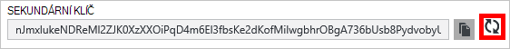

<properties
    pageTitle="Spravovat účet DocumentDB prostřednictvím portálu Azure | Microsoft Azure"
    description="Naučte se spravovat svůj účet DocumentDB prostřednictvím portálu Azure. Najděte vodítko na portálu Azure zobrazení, kopírování, odstranění a přístup k účtům."
    keywords="Azure portál documentdb, azure, Microsoft azure"
    services="documentdb"
    documentationCenter=""
    authors="kirillg"
    manager="jhubbard"
    editor="cgronlun"/>

<tags
    ms.service="documentdb"
    ms.workload="data-services"
    ms.tgt_pltfrm="na"
    ms.devlang="na"
    ms.topic="article"
    ms.date="10/14/2016"
    ms.author="kirillg"/>

# Jak spravovat účet DocumentDB

Zjistěte, jak se dají globální konzistence, pracovat s klávesami a odstranění DocumentDB účtu na portálu Azure.

## Správa nastavení konzistence DocumentDB

Výběr správné konzistence úrovně závisí na sémantiku aplikace. Byste si měli přečíst s úrovně dostupné konzistence v DocumentDB v tématu [použití konzistence úrovně maximalizovat dostupnost a výkon DocumentDB] [consistency]. DocumentDB poskytuje konzistence dostupnost a výkonu záruky na každé úrovni konzistence pro váš účet databáze dostupná. Konfigurace účtu databáze s konzistence úrovní silné vyžaduje, aby vaše data uzavřeného do jednoho Azure oblasti a globálně není k dispozici. Na druhé straně, úrovně naleznete konzistence - ohraničenou staleness, relace nebo případné povolit můžete přiřadit libovolný počet Azure oblastí pomocí svého účtu databáze. Jednoduchý takto ukazují, jak chcete-li vybrat výchozí úroveň konzistence pro váš účet databáze. 

### Chcete-li zadat výchozí konzistenci DocumentDB účtu

1. [Azure portál](https://portal.azure.com/)přístup ke svému účtu DocumentDB.
2. V zásuvné účtu klikněte na **výchozí konzistence**.
3. **Výchozí konzistence** zásuvné vyberte novou úroveň konzistenci a na tlačítko **Uložit**.
    ![Výchozí konzistence relace][5]

## Zobrazení, kopírovat a obnovit přístupových kláves
Při vytváření účtu DocumentDB službu vygeneruje dva hlavní přístupové klávesy, které mohou sloužit k ověření při přístupu k účtu DocumentDB. Zadáním dvou přístupových kláves z verze DocumentDB vám umožní obnovit klávesy bez přerušení ke svému účtu DocumentDB. 

[Azure portál](https://portal.azure.com/)získat přístup z nabídky zdroje na zásuvné **DocumentDB účet** zobrazit, kopírovat a obnovit přístupové klávesy, které se používají pro přístup k účtu DocumentDB zásuvné **klíče** .

> [AZURE.NOTE] **Klávesy** zásuvné obsahuje taky primárních a sekundárních připojovací řetězec, které mohou sloužit k připojení ke svému účtu z [Nástroje pro migraci dat](documentdb-import-data.md).

Jen pro čtení klávesy slouží také k dispozici v tomto zásuvné. Čtení a dotazy jsou určené jen pro čtení operace při vytvoří, odstraníte, a slouží k nahrazení nejsou.

### Zkopírujte přístupové klávesy na portálu Azure

Na zásuvné **klávesy** klikněte na tlačítko **Kopírovat** napravo od klíč, který chcete zkopírovat.

### Obnovit přístupových kláves

Měli byste změnit přístupových kláves ke svému účtu DocumentDB pravidelně, aby lépe zabezpečit připojení. Dva přístupových kláves z verze přiřazené vám umožní zachovat připojení k účtu DocumentDB pomocí jednoho přístupové klávesy, zatímco obnovit přístupové klávesy.

> [AZURE.WARNING] Obnovení přístupové klávesy vliv na všechny aplikace, které jsou závislé na aktuální klávesy. Všechny klienty využívající přístupová klávesa pro přístup k účtu DocumentDB musí být aktualizovány pomocí nového klíče.

Pokud máte aplikace nebo služby cloudu pomocí účtu DocumentDB, můžete dojde ke ztrátě připojení obnovit klávesy, pokud vrátit klíče. Následující kroky popisují proces zahrnutý v postupných klíče.

1. Aktualizujte přístupová klávesa v kódu aplikace neodkazuje sekundární přístupová klávesa DocumentDB účtu.
2. Obnovit primární přístupová klávesa pro váš účet DocumentDB. Na [Portálu Azure](https://portal.azure.com/)přístup ke svému účtu DocumentDB.
3. V zásuvné **DocumentDB účtu** klikněte na **klíče**.
4. Na zásuvné **klávesy** klikněte na tlačítko regenerovat a potom klikněte na **Ok** potvrďte, že chcete generovat nový klíč.
    

5. Po ověření, že není k dispozici pro použití (přibližně 5 minut po obnovení) nový klíč aktualizujte přístupová klávesa v kódu aplikace k odkazu na nový přístup primární klíč.
6. Obnovit sekundární přístupové klávesy.

    

> [AZURE.NOTE] Může trvat několik minut, než nově generovaného klíče mohou sloužit k připojení ke svému účtu DocumentDB.

## Získání připojovacího řetězce

Získání připojovacího řetězce, postupujte takto: 

1. [Azure portál](https://portal.azure.com)přístup ke svému účtu DocumentDB.
2. V nabídce zdrojů klikněte na **klíče**.
3. Klikněte na tlačítko **Kopírovat** vedle pole **Primární připojovací řetězec** nebo **Vedlejší připojovací řetězec** . 

Pokud používáte připojovací řetězec pro [Nástroje pro migraci DocumentDB databáze](documentdb-import-data.md), připojte název databáze na konec připojovací řetězec. `AccountEndpoint=< >;AccountKey=< >;Database=< >`.

## Odstranění účtu DocumentDB
DocumentDB účet odebrat z portálu Microsoft Azure, kterou už používáte, použijte příkaz **Odstranit účet** na zásuvné **DocumentDB účtu** .

1. [Azure portál](https://portal.azure.com/)přístup k DocumentDB účet, který chcete odstranit.
2. Na zásuvné **DocumentDB účtu** klikněte na **Další**a potom klikněte na **Odstranit účet**. Nebo klikněte pravým tlačítkem myši na název databáze a klikněte na **Odstranit účet**.
3. Ve výsledném zásuvné potvrzení zadejte název účtu DocumentDB k potvrzení odstranění účtu.
4. Klikněte na tlačítko **Odstranit** .

## Další kroky

Zjistěte, jak [začít pracovat s účtem DocumentDB](http://go.microsoft.com/fwlink/p/?LinkId=402364).

Další informace o DocumentDB najdete v dokumentaci Azure DocumentDB na [azure.com](http://go.microsoft.com/fwlink/?LinkID=402319&clcid=0x409).

<!--Image references-->
[1]: ./media/documentdb-manage-account/documentdb_add_region-1.png
[2]: ./media/documentdb-manage-account/documentdb_add_region-2.png
[3]: ./media/documentdb-manage-account/documentdb_change_write_region-1.png
[4]: ./media/documentdb-manage-account/documentdb_change_write_region-2.png
[5]: ./media/documentdb-manage-account/documentdb_change_consistency-1.png
[6]: ./media/documentdb-manage-account/chooseandsaveconsistency.png

<!--Reference style links - using these makes the source content way more readable than using inline links-->
[bcdr]: https://azure.microsoft.com/documentation/articles/best-practices-availability-paired-regions/
[consistency]: https://azure.microsoft.com/documentation/articles/documentdb-consistency-levels/
[azureregions]: https://azure.microsoft.com/en-us/regions/#services
[offers]: https://azure.microsoft.com/en-us/pricing/details/documentdb/
