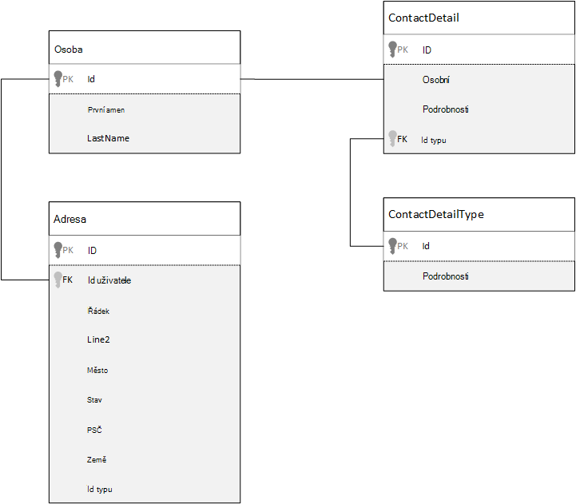
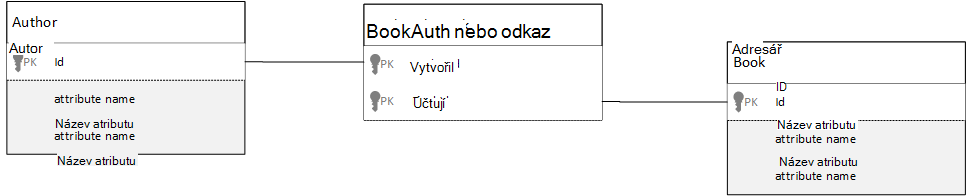

<properties 
    pageTitle="Modelování dat v Azure DocumentDB | Microsoft Azure" 
    description="Informace o modelování dat pro DocumentDB, databázi NoSQL dokumentu." 
    keywords="modelování dat"
    services="documentdb" 
    authors="kiratp" 
    manager="jhubbard" 
    editor="mimig1" 
    documentationCenter=""/>

<tags 
    ms.service="documentdb" 
    ms.workload="data-services" 
    ms.tgt_pltfrm="na" 
    ms.devlang="na" 
    ms.topic="article" 
    ms.date="08/05/2016" 
    ms.author="kipandya"/>

#Modelování dat v DocumentDB#
Při uvolnění schématu databáze jako Azure DocumentDB usnadňují velmi snadno podpořit změny do datového modelu a by pořád strávený Popřemýšlejte taky čas o datům. 

Jak dat bude uchováván? Jak aplikace bude načítání a dotaz data? Je vaše aplikace číst silná nebo zápisu? 

Po přečtení v tomto článku, budou moct odpovězte na následující otázky:

- Jak měli popřemýšlet o dokumentu v databázi dokumentu?
- Co je modelování dat a proč by měl starat? 
- Čím se liší od relační databáze modelování dat v databázi dokumentu
- Jak express relace dat v jiné relační databáze?
- Po vložení dat a kdy je propojení s daty?

##Vložení dat##
Při spuštění modelování dat v úložišti dokumentů, například DocumentDB, zkuste entity považovat za **samostatné dokumenty** ve formátu JSON.

Před jsme ponoříte hlouběji taky nastavte, jaké další můžeme udělat několik kroků zpět a podívejte se na tom, jak jsme může model, něco v relační databázi, předmět, které v mnoha nám již znáte. Následující příklad ukazuje, jak osoba mohou být uložena v relační databázi. 

Když pracujete s relační databáze, jsme jste byla výukové roky normalizovat normalizovat, normalizovat.

Normalizace dat obvykle spočívá entita, například žádnou osobou, vyjmutí a rozdělení do samostatné datovými údaji. Ve výše uvedeném příkladu osoba může mít více záznamů podrobnosti o kontaktu, jakož i více záznamů adresu. I dál přejděte postupně po jednotlivých krocích jsme rozdělí Podrobné kontaktní informace o dalších extrahování běžné pole líbí typu. Stejné adresy, každý záznam s typem jako *pro domácnosti* nebo pro *firmy* 

Orientaci místní po normalizace dat **Neuchovávejte redundantních dat** u jednotlivých záznamů a raději odkazují na data. V tomto příkladu číst žádnou osobou, se všechny své kontaktní údaje a adresy, budete muset účinně agregovat data za běhu pomocí spojení.

    SELECT p.FirstName, p.LastName, a.City, cd.Detail
    FROM Person p
    JOIN ContactDetail cd ON cd.PersonId = p.Id
    JOIN ContactDetailType on cdt ON cdt.Id = cd.TypeId
    JOIN Address a ON a.PersonId = p.Id

Aktualizace jedna osoba s jejich podrobnosti o kontaktu a adresy vyžaduje zápisu přes mnoho jednotlivých tabulek. 

Teď si přečtěte si téma Jak jsme by model stejná data jako samostatná entita v databázi dokumentu.
        
    {
        "id": "1",
        "firstName": "Thomas",
        "lastName": "Andersen",
        "addresses": [
            {            
                "line1": "100 Some Street",
                "line2": "Unit 1",
                "city": "Seattle",
                "state": "WA",
                "zip": 98012
            }
        ],
        "contactDetails": [
            {"email: "thomas@andersen.com"},
            {"phone": "+1 555 555-5555", "extension": 5555}
        ] 
    }

Použití výše uvedených přístupu jsme teď **nenormalizované** osoby záznam kde jsme **vložený** všechny informace o této osobě, například své kontaktní údaje a adresy, v jeden dokument JSON.
Kromě toho protože jsme není omezena pevné schéma máme možnost provádět věci, jako úplně s Podrobné kontaktní informace z různých obrazcích. 

Načítání záznamu dokončení osoby z databáze je teď typu single operace proti jedné kolekce a pro jeden dokument čtení. Aktualizace záznamu osoby s jejich podrobné kontaktní informace a adresu, je také operaci jednoho zápisu proti jeden dokument.

Podle denormalizing dat, může být nutné aplikace vydávání méně dotazy a na dokončení společná operace aktualizace. 

###Kdy se má vložit

Obecně použít vložené datové modely případech:

- Existuje **obsahuje** vztahy mezi entity.
- Existuje **jeden několik** vztahy mezi entity.
- Je vložená data **nemění**.
- Je vložen data nebude postupně se zvětšují **bez mez**.
- Je vložená data, která je **nedílnou** k datům v dokumentu.

> [AZURE.NOTE] Obvykle nenormalizované datové modely poskytuje lepší výkon **Číst** .

###Kdy není třeba vkládat

Když pravidlo v databázi dokument je denormalize všechno a vložení všechna data do jednoho dokumentu, může dojít k situacích, která je nutno.

Trvat tento JSON fragment kódu.

    {
        "id": "1",
        "name": "What's new in the coolest Cloud",
        "summary": "A blog post by someone real famous",
        "comments": [
            {"id": 1, "author": "anon", "comment": "something useful, I'm sure"},
            {"id": 2, "author": "bob", "comment": "wisdom from the interwebs"},
            …
            {"id": 100001, "author": "jane", "comment": "and on we go ..."},
            …
            {"id": 1000000001, "author": "angry", "comment": "blah angry blah angry"},
            …
            {"id": ∞ + 1, "author": "bored", "comment": "oh man, will this ever end?"},
        ]
    }

Může to být entita příspěvku s vloženého komentáře by prohlédnout, jak jsme modelování byly typické blogu nebo cm, systému. V tomto příkladu je to, že je argument matice komentáře **neomezené**, což znamená, že je neomezené (praktické) počtem komentářů některým z příspěvků jediné mohou mít. Jak může výrazně zvětšit velikost dokumentu stane problém.

> [AZURE.TIP] Dokumenty v DocumentDB mít maximální velikost. Další informace o nápovědě k [DocumentDB omezení](documentdb-limits.md).

Velikost dokumentu narůstající schopnost přenášet data prostřednictvím drátěný i pro čtení a aktualizace dokumentů ve velkém měřítku, bude mít vliv.

V tomto případě je lepší vzít v úvahu následující modelu.
        
    Post document:
    {
        "id": "1",
        "name": "What's new in the coolest Cloud",
        "summary": "A blog post by someone real famous",
        "recentComments": [
            {"id": 1, "author": "anon", "comment": "something useful, I'm sure"},
            {"id": 2, "author": "bob", "comment": "wisdom from the interwebs"},
            {"id": 3, "author": "jane", "comment": "....."}
        ]
    }

    Comment documents:
    {
        "postId": "1"
        "comments": [
            {"id": 4, "author": "anon", "comment": "more goodness"},
            {"id": 5, "author": "bob", "comment": "tails from the field"},
            ...
            {"id": 99, "author": "angry", "comment": "blah angry blah angry"}
        ]
    },
    {
        "postId": "1"
        "comments": [
            {"id": 100, "author": "anon", "comment": "yet more"},
            ...
            {"id": 199, "author": "bored", "comment": "will this ever end?"}
        ]
    }

Tento model má tři poslední poznámky vložen do příspěvku na sebe, která je polem s pevným vázaná tentokrát. Komentáře jsou v seskupené do listů 100 komentářů a uložených v samostatné dokumenty. Velikost listu byla vybrána jako 100 vzhledem k tomu, že naše fiktivní aplikace umožňuje uživateli načíst 100 komentáře najednou.  

Jiné případě, kdy vkládání dat není vhodné je, když vložená data se často používá v dokumentech a se často mění. 

Trvat tento JSON fragment kódu.

    {
        "id": "1",
        "firstName": "Thomas",
        "lastName": "Andersen",
        "holdings": [
            {
                "numberHeld": 100,
                "stock": { "symbol": "zaza", "open": 1, "high": 2, "low": 0.5 }
            },
            {
                "numberHeld": 50,
                "stock": { "symbol": "xcxc", "open": 89, "high": 93.24, "low": 88.87 }
            }
        ]
    }

Může se zobrazují burzovní portfolia osoby. Zvolili jsme vložení burzovní informace v jednotlivých portfolia dokumentu. V prostředí, kde se často mění související data jako je populace obchodních aplikací, vkládání dat, které se často mění bude znamená, že průběžně aktualizujete každý dokument portfolia pokaždé, když obchodování populace.

Burzovní *zaza* může stovky časy v jeden den obchodování a tisíce uživatelů může mít *zaza* na jejich portfolia. S datovým modelem jako výše uvedených možností nám aktualizovat mnoho tisíce dokumentů portfolia opakovaně pokoušeli každý den vést k systému, který nebude měřítko dobře. 

##Odkazování na data##

Ano vkládání dat funguje dobře u mnoha případech ale bylo jasné, že existují scénáře, kdy denormalizing datům způsobí více problémů, než je jmění. Takže co jsme teď dělat? 

Relační databáze nejsou jenom místo kde můžete vytvořit relace mezi entity. V databázi dokumentu můžou obsahovat informace v jednom dokumentu, které skutečně se vztahují k datům v jiných dokumentů. Teď můžu nejsou zasazovat o ještě jednu minutu, abychom vytvářet systémů, které by být vhodnější relační databáze v DocumentDB nebo jakékoli jiné databáze dokumentu, ale jednoduché vztahy jsou pořádku a může být užitečné. 

V následujícím JSON jsme rozhodli příklad burzovní portfolia z výše, ale tentokrát označovány burzovní položky na portfolia namísto jeho vložení. Tímto způsobem, pokud se změní burzovní položku často celý den pouze dokument, který je třeba aktualizovat je jeden burzovní dokument. 

    Person document:
    {
        "id": "1",
        "firstName": "Thomas",
        "lastName": "Andersen",
        "holdings": [
            { "numberHeld":  100, "stockId": 1},
            { "numberHeld":  50, "stockId": 2}
        ]
    }
    
    Stock documents:
    {
        "id": "1",
        "symbol": "zaza",
        "open": 1,
        "high": 2,
        "low": 0.5,
        "vol": 11970000,
        "mkt-cap": 42000000,
        "pe": 5.89
    },
    {
        "id": "2",
        "symbol": "xcxc",
        "open": 89,
        "high": 93.24,
        "low": 88.87,
        "vol": 2970200,
        "mkt-cap": 1005000,
        "pe": 75.82
    }
    

Okamžité nevýhodou na tento přístup přes je-li aplikace se vyžaduje k zobrazení informací o každé akcie, který směřuje při zobrazování portfolia osoby; v tomto případě by potřebujete provést více cest k databázi načíst informace pro každý burzovní dokument. Zde se rozhodnutí o zvýšení efektivity zápisu, které dojít často celý den, ale naopak ohroženo na čtení operacích, které potenciálně mít menší dopad na výkon konkrétní systému.

> [AZURE.NOTE] Normalizovaných datové modely **může vyžadovat víc výměny zpráv** na server.

### Co dávat pozor cizích klíčů?
Protože je aktuálně žádné koncepci omezení, cizí klíč nebo jinak, žádné relace mezi dokumentů, které máte v dokumentech jsou účinně "slabými propojení" a nesmí být ověřený samotné databáze. Pokud chcete zajistit, aby data, která dokumentu odkazující na skutečně existuje, budete muset provést v aplikaci nebo pomocí aktivačních událostí straně serveru nebo uložené procedury na DocumentDB.

###Kdy se má odkaz
Normalizovaná dat se obvykle používá modely případech:

- Představující **- n** relace.
- Představující **- n** relace.
- Související data **často mění**.
- Odkazovaný dat může být **neomezené**.

> [AZURE.NOTE] Obvykle normalizace poskytuje lepší výkon **psát** .

###Kde umístění relace?
LOGLINTREND vztah vám pomůže určit, ve které dokument uložit odkaz.

Pokud se podíváme na JSON, pod který modely vydavatelé a publikace.

    Publisher document:
    {
        "id": "mspress",
        "name": "Microsoft Press",
        "books": [ 1, 2, 3, ..., 100, ..., 1000]
    }

    Book documents:
    {"id": "1", "name": "DocumentDB 101" }
    {"id": "2", "name": "DocumentDB for RDBMS Users" }
    {"id": "3", "name": "Taking over the world one JSON doc at a time" }
    ...
    {"id": "100", "name": "Learn about Azure DocumentDB" }
    ...
    {"id": "1000", "name": "Deep Dive in to DocumentDB" }

Pokud je číslo publikace v Publisheru malé s omezenou růstu, může být užitečné ukládání knihy odkaz do dokumentu aplikace publisher. Však-li číslo publikace v Publisheru neomezené, potom tento datový model povede k proměnlivých a rostoucí polí jako dokument aplikace publisher příkladu výše. 

Přepínání věci kolem trochu by vedla v modelu, který stále představuje stejná data, ale teď zabráněno tyto velké proměnlivých kolekce.

    Publisher document: 
    {
        "id": "mspress",
        "name": "Microsoft Press"
    }
    
    Book documents: 
    {"id": "1","name": "DocumentDB 101", "pub-id": "mspress"}
    {"id": "2","name": "DocumentDB for RDBMS Users", "pub-id": "mspress"}
    {"id": "3","name": "Taking over the world one JSON doc at a time"}
    ...
    {"id": "100","name": "Learn about Azure DocumentDB", "pub-id": "mspress"}
    ...
    {"id": "1000","name": "Deep Dive in to DocumentDB", "pub-id": "mspress"}

Ve výše uvedeném příkladu jsme máte kolekci neomezené Publisheru dokumentu přetaženy. Místo toho jenom máme odkaz do aplikace publisher pro každý dokument adresář.

###Jak model n: n relace?
Relační databáze jsou *n: n* relace často modelovat pomocí připojení tabulkách, které právě spojovat záznamy z jiné tabulky. 

Je to svádět k replikovat totéž pomocí dokumenty a vytvoření datového modelu, který bude vypadat podobně jako tento.

    Author documents: 
    {"id": "a1", "name": "Thomas Andersen" }
    {"id": "a2", "name": "William Wakefield" }
    
    Book documents:
    {"id": "b1", "name": "DocumentDB 101" }
    {"id": "b2", "name": "DocumentDB for RDBMS Users" }
    {"id": "b3", "name": "Taking over the world one JSON doc at a time" }
    {"id": "b4", "name": "Learn about Azure DocumentDB" }
    {"id": "b5", "name": "Deep Dive in to DocumentDB" }
    
    Joining documents: 
    {"authorId": "a1", "bookId": "b1" }
    {"authorId": "a2", "bookId": "b1" }
    {"authorId": "a1", "bookId": "b2" }
    {"authorId": "a1", "bookId": "b3" }

To vhodná. Však načítání buď Autor s jejich seznamů nebo načtení knize s jeho autorem vždy vyžadují aspoň dva další dotazy v databázi. Jeden dotaz spojování dokumentu a potom jiný dotaz načíst aktuální dokument je připojen. 

Pokud všechny udělat v této tabulce spojení je připevnit společně dvěma datovými údaji, pak Nebojte vložíte úplně?
Zvažte tyto skutečnosti:

    Author documents:
    {"id": "a1", "name": "Thomas Andersen", "books": ["b1, "b2", "b3"]}
    {"id": "a2", "name": "William Wakefield", "books": ["b1", "b4"]}
    
    Book documents: 
    {"id": "b1", "name": "DocumentDB 101", "authors": ["a1", "a2"]}
    {"id": "b2", "name": "DocumentDB for RDBMS Users", "authors": ["a1"]}
    {"id": "b3", "name": "Learn about Azure DocumentDB", "authors": ["a1"]}
    {"id": "b4", "name": "Deep Dive in to DocumentDB", "authors": ["a2"]}

Teď můžu měli Autor, okamžitě vím, které jste napsali knihy a naopak pokud měli dokument adresáře načtené by vím ID právem. Tím se uloží, které zprostředkovatel dotazu v tabulce připojit se ke snížení počet serveru zaokrouhlení cesty, který má být aplikace. 

##Hybridní datové modely##
Jste teď prohledat vkládání (nebo denormalizing) a referenční (nebo normalizace) data obsahují jejich upsides a každý mít kompromisům jako jsme viděli. 

Vždy nemusí být buď nebo nemusí být Vystrašené trochu různé věci. 

Na základě vzorce konkrétní použití aplikace a úloh, které někdy může být kdy společným vložené odkazovanou dat smysl a může vést k použití logických operátorů jednodušší aplikace méně serverem zaokrouhlení cest a pořád zachovat úrovně dobrý výkon.

Zvažte následující JSON. 

    Author documents: 
    {
        "id": "a1",
        "firstName": "Thomas",
        "lastName": "Andersen",     
        "countOfBooks": 3,
        "books": ["b1", "b2", "b3"],
        "images": [
            {"thumbnail": "http://....png"}
            {"profile": "http://....png"}
            {"large": "http://....png"}
        ]
    },
    {
        "id": "a2",
        "firstName": "William",
        "lastName": "Wakefield",
        "countOfBooks": 1,
        "books": ["b1"],
        "images": [
            {"thumbnail": "http://....png"}
        ]
    }
    
    Book documents:
    {
        "id": "b1",
        "name": "DocumentDB 101",
        "authors": [
            {"id": "a1", "name": "Thomas Andersen", "thumbnailUrl": "http://....png"},
            {"id": "a2", "name": "William Wakefield", "thumbnailUrl": "http://....png"}
        ]
    },
    {
        "id": "b2",
        "name": "DocumentDB for RDBMS Users",
        "authors": [
            {"id": "a1", "name": "Thomas Andersen", "thumbnailUrl": "http://....png"},
        ]
    }

Tady jsme (převážně) postupovali jste vložený modelu, kde dat z jiných entity jsou vložené do dokumentů nejvyšší úrovně, ale odkaz Další data. 

Když se podíváte na dokument adresáře, vidíme několik dostanete zajímavý pole při podíváme na pole autory. Obsahuje pole *id* , což je pole, které umožňují snadno dostanete k Autor dokumentu, standardní praktická část v modelu normalizovanou, ale pak taky máme *název* a *thumbnailUrl*. Můžeme může jste právě zasekne s *id* a vlevo aplikace z příslušné Autor dokumentu pomocí "odkaz" získat další informace, které potřebuje, ale vzhledem k tomu, že naše aplikace zobrazí jménem autora a miniatury obrázků s každé knize zobrazí jsme doby odezvy uložit na server za adresáři v seznamu tak, že denormalizing **některá** data z autora.

Zkontrolujte Pokud ale chtěli aktualizovat jeho fotografii nám přejdete k aktualizaci nebo změněné jménem autora každé knize budou dříve publikované ale naše aplikace založené na za předpokladu, že autoři není jejich jména příliš často měnit, je rozhodnutí o přijatelné návrh.  

V příkladu jsou **předem výpočtu agregace** hodnot a ty pak uložte drahé zpracování na operace čtení. V příkladu některá data vloženého do dokumentu Autor jsou data, která se vypočítá za běhu. Pokaždé, když je publikován nový sešit, dokumentu sešit je vytvořen **a** countOfBooks pole je nastavena na hodnotu vypočtenou na základě počtu knihy dokumenty, které jsou pro určitého autora. Optimalizací by bylo dobré ve čtení hodně systémy kde jsme můžou dovolit provádět výpočty o zápisů Pokud chcete optimalizovat čtení.

Možnost model s předem počítaných polí je umožnily, protože DocumentDB podporuje **transakce složené z více dokumentů**. Mnoho ukládá NoSQL nelze provést transakce v dokumentech a proto webu navrhování, například "vždy Vložit vše", kvůli toto omezení. DocumentDB můžete pomocí aktivačních událostí straně serveru nebo uložené procedury, vkládat knih a aktualizovat autoři všechno v kyseliny transakce. Teď můžete nechcete **mít** můžete vložit vše do jednoho dokumentu jenom, abyste měli jistotu, že vaše data je stejné.

##Další kroky

Největší takeaways v tomto článku je chcete porozumět tomu, že je modelování dat v světě uvolnit schématu stejně důležité jako vůbec. 

Stejně jako nejde žádným způsobem jednoho představující část dat na obrazovce, nejde žádným způsobem jednoho k modelování dat. Je to potřeba porozumět aplikace a jak ho vytvoří, používat a zpracovat data. Poté použitím některých směrech můžete nastavit o vytvoření modelu prostředních okamžité potřebám vaší aplikace. Pokud vaše aplikace nechcete změnit, můžete využít flexibilitu uvolnit schématu databáze podpořit a změnit a snadno vyvíjet datového modelu. 

Další informace o Azure DocumentDB, v nápovědě služby [si přečtěte následující dokumentaci](https://azure.microsoft.com/documentation/services/documentdb/) stránku. 

Další informace o optimalizaci indexy v Azure DocumentDB, naleznete v článku o [indexování zásady](documentdb-indexing-policies.md).

Pokud chcete zjistit, jak shard dat ve více oddílů, najdete pod odkazy [Rozdělování dat v DocumentDB](documentdb-partition-data.md). 

A nakonec pokyny pro modelování dat a sharding pro více klienta aplikace naleznete [měřítka více klienta aplikaci Azure DocumentDB](http://blogs.msdn.com/b/documentdb/archive/2014/12/03/scaling-a-multi-tenant-application-with-azure-documentdb.aspx).
 
