<properties 
    pageTitle="Použití MongoChef pod svým účtem DocumentDB s podporou protokolu MongoDB | Microsoft Azure" 
    description="Naučte se používat MongoChef pod svým účtem DocumentDB s podporou protokolu MongoDB, teď k dispozici pro náhled." 
    keywords="mongochef"
    services="documentdb" 
    authors="AndrewHoh" 
    manager="jhubbard" 
    editor="" 
    documentationCenter=""/>

<tags 
    ms.service="documentdb" 
    ms.workload="data-services" 
    ms.tgt_pltfrm="na" 
    ms.devlang="na" 
    ms.topic="article" 
    ms.date="08/25/2016" 
    ms.author="anhoh"/>

# Použití MongoChef pod svým účtem DocumentDB s podporou protokolu MongoDB

Připojení k účtu Azure DocumentDB s podporou protokolu MongoDB pomocí MongoChef, musíte:

- Stažení a instalace [MongoChef](http://3t.io/mongochef)
- Máte účet DocumentDB s podporou protokolu MongoDB [připojovací řetězec](documentdb-connect-mongodb-account.md) informace

## Vytvoření připojení v MongoChef  

Přidat svůj účet DocumentDB s podporou protokolu MongoDB vedoucímu MongoChef připojení, proveďte následující kroky.

1. Načtení DocumentDB s podporou protokolu informace o připojení MongoDB postupujte podle pokynů [v tomto poli](documentdb-connect-mongodb-account.md).

    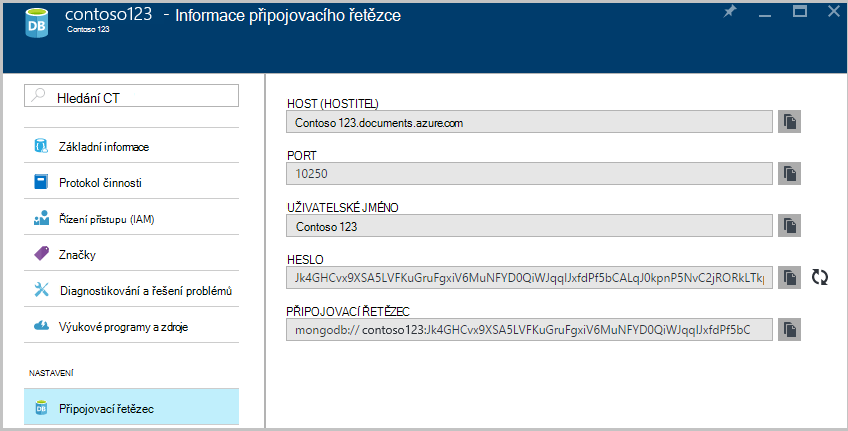

2. Klikněte na **Připojit** k otevření Connection Manager a potom klikněte na **Nové připojení**

    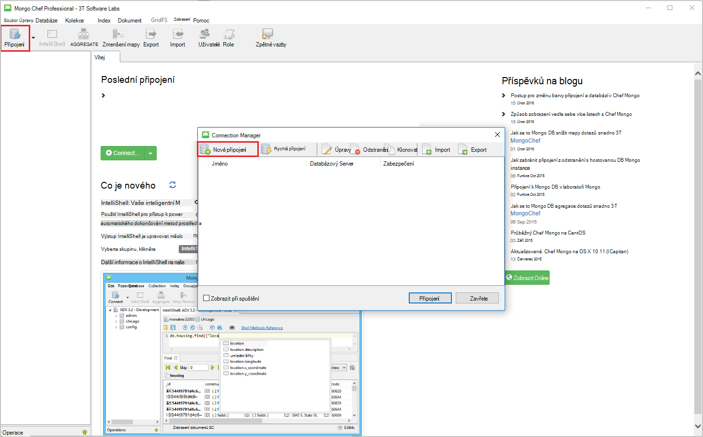
    
2. V okně **Nové připojení** klikněte na kartě **Server** zadejte hostitele (FQDN) DocumentDB účet s podporou protokolu MongoDB a číslo portu.
    
    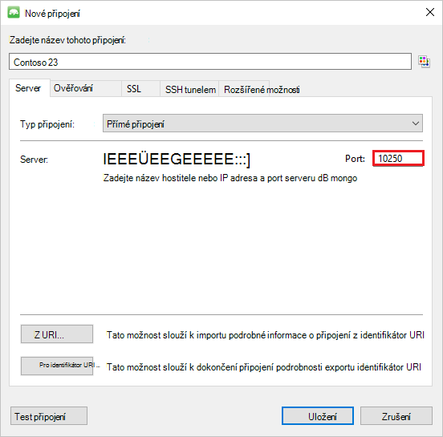

3. V okně **Nové připojení** klikněte na kartu **ověřování** vyberte režim ověřování **směrodatnou (MONGODB CR nebo SCARM-SHA-1)** a zadejte uživatelské jméno a heslo.  Přijměte výchozí ověřování databáze (Správci) nebo zadejte vlastní hodnota.

    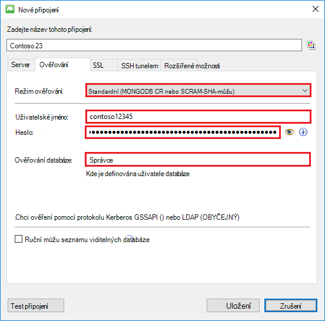

4. V okně **Nové připojení** klikněte na kartě **SSL** zaškrtněte políčko **použít protokol SSL protokol sloužící k připojení** a přepínací tlačítko **přijmout podepsaného certifikáty SSL** .

    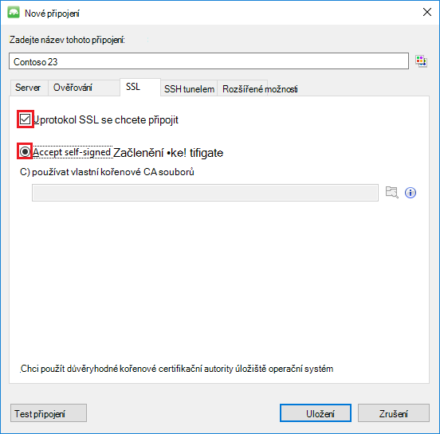

5. Kliknutím na tlačítko **Testovat připojení** ověřte informace o připojení, klikněte na **OK** se vrátíte do okna nové připojení a pak klikněte na **Uložit**.

    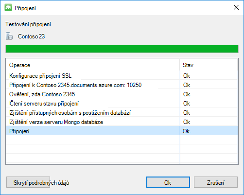

## Vytvoření databáze, shromažďování a dokumentů pomocí MongoChef  

Pokud chcete vytvořit databázi, shromažďování a dokumentů pomocí MongoChef, proveďte následující kroky.

1. Ve **Správci připojení**zvýrazněte připojení a klikněte na **Připojit**.

    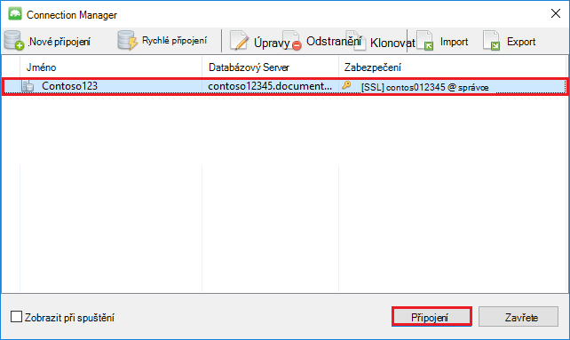

2. Klikněte pravým tlačítkem myši Host (hostitel) a zvolte **Přidat databázi**.  Zadejte název databáze a klikněte na **OK**.
    
    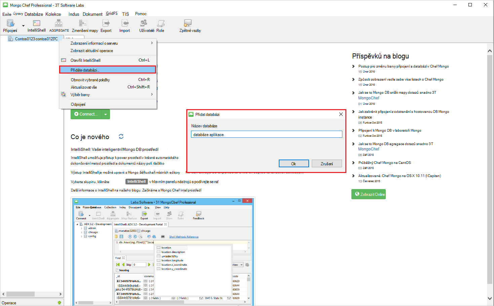

3. Klikněte pravým tlačítkem myši databázi a zvolte **Přidat kolekce**.  Zadejte název kolekce a klikněte na **vytvořit**.

    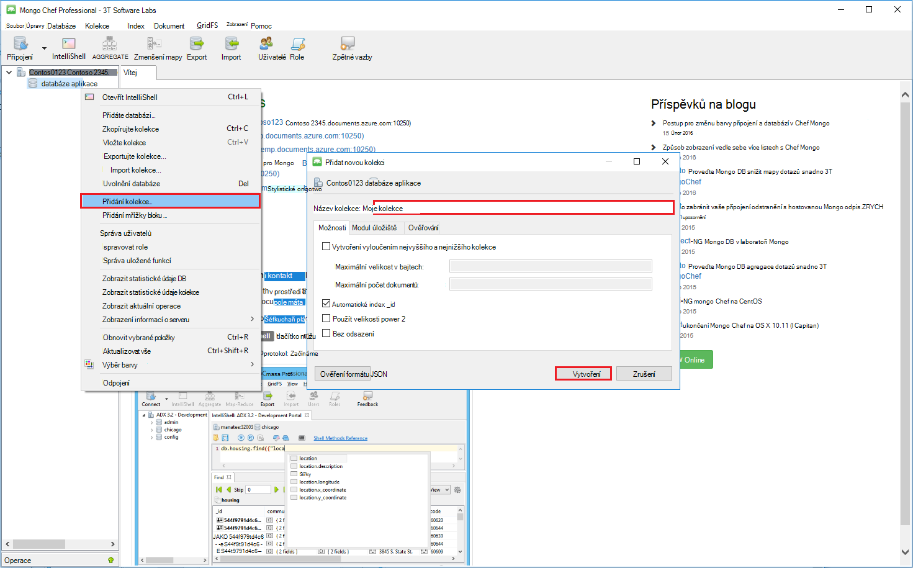

4. Klikněte na položku **kolekce** a potom klikněte na **Přidat dokument**.

    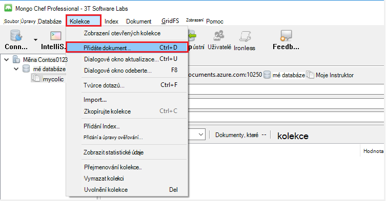

5. V dialogovém okně Přidat dokument vložte následující a pak klikněte na **Přidat dokument**.

        {
        "_id": "AndersenFamily",
        "lastName": "Andersen",
        "parents": [
            { "firstName": "Thomas" },
            { "firstName": "Mary Kay"}
        ],
        "children": [
        {
            "firstName": "Henriette Thaulow", "gender": "female", "grade": 5,
            "pets": [{ "givenName": "Fluffy" }]
        }
        ],
        "address": { "state": "WA", "county": "King", "city": "seattle" },
        "isRegistered": true
        }

    
6. Přidání jiného dokumentu, tuto dobu následující obsah.

        {
        "_id": "WakefieldFamily",
        "parents": [
            { "familyName": "Wakefield", "givenName": "Robin" },
            { "familyName": "Miller", "givenName": "Ben" }
        ],
        "children": [
            {
                "familyName": "Merriam", 
                "givenName": "Jesse", 
                "gender": "female", "grade": 1,
                "pets": [
                    { "givenName": "Goofy" },
                    { "givenName": "Shadow" }
                ]
            },
            { 
                "familyName": "Miller", 
                "givenName": "Lisa", 
                "gender": "female", 
                "grade": 8 }
        ],
        "address": { "state": "NY", "county": "Manhattan", "city": "NY" },
        "isRegistered": false
        }

7. Spuštění dotazu na vzorku. Příklad hledání pro rodiny se příjmení "Andersen" a vraťte se rodičům a pole Stav.

    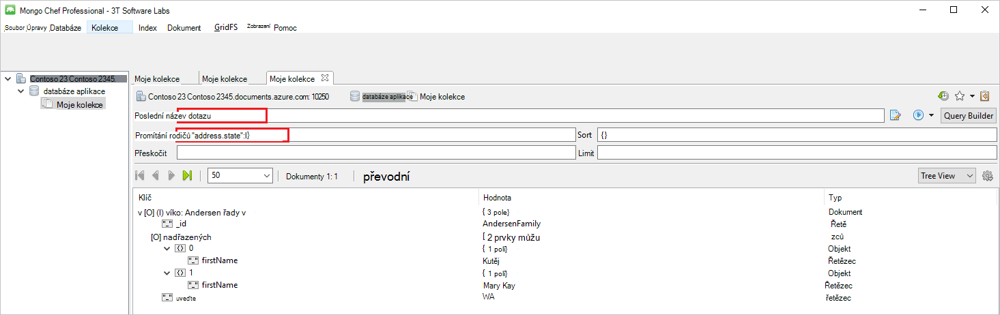
    

## Další kroky

- Prozkoumejte DocumentDB s podporou protokolu MongoDB [vzorky](documentdb-mongodb-samples.md).

 
