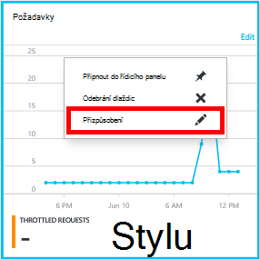
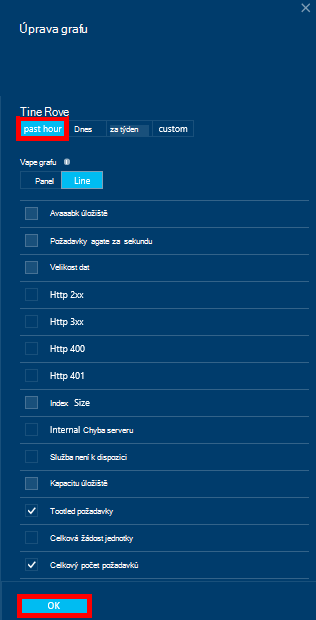

<properties
    pageTitle="Sledování DocumentDB žádosti o schůzku a úložiště | Microsoft Azure"
    description="Zjistěte, jak sledovat účtu DocumentDB měřítka, například požadavky a chyby serveru a použití metriky, například spotřebu úložiště."
    services="documentdb"
    documentationCenter=""
    authors="mimig1"
    manager="jhubbard"
    editor="cgronlun"/>

<tags
    ms.service="documentdb"
    ms.workload="data-services"
    ms.tgt_pltfrm="na"
    ms.devlang="na"
    ms.topic="article"
    ms.date="10/17/2016"
    ms.author="mimig"/>

# Sledování DocumentDB žádosti o použití a úložiště

Můžete sledovat účtů Azure DocumentDB [Azure portálu](https://portal.azure.com/). Pro každý účet DocumentDB obou metriky výkonu, například žádosti a chyby serveru a použití metriky, například spotřebu úložiště, jsou k dispozici.

Na zásuvné účet nebo na nové zásuvné metriky metriky prohlédnout.

## Zobrazení měřítka na zásuvné metriky

1. V novém okně otevřete [Azure portál](https://portal.azure.com/), klikněte na **Další služby**, klikněte na **DocumentDB (NoSQL)**a potom klikněte na název účtu DocumentDB, u kterého chcete zobrazit měřítka.
2. V nabídce zdrojů klikněte na **Nastavení**.

Otevře se zásuvné metriky a vyberete kolekci zobrazíte. Můžete zkontrolovat dostupnost, požadavky, výkon a úložiště metriky a porovnejte je DocumentDB rozsahu.

## Zobrazení měřítka na zásuvné účtu
1.  V novém okně otevřete [Azure portál](https://portal.azure.com/), klikněte na **Další služby**, klikněte na **DocumentDB (NoSQL)**a potom klikněte na název účtu DocumentDB, u kterého chcete zobrazit měřítka.

2.  Ve výchozím nastavení zobrazuje lens **Sledování** následujících dlaždic:
    *   Celkový počet požadavků pro aktuální den.
    *   Použité úložiště.

    Pokud vaše tabulka zobrazuje **k dispozici žádná data** a myslíte, že v databázi dat, najdete v části [Poradce při potížích](#troubleshooting) .

    

3.  Kliknutím na tlačítko na **žádosti o** nebo **úložiště** dlaždice otevřete podrobné zásuvné **míru** .
4.  **Metriky** zásuvné zobrazí podrobnosti o metriky, který jste zvolili.  V horní části zásuvné je graf žádostí o zobrazena každou hodinu a, který následuje tabulka, která zobrazí agregace hodnoty požadavky omezené a celkové.  Metriky zásuvné taky zobrazí seznam upozornění, které jste určili, filtrované metriky, které ukazují aktuální metrických zásuvné (tímto způsobem, pokud máte počet upozornění, uvidíte jenom relevantní těch, které jsou uvedené v této).   

    

## Přizpůsobení zobrazení metrických výkonu na portálu

1.  Přizpůsobit metriky zobrazující konkrétní grafu, klikněte na graf a otevřete ji v zásuvné **metriky** a potom klikněte na **Upravit graf**.  
    

2.  Na zásuvné **Upravit graf** způsoby k úpravám metriky, který zobrazí v grafu, jakož i jejich časový rozsah.  
    

3.  Pokud chcete změnit nastavení v části, jednoduše vyberte nebo zrušte dostupné měřítka a klikněte na tlačítko **OK** v dolní části zásuvné.  
4.  Změna časového rozsahu, zvolte jiné oblasti (například **vlastní**) a klikněte na tlačítko **OK** v dolní části zásuvné.  

    

## Vytváření grafů vedle sebe na portálu
Na portálu Azure umožňuje vytvoříte metrických diagramy vedle sebe.  

1.  Nejdřív klikněte pravým tlačítkem myši na graf, který chcete zkopírovat a vyberte možnost **Přizpůsobit**.

    

2.  **Klonovat** v nabídce klikněte na zkopírovat část a pak klikněte na **Hotovo, přizpůsobení**.

      

Tato část může teď považovat za jiné metrických části, vlastní nastavení v části rozsah metriky a času.  Tímto způsobem, uvidíte dva různé metriky grafu vedle sebe ve stejnou dobu.  
      

## Nastavení upozornění na portálu
1.  [Azure portál](https://portal.azure.com/)klikněte na **Další služby**a **DocumentDB (NoSQL)**klikněte na název účtu DocumentDB, u kterého chcete nastavit výkon metrických upozornění.

2.  V nabídce zdrojů klikněte na **Pravidla výstrah** otevřete zásuvné upozornění pravidla.  
    

3.  V **upozornění pravidel** zásuvné klikněte na **Přidat upozornění**.  
    

4.  V zásuvné **Přidat pravidlo výstrahy** zadejte:
    *   Název pravidla výstrahy nastavujete.
    *   Popis nové pravidlo výstrahy.
    *   Metriky pravidlo výstrahy.
    *   Podmínka mezní hodnota a období, jež určují, kdy aktivuje upozornění. Například, chyba serveru spočítá větší než 5 myši za posledních 15 minut.
    *   Jestli správce služby a coadministrators jsou odeslány e-mailem při upozornění.
    *   Další e-mailové adresy pro oznámení.  
    

## Sledování DocumentDB programově
Úrovně metriky účet k dispozici v portálu, jako je použití a součet požadavků na účtu úložiště, nejsou k dispozici prostřednictvím rozhraní API DocumentDB. Použití dat na úrovni kolekce můžete však načíst pomocí rozhraní API DocumentDB. K načtení dat úrovně kolekce, postupujte takto:

- Použití rozhraní REST API [provést získáte v kolekci](https://msdn.microsoft.com/library/mt489073.aspx). Kvóta a použití kolekce doručeno v záhlaví x-ms--kvóty využití prostředků a x-ms zdrojů – použití v odpovědi.
- Použití .NET SDK, použijte metodu [DocumentClient.ReadDocumentCollectionAsync](https://msdn.microsoft.com/library/microsoft.azure.documents.client.documentclient.readdocumentcollectionasync.aspx) vrátí [ResourceResponse](https://msdn.microsoft.com/library/dn799209.aspx) , která obsahuje celá řada vlastností použití například **CollectionSizeUsage** **DatabaseUsage**, **DocumentUsage**a další.

Přístup k další metriky, použijte [Azure Monitor SDK](https://www.nuget.org/packages/Microsoft.Azure.Insights). K dispozici metrických definice lze získat tak, že zavoláte:

    https://management.azure.com/subscriptions/{SubscriptionId}/resourceGroups/{ResourceGroup}/providers/Microsoft.DocumentDb/databaseAccounts/{DocumentDBAccountName}/metricDefinitions?api-version=2015-04-08

Dotazy k načtení jednotlivé metriky použijte v tomto formátu:

    https://management.azure.com/subscriptions/{SubecriptionId}/resourceGroups/{ResourceGroup}/providers/Microsoft.DocumentDb/databaseAccounts/{DocumentDBAccountName}/metrics?api-version=2015-04-08&$filter=%28name.value%20eq%20%27Total%20Requests%27%29%20and%20timeGrain%20eq%20duration%27PT5M%27%20and%20startTime%20eq%202016-06-03T03%3A26%3A00.0000000Z%20and%20endTime%20eq%202016-06-10T03%3A26%3A00.0000000Z

Další informace najdete v tématu [Načítání metriky zdroje přes Azure Monitor REST API](https://blogs.msdn.microsoft.com/cloud_solution_architect/2016/02/23/retrieving-resource-metrics-via-the-azure-insights-api/). Všimněte si, že "Azure Inights" přejmenovaná "Azure Monitor".  Tuto položku blogu odkazuje starším názvem.

## Řešení potíží
Pokud sledování dlaždic zobrazit zprávu **k dispozici žádná data** a naposledy udělali požadavky nebo přidání dat do databáze, můžete upravit dlaždici tak, aby odrážely poslední použití.

### Úpravy dlaždice aktualizovat aktuálními daty
1.  Přizpůsobení metrik zobrazující do určité části, klikněte na graf otevřete zásuvné **metrické** a klikněte na **Upravit diagram**.  
    

2.  Na zásuvné **Upravit graf** , v části **Časový rozsah** klikněte **za hodinu**a potom klikněte na **OK**.  
    

3.  Dlaždici by nyní aktualizace s aktuálními daty a použití.  
    

## Další kroky
Další informace o DocumentDB kapacitu, najdete v článku [Správa DocumentDB kapacitu](documentdb-manage.md).
