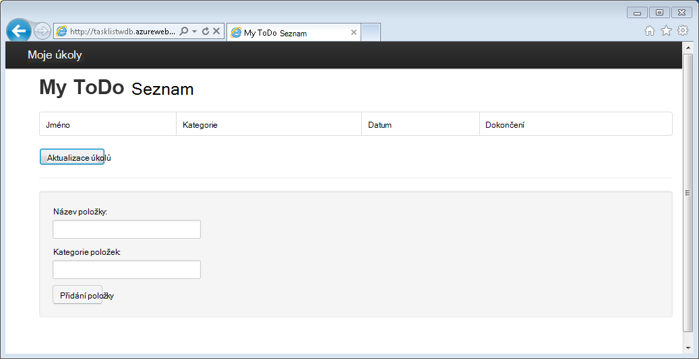
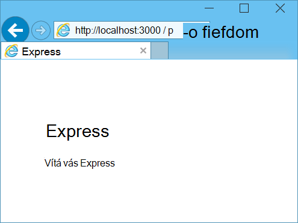
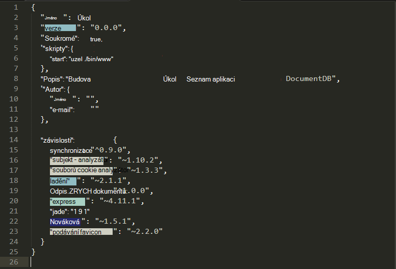
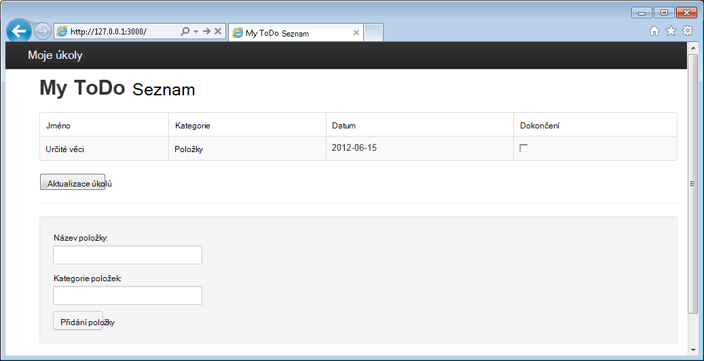

<properties 
    pageTitle="Přečtěte si Node.js – kurz Node.js DocumentDB | Microsoft Azure" 
    description="Přečtěte si Node.js! Kurz popisuje jak používat Microsoft Azure DocumentDB k ukládání a přístup k datům z webové aplikace Node.js Express hostitelem Azure weby." 
    keywords="Vývoj aplikací, databáze kurz další node.js node.js kurz, documentdb, azure, Microsoft azure"
    services="documentdb" 
    documentationCenter="nodejs" 
    authors="syamkmsft" 
    manager="jhubbard" 
    editor="cgronlun"/>

<tags 
    ms.service="documentdb" 
    ms.workload="data-services" 
    ms.tgt_pltfrm="na" 
    ms.devlang="nodejs" 
    ms.topic="hero-article" 
    ms.date="08/25/2016" 
    ms.author="syamk"/>

# Vytvoření webové aplikace Node.js pomocí DocumentDB

> [AZURE.SELECTOR]
- [.NET](documentdb-dotnet-application.md)
- [Node.js](documentdb-nodejs-application.md)
- [Java](documentdb-java-application.md)
- [Python](documentdb-python-application.md)

Tento kurz Node.js se dozvíte, jak používat službu Azure DocumentDB k ukládání a přístup k datům z aplikace Node.js Express hostitelem Azure weby.

Doporučujeme, ale můžete podívat v následujícím videu, kde se naučíte zřízení účtu Azure DocumentDB databáze a ukládání dokumentů JSON v aplikaci Node.js začínáte pracovat. 

> [AZURE.VIDEO azure-demo-getting-started-with-azure-documentdb-on-nodejs-in-linux]

Vraťte se do tohoto kurzu Node.js, kde se dozvíte odpovědi na následující otázky:

- Práce s DocumentDB používání modulu npm documentdb?
- Jak můžu nasadit webové aplikace na weby Azure?

Provedením tohoto kurzu databáze, vytvoříte jednoduché webová řízení úkolů aplikace, která umožňuje vytváření, načítání a dokončení úkolů. Úkoly se uloží jako JSON dokumenty v Azure DocumentDB.

Nemáte čas na dokončení kurzu a chcete získat úplné řešení? Není problém, dostanete řešení celá ukázková z [GitHub][].

## Zjistit předpoklady pro

> [AZURE.TIP] Tento kurz Node.js předpokládá, že máte předchozí zkušenosti s používáním Node.js a Azure weby.

Před postupujte podle pokynů v tomto článku, se ujistěte, že máte takto:

- Účet Azure active. Pokud nemáte účet, můžete vytvořit bezplatný účet zkušební v jenom pár minut. Podrobnosti najdete v tématu [Bezplatnou zkušební verzi Azure](https://azure.microsoft.com/pricing/free-trial/).
- [Node.js][] verze v0.10.29 nebo vyšší.
- [Expresní generátor](http://www.expressjs.com/starter/generator.html) (instalací to prostřednictvím `npm install express-generator -g`)
- [Libovolná][].

## Krok 1: Vytvoření účtu DocumentDB databáze

Začneme tím, že vytvoření účtu DocumentDB. Pokud už máte nastavený účet, můžete přejít ke [Krok 2: vytvoření nové aplikace Node.js](#_Toc395783178).

[AZURE.INCLUDE [documentdb-create-dbaccount](../../includes/documentdb-create-dbaccount.md)]

[AZURE.INCLUDE [documentdb-keys](../../includes/documentdb-keys.md)]

## Krok 2: Naučte se vytvořit novou aplikaci Node.js

Teď Pojďme Naučte se vytvořit základní Ahoj světě Node.js projektu v rámci [Express](http://expressjs.com/) .

1. Otevřete svůj oblíbený terminál.

2. Umožňuje generovat nové aplikace s názvem **úkol**express generátor.

        express todo

3. Otevřete nový **úkol** adresář a nainstalujte závislosti.

        cd todo
        npm install

4. Spuštění nové aplikace.

        npm start

5. Můžete zobrazit tak, že přejdete tak, aby prohlížeč [http://localhost:3000](http://localhost:3000)novou aplikaci.

    

## Krok 3: Instalace další moduly

Soubor **package.json** je jedním ze soubory vytvořené v kořenovém projektu. Tento soubor obsahuje seznam další modulů kontroly, které jsou potřeba pro aplikace Node.js. Později když nasadíte tuto aplikaci k webům Azure, tento soubor slouží k určení, které moduly je třeba nainstalovat na Azure na podporu aplikace. Pořád potřebujeme instalace dva další balíčky pro účely tohoto návodu.

1. Zpátky v terminálu instalace modulu **asynchronní** prostřednictvím npm.

        npm install async --save

1. Instalace modulu **documentdb** prostřednictvím npm. Toto je modulu místo, kam se stane všechny magické DocumentDB.

        npm install documentdb --save

3. Rychlá kontrola **package.json** souboru aplikace by se zobrazit další moduly. Tento soubor se dozvíte Azure, které balíčky si stáhněte a nainstalujte při spuštění aplikace. By měl vypadat následujícím příkladu.

    

    Toto říká uzel (a novější Azure), že aplikace závisí na tyto další moduly.

## Krok 4: Pomocí služby DocumentDB aplikaci uzel

Který má na starosti počáteční nastavení a konfiguraci, teď Pojďme get dolů k proč může vám tento článek a, který má některé kódu pomocí Azure DocumentDB.

### Vytvoření modelu

1. V adresáři projektu vytvořte nový adresář s názvem **modely**.
2. V adresáři **modely** vytvoření nového souboru s názvem **taskDao.js**. Tento soubor bude obsahovat modelu doplňku pro úkoly vytvořené náš aplikací.
3. V adresáři stejné **modely** vytvořte další nový soubor s názvem **docdbUtils.js**. Tento soubor bude obsahovat některé užitečné a opakovaně použitelný, kód, který použijeme v rámci naší aplikace. 
4. Zkopírujte následující kód v **docdbUtils.js**

        var DocumentDBClient = require('documentdb').DocumentClient;
            
        var DocDBUtils = {
            getOrCreateDatabase: function (client, databaseId, callback) {
                var querySpec = {
                    query: 'SELECT * FROM root r WHERE r.id= @id',
                    parameters: [{
                        name: '@id',
                        value: databaseId
                    }]
                };
        
                client.queryDatabases(querySpec).toArray(function (err, results) {
                    if (err) {
                        callback(err);
        
                    } else {
                        if (results.length === 0) {
                            var databaseSpec = {
                                id: databaseId
                            };
        
                            client.createDatabase(databaseSpec, function (err, created) {
                                callback(null, created);
                            });
        
                        } else {
                            callback(null, results[0]);
                        }
                    }
                });
            },
        
            getOrCreateCollection: function (client, databaseLink, collectionId, callback) {
                var querySpec = {
                    query: 'SELECT * FROM root r WHERE r.id=@id',
                    parameters: [{
                        name: '@id',
                        value: collectionId
                    }]
                };             
                
                client.queryCollections(databaseLink, querySpec).toArray(function (err, results) {
                    if (err) {
                        callback(err);
        
                    } else {        
                        if (results.length === 0) {
                            var collectionSpec = {
                                id: collectionId
                            };
                            
                            client.createCollection(databaseLink, collectionSpec, function (err, created) {
                                callback(null, created);
                            });
        
                        } else {
                            callback(null, results[0]);
                        }
                    }
                });
            }
        };
                
        module.exports = DocDBUtils;

    > [AZURE.TIP] createCollection přijímá volitelné requestOptions parametr, který umožňuje určit typ nabízejí kolekce. Pokud je zadána žádná hodnota requestOptions.offerType potom kolekci se vytvoří pomocí výchozího typu nabízejí.
    >
    > Další informace o typech nabízejí DocumentDB naleznete [úrovně výkonu při DocumentDB](documentdb-performance-levels.md) 
        
3. Uložte a zavřete soubor **docdbUtils.js** .

4. Na začátku tohoto souboru **taskDao.js** přidáte následující kód neodkazuje **DocumentDBClient** a **docdbUtils.js** , kterou jsme vytvořili nad:

        var DocumentDBClient = require('documentdb').DocumentClient;
        var docdbUtils = require('./docdbUtils');

4. Pak přidáte kód definovat a export objektu úkolu. Toto je zodpovědný za naše úkolu objektu a nastavení databáze a kolekci dokumentů, které použijeme.

        function TaskDao(documentDBClient, databaseId, collectionId) {
          this.client = documentDBClient;
          this.databaseId = databaseId;
          this.collectionId = collectionId;
        
          this.database = null;
          this.collection = null;
        }
        
        module.exports = TaskDao;

5. Potom přidáte následující kód pro definování další metody objektu úkolu umožňující interakce s daty uloženými v DocumentDB.

        TaskDao.prototype = {
            init: function (callback) {
                var self = this;
        
                docdbUtils.getOrCreateDatabase(self.client, self.databaseId, function (err, db) {
                    if (err) {
                        callback(err);
                    } else {
                        self.database = db;
                        docdbUtils.getOrCreateCollection(self.client, self.database._self, self.collectionId, function (err, coll) {
                            if (err) {
                                callback(err);
        
                            } else {
                                self.collection = coll;
                            }
                        });
                    }
                });
            },
        
            find: function (querySpec, callback) {
                var self = this;
        
                self.client.queryDocuments(self.collection._self, querySpec).toArray(function (err, results) {
                    if (err) {
                        callback(err);
        
                    } else {
                        callback(null, results);
                    }
                });
            },
        
            addItem: function (item, callback) {
                var self = this;
        
                item.date = Date.now();
                item.completed = false;
        
                self.client.createDocument(self.collection._self, item, function (err, doc) {
                    if (err) {
                        callback(err);
        
                    } else {
                        callback(null, doc);
                    }
                });
            },
        
            updateItem: function (itemId, callback) {
                var self = this;
        
                self.getItem(itemId, function (err, doc) {
                    if (err) {
                        callback(err);
        
                    } else {
                        doc.completed = true;
        
                        self.client.replaceDocument(doc._self, doc, function (err, replaced) {
                            if (err) {
                                callback(err);
        
                            } else {
                                callback(null, replaced);
                            }
                        });
                    }
                });
            },
        
            getItem: function (itemId, callback) {
                var self = this;
        
                var querySpec = {
                    query: 'SELECT * FROM root r WHERE r.id = @id',
                    parameters: [{
                        name: '@id',
                        value: itemId
                    }]
                };
        
                self.client.queryDocuments(self.collection._self, querySpec).toArray(function (err, results) {
                    if (err) {
                        callback(err);
        
                    } else {
                        callback(null, results[0]);
                    }
                });
            }
        };

6. Uložte a zavřete **taskDao.js** soubor. 

### Vytvoření správce

1. V adresáři **směruje** projektu vytvoření nového souboru s názvem **tasklist.js**. 
2. Přidejte následující kód **tasklist.js**. Načte DocumentDBClient a asynchronní moduly, které využívají **tasklist.js**. Definovat také **TaskList** funkci, která je předaný instanci objektu **úkolu** , která byla definována dříve:

        var DocumentDBClient = require('documentdb').DocumentClient;
        var async = require('async');
        
        function TaskList(taskDao) {
          this.taskDao = taskDao;
        }
        
        module.exports = TaskList;

3. Přidávejte k souboru **tasklist.js** přidáním metodách **showTasks addTask**a **completeTasks**:
        
        TaskList.prototype = {
            showTasks: function (req, res) {
                var self = this;
        
                var querySpec = {
                    query: 'SELECT * FROM root r WHERE r.completed=@completed',
                    parameters: [{
                        name: '@completed',
                        value: false
                    }]
                };
        
                self.taskDao.find(querySpec, function (err, items) {
                    if (err) {
                        throw (err);
                    }
        
                    res.render('index', {
                        title: 'My ToDo List ',
                        tasks: items
                    });
                });
            },
        
            addTask: function (req, res) {
                var self = this;
                var item = req.body;
        
                self.taskDao.addItem(item, function (err) {
                    if (err) {
                        throw (err);
                    }
        
                    res.redirect('/');
                });
            },
        
            completeTask: function (req, res) {
                var self = this;
                var completedTasks = Object.keys(req.body);
        
                async.forEach(completedTasks, function taskIterator(completedTask, callback) {
                    self.taskDao.updateItem(completedTask, function (err) {
                        if (err) {
                            callback(err);
                        } else {
                            callback(null);
                        }
                    });
                }, function goHome(err) {
                    if (err) {
                        throw err;
                    } else {
                        res.redirect('/');
                    }
                });
            }
        };

4. Uložte a zavřete soubor **tasklist.js** .
 
### Přidání config.js

1. V adresáři vašeho projektu nejradši s názvem **config.js**.
2. Přidejte do následující **config.js**. Tato možnost definuje nastavení konfigurace a hodnot potřebné pro naše aplikace.

        var config = {}
        
        config.host = process.env.HOST || "[the URI value from the DocumentDB Keys blade on http://portal.azure.com]";
        config.authKey = process.env.AUTH_KEY || "[the PRIMARY KEY value from the DocumentDB Keys blade on http://portal.azure.com]";
        config.databaseId = "ToDoList";
        config.collectionId = "Items";
        
        module.exports = config;

3. V souboru **config.js** aktualizujte hodnoty Host (hostitel) a AUTH_KEY hodnotami součástí zásuvné klíče účtu DocumentDB na [Microsoft Azure portálu](https://portal.azure.com):

4. Uložte a zavřete soubor **config.js** .
 
### Úprava app.js

1. V adresáři projektu otevřete soubor **app.js** . Tento soubor byl vytvořen dříve při vytvoření webové aplikace Express.
2. Přidejte následující kód do horní části **app.js**
    
        var DocumentDBClient = require('documentdb').DocumentClient;
        var config = require('./config');
        var TaskList = require('./routes/tasklist');
        var TaskDao = require('./models/taskDao');

3. Tento kód definuje konfiguračního souboru do lze použít a vytvářejí ke čtení hodnot z tohoto souboru v některé proměnné použijeme brzy bude k dispozici.
4. Nahrazení následující dva řádky v **app.js** souboru:

        app.use('/', routes);
        app.use('/users', users); 

      pomocí následujících fragment kódu:

        var docDbClient = new DocumentDBClient(config.host, {
            masterKey: config.authKey
        });
        var taskDao = new TaskDao(docDbClient, config.databaseId, config.collectionId);
        var taskList = new TaskList(taskDao);
        taskDao.init();
        
        app.get('/', taskList.showTasks.bind(taskList));
        app.post('/addtask', taskList.addTask.bind(taskList));
        app.post('/completetask', taskList.completeTask.bind(taskList));
        app.set('view engine', 'jade');

6. Tyto řádky definovat nové instance naše **TaskDao** objektu, s nové připojení k DocumentDB (pomocí hodnoty číst z **config.js**) inicializace objektu úlohy a akce formuláře svázat metody řadiči naše **TaskList** . 

7. Nakonec uložit a zavřete soubor **app.js** , jsme prakticky hotovi.
 
## Krok 5: Vytvoření uživatelského rozhraní

Teď Pojďme zapnutí naše pozornost k vytváření uživatelského rozhraní tak, aby uživatel může skutečně interakci s naše aplikací. Express aplikace, kterou jsme vytvořili používá **Jade** jako modul zobrazení. Další informace o jadeit získáte [http://jade-lang.com/](http://jade-lang.com/).

1. Soubor **layout.jade** v adresáři **zobrazení** slouží jako globální šablony pro ostatní soubory **.jade** . V tomto kroku se budou ho upravit a použijte [Twitter zavádění](https://github.com/twbs/bootstrap), která je sada nástrojů, který usnadňuje hodní vypadající web navrhnout. 
2. Otevřít soubor **layout.jade** najdete ve složce **zobrazení** a nahraďte obsah těchto věcí:
    
        doctype html
        html
          head
            title= title
            link(rel='stylesheet', href='//ajax.aspnetcdn.com/ajax/bootstrap/3.3.2/css/bootstrap.min.css')
            link(rel='stylesheet', href='/stylesheets/style.css')
          body
            nav.navbar.navbar-inverse.navbar-fixed-top
              div.navbar-header
                a.navbar-brand(href='#') My Tasks
            block content
            script(src='//ajax.aspnetcdn.com/ajax/jQuery/jquery-1.11.2.min.js')
            script(src='//ajax.aspnetcdn.com/ajax/bootstrap/3.3.2/bootstrap.min.js')

    To efektivně říká modul **Jade** k vykreslování některé HTML pro naše aplikace a vytvoří **blok** s názvem **obsahu** ve rozložení můžete zadat pro naše obsahu stránky.
    Uložte a zavřete soubor **layout.jade** .

4. Teď otevřete soubor **index.jade** zobrazení, které se použije naše aplikací a nahraďte obsah souboru takto:

        extends layout
        
        block content
          h1 #{title}
          br
        
          form(action="/completetask", method="post")
            table.table.table-striped.table-bordered
              tr
                td Name
                td Category
                td Date
                td Complete
              if (typeof tasks === "undefined")
                tr
                  td
              else
                each task in tasks
                  tr
                    td #{task.name}
                    td #{task.category}
                    - var date  = new Date(task.date);
                    - var day   = date.getDate();
                    - var month = date.getMonth() + 1;
                    - var year  = date.getFullYear();
                    td #{month + "/" + day + "/" + year}
                    td
                      input(type="checkbox", name="#{task.id}", value="#{!task.completed}", checked=task.completed)
            button.btn(type="submit") Update tasks
          hr
          form.well(action="/addtask", method="post")
            label Item Name:
            input(name="name", type="textbox")
            label Item Category:
            input(name="category", type="textbox")
            br
            button.btn(type="submit") Add item

    Slouží k rozšíření rozložení a poskytuje obsahu pro zástupný symbol **obsahu** , který jsme viděli v souboru **layout.jade** dříve.
    
    V tomto rozvržení jsme vytvořili dvou formulářů ve formátu HTML. 
    První formulář obsahuje tabulky pro naše data a ovládací prvek, který umožňuje aktualizovat položky jejich odesíláním **/completetask** metoda naše řadiče domény.
    Druhý formulář obsahuje dvě vstupní pole a ovládací prvek, který umožňuje vytvořit novou položku jejich odesíláním **/addtask** metoda naše řadiče domény.
    
    Je vhodné vše, co potřebujeme náš aplikace pro práci.

5. Otevřete soubor **style.css** v adresáři **public\stylesheets** a nahraďte kód takto:

        body {
          padding: 50px;
          font: 14px "Lucida Grande", Helvetica, Arial, sans-serif;
        }
        a {
          color: #00B7FF;
        }
        .well label {
          display: block;
        }
        .well input {
          margin-bottom: 5px;
        }
        .btn {
          margin-top: 5px;
          border: outset 1px #C8C8C8;
        }

    Uložte a zavřete soubor **style.css** .

## Krok 6: Spusťte aplikaci místně

1. Otestujte aplikace na místním počítači, spustit `npm start` Terminálová ke spuštění aplikace a spuštění prohlížeče se na stránku, která vypadá jako na následujícím obrázku:

    

2. Pomocí pole zadané pro položku, název položky a kategorie můžete zadat informace a potom klikněte na **Přidat položku**.

3. Na stránce měli aktualizovat zobrazte nově vytvořený položku v seznamu úkol.

    

4. Pro dokončení daného úkolu, jednoduše, zaškrtněte políčko ve sloupci dokončení a potom klikněte na **Aktualizovat úkoly**.

## Krok 7: Nasazení projektu vývoj aplikací k webům Azure

1. Pokud jste to ještě neudělali, povolte libovolná úložiště pro vašeho webu Azure. Jak se to dělá v [Místním nasazení libovolná aplikace služby Azure](../app-service-web/app-service-deploy-local-git.md) tématu najdete pokyny.

2. Přidání webu Azure jako libovolná vzdálené.

        git remote add azure https://username@your-azure-website.scm.azurewebsites.net:443/your-azure-website.git

3. Nasazení stisknutím vzdáleného.

        git push azure master

4. Ve chvíli libovolná dokončete publikování webové aplikace a spuštění prohlížeče, kde navíc přehledně uvidíte po ruce práce spuštěné v Azure?

## Další kroky

Blahopřejeme! Máte právě vytvořené první Node.js Express webové aplikace pomocí Azure DocumentDB a publikované na Azure weby.

Zdrojový kód pro aplikaci úplný odkaz můžete stáhnout z [GitHub][].

Další informace najdete v tématu [Středisko pro vývojáře Node.js](https://azure.microsoft.com/develop/nodejs/).

[Node.js]: http://nodejs.org/
[Libovolná]: http://git-scm.com/
[Github]: https://github.com/Azure-Samples/documentdb-node-todo-app
 
