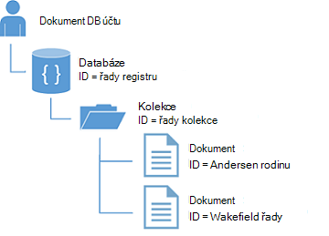

<properties
  pageTitle="Kurz NoSQL Node.js pro DocumentDB | Microsoft Azure"
  description="Kurz NoSQL Node.js, který vytvoří uzel databáze a konzoly aplikace pomocí DocumentDB Node.js SDK. DocumentDB je NoSQL databáze pro JSON."
    keywords="Node.js kurzu uzel databáze"
  services="documentdb"
  documentationCenter="node.js"
  authors="AndrewHoh"
  manager="jhubbard"
  editor="monicar"/>

<tags
  ms.service="documentdb"
  ms.workload="data-services"
  ms.tgt_pltfrm="na"
  ms.devlang="node"
  ms.topic="hero-article"
  ms.date="08/11/2016"
  ms.author="anhoh"/>

# <a name="nosql-nodejs-tutorial-documentdb-nodejs-console-application"></a>Kurz NoSQL Node.js: DocumentDB Node.js konzoly aplikace  

> [AZURE.SELECTOR]
- [.NET](documentdb-get-started.md)
- [Node.js](documentdb-nodejs-get-started.md)

Vítá vás kurz Node.js pro Azure DocumentDB Node.js SDK! Po provedení kroků tohoto kurzu, budete mít aplikaci konzoly, která vytvoří a dotazů DocumentDB zdrojů, včetně uzel databáze.

Budeme se zabývat těmito oblastmi:

- Vytváření a připojení k účtu DocumentDB
- Nastavení aplikace
- Vytvoření databáze uzel
- Vytvoření kolekce
- Vytváření dokumentů JSON
- Dotazování kolekci
- Nahrazení dokumentu
- Odstranění dokumentu
- Odstranění databáze uzel

Nemáte čas? Neboj! Úplné řešení je dostupná na [GitHub](https://github.com/Azure-Samples/documentdb-node-getting-started). Rychlé pokyny naleznete v tématu [získání dokonalé řešení](#GetSolution) .

Po dokončení kurz Node.js, použijte hlasovací tlačítka v horní a dolní části této stránky a sdělte nám svůj názor. Pokud byste chtěli nás kontaktovat přímo, neváhejte zahrnout e-mailové adresy komentáře.

Teď můžeme začít!

## <a name="prerequisites-for-the-nodejs-tutorial"></a>Požadavky na kurz Node.js

Ujistěte se, že budete mít takto:

- Účet Azure active. Pokud nemáte, můžete zaregistrovat [Bezplatnou zkušební verzi Azure](https://azure.microsoft.com/pricing/free-trial/).
- [Node.js](https://nodejs.org/) verze v0.10.29 nebo vyšší.

## <a name="step-1-create-a-documentdb-account"></a>Krok 1: Vytvoření účtu DocumentDB

Vytvoření účtu DocumentDB. Pokud už máte nastavený účet, který chcete použít, můžete přejít dále nastavit [Node.js aplikace](#SetupNode).

[AZURE.INCLUDE [documentdb-create-dbaccount](../../includes/documentdb-create-dbaccount.md)]

## <a id="SetupNode"></a>Krok 2: Nastavte aplikace Node.js

1. Otevřete svůj oblíbený terminál.
2. Vyhledejte složku nebo adresáře místo, kam chcete uložit Node.js aplikace.
3. Vytvořte dva prázdné soubory JavaScriptu pomocí následujících příkazů:
  - Systém Windows:
      * ```fsutil file createnew app.js 0```
        * ```fsutil file createnew config.js 0```
  - Linux X: operační systém
      * ```touch app.js```
        * ```touch config.js```
4. Instalace modulu documentdb prostřednictvím npm. Použijte tento příkaz:
    * ```npm install documentdb --save```

Skvělé! Teď, když budete mít možnost nastavit, Začněme psaní některé kódu.

## <a id="Config"></a>Krok 3: Nastavení konfigurace vaše aplikace

Otevřít ```config.js``` Oblíbené textového editoru.

Poté, kopírovat a Vložit fragment kódu a nastavení vlastností ```config.endpoint``` a ```config.primaryKey``` uri DocumentDB koncového bodu a primární klíč. Obě tyto konfigurace najdete na [Portál Azure](https://portal.azure.com).

![Kurz Node.js – snímek obrazovky s portálem Azure, s účtem DocumentDB s aktivní centrální zvýrazněná, zvýrazněného na zásuvné účtu DocumentDB tlačítka klíče a identifikátor URI, primární klíč a vedlejší klíč hodnoty na zásuvné klíče - databáze uzlu zvýrazněná][keys]

    // ADD THIS PART TO YOUR CODE
    var config = {}

    config.endpoint = "~your DocumentDB endpoint uri here~";
    config.primaryKey = "~your primary key here~";

Kopírování a vkládání ```database id```, ```collection id```, a ```JSON documents``` do vaší ```config``` objekt pod kde nastavíte svůj ```config.endpoint``` a ```config.authKey``` vlastnosti. Pokud už máte data, která chcete uložit do databáze, můžete je DocumentDB [Nástroje pro migraci dat](documentdb-import-data.md) místo přidání definice dokumentu.

    config.endpoint = "~your DocumentDB endpoint uri here~";
    config.primaryKey = "~your primary key here~";

    // ADD THIS PART TO YOUR CODE
    config.database = {
        "id": "FamilyDB"
    };

    config.collection = {
        "id": "FamilyColl"
    };

    config.documents = {
        "Andersen": {
            "id": "Anderson.1",
            "lastName": "Andersen",
            "parents": [{
                "firstName": "Thomas"
            }, {
                    "firstName": "Mary Kay"
                }],
            "children": [{
                "firstName": "Henriette Thaulow",
                "gender": "female",
                "grade": 5,
                "pets": [{
                    "givenName": "Fluffy"
                }]
            }],
            "address": {
                "state": "WA",
                "county": "King",
                "city": "Seattle"
            }
        },
        "Wakefield": {
            "id": "Wakefield.7",
            "parents": [{
                "familyName": "Wakefield",
                "firstName": "Robin"
            }, {
                    "familyName": "Miller",
                    "firstName": "Ben"
                }],
            "children": [{
                "familyName": "Merriam",
                "firstName": "Jesse",
                "gender": "female",
                "grade": 8,
                "pets": [{
                    "givenName": "Goofy"
                }, {
                        "givenName": "Shadow"
                    }]
            }, {
                    "familyName": "Miller",
                    "firstName": "Lisa",
                    "gender": "female",
                    "grade": 1
                }],
            "address": {
                "state": "NY",
                "county": "Manhattan",
                "city": "NY"
            },
            "isRegistered": false
        }
    };


Databáze, shromažďování a definice dokument bude sloužit jako svého DocumentDB ```database id```, ```collection id```a dokumenty data.

Nakonec exportovat vaše ```config``` objektu, tak, aby ho v rámci můžete odkázat ```app.js``` soubor.

            },
            "isRegistered": false
        }
    };

    // ADD THIS PART TO YOUR CODE
    module.exports = config;

##<a id="Connect"></a>Krok 4: Připojení k účtu DocumentDB

Otevřete svůj vyprázdnit ```app.js``` soubor v textovém editoru. Zkopírujte a vložte následující k importu kód ```documentdb``` modul a nově vytvořený ```config``` modul.

    // ADD THIS PART TO YOUR CODE
    "use strict";

    var documentClient = require("documentdb").DocumentClient;
    var config = require("./config");
    var url = require('url');

Zkopírujte a vložte kód použít dříve uložené ```config.endpoint``` a ```config.primaryKey``` k vytvoření nové DocumentClient.

    var config = require("./config");
    var url = require('url');

    // ADD THIS PART TO YOUR CODE
    var client = new documentClient(config.endpoint, { "masterKey": config.primaryKey });

Teď, když máte kód inicializace documentdb klienta, Podívejme se při práci s DocumentDB zdroje.

## <a name="step-5-create-a-node-database"></a>Krok 5: Vytvoření databáze uzel
Zkopírujte a vložte následující nastavení stav protokolu HTTP nebyl nalezen adresu url databáze a adresu url kolekce kód. Tyto adresy URL jsou, jak bude hledat klientovi DocumentDB shromažďování a pravý databází.

    var client = new documentClient(config.endpoint, { "masterKey": config.primaryKey });

    // ADD THIS PART TO YOUR CODE
    var HttpStatusCodes = { NOTFOUND: 404 };
    var databaseUrl = `dbs/${config.database.id}`;
    var collectionUrl = `${databaseUrl}/colls/${config.collection.id}`;

[Databázi](documentdb-resources.md#databases) lze vytvořit pomocí funkce [createDatabase](https://azure.github.io/azure-documentdb-node/DocumentClient.html) třídy **DocumentClient** . Databázi je logické kontejner ukládání dokumentů na oddíly v kolekcích.

Kopírování a vkládání funkci **getDatabase** při vytváření nové databáze v souboru app.js ```id``` v souladu s ```config``` objektu. Funkce kontroloval Pokud databáze se stejnými ```FamilyRegistry``` id dosud neexistuje. Pokud neexistuje, budete vrácených místo abyste vytvářeli novou databázi.

    var collectionUrl = `${databaseUrl}/colls/${config.collection.id}`;

    // ADD THIS PART TO YOUR CODE
    function getDatabase() {
        console.log(`Getting database:\n${config.database.id}\n`);

        return new Promise((resolve, reject) => {
            client.readDatabase(databaseUrl, (err, result) => {
                if (err) {
                    if (err.code == HttpStatusCodes.NOTFOUND) {
                        client.createDatabase(config.database, (err, created) => {
                            if (err) reject(err)
                            else resolve(created);
                        });
                    } else {
                        reject(err);
                    }
                } else {
                    resolve(result);
                }
            });
        });
    }

Zkopírujte a vložte kód pod místo, kam se nastavit funkci **getDatabase** přidáte pomocná funkce **Ukončit** , který bude vytisknout zprávu konec a volání funkce **getDatabase** .

                } else {
                    resolve(result);
                }
            });
        });
    }

    // ADD THIS PART TO YOUR CODE
    function exit(message) {
        console.log(message);
        console.log('Press any key to exit');
        process.stdin.setRawMode(true);
        process.stdin.resume();
        process.stdin.on('data', process.exit.bind(process, 0));
    }

    getDatabase()
    .then(() => { exit(`Completed successfully`); })
    .catch((error) => { exit(`Completed with error ${JSON.stringify(error)}`) });

V terminálu, vyhledejte vaše ```app.js``` souboru a spuštění příkazu:```node app.js```

Blahopřejeme! Úspěšně jste vytvořili DocumentDB databáze.

##<a id="CreateColl"></a>Krok 6: Vytvoření kolekce  

> [AZURE.WARNING] **CreateDocumentCollectionAsync** vytvoří novou kolekci, tato role má ceny důsledky. Podrobné informace navštivte naše [ceny stránky](https://azure.microsoft.com/pricing/details/documentdb/).

[Kolekce](documentdb-resources.md#collections) lze vytvořit pomocí funkce [createCollection](https://azure.github.io/azure-documentdb-node/DocumentClient.html) třídy **DocumentClient** . Kolekce je kontejner JSON dokumentů a přidružené aplikace logiky JavaScript.

Kopírování a vkládání funkci **getCollection** pod funkci **getDatabase** při vytváření nové kolekce s ```id``` v souladu s ```config``` objektu. Znovu jsme budete zkontrolujte kolekce se stejnými ```FamilyCollection``` id dosud neexistuje. Pokud neexistuje, budete vrácených kolekce místo abyste vytvářeli novou.

                } else {
                    resolve(result);
                }
            });
        });
    }

    // ADD THIS PART TO YOUR CODE
    function getCollection() {
        console.log(`Getting collection:\n${config.collection.id}\n`);

        return new Promise((resolve, reject) => {
            client.readCollection(collectionUrl, (err, result) => {
                if (err) {
                    if (err.code == HttpStatusCodes.NOTFOUND) {
                        client.createCollection(databaseUrl, config.collection, { offerThroughput: 400 }, (err, created) => {
                            if (err) reject(err)
                            else resolve(created);
                        });
                    } else {
                        reject(err);
                    }
                } else {
                    resolve(result);
                }
            });
        });
    }

Zkopírujte a vložte kód pod volání **getDatabase** spustit funkci **getCollection** .

    getDatabase()

    // ADD THIS PART TO YOUR CODE
    .then(() => getCollection())
    // ENDS HERE

    .then(() => { exit(`Completed successfully`); })
    .catch((error) => { exit(`Completed with error ${JSON.stringify(error)}`) });

V terminálu, vyhledejte vaše ```app.js``` souboru a spuštění příkazu:```node app.js```

Blahopřejeme! Úspěšně jste vytvořili kolekce DocumentDB.

##<a id="CreateDoc"></a>Krok 7: Vytvoření dokumentu
Pomocí funkce [createDocument](https://azure.github.io/azure-documentdb-node/DocumentClient.html) třídy **DocumentClient** můžete vytvořit [dokument](documentdb-resources.md#documents) . Dokumenty jsou definované uživatelem (libovolného) JSON obsah. Teď můžete vložit dokument do DocumentDB.

Kopírování a vkládání funkci **getFamilyDocument** pod funkci **getCollection** pro vytváření dokumentů obsahující JSON data uložená v ```config``` objektu. Znovu jsme budete zkontrolujte, že dokument se stejným id dosud neexistuje.

                } else {
                    resolve(result);
                }
            });
        });
    }

    // ADD THIS PART TO YOUR CODE
    function getFamilyDocument(document) {
        let documentUrl = `${collectionUrl}/docs/${document.id}`;
        console.log(`Getting document:\n${document.id}\n`);

        return new Promise((resolve, reject) => {
            client.readDocument(documentUrl, { partitionKey: document.district }, (err, result) => {
                if (err) {
                    if (err.code == HttpStatusCodes.NOTFOUND) {
                        client.createDocument(collectionUrl, document, (err, created) => {
                            if (err) reject(err)
                            else resolve(created);
                        });
                    } else {
                        reject(err);
                    }
                } else {
                    resolve(result);
                }
            });
        });
    };

Zkopírujte a vložte kód pod volání **getCollection** spustit funkci **getFamilyDocument** .

    getDatabase()
    .then(() => getCollection())

    // ADD THIS PART TO YOUR CODE
    .then(() => getFamilyDocument(config.documents.Andersen))
    .then(() => getFamilyDocument(config.documents.Wakefield))
    // ENDS HERE

    .then(() => { exit(`Completed successfully`); })
    .catch((error) => { exit(`Completed with error ${JSON.stringify(error)}`) });

V terminálu, vyhledejte vaše ```app.js``` souboru a spuštění příkazu:```node app.js```

Blahopřejeme! Úspěšně jste vytvořili DocumentDB dokumenty.



##<a id="Query"></a>Krok 8: Dotazu DocumentDB zdroje

DocumentDB podporuje [bohaté dotazů](documentdb-sql-query.md) JSON dokumentů uložených v každé kolekce. Následující ukázkový kód zobrazuje dotaz, jehož spuštěním proti dokumenty ve vaší kolekci.

Kopírování a vkládání funkci **queryCollection** pod funkci **getFamilyDocument** . DocumentDB podporuje SQL podobné dotazy, jak je ukázáno v následujícím příkladu. Další informace o vytváření složitých dotazů najdete v článku [Hřišť dotazu](https://www.documentdb.com/sql/demo) a [si přečtěte následující dokumentaci dotazu](documentdb-sql-query.md).

                } else {
                    resolve(result);
                }
            });
        });
    }

    // ADD THIS PART TO YOUR CODE
    function queryCollection() {
        console.log(`Querying collection through index:\n${config.collection.id}`);

        return new Promise((resolve, reject) => {
            client.queryDocuments(
                collectionUrl,
                'SELECT VALUE r.children FROM root r WHERE r.lastName = "Andersen"'
            ).toArray((err, results) => {
                if (err) reject(err)
                else {
                    for (var queryResult of results) {
                        let resultString = JSON.stringify(queryResult);
                        console.log(`\tQuery returned ${resultString}`);
                    }
                    console.log();
                    resolve(results);
                }
            });
        });
    };


Následující obrázek znázorňuje, jak je syntaxe dotazu DocumentDB SQL se nazývá proti kolekci jste vytvořili.


Klíčové slovo [FROM](documentdb-sql-query.md#from-clause) vynechán v dotazu, protože DocumentDB dotazů je už omezené do jednoho kolekce. Proto "Z rodiny f" můžete si místo se "Z kořenového r" nebo jiných proměnná Název zvolte. DocumentDB odvodit této skupiny, kořenovou nebo proměnná název, který jste se rozhodli, odkazovat aktuální kolekci ve výchozím nastavení.

Zkopírujte a vložte kód pod volání **getFamilyDocument** spustit funkci **queryCollection** .

    .then(() => getFamilyDocument(config.documents.Andersen))
    .then(() => getFamilyDocument(config.documents.Wakefield))

    // ADD THIS PART TO YOUR CODE
    .then(() => queryCollection())
    // ENDS HERE

    .then(() => { exit(`Completed successfully`); })
    .catch((error) => { exit(`Completed with error ${JSON.stringify(error)}`) });

V terminálu, vyhledejte vaše ```app.js``` souboru a spuštění příkazu:```node app.js```

Blahopřejeme! Máte úspěšně dotazovaném DocumentDB dokumenty.

##<a id="ReplaceDocument"></a>Krok 9: Nahrazení dokumentu
DocumentDB podporuje nahrazení JSON dokumenty.

Kopírování a vkládání funkci **replaceDocument** pod funkci **queryCollection** .

                    }
                    console.log();
                    resolve(result);
                }
            });
        });
    }

    // ADD THIS PART TO YOUR CODE
    function replaceFamilyDocument(document) {
        let documentUrl = `${collectionUrl}/docs/${document.id}`;
        console.log(`Replacing document:\n${document.id}\n`);
        document.children[0].grade = 6;

        return new Promise((resolve, reject) => {
            client.replaceDocument(documentUrl, document, (err, result) => {
                if (err) reject(err);
                else {
                    resolve(result);
                }
            });
        });
    };

Zkopírujte a vložte kód pod volání **queryCollection** spustit funkci **replaceDocument** . Také přidáte kód pro volání **queryCollection** znovu k ověření, že dokument úspěšně změnil.

    .then(() => getFamilyDocument(config.documents.Andersen))
    .then(() => getFamilyDocument(config.documents.Wakefield))
    .then(() => queryCollection())

    // ADD THIS PART TO YOUR CODE
    .then(() => replaceFamilyDocument(config.documents.Andersen))
    .then(() => queryCollection())
    // ENDS HERE

    .then(() => { exit(`Completed successfully`); })
    .catch((error) => { exit(`Completed with error ${JSON.stringify(error)}`) });

V terminálu, vyhledejte vaše ```app.js``` souboru a spuštění příkazu:```node app.js```

Blahopřejeme! Jste nahradili úspěšně DocumentDB dokumentu.

##<a id="DeleteDocument"></a>Krok 10: Odstranění dokumentu
DocumentDB podporuje odstraňování JSON dokumenty.

Kopírování a vkládání funkci **deleteDocument** pod funkci **replaceDocument** .

                else {
                    resolve(result);
                }
            });
        });
    };

    // ADD THIS PART TO YOUR CODE
    function deleteFamilyDocument(document) {
        let documentUrl = `${collectionUrl}/docs/${document.id}`;
        console.log(`Deleting document:\n${document.id}\n`);

        return new Promise((resolve, reject) => {
            client.deleteDocument(documentUrl, (err, result) => {
                if (err) reject(err);
                else {
                    resolve(result);
                }
            });
        });
    };

Zkopírujte a vložte kód pod volání druhý **queryCollection** spustit funkci **deleteDocument** .

    .then(() => queryCollection())
    .then(() => replaceFamilyDocument(config.documents.Andersen))
    .then(() => queryCollection())

    // ADD THIS PART TO YOUR CODE
    .then(() => deleteFamilyDocument(config.documents.Andersen))
    // ENDS HERE

    .then(() => { exit(`Completed successfully`); })
    .catch((error) => { exit(`Completed with error ${JSON.stringify(error)}`) });

V terminálu, vyhledejte vaše ```app.js``` souboru a spuštění příkazu:```node app.js```

Blahopřejeme! Odstranění dokumentu DocumentDB úspěšně.

##<a id="DeleteDatabase"></a>Krok 11: Odstranění databázi uzel

Odstranění vytvořenou databázi odeberete databázi a všechny podřízené zdroje (kolekce, dokumenty, atd.).

Zkopírujte a vložte následující fragment kódu (funkce **Vyčištění**) odebrat databáze a všechny podřízené zdroje.

                else {
                    resolve(result);
                }
            });
        });
    };

    // ADD THIS PART TO YOUR CODE
    function cleanup() {
        console.log(`Cleaning up by deleting database ${config.database.id}`);

        return new Promise((resolve, reject) => {
            client.deleteDatabase(databaseUrl, (err) => {
                if (err) reject(err)
                else resolve(null);
            });
        });
    }

Zkopírujte a vložte kód pod volání **deleteDocument** spustit funkci **Vyčištění** .

    .then(() => deleteFamilyDocument(config.documents.Andersen))

    // ADD THIS PART TO YOUR CODE
    .then(() => cleanup())
    // ENDS HERE

    .then(() => { exit(`Completed successfully`); })
    .catch((error) => { exit(`Completed with error ${JSON.stringify(error)}`) });

##<a id="Run"></a>Krok 12: Spustit aplikaci Node.js najednou.

Úplně odebrat pořadí pro volání funkce by měl vypadat takto:

    getDatabase()
    .then(() => getCollection())
    .then(() => getFamilyDocument(config.documents.Andersen))
    .then(() => getFamilyDocument(config.documents.Wakefield))
    .then(() => queryCollection())
    .then(() => replaceFamilyDocument(config.documents.Andersen))
    .then(() => queryCollection())
    .then(() => deleteFamilyDocument(config.documents.Andersen))
    .then(() => cleanup())
    .then(() => { exit(`Completed successfully`); })
    .catch((error) => { exit(`Completed with error ${JSON.stringify(error)}`) });

V terminálu, vyhledejte vaše ```app.js``` souboru a spuštění příkazu:```node app.js```

Měli byste vidět výstup Začínáme aplikace získání. Výstup by měly odpovídat následující příklad textu.

    Getting database:
    FamilyDB

    Getting collection:
    FamilyColl

    Getting document:
    Anderson.1

    Getting document:
    Wakefield.7

    Querying collection through index:
    FamilyColl
        Query returned [{"firstName":"Henriette Thaulow","gender":"female","grade":5,"pets":[{"givenName":"Fluffy"}]}]

    Replacing document:
    Anderson.1

    Querying collection through index:
    FamilyColl
        Query returned [{"firstName":"Henriette Thaulow","gender":"female","grade":6,"pets":[{"givenName":"Fluffy"}]}]

    Deleting document:
    Anderson.1

    Cleaning up by deleting database FamilyDB
    Completed successfully
    Press any key to exit

Blahopřejeme! Jste je vytvořili jste dokončili kurz Node.js a má vaše první konzoly aplikace DocumentDB!

## <a id="GetSolution"></a>Získání úplné řešení výuková Node.js
Pokud chcete vytvořit GetStarted řešení, která obsahuje všechny vzorky v tomto článku, budete potřebovat:

-   [Účet DocumentDB][documentdb-create-account].
-   K dispozici na GitHub [GetStarted](https://github.com/Azure-Samples/documentdb-node-getting-started) řešení.

Instalace modulu **documentdb** prostřednictvím npm. Použijte tento příkaz:
* ```npm install documentdb --save```

Další v ```config.js``` soubor, aktualizovat hodnoty config.endpoint a config.authKey podle popisu v [Krok 3: nastavení vaše aplikace konfigurací](#Config).

## <a name="next-steps"></a>Další kroky

-   Chcete složitější výběru Node.js? V tématu [Vytvoření Node.js webové aplikace pomocí DocumentDB](documentdb-nodejs-application.md).
-  Zjistěte, jak [Sledování DocumentDB účtu](documentdb-monitor-accounts.md).
-  Spouštění dotazů týkající se naší ukázkové datové sady v [Dotazu hřišť](https://www.documentdb.com/sql/demo).
-  Další informace o model programování v části vývoje [DocumentDB si přečtěte následující dokumentaci stránky](https://azure.microsoft.com/documentation/services/documentdb/).

[documentdb-create-account]: documentdb-create-account.md
[documentdb-manage]: documentdb-manage.md

[keys]: media/documentdb-nodejs-get-started/node-js-tutorial-keys.png
