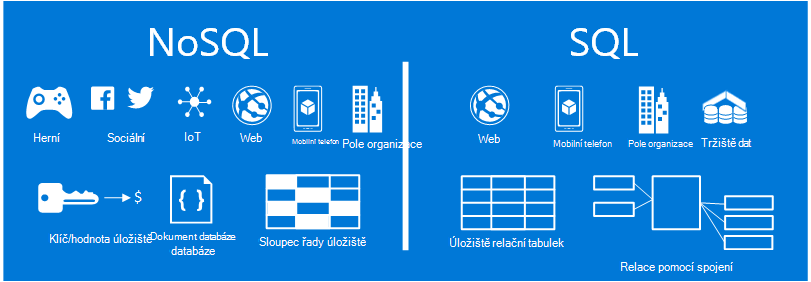
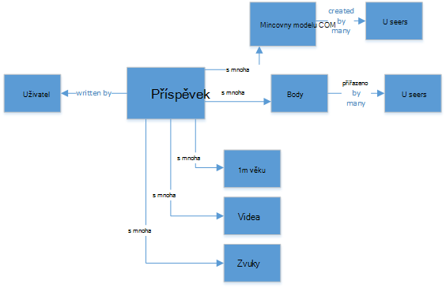
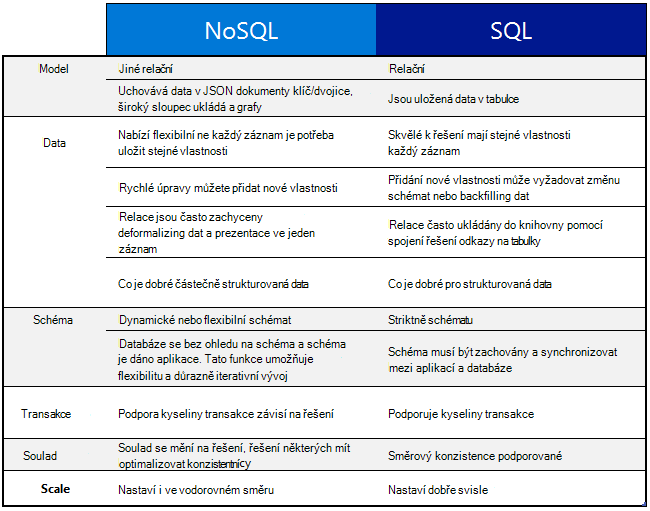
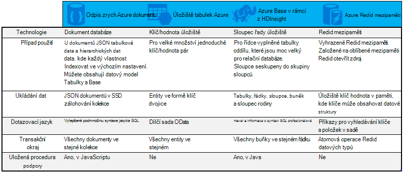

<properties
    pageTitle="Kdy použít NoSQL a SQL | Microsoft Azure"
    description="Porovnejte výhody používání NoSQL-relační řešení a řešení SQL. Zjistěte, jestli jednu ze služby Microsoft Azure NoSQL nebo SQL Server nejlepší vešel nefunguje."
    keywords="nosql a sql, kdy použít NoSQL, nosql a sql"
    services="documentdb"
    documentationCenter=""
    authors="mimig1"
    manager="jhubbard"
    editor=""/>

<tags
    ms.service="documentdb"
    ms.workload="data-services"
    ms.tgt_pltfrm="na"
    ms.devlang="dotnet"
    ms.topic="article" 
    ms.date="06/24/2016"
    ms.author="mimig"/>

# NoSQL a SQL

SQL Server a relační databáze (RDBMS) byly databází přejít do více než dvacet let. Lepší nutnosti zpracuje vyšší svazky a odrůd dat k rychlému tempu však změnil přírodní požadavky na úložiště dat pro vývojáře aplikace. Pokud chcete tento scénář povolení NoSQL databází, které umožňují uložení nestrukturovaná a nesourodými dat ve velkém měřítku získali v oblíbenosti. 

NoSQL je kategorie databází odlišné od SQL databáze. NoSQL se často používá odkázat na systémy řízení dat, které jsou "Není SQL" nebo přístupu k správy dat, který obsahuje "není jen SQL". Existuje celá řada technologií v kategorii NoSQL, včetně dokumentu, ukládá hodnoty klíče, sloupci řady uloženy a grafu databází, které jsou oblíbené s hraní, sociální a IoT aplikace.

Hledání v tomto článku je vám pomůže informace o rozdílech mezi NoSQL a SQL a poskytnout Úvod do nabídky NoSQL a SQL od Microsoftu.  

## Kdy použít NoSQL?

Pojďme si představte, že vytváříte nový web social engagement. Uživatele můžete vytvořit příspěvků a přidejte obrázky, videa a hudbu na ně. Ostatní uživatelé můžete komentovat příspěvků a poskytují bodů (lajky) postup ohodnocení příspěvků. Cílová stránka bude mít informační kanál příspěvky, které uživatelé mohou sdílet a pracovat s nimi. 

Takže jak ukládáte tato data? Pokud znáte SQL, můžete začít kresba přibližně takto:

Takže úplně, takže dobré, ale teď myslete struktury jednoho příspěvek a k jeho zobrazení. Pokud chcete zobrazit příspěvku a přidružené obrázky, zvuk, video, komentářů, bodů a informace o uživateli na webu nebo aplikace, je třeba provést dotaz se osm JOIN jenom k načtení obsah. Teď si představte toku příspěvků, které dynamicky načíst a na obrazovce a můžete snadno předpovídání, že bude požadovat oddělovače tisíců dotazů a mnoho spojení k provedení daného úkolu.

Teď můžete použít relační řešení jako SQL serveru k ukládání dat – ale existuje jinou možnost NoSQL možnost, která usnadňuje přístup. Transformace příspěvek do dokumentu JSON takto a ukládání do DocumentDB, databáze služby Azure NoSQL dokumentu můžete zvýšit výkon a načíst celé příspěvek se jeden dotaz a bez spojení. Je další jednoznačné jednodušší, a další performant výsledek.

    {
        "id":"ew12-res2-234e-544f",
        "title":"post title",
        "date":"2016-01-01",
        "body":"this is an awesome post stored on NoSQL",
        "createdBy":User,
        "images":["http://myfirstimage.png","http://mysecondimage.png"],
        "videos":[
            {"url":"http://myfirstvideo.mp4", "title":"The first video"},
            {"url":"http://mysecondvideo.mp4", "title":"The second video"}
        ],
        "audios":[
            {"url":"http://myfirstaudio.mp3", "title":"The first audio"},
            {"url":"http://mysecondaudio.mp3", "title":"The second audio"}
        ]
    }

Kromě toho tato data můžete rozdělit na oddíly podle id příspěvku povolení data, která chcete rozšiřování přirozeným a využijte výhod NoSQL měřítko vlastnosti. Také NoSQL systémů umožňuje vývojářům zmírnit konzistenci a nabízejí vysoce dostupných aplikací.  Nakonec toto řešení není nutné zadávat vývojářům definovat, Správa a Udržovat schéma ve vrstvě dat umožňuje rychlé iterace.

Je možné vytvářet na tomto řešení použití jiných Azure služeb:

- [Hledání Azure](https://azure.microsoft.com/services/search/) lze pomocí web appu pro umožnění uživatelům vyhledávat příspěvky.
- [Aplikace služby Azure](https://azure.microsoft.com/services/app-service/) mohou sloužit k hostování aplikací a procesy na pozadí.
- [Úložiště objektů Blob Azure](https://azure.microsoft.com/services/storage/) mohou sloužit k ukládání úplné profily včetně obrázků.
- [Databáze SQL Azure](https://azure.microsoft.com/services/sql-database/) mohou sloužit k uložení sešitu velká množství dat, například přihlašovací údaje a data pro analýzu použití.
- [Výukové Azure počítače](https://azure.microsoft.com/services/machine-learning/) mohou sloužit k vytvoření znalosti a měřítka, který můžete poskytnutí zpětné vazby k procesu a pomáhat v pravém uživatelům poskytovat správný obsah.

Tento web social engagement patří jenom jeden scénář, ve kterém je databáze NoSQL správné datového modelu pro daný úkol. Pokud jste zúčastněnými v režimu čtení Další informace o tomto scénáři a jak k modelování dat pro DocumentDB v aplikacích sociálních médií, najdete v článku [Přechod sociální s DocumentDB](documentdb-social-media-apps.md). 

## Porovnání SQL a NoSQL

Následující tabulka porovnává hlavní rozdíly mezi NoSQL a SQL. 

Pokud databázi NoSQL nejlepší vyhovuje vašim požadavkům, pokračujte dál zobrazíte další informace o službách NoSQL z Azure. Jinak, pokud databázi SQL nejlepší vyhovuje vašim potřebám, přejděte ke [jaké nabídky Microsoft SQL?](#what-are-the-microsoft-sql-offerings)

## Jaké jsou nabízené Microsoft Azure NoSQL?

Azure má čtyři plně Správa přístupových práv NoSQL služby: 

- [Azure DocumentDB](https://azure.microsoft.com/services/documentdb/)
- [Úložiště tabulek Azure](https://azure.microsoft.com/services/storage/)
- [Azure HBase jako součást HDInsight](https://azure.microsoft.com/services/hdinsight/)
- [Azure Redis mezipaměti](https://azure.microsoft.com/services/cache/)

Následující srovnávací mapy, klíčové differentiators pro každou službu. Která nejpřesněji popisuje požadavky aplikace? 

Pokud jeden nebo víc z těchto služeb může potřebám aplikace, informace se v následujících zdrojích: 

- [DocumentDB naučná stezka](https://azure.microsoft.com/documentation/learning-paths/documentdb/) a [DocumentDB případy použití](documentdb-use-cases.md)
- [Začínáme s úložiště tabulek Azure](../storage/storage-dotnet-how-to-use-tables.md)
- [Co je HBase v HDInsight](../hdinsight/hdinsight-hbase-overview.md)
- [Redis mezipaměti cesta výuky](https://azure.microsoft.com/documentation/learning-paths/redis-cache/)

Přejděte na [Další kroky](#next-steps) pro informace o bezplatnou zkušební verzi.

## Jaké jsou nabídky Microsoft SQL?

Microsoft obsahuje pět nabídky SQL: 

- [Databáze Azure SQL](https://azure.microsoft.com/services/sql-database/)
- [SQL Server na virtuálních počítačích Azure](https://azure.microsoft.com/services/virtual-machines/sql-server/)
- [SQL Server](https://www.microsoft.com/server-cloud/products/sql-server-2016/)
- [Azure SQL datový sklad (verze Preview)](https://azure.microsoft.com/services/sql-data-warehouse/)
- [Technologie pro analýzu platformu systému (místní zařízení)](https://www.microsoft.com/en-us/server-cloud/products/analytics-platform-system/)

Pokud máte zájem SQL Server na virtuálních počítače nebo databáze SQL, přečtěte si [Zvolte obláčkem možnost SQL Server: databáze SQL Azure (PaaS) nebo SQL Server na Azure VMs (IaaS)](../sql-database/sql-database-paas-vs-sql-server-iaas.md) zobrazíte další informace o rozdílech mezi nimi.

Pokud zvuky SQL, jako je nejlepší možností, potom přejděte k části Další informace o Microsoft SQL produkty a služby pro naše mít nabízet [SQL Server](https://www.microsoft.com/server-cloud/products/) .

Potom přejděte k [dalším krokům](#next-steps) zdarma zkušební verzi a hodnocení odkazy.

## Další kroky

Nemůžeme vás pozvat další informace o produktech SQL a NoSQL tak, že je zdarma vyzkoušet. 

- Pro všechny služby Azure můžete zaregistrovat si [bezplatná zkušební verze měsíčního](https://azure.microsoft.com/pricing/free-trial/) a přijímat 200 $ se vám na některou z Azure služeb.
    - [Azure DocumentDB](https://azure.microsoft.com/services/documentdb/)
    - [Azure HBase jako součást HDInsight](https://azure.microsoft.com/services/hdinsight/)
    - [Azure Redis mezipaměti](https://azure.microsoft.com/services/cache/)
    - [Azure SQL datový sklad (verze Preview)](https://azure.microsoft.com/services/sql-data-warehouse/)
    - [Databáze Azure SQL](https://azure.microsoft.com/services/sql-database/)
    - [Úložiště tabulek Azure](https://azure.microsoft.com/services/storage/)

- Můžete číselník [zkušební verze 2016 SQL Server na virtuálních počítač](https://azure.microsoft.com/marketplace/partners/microsoft/sqlserver2016ctp33evaluationwindowsserver2012r2/) nebo stáhnout [zkušební verze systému SQL Server](https://www.microsoft.com/en-us/evalcenter/evaluate-sql-server-2016).
    - [SQL Server](https://www.microsoft.com/server-cloud/products/sql-server-2016/)
    - [SQL Server na virtuálních počítačích Azure](https://azure.microsoft.com/services/virtual-machines/sql-server/)

