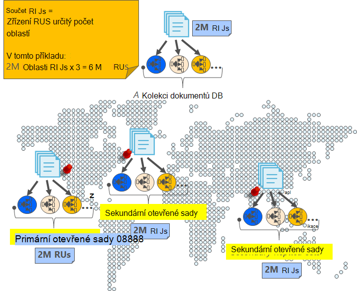
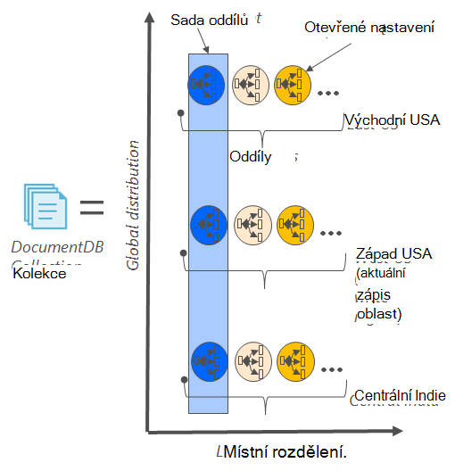
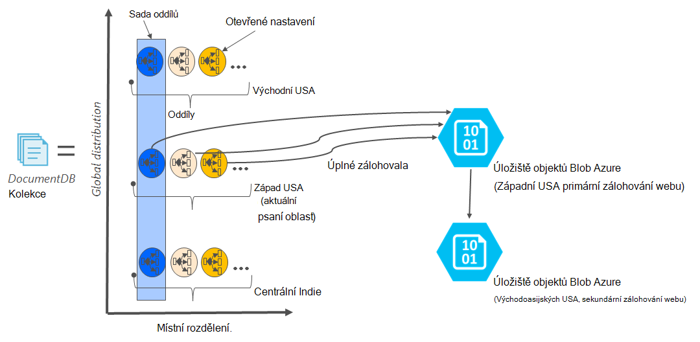

<properties
    pageTitle="Online zálohování a obnovení s DocumentDB | Microsoft Azure"
    description="Zjistěte, jak provádět automatické zálohování a obnovení databáze NoSQL s Azure DocumentDB."
    keywords="zálohování a obnovení, zálohování online"
    services="documentdb"
    documentationCenter=""
    authors="RahulPrasad16"
    manager="jhubbard"
    editor="monicar"/>

<tags
    ms.service="documentdb"
    ms.workload="data-services"
    ms.tgt_pltfrm="na"
    ms.devlang="multiple"
    ms.topic="article"
    ms.date="09/23/2016"
    ms.author="raprasa"/>

# Automatické online zálohování a obnovení s DocumentDB 

Azure DocumentDB automaticky přenese zálohy všechna data v pravidelných intervalech. Automatické zálohování braly beze změny se výkonu a dostupnosti operací databázi NoSQL. Všechny zálohy samostatně uložené v jiné úložiště služby a tyto zálohy jsou globálně replikovat odolnosti proti místní havárie. Automatické zálohování jsou určeny pro scénáře při neúmyslně odstraníte kolekci DocumentDB a novější vyžadují obnovení dat nebo obnovení řešení havárie.  

Tento článek začíná snadné recap redundance dat a dostupnosti v DocumentDB a potom popisuje zálohy. 

## Dostupnost s DocumentDB - recap

DocumentDB je navržen [globálně distributed](documentdb-distribute-data-globally.md) – umožňuje zobrazit výkon napříč několika Azure oblastí spolu s zásad řízený úsilím převzetí a průhledné více homing rozhraní API. Databáze systému nabízející [99,99 % dostupnost rozsahu](https://azure.microsoft.com/support/legal/sla/documentdb/v1_0/)všechny zápisy DocumentDB jsou trvale dbá na místním disku tak, že hlasování replik v rámci místní datovém centru dříve, než potvrdil klientovi. Všimněte si, že dostupnost DocumentDB závisí na místním úložišti a nezávisí na jakékoli externí úložiště technologií. Navíc pokud váš účet databáze souvisí s víc než jedné oblasti Azure, vaše zápisy jsou replikovat přes i jiné oblasti. Zobrazit data výkonu a přístup na zhoršeným čekacích dob, můžete mít jako mnoho číst oblastí přidruženého k vašemu účtu databáze podle potřeby. V jednotlivých oblastech čtení (replikovanou) data trvale uložena v sadě otevřené.  

Jak je ukázáno v následujícím diagramu, je jedné kolekce DocumentDB [vodorovně oddíly](documentdb-partition-data.md). Oddíl"" je označen kruhu v následujícím diagramu a každý oddíl je zpřístupnit pomocí sady otevřené. Jde o místní distribuci v rámci jedné Azure oblasti (symbolem osy X). Kromě toho každý oddíl (s odpovídajícím otevřené nastavenou) je pak globálně rozvržena více oblastí přidruženého k vašemu účtu databáze (například ve tento obrázek tři oblastech – východoasijských USA, západní USA a centrální Indie). "Sady oddílů" je globálně distribuované entity zahrnující více kopií dat v jednotlivých oblastech (symbolem s osou Y). Priority (priorita) můžete přiřadit oblasti přidruženého k vašemu účtu databáze a DocumentDB bude transparentně přepnutí do další oblast v případě havárie. Můžete taky ručně simulovat přepnutí do začátku do konce dostupnosti aplikace.  

Následující obrázek znázorňuje vysoký stupeň redundance s DocumentDB.

## Úplné automatické online zálohování

Ale ne můžu odstranění Moje kolekce nebo v databázi! S DocumentDB nejen dat, ale zálohování dat spočívá vysoce nadbytečné a pružné místní havárie. Automatické zálohy aktuálně přesměrováni zhruba každých čtyři hodin. 

Zálohy přesměrováni beze změny se výkonu a dostupnosti operací databázi. Bez jinými zřizování RUs nebo vliv na výkon a beze změny dostupnost databáze NoSQL DocumentDB trvá zálohování na pozadí. 

Na rozdíl od vašich dat, která je uložena v rámci DocumentDB automatické zálohování uložené v úložišti objektů Blob Azure služby. Zajistit zhoršeným latence/efektivně nahrávání snímek zálohování nahrané na instanci úložiště objektů Blob Azure ve stejné oblasti jako aktuální oblasti zápisu účtu DocumentDB databáze. Pro odolnost proti místního katastrofě každý snímek zálohování dat v úložišti objektů Blob Azure znovu replikovat prostřednictvím geo nadbytečné úložiště (GRS) do jiné oblasti. Na následujícím obrázku vidíte, že v celé kolekci DocumentDB (plus pár všechny tři primární oddíly západní USA, v tomto příkladu) zálohovala vzdálené účtu úložiště objektů Blob Azure západní USA a potom GRS replikovat na východní USA. 

Následující obrázek znázorňuje úplné zálohovala všechny entity DocumentDB v úložišti Azure GRS.

## Doba uchovávání informací pro dané snímek

Jak jsme je popsali výše, doporučujeme pravidelně pořizovat snímky dat a jednoho naše dodržování předpisů, jsme zachovat poslední snímek do 90 dní před jej nakonec získá vyprázdnit. Pokud je Odstraněná kolekce nebo účet, DocumentDB ukládá poslední zálohování 90 dní.

## Obnovení databáze ze zálohování online

V případě, že odstraníte omylem dat, můžete [soubor požadavek podpory můžete](https://portal.azure.com/?#blade/Microsoft_Azure_Support/HelpAndSupportBlade) nebo [zavolejte na linku podpory Azure](https://azure.microsoft.com/support/options/) obnovit data z poslední automatické zálohy. Pro konkrétní snímek zálohu chcete obnovit DocumentDB vyžaduje, aby byla data aspoň dostupné s abychom po celou dobu záložní cyklu pro tento snímek.

## Další kroky

Replikace databáze NoSQL v datacentrech víc, najdete v článku [distribuce globálně při práci s DocumentDB](documentdb-distribute-data-globally.md). 

Soubor kontaktu Azure podpory [soubor lístek z portálu Microsoft Azure](https://portal.azure.com/?#blade/Microsoft_Azure_Support/HelpAndSupportBlade).