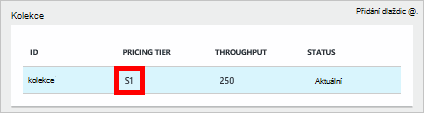
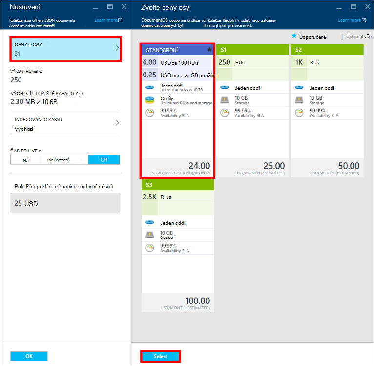
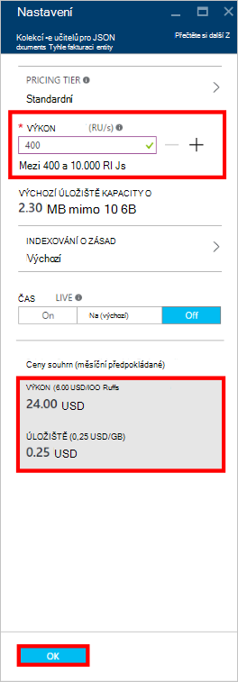
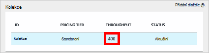

<properties
    pageTitle="Úrovně výkonu při DocumentDB | Microsoft Azure"
    description="Zjistěte, jak úrovně výkonu při DocumentDB umožňují rezervovat výkon na základě za kolekce."
    services="documentdb"
    authors="mimig1"
    manager="jhubbard"
    editor="monicar"
    documentationCenter=""/>

<tags
    ms.service="documentdb"
    ms.workload="data-services"
    ms.tgt_pltfrm="na"
    ms.devlang="na"
    ms.topic="article"
    ms.date="08/26/2016"
    ms.author="mimig"/>

# Úrovně výkonu při DocumentDB

Tento článek obsahuje přehled o výkonu úrovní v [Microsoft Azure DocumentDB](https://azure.microsoft.com/services/documentdb/).

Po přečtení v tomto článku si budete moct odpovězte na následující otázky:  

-   Co je úrovně výkon?
-   Jak je výkon vyhrazená pro účet databáze?
-   Jak fungují s výkonem úrovně
-   Jak mám fakturované úrovní výkon?

## Úvod k úrovně výkonu

Jednotlivé kolekce DocumentDB vytvořené v části standardní účet máte k dispozici s úrovní přidružené výkonu. Každou kolekci v databázi můžete mít různých výkonu úroveň umožňuje určit více výkon často používané kolekcí a nižší výkon Collections zřídka přístup. DocumentDB podporuje obě úrovně uživatelské výkon a předem definované úrovně výkonu.  

Každou úroveň výkonu má limit sazba přidružené [žádost o jednotky (RU)](documentdb-request-units.md) . To je výkon, která bude vyhrazená pro kolekci na základě jeho výkon úrovně a je k dispozici pro tuto kolekci výhradně.

<table border="0" cellspacing="0" cellpadding="0">
    <tbody>
        <tr>
            <td valign="top">

</td>
            <td valign="top">
Podrobnosti
</td>
            <td valign="top">
Limity výkon
</td>
            <td valign="top">
Omezení úložiště
</td>
            <td valign="top">
Verze
</td>
            <td valign="top">
Rozhraní API
</td>            
        </tr>
        <tr>
            <td valign="top">
Uživatelem definované výkonu
</td>
            <td valign="top">
Úložiště podle objemu dat na základě použití v GB.

Výkon v jednotkách 100 RU/s
</td>
            <td valign="top">
Neomezený. 400 - 250 000 požadovat jednotky/s výchozím (vyšší žádost)
</td>
            <td valign="top">
Neomezený. 250 GB ve výchozím nastavení (vyšší žádost) 
</td>
            <td valign="top">
V2
</td>
            <td valign="top">
Rozhraní API 2015-12-16 a novější
</td>  
        </tr>
        <tr>
            <td valign="top">
Předdefinované výkonu
</td>
            <td valign="top">
10 GB vyhrazená úložiště.

S1 = RU 250/s, S2 = RU 1000/s, S3 = 2 500 RU/s
</td>
            <td valign="top">
2 500 RU/s
</td>
            <td valign="top">
10 GB
</td>
            <td valign="top">
V1
</td>
            <td valign="top">
Všechny
</td>  
        </tr>        
    </tbody>
</table>                

DocumentDB umožňuje celá řada databázové operace včetně dotazů, dotazy s funkcí definovaných uživatelem (UDF), uložené procedury a aktivace. Zpracování náklady spojené s každým z těchto akcí se liší v závislosti na využití procesoru, vstupů/výstupů a paměti potřebná k dokončení operace. Místo toho přemýšlíte o a správa prostředcích, si můžete představit jednotky žádost jako jednu míru u zdrojů potřebná k provádění různých operacích databáze a žádosti o služby.

Kolekce můžete vytvořit prostřednictvím [portálu Microsoft Azure](https://portal.azure.com), [Rozhraní REST API](https://msdn.microsoft.com/library/azure/mt489078.aspx) nebo na jakékoli [DocumentDB SDK](https://msdn.microsoft.com/library/azure/dn781482.aspx). Rozhraní API DocumentDB umožňují určit úroveň výkonu kolekce.

> [AZURE.NOTE] Úroveň výkonu kolekce lze upravit prostřednictvím rozhraní API ani na [portál Microsoft Azure](https://portal.azure.com/). Očekává se, že změny na úrovni výkonu dokončení v rámci 3 minuty.

## Nastavení úrovně výkonu Collections
Po vytvoření kolekci úplné rozdělení založené na úrovni určené výkon RUs rezervováno pro kolekci.

Všimněte si, že se obě úrovně výkon definované uživatelem a předdefinovaných funguje DocumentDB podle rezervace výkon. Vytvořením kolekce aplikace rezervoval a je fakturovat pro rezervovaná výkon bez ohledu na to, kolik tento výkon aktivně používá. S uživatelem definovaných výkonu úrovně úložiště je podle objemu dat podle spotřebu, ale s úrovněmi předdefinovaných výkonu 10 GB úložiště vyhrazená při vytvoření kolekce.  

Po vytvoření kolekcí můžete změnit úroveň výkon prostřednictvím SDK DocumentDB nebo klasická portálu Azure.

> [AZURE.IMPORTANT] Standardní DocumentDB kolekce je faktura hodinové sazby a každé kolekce, kterou vytvoříte se vám nebudou účtovat poplatky minimální hodinu použití.

Pokud upravíte úroveň výkonu kolekci v rámci hodiny, které bude vám nebudou účtovat poplatky pro nejvyšší úroveň výkonu nastavit za hodinu. Například pokud zvýšit úroveň výkonu kolekce v 8:53 dopoledne můžete strhne příslušná pro novou úroveň počínaje 8:00 dop. Podobně platí Pokud snížit úroveň výkonu v 8:53 dopoledne Nová sazba se použije na 9:00 dop.

Žádost o jednotky jsou vyhrazená pro každou kolekci založené na úroveň nastavená výkonu. Žádost o Jednotková spotřeba je vyhodnoceno jako za druhý sazba. Aplikace, které překročit sazba jednotky zřizování žádost (nebo úroveň výkonu) na kolekci se sníží dokud sazbu vynechává pod úroveň vyhrazená pro tuto kolekci. Pokud vaše aplikace vyžaduje do vyšší úrovně výkon, můžete zvýšit úroveň výkonu pro každou kolekci.

> [AZURE.NOTE] Jakmile aplikace překročí úrovně výkonu pro jednu nebo více kolekcí, požadavky se sníží na základě za kolekce. To znamená, že některé požadavky aplikace může být úspěšné, zatímco ostatní omezena. Doporučuje se přidat malým počtem poštovních opakované pokusy o omezena pro zpracování vrcholy pole v žádosti o přenos.

## Práce s výkonem úrovně
Kolekce DocumentDB umožňují seskupit data podle vzorce dotazu a výkonu potřebám vaší aplikace. S jeho DocumentDB automatické indexování a podporu dotazů je úplně běžné společně umístit nesourodými dokumenty v rámci stejné kolekce. Klíčové co byste měli zvážit při rozhodování, zda má být použita samostatných kolekcí patří:

- Dotazy – kolekce je obor pro spuštění dotazu. Pokud potřebujete k vytvoření dotazu v sadě dokumentů, co nejefektivněji čtení vzorků pocházet z tyto dokumenty v jedné kolekce.
- Transakce – všechny transakce mají rozsah v rámci jedné kolekce. Pokud máte dokumenty, které musí být aktualizovány v rámci jedné uložené procedury nebo aktivační událost, musí být uloženy v rámci stejné kolekce. Konkrétně klíč oddílu v rámci kolekce je hranici transakce. Další informace najdete v článku [Partitioning v DocumentDB](documentdb-partition-data.md) .
- Výkon izolace – kolekce má úroveň přidružené výkonu. Zajistíte tak, že každé kolekce má předvídatelná výkonu až rezervovaná RUs. Data můžete přidělit různé kolekce s jinou výkon úrovně podle frekvence přístup.

> [AZURE.IMPORTANT] Je důležité pochopit, že bude se vám účtovat úplné standardní sazbou zadaný počet kolekcí vytvořené pomocí aplikace.

Doporučuje se, že aplikace umožňuje použití malým počtem kolekcí, pokud nemáte velké úložiště nebo výkon požadavky. Ujistěte se, že máte dobře pochopitelný aplikace vzorků pro vytvoření nové kolekce. Můžete rezervovat vytvoření kolekce jako správa akce zpracování mimo aplikaci. Úprava úroveň výkonu pro kolekci Podobně se změní hodinovou sazbu pro niž kolekci vám účtovat poplatky. Pokud aplikace nastaví tyto dynamicky byste měli sledovat výkon úrovně kolekce.

## Změna z S1, S2, S3 uživatelem definovaných výkonu

Postupujte podle těchto kroků změníte pomocí předdefinovaných výkon úrovně uživatelské výkon úrovně na portálu Azure. Pomocí uživatelem definovaných výkon úrovně, můžete přizpůsobit vaše výkon vašim potřebám. A pokud stále používáte účet S1, můžete zvýšit výkon vaší výchozí z 250 RU/s 400 RU/s jen pomocí několika kliknutí.

Další informace o ceny související a uživatelem definovaných předdefinovaných výkon změny najdete v blogovém příspěvku [DocumentDB: všechno, co byste měli vědět o používání nové ceny možnosti](https://azure.microsoft.com/blog/documentdb-use-the-new-pricing-options-on-your-existing-collections/).

> [AZURE.VIDEO changedocumentdbcollectionperformance]

1. V prohlížeči přejděte na [**portál Azure**](https://portal.azure.com).
2. Klikněte na tlačítko **Procházet** -> **DocumentDB účty**a pak vyberte DocumentDB účet, který chcete upravit.   
3. V **databázích** lens vyberte databáze, kterou chcete upravit a vyberte kolekci pro úpravy v zásuvné **databáze** . Účty pomocí předdefinovaných výkon mají ceny vrstva S1, S2 nebo S3.

      

4. V zásuvné **kolekce** klikněte na **Další** **Nastavení** na horním panelu.   
5. V **Nastavení** zásuvné klikněte **Ceny osy** a Všimněte si, že se zobrazí měsíční odhadu nákladů pro každý plán zásuvné **Zvolte ceny osy** . Pokud chcete změnit uživatelem definovaných výkonu, klikněte na **Standardní**a potom klikněte na Uložit uložte změnu textu **Vyberte** .

      

6. Po návratu do zásuvné **Nastavení** **Ceny osy** se změní na **Standardní** a zobrazí se pole **výkon (RU/ne)** s výchozí hodnotou 400. Nastavení výkon mezi 400 až 10 000 [požádat o jednotky](documentdb-request-units.md)/second (RU/ne). **Ceny souhrnu** v dolní části stránky se automaticky aktualizuje poskytnout odhad měsíční náklady. Klikněte na **OK** uložte provedené změny.

    

7. Zpět na zásuvné **databáze** můžete ověřit nové výkon kolekce.

    

Pokud se rozhodnete, že budete potřebovat další výkon (větší než 10 000 RU/s) nebo další úložiště (větší než 10GB) můžete vytvořit kolekci oddílů. Vytvoření kolekce rozdělený najdete v tématu [vytvoření kolekce](documentdb-create-collection.md).

>[AZURE.NOTE] Změna úrovně výkonu kolekce může trvat až 2.

## Změna úrovně výkon pomocí .NET SDK

Další možností pro změnu úrovně výkonu vaše kolekce je prostřednictvím naše SDK. Tato část obsahuje pouze změna úroveň výkonu na kolekci pomocí našich [.NET SDK](https://msdn.microsoft.com/library/azure/dn948556.aspx), ale proces je podobný pro naše jiné [SDK](https://msdn.microsoft.com/library/azure/dn781482.aspx). Pokud začínáte naše .NET SDK, navštivte naše [Kurz Začínáme](documentdb-get-started.md).

Tady je fragment kódu pro změnu výkon nabídku více než 50 000 jednotek žádost o sekundu:

    //Fetch the resource to be updated
    Offer offer = client.CreateOfferQuery()
                      .Where(r => r.ResourceLink == collection.SelfLink)    
                      .AsEnumerable()
                      .SingleOrDefault();

    // Set the throughput to 5000 request units per second
    offer = new OfferV2(offer, 5000);

    //Now persist these changes to the database by replacing the original resource
    await client.ReplaceOfferAsync(offer);

    // Set the throughput to S2
    offer = new Offer(offer);
    offer.OfferType = "S2";

    //Now persist these changes to the database by replacing the original resource
    await client.ReplaceOfferAsync(offer);

> [AZURE.NOTE] Kolekce zřízení se v části 10 000 jednotek požadavek na druhý můžete migrovat mezi nabídky s uživatelem definovaných výkon a předdefinovaných výkon (S1, S2, S3) kdykoli. Kolekce, které jsou zřízení s nad 10 000 jednotek požadavek na druhé nelze převést na předdefinované výkon úrovně.

Navštivte [Web MSDN](https://msdn.microsoft.com/library/azure/microsoft.azure.documents.client.documentclient.aspx) zobrazit další příklady a další informace o naše nabídky metod:

- [**ReadOfferAsync**](https://msdn.microsoft.com/library/azure/microsoft.azure.documents.client.documentclient.readofferasync.aspx)
- [**ReadOffersFeedAsync**](https://msdn.microsoft.com/library/azure/microsoft.azure.documents.client.documentclient.readoffersfeedasync.aspx)
- [**ReplaceOfferAsync**](https://msdn.microsoft.com/library/azure/microsoft.azure.documents.client.documentclient.replaceofferasync.aspx)
- [**CreateOfferQuery**](https://msdn.microsoft.com/library/azure/microsoft.azure.documents.linq.documentqueryable.createofferquery.aspx)

## Změna výkon kolekce

Pokud už používáte výkonu definované uživatelem, můžete změnit výkon kolekce webů následujícím způsobem. Pokud potřebujete změnit S1, S2 nebo S3 výkonu úroveň (předdefinovaných výkon) na uživatelem definovaných výkonu, najdete v článku [Změna S1, S2, S3 uživatelské výkon](#changing-performance-levels-using-the-azure-portal).

1. V prohlížeči přejděte na [**portál Azure**](https://portal.azure.com).
2. Klikněte na tlačítko **Procházet** -> **DocumentDB účty**a pak vyberte DocumentDB účet, který chcete upravit.   
3. Na zásuvné **DocumentDB účet** v **databázích** lens vyberte databáze, kterou chcete upravit a vyberte kolekci pro úpravy v zásuvné **databáze** .
4. V zásuvné **kolekce** klikněte na **Nastavení** na horním panelu.   
5. V **Nastavení** zásuvné zvyšte hodnotu v poli **výkon (RU/ne)** a klikněte na **OK** uložte provedenou změnu. **Ceny souhrnu** v dolní části aktualizace zásuvné zobrazit nové odhadovaná měsíční náklady na této kolekce webů v jedné oblasti.

    

Pokud si nejste jisti kolik zvětšíte vaší výkon, najdete v článku [potřebuje Estimating výkon](documentdb-request-units.md#estimating-throughput-needs) a [požádat o kalkulačky jednotku](https://www.documentdb.com/capacityplanner).

## Další kroky

Další informace o ceny a správa dat s Azure DocumentDB, prostudujte si tyto materiály:

- [DocumentDB ceny](https://azure.microsoft.com/pricing/details/documentdb/)
- [Správa DocumentDB kapacity](documentdb-manage.md)
- [Modelování dat v DocumentDB](documentdb-modeling-data.md)
- [Rozdělení data v DocumentDB](documentdb-partition-data.md)
- [Žádost o jednotky](http://go.microsoft.com/fwlink/?LinkId=735027)

Další informace o DocumentDB, najdete v Azure DocumentDB [si přečtěte následující dokumentaci](https://azure.microsoft.com/documentation/services/documentdb/).

Začít s měřítko a testování s DocumentDB výkonu, najdete v článku [Výkon a měřítko testováním pomocí Azure DocumentDB](documentdb-performance-testing.md).

[1]: ./media/documentdb-performance-levels/documentdb-change-collection-performance7-9.png
[2]: ./media/documentdb-performance-levels/documentdb-change-collection-performance10-11.png
