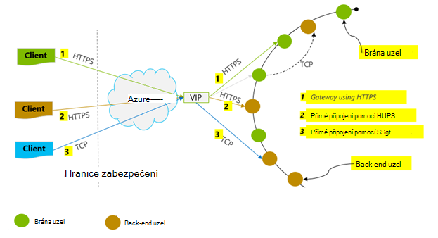
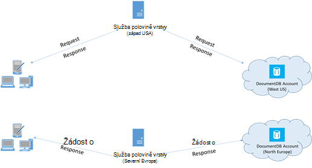

<properties 
    pageTitle="Tipy pro výkon DocumentDB | Microsoft Azure" 
    description="Další možnosti konfigurace klienta pro zvýšení výkonu databáze Azure DocumentDB"
    keywords="jak zvýšit výkon databáze"
    services="documentdb" 
    authors="mimig1" 
    manager="jhubbard" 
    editor="" 
    documentationCenter=""/>

<tags 
    ms.service="documentdb" 
    ms.workload="data-services" 
    ms.tgt_pltfrm="na" 
    ms.devlang="na" 
    ms.topic="article" 
    ms.date="10/17/2016" 
    ms.author="mimig"/>

# Tipy pro DocumentDB výkonu

Azure DocumentDB je rychlé a flexibilní distribuované databázi, která upraví Bezproblémová s zaručené latence a výkon. Nemáte požadované změny hlavní architektura nebo složité kódu zobrazit databáze můžete použít DocumentDB. Změna měřítka nahoru a dolů je stejně snadná jako jedno rozhraní API volání nebo [SDK metoda volání](documentdb-performance-levels.md#changing-performance-levels-using-the-net-sdk). Protože DocumentDB k nim získat přístup prostřednictvím sítě hovory jsou tu ale optimalizace klientských provedený dosáhnout zvýšení výkonu.

Takže Pokud žádáte "jak lze zlepšit výkon mé databáze?" Zvažte následující možnosti:

## Sítě

1. **Zásady připojení: použití přímé připojení režimu**
    
    Jak klient připojí k Azure DocumentDB má důležité důsledky na výkon, zejména z hlediska pozorovanými latence klienta. Dvě klíčové konfigurace nastavení pro nejsou k dispozici konfigurace klienta zásady připojení – připojení *režimu* a [připojení *protokol*](#connection-protocol).  Jsou dva dostupné režimy:

    1. Režim brány (výchozí)
    2. Přímý režim

    Protože DocumentDB je systém distribuované úložiště, DocumentDB zdrojů, jako jsou kolekce jsou oddíly ve více počítačích a každý oddíl replikovat vysoké dostupnosti. Logické fyzické adresy překladu bude k dispozici v směrování tabulky, která lze rovněž interně zdroje.

    V režimu brány počítačích brány DocumentDB provádět tento směrování, což kód klienta je jednoduchý a kompaktní. Klientské aplikaci problémy požadavky na počítačích brány DocumentDB, které přeložit logické URI v žádosti o fyzické adresy uzel back-end a žádost předat dál řádně podporovat.  Naopak v přímý režim klientů musí udržovat – a pravidelně aktualizovat – kopii Tato tabulka směrování a přímo připojit se ke uzly DocumentDB back-end.

    Režim brány je podporována u všech platformách SDK a je nakonfigurované výchozí.  Pokud aplikace běží v rámci podnikové sítě s omezeními zobrazit dotaz striktně bránu firewall, režim brány je nejlepší volbou od použije standardní port HTTPS a jeden koncový bod. Kompromis výkonu je ale, že brány režimu zahrnuje další síťové směrování pokaždé, když dat přečíst nebo došlo k DocumentDB zápisu.   Z toho důvodu nabízí přímý režim lepší výkon kvůli méně směrování sítě.

2. **Zásady připojení: použití protokolu TCP**

    Když využívání přímý režim dvěma způsoby Protocol (protokol) k dispozici:

    - TCP
    - PROTOKOL HTTPS

    DocumentDB nabízí jednoduchý a otevřete RESTful programovací model přes protokol HTTPS. Navíc nabízí efektivně protokolu TCP, který je také RESTful v jeho komunikace modelu je dostupná přes klienta .NET SDK. Přímé protokoly TCP a HTTP použít protokol SSL pro počáteční ověřování a šifrování přenosy. Dosažení nejlepších výsledků dosáhnete protokolu TCP, pokud je to možné. 

    Při použití TCP v režimu brány, TCP Port 443 DocumentDB port označeným je 10250 port rozhraní API MongoDB. Pokud chcete použít TCP přímý režim kromě portů brány, budete muset zajistit port oblast mezi 20000 a 10000 je otevřít, protože DocumentDB používá dynamické porty TCP. Pokud tyto porty nejsou otevřené a pokusíte použít TCP, zobrazí se chyba 503 Služba není k dispozici. 

    Režim připojení nakonfigurovaný během konstrukce instance DocumentClient s parametrem ConnectionPolicy. Pokud je použit přímý režim, můžete v rámci parametr ConnectionPolicy nastavit protokol.

        var serviceEndpoint = new Uri("https://contoso.documents.net");
        var authKey = new "your authKey from Azure Mngt Portal";
        DocumentClient client = new DocumentClient(serviceEndpoint, authKey, 
        new ConnectionPolicy
        {
            ConnectionMode = ConnectionMode.Direct,
            ConnectionProtocol = Protocol.Tcp
        });

    Vzhledem k tomu, že TCP je podporována pouze v přímý režim, když je použita brány režimu, protokol HTTPS vždy slouží ke komunikaci s brány a hodnotu z pole protokol v ConnectionPolicy ignorován.

    

3. **Volání OpenAsync Chcete-li předejít zpoždění při spuštění na první požadavek**

    Ve výchozím nastavení bude první žádost mít vyšší latence protože má vzdáleně tabulce směrování adres. Chcete-li předejít tento zpoždění při spuštění na první žádost, je potřeba zavolat na OpenAsync() jednou během inicializace následujícím způsobem.

        await client.OpenAsync();

4. **Společně umístit klienty ve stejné oblasti Azure výkon**

    Pokud je to možné, umístěte všechny aplikace volání DocumentDB ve stejné oblasti jako DocumentDB databáze. Při porovnávání přibližnou volání DocumentDB ve stejné oblasti dokončení v rámci ms 1-2, ale je latence až na západní pobřeží USA > 50 ms. Tento latence pravděpodobně z žádost o žádost lišit podle toho, směrování žádost jako předá z klienta na hranici Azure datacentra. Nejnižší možné latence zadáváním, že volající aplikace je umístěn v rámci stejné Azure oblasti jako zřizování koncový bod DocumentDB. Seznam dostupných oblastí najdete v článku [Azure oblastí](https://azure.microsoft.com/regions/#services).

    

5. **Zvýšení počtu vláknech nebo úkoly**

    Protože k DocumentDB volání v síti, budete muset tak, aby klientské aplikaci tráví krátce čekání mezi požadavky se liší stupeň paralelismu vašich požadavků. Řekněme, že používáte. Na čistého [Parallel Library úkolu](https://msdn.microsoft.com//library/dd460717.aspx), vytvoření v pořadí 100s úkolů pro čtení a zápis DocumentDB.

## Použití SDK

1. **Nainstalujte nejnovější SDK**

    SDK DocumentDB jsou neustále dochází ke zlepšování poskytnout nejlepší možný výkon. Najdete na stránkách [DocumentDB SDK](documentdb-sdk-dotnet.md) určit posledních SDK a zobrazíte vylepšení. 

2. **Použití klienta DocumentDB jednoznačné dobu trvání aplikace**
  
    Poznámka: pokaždé DocumentClient je vláken provádí Správa efektivně připojení a adresa ukládání do mezipaměti při práci v přímé režimu. Povolit správu efektivně připojení a lepší výkon tak, že DocumentClient, doporučujeme použít jednu instanci DocumentClient jednotlivé domény aplikace dobu trvání aplikace.

3. **Zvětšení System.Net MaxConnections za Host (hostitel)**

    Žádosti o DocumentDB HTTPS/ZBÝVAJÍCÍ převedené ve výchozím nastavení a podléhají výchozí limit připojení na IP adresu nebo název hostitele. Budete muset nastavit MaxConnections na hodnotu vyšší (100-1000) tak, že knihovnu klienta může používat víc současných připojení k DocumentDB. V .NET SDK 1.8.0 nad, výchozí hodnoty pro [ServicePointManager.DefaultConnectionLimit](https://msdn.microsoft.com/library/system.net.servicepointmanager.defaultconnectionlimit.aspx) je 50 a změňte hodnotu, můžete si nastavit [Documents.Client.ConnectionPolicy.MaxConnectionLimit](https://msdn.microsoft.com/en-us/library/azure/microsoft.azure.documents.client.connectionpolicy.maxconnectionlimit.aspx) na hodnotu vyšší.  

4. **Optimalizace paralelní dotazy rozdělený Collections**

     DocumentDB .NET SDK verze 1.9.0 a nad paralelní dotazy podpory, které umožňují dotazu kolekce oddíly současně (najdete v článku [práce s SDK](documentdb-partition-data.md#working-with-the-sdks) a související [ukázek kódu](https://github.com/Azure/azure-documentdb-dotnet/blob/master/samples/code-samples/Queries/Program.cs) pro další informace). Paralelní dotazy slouží ke zlepšení latence dotazu a výkon nad jejich sériové protějšek. Paralelní dotazy poskytují dvěma parametry, které uživatelé můžete doladit vlastní přizpůsobit své požadavky (a) MaxDegreeOfParallelism: Chcete-li určit maximální počet oddílů, než je možné zjistit ve paralelní a (b) MaxBufferedItemCount: k řízení počtu předem načtených výsledků. 
    
    (a) ***Optimalizace MaxDegreeOfParallelism\: *** 
    paralelní funguje dotazu pomocí dotazu více oddílů souběžně. Data z jednotlivých oddílů shromáždit je však získávat sériově týkající dotaz. Ano nastavení MaxDegreeOfParallelism počet oddílů má maximální možnost dosažení většina dotazu performant za předpokladu, že všechny další podmínky systému, zůstávají stejné. Pokud si nejste jisti počet oddílů, můžete nastavit MaxDegreeOfParallelism vysoké číslo a systému bude zvolte minimální (počet oddílů, vstup uživatelem zadaná) jako MaxDegreeOfParallelism. 
    
    Je důležité mít na paměti, že výsledkem paralelní dotazů nejlepší výhod Pokud data rovnoměrně rozvržena všechny oddíly týkající dotaz. Pokud rozdělený kolekce rozdělen je takovým způsobem, nebo jeho část data vrácená dotazem soustředěny v několika oddílů (jeden oddíl v Nejhorší varianta) a potom výkonu dotazu by bottlenecked tyto oddíly. 
    
    (b) ***Optimalizace MaxBufferedItemCount\: *** 
    paralelní dotaz slouží předem načítání výsledků během zpracovávání aktuální sadu výsledků klientem. Předem načítání pomáhá zvyšování Celková latence dotazu. MaxBufferedItemCount je parametr omezení počtu předem načtených výsledky. Nastavení MaxBufferedItemCount očekávaný počet výsledky (nebo vyšší čísla) umožňuje dotazu přijme maximální výhoda od předem načítání. 
    
    Všimněte si, že předem načítání funguje stejně, bez ohledu MaxDegreeOfParallelism a je jediný vyrovnávací paměť data z všechny oddíly.  

5. **Zapnutí na straně serveru ° c**
    
    V některých případech může pomoci snížení četnost uvolnění paměti. V .NET nastavte [gcServer](https://msdn.microsoft.com/library/ms229357.aspx) true (pravda).

6. **Implementace zdvojnásobení intervalech RetryAfter**
 
    Testování výkonu, měli byste zvýšit zatížení dokud získat omezena malé rychlost požadavků. Pokud omezena, klientské aplikace by zdvojnásobení na omezení pro interval zadán server opakování. Respektovat zdvojnásobení zaručuje věnovat minimální množství času čekání mezi opakování. Podpora zásad opakovat je součástí verze 1.8.0 a nad DocumentDB [.NET](documentdb-sdk-dotnet.md) a [Java](documentdb-sdk-java.md)a verze 1.9.0 hodnoty i všech [Node.js](documentdb-sdk-node.md) a [Python](documentdb-sdk-python.md). Další informace najdete v tématu [limity Exceeding rezervovaná výkon](documentdb-request-units.md#exceeding-reserved-throughput-limits) a [RetryAfter](https://msdn.microsoft.com/library/microsoft.azure.documents.documentclientexception.retryafter.aspx).

7. **Rozšiřování pracovní zátěž vašeho klienta**

    Pokud testujete úrovni vysoký výkon (> 50 000 RU/s), klientské aplikace se může stát kritický kvůli počítače omezení na využití procesoru nebo k síti. Když dostanete tento bodu, můžete dál nabízená účtu DocumentDB dál tak, že rozšiřování klientské aplikace na více serverech.

8. **Dokument URI nižší čtení latence do mezipaměti**

    Dokument mezipaměti URI kdykoli je to možné pro dosažení nejlepších výsledků pro čtení.

9. **Ladění velikosti stránky pro dotazy/přečtené kanálů RSS pro lepší výkon**

    Při provádění hromadné čtení dokumentů pomocí čtení kanálu funkci (například ReadDocumentFeedAsync) nebo při vydání DocumentDB SQL dotazu, výsledky jsou vráceny Segmentovaný způsobem, pokud je příliš velký. Ve výchozím nastavení výsledky jsou vráceny v blocích 100 položek nebo 1 MB, z těchto omezení přístupů první. 

    Snižte počet sítě zaokrouhlení cest nutný k načtení všechny související výsledky, můžete zvýšit velikost stránky pomocí záhlaví x-ms Maximum--počet položek žádost a až 1 000. V případech, kdy je potřeba zobrazení jenom několik výsledků například, pokud vaše uživatelské rozhraní ani aplikace rozhraní API vrátí jenom 10 výsledků čas, lze také zmenšit velikost stránky na 10 zmenšit výkon spotřebované množství pro čtení a dotazů.

    Může taky nastavte požadovanou velikost stránky pomocí dostupných SDK DocumentDB.  Příklad:
    
        IQueryable<dynamic> authorResults = client.CreateDocumentQuery(documentCollection.SelfLink, "SELECT p.Author FROM Pages p WHERE p.Title = 'About Seattle'", new FeedOptions { MaxItemCount = 1000 });

10. **Zvýšení počtu vláknech nebo úkoly**

    V tématu [zvětšit počet vláknech/úkolů](#increase-threads) v části síť.

## Indexování zásad

1. **Použít pustí indexování pro rychlejší sazby požití čas ve špičce**

    DocumentDB vám umožní určit – na úrovni kolekce – indexování zásady, která umožňuje určete, jestli mají dokumenty v kolekci automaticky indexovat nebo ne.  Kromě toho můžete také mezi synchronní (konzistentní) a asynchronní aktualizace index (opožděné). Index je ve výchozím nastavení synchronní aktuální informace o jednotlivých vložení, nahrazení nebo odstranění dokumentu v kolekci. Režim synchronní umožňuje dotazů přijmout stejné [úrovně konzistence](documentdb-consistency-levels.md) jako čtení dokumentu neprodleně pro indexu "zorientovat".
    
    Považovat za pustí indexování scénáře, ve kterých zápisu dat v roztržení a chcete umořit práce muset indexovat obsah po delší dobu. Pustí indexování lze také efektivně používat zřizování výkon a vyřizovat zápisu požadavky na špičce s minimálními latence. Je důležité si uvědomit, že při zapnuté funkci pustí indexování, výsledky dotazu bude postupně konzistentní bez ohledu na úroveň konzistence nakonfigurován pro účet DocumentDB.

    Proto konzistentní indexování režim (IndexingPolicy.IndexingMode je nastavena na konzistentní) poněkud nejvyšší žádost o poplatku za jednotku za zápisu při Opožděné indexování režim (IndexingPolicy.IndexingMode je nastavena na opožděné) a bez indexování (IndexingPolicy.Automatic je nastavena na hodnotu False) mít nula indexování nákladů v okamžiku zápisu.

2. **Vyloučení indexování pro rychlejší zápisy nepoužitý cesty**

    Indexování zásady společnosti DocumentDB také vám umožní určit které cesty dokumentu zahrnout nebo vyloučit z indexování využitím indexování cesty (IndexingPolicy.IncludedPaths a IndexingPolicy.ExcludedPaths). Použití indexování cesty nabízí vylepšené zápisu výkon a dolní index úložiště scénáře, ve kterých vzorků dotazu je známo, předem jako indexování náklady jsou přímo vazba počet jedinečných cesty indexovat.  Například následující kód znázorňuje (také vyloučit celého oddílu dokumentů dílčí stromová struktura) z indexování pomocí "*" zástupných znaků.

        var collection = new DocumentCollection { Id = "excludedPathCollection" };
        collection.IndexingPolicy.IncludedPaths.Add(new IncludedPath { Path = "/*" });
        collection.IndexingPolicy.ExcludedPaths.Add(new ExcludedPath { Path = "/nonIndexedContent/*");
        collection = await client.CreateDocumentCollectionAsync(UriFactory.CreateDatabaseUri("db"), excluded);

    Další informace najdete v tématu [zásady indexování DocumentDB](documentdb-indexing-policies.md).

## Výkon

1. **Změřte a ladění nižší požadavku na jednotky/druhé použití**

    DocumentDB nabízí celá řada databázové operace včetně relační a hierarchických dotazů pomocí funkce definované uživatelem, uložené procedury a aktivace – všechny pracovním na dokumentech v rámci kolekce databáze. Náklady spojené s každým z těchto akcí se liší podle procesoru, vstupu a výstupu a paměti potřebná k dokončení operace. Místo přemýšlet o a správě prostředcích můžete představit žádost o jednotky (RU) jako jednu míru pro materiály potřebné k provádění různých operacích databáze a služby na žádost aplikace.

    [Žádost o jednotky](documentdb-request-units.md) jsou k dispozici pro každý účet databáze zadaný počet jednotek kapacity, které jste si zakoupili. Žádost o Jednotková spotřeba je vyhodnoceno jako sazbu vztaženou na druhé. Aplikace, které překročit zřizování žádost jednotku pro svůj účet je omezené, dokud rychlosti vynechává pod úroveň vyhrazená pro účet. Pokud aplikace vyžaduje do vyšší úrovně výkon, můžete si koupit další kapacitu jednotky.

    Kolik požádat o jednotky jsou pro operaci spotřebované množství má vliv složitost dotazu. Počet predikáty, druh predikáty počet funkce definované uživatelem a velikost zdroj uvedenou množinu dat všechny ovlivnit nákladů dotazu.

    Změřit režijních všechny operace (vytvoření, aktualizace nebo odstranění), zkontrolovat záhlaví x ms žádost o bezplatné (nebo rovnocenný RequestCharge vlastností v ResourceResponse<T> nebo FeedResponse<T> v .NET SDK) změřit počet jednotek žádost o využívané tyto operace.

        // Measure the performance (request units) of writes
        ResourceResponse<Document> response = await client.CreateDocumentAsync(collectionSelfLink, myDocument);
        Console.WriteLine("Insert of document consumed {0} request units", response.RequestCharge);
        // Measure the performance (request units) of queries
        IDocumentQuery<dynamic> queryable = client.CreateDocumentQuery(collectionSelfLink, queryString).AsDocumentQuery();
        while (queryable.HasMoreResults)
             {
                  FeedResponse<dynamic> queryResponse = await queryable.ExecuteNextAsync<dynamic>();
                  Console.WriteLine("Query batch consumed {0} request units", queryResponse.RequestCharge);
             }
        
    Žádost o poplatek vrácený v toto záhlaví je zlomek zřizování výkon (tedy 2000 RUs druhé). Například pokud nahoře query vrátí 1000 1KB dokumenty, náklady operace budou 1 000. Jako takové jedné sekundy respektuje serveru pouze dva tyto požadavky před omezení následující požadavky. Další informace najdete v tématu [žádost o jednotky](documentdb-request-units.md) a [jednotky kalkulačky žádosti o](https://www.documentdb.com/capacityplanner).

2. **Úchyt pro kurz omezení/žádost sazba je příliš velký**

    Při pokusu klienta překročit rezervovaná výkon pro účet, mívají žádné snížení výkonu na serveru bez použití kapacitu mimo úroveň rezervovaná. Server preventivně ukončit žádost o RequestRateTooLarge (HTTP stavový kód 429) a vrácená záhlaví x-ms opakování – po ms označující dobu v milisekundách, které uživatel musí čekat, než neúspěšných žádost.
 
        HTTP Status 429,
        Status Line: RequestRateTooLarge
        x-ms-retry-after-ms :100

    SDK všechny implicitně zachytit tato odpověď dodržovat zadán server opakovat po záhlaví a opakování žádosti. Pokud váš účet přistupuje současně více klientů, proběhne úspěšně další opakovat.

    Pokud máte více než jednoho klienta kumulativním způsobem provozní konzistentní nad rychlosti požadavku, nemusí postačovat počet opakování výchozí aktuálně nastavil 9 interně klienta; v tomto případě klienta vyvolá DocumentClientException s stavový kód 429 aplikaci. Počet opakování výchozí mohou měnit nastavení RetryOptions ConnectionPolicy instance. Ve výchozím nastavení DocumentClientException s stavový kód 429 po kumulativní prodleva 30 sekund Pokud vrátí žádost nadále pracovat nad rychlosti požadavku. V takovém i v případě aktuální počet opakování je menší než počet maximální počet opakování, nastavit jako výchozí 9 nebo hodnoty definované uživatelem.

    Při automatické opakování chování pomáhá zlepšit odolnost proti chybám i použitelnost u většiny aplikací, zřejmě široké odds při provádění ukazatele výkonu, zvlášť když měření latence.  Latence pozorovanými klientů bude dosahuje Pokud testu narazí omezení serveru a způsobí, že klienta SDK tiše opakovat. Zabráníte vrcholy pole latence během pokusy výkonu, změřit poplatků vrácené každé operace a ujistěte se, že žádosti o fungují pod sazbu rezervovaná žádost. Další informace najdete v tématu [vyžádání jednotky](documentdb-request-units.md).
   
3. **Návrh pro menší dokumenty pro vyšší výkon**

    Žádost o poplatků (tedy zpracování žádostí o náklady) operace daném je přímo vazba velikosti dokumentu. Operace na velké dokumenty nákladů více než operace pro malé dokumenty.

## Soulad úrovně

1. **Použití méně bezpečné konzistence úrovně pro lepší čtení čekacích dob**

    Jiné důležité faktor vzít v úvahu při ladění výkonu DocumentDB aplikace je konzistence úroveň. Volba konzistence úroveň má vliv na výkon pro čtení i zápis. Konfigurovat výchozí úroveň konzistence na účet databázi a úroveň zvolené konzistence poté použije ke všem kolekcím (ve všech databází) v rámci DocumentDB účtu. Pokud jde o zápisů vliv změny konzistence úroveň pozorovanými jako žádost o zpoždění. Silnější konzistence úrovně se používají, čekacích zápisu dob zvětšíte. Na druhé straně dopad konzistence na úrovni operace čtení pozorovanými z hlediska výkon. Méně bezpečné konzistence, které umožňují vyšší úrovně číst výkon uskutečňovat klientem.

    Ve výchozím nastavení použije čtení a dotazy vystavený zdroje uživatelem definovaných výchozí úroveň konzistence zadanou v účet databázi. Snížit úroveň konzistence specifické pro čtení nebo dotaz však zadáním hlavičky x ms konzistence úrovně. Další informace najdete v tématu [konzistence úrovní v DocumentDB](documentdb-consistency-levels.md).

## Další kroky

Ukázka aplikace použitá k vyhodnocení DocumentDB výkonné scénářích na několik klientských počítačích najdete v článku [Výkon a měřítko testováním pomocí Azure DocumentDB](documentdb-performance-testing.md).

Taky Další informace o vytváření aplikace pro měřítko a vysoký výkon najdete v tématu [Partitioning a stejné měřítko v Azure DocumentDB](documentdb-partition-data.md).
