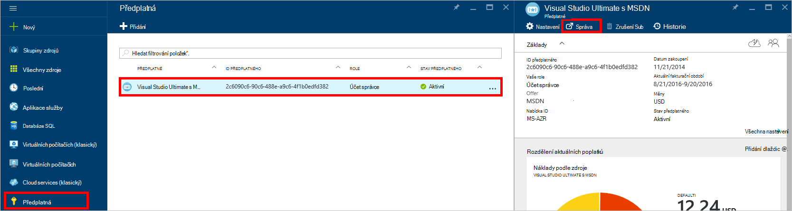
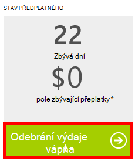

<properties
    pageTitle="Řešení potíží portálu DocumentDB | Microsoft Azure"
    description="Zjistěte, k řešení problémů na portálu DocumentDB Azure." 
    services="documentdb"
    documentationCenter=""
    authors="mimig1"
    manager="jhubbard"
    editor="monicar"/>

<tags
    ms.service="documentdb"
    ms.workload="data-services"
    ms.tgt_pltfrm="na"
    ms.devlang="na"
    ms.topic="article"
    ms.date="08/29/2016"
    ms.author="mimig"/>

# Azure portál DocumentDB tipy pro odstraňování potíží

Tento článek popisuje, jak řešit problémy DocumentDB v portálu Azure. 

## Chybí zdroje

**Příznak**: databází kolekce chybí nebo portálu listy.

**Řešení**: Ztlumením využití aplikace k ovládání v části maximální výkon kvóty kolekce. 

**Vysvětlení**: na portálu je poznamenat do jiného volání shromažďování a DocumentDB databáze. Pokud žádostech jsou jsou aktuálně omezena kvůli hovorů ze samostatné aplikace, portálu mohou také sníží, způsobují zdroje pozor, abyste se zobrazí na portálu. Tento problém vyřešit, adresa příčinu použití vysoce výkonných a pak aktualizujte portálu zásuvné. Informace o tom, jak měřit a nižší výkon použití najdete v části [výkon](documentdb-performance-tips.md#throughput) článku [výkonu](documentdb-performance-tips.md) .
 
## Stránky nebo listy nimi nebude, nenačte

**Příznak**: stránky a listy v portálu se nezobrazují.

**Řešení**: Ztlumením využití aplikace k ovládání v části maximální výkon kvóty kolekce. 

**Vysvětlení**: na portálu je poznamenat do jiného volání shromažďování a DocumentDB databázi. Pokud žádostech jsou jsou aktuálně omezena kvůli hovorů ze samostatné aplikace, portálu může taky sníží, způsobují zdroje pozor, abyste se zobrazí na portálu. Tento problém vyřešit, adresa příčinu použití vysoký výkon a potom aktualizujte portálu zásuvné. Informace o tom, jak měřit a nižší výkon použití najdete v části [výkon](documentdb-performance-tips.md#throughput) článku [výkonu](documentdb-performance-tips.md) .

## Přidat tlačítko kolekce není k dispozici

**Příznak**: na zásuvné databáze na tlačítko **Přidat kolekce** zakázané.

**Vysvětlení**: Pokud předplatné Azure přidružen přeplatky výhody jako bezplatná přeplatky nabízí předplatné MSDN a použili jste všechny vaše přeplatky za měsíc, nemůžete v DocumentDB vytvářet další kolekce.

**Řešení**: Odeberte limit výdajů ze svého účtu.

1. Na portálu Azure v Jumpbar klikněte na **předplatná**, klikněte na předplatné přidružené databáze DocumentDB a v zásuvné **předplatného** klikněte na **Spravovat**. 
    

2. V novém okně prohlížeče zobrazí se již žádné kredity zbývající. Tlačítko **Odebrat výdajů limit** odebrat výdaje pouze aktuální fakturační období nebo donekonečna udržovat. Pak ukončete průvodce žádnou potvrzením údajů o kreditní kartě. 
    

 
## Průzkumník dotazu provede s chybami

V tématu [Poradce při potížích s Explorer dotazu](documentdb-query-collections-query-explorer.md#troubleshoot).

## K dispozici v sledování dlaždice žádná data

V tématu [Poradce při potížích s sledování dlaždice](documentdb-monitor-accounts.md#troubleshooting).

## Žádné dokumentů ve Průzkumník dokumentů

V tématu [Poradce při potížích s Průzkumník dokumentů](documentdb-view-json-document-explorer.md#troubleshoot).

## Další kroky

Pokud jste zaznamenali dál problémy v portálu, e-mailem [askdocdb@microsoft.com](mailto:askdocdb@microsoft.com) o podporu nebo soubor podporu požádat o na portálu klepnutím na tlačítko **Procházet**, **Nápověda + podpory**, a potom klikněte na **vytvořit žádost o podporu**.
