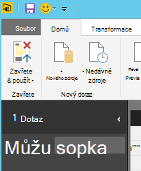
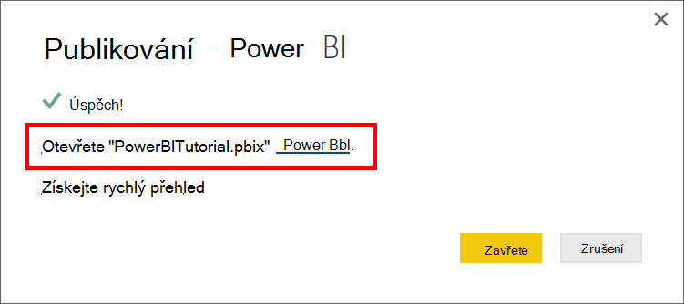

<properties
    pageTitle="Power BI kurz DocumentDB spojnice | Microsoft Azure"
    description="Tento kurz Power BI umožňuje importovat JSON, vytvářet kvalifikovaná sestavy a vizualizace dat pomocí konektoru DocumentDB a Power BI."
    keywords="Power bi kurz, vizualizovat data, power bi spojnice"
    services="documentdb"
    authors="h0n"
    manager="jhubbard"
    editor="mimig"
    documentationCenter=""/>

<tags
    ms.service="documentdb"
    ms.workload="data-services"
    ms.tgt_pltfrm="na"
    ms.devlang="na"
    ms.topic="article"
    ms.date="09/22/2016"
    ms.author="hawong"/>

# Kurz Power BI pro DocumentDB: vizualizace dat pomocí konektoru Power BI

[PowerBI.com](https://powerbi.microsoft.com/) je server nějaké online služby, kde můžete vytvořit a sdílet řídicích panelů a sestav s daty, která je pro vás důležití a vaše organizace.  Power BI Desktop je vyhrazený nástroj, který slouží k načtení dat z různých zdrojů dat, sloučit a transformace dat, vytváření výkonných sestav a vizualizací a publikovat v sestavách Power BI na vytváření sestav.  V rámci nejnovější verze Power BI Desktop již se můžete připojit ke svému účtu DocumentDB prostřednictvím konektoru DocumentDB k Power BI.   

V tomto kurzu Power BI jsme provede jednotlivými kroky k připojení k účtu DocumentDB v Power BI Desktop, přejděte na místo, kam chcete extrahovat data pomocí panelu pro navigaci mezi kolekce, transformace dat JSON do formátu tabulky pomocí editoru dotazů Power BI Desktop vytvářet a publikovat sestavy PowerBI.com.

Po dokončení tohoto kurzu Power BI, byste měli odpovězte na následující otázky:  

-   Jak lze vytvářet sestavy s daty z DocumentDB pomocí Power BI Desktop?
-   Jak se dá připojit k účtu DocumentDB v Power BI Desktop?
-   Jak lze načtení dat z kolekce v Power BI Desktop?
-   Jak lze transformace vnořené JSON dat v Power BI Desktop?
-   Jak lze publikovat a sdílet svůj sestav v PowerBI.com?

## Zjistit předpoklady pro

Před postupujte podle pokynů v tomto kurzu Power BI, ověřte, jestli máte takto:

- [Nejnovější verzi Power BI Desktop](https://powerbi.microsoft.com/desktop).
- Přístup k naše ukázkový účet nebo dat ve vašem účtu Azure DocumentDB.
    - Ukázkový účet je vyplněn sopka data zobrazená v tomto kurzu. Tento účet ukázku není vazby tak, že všechny rozsahu a je určen ukázka pouze pro účely.  Vyhrazuje právo, aby tento účet ukázku včetně, ale bez omezení ukončení účet, změně klíče, omezení, změna přístupu jsme odstranit data, kdykoli bez předem nebo důvod, proč.
        - Adresa URL: https://analytics.documents.azure.com
        - Jen pro čtení klíč: MSr6kt7Gn0YRQbjd6RbTnTt7VHc5ohaAFu7osF0HdyQmfR + YhwCH2D2jcczVIR1LNK3nMPNBD31losN7lQ/fkw ==
    - Nebo pokud chcete vytvořit svůj účet, najdete v tématu [Vytvoření účet DocumentDB databáze pomocí portálu Azure](https://azure.microsoft.com/documentation/articles/documentdb-create-account/). Získat sopka ukázková data, která je podobná k čemu slouží v tomto kurzu (ale neobsahuje bloky GeoJSON), najdete v článku [NOAA webu](https://www.ngdc.noaa.gov/nndc/struts/form?t=102557&s=5&d=5) a pak je naimportujte data pomocí [Nástroje pro migraci dat DocumentDB](https://azure.microsoft.com/documentation/articles/documentdb-import-data/).

Sdílení sestav v PowerBI.com, pokud nemáte účet v PowerBI.com.  Další informace o Power BI pro zdarma a Power BI Pro, navštivte [https://powerbi.microsoft.com/pricing](https://powerbi.microsoft.com/pricing).

## Pusťme se do práce
V tomto kurzu si představte si, že geologist studium vulkány ve světě.  Sopka data se ukládají v účtu DocumentDB a JSON dokumenty vypadat podobné tomuto dole.

    {
        "Volcano Name": "Rainier",
        "Country": "United States",
        "Region": "US-Washington",
        "Location": {
            "type": "Point",
            "coordinates": [
            -121.758,
            46.87
            ]
        },
        "Elevation": 4392,
        "Type": "Stratovolcano",
        "Status": "Dendrochronology",
        "Last Known Eruption": "Last known eruption from 1800-1899, inclusive"
    }

Chcete načíst sopka data z účtu DocumentDB a vizualizace dat v podobné pod interaktivní sestavy Power BI.

Jste připravení vyzkoušejte si to? Pusťme se do práce.

1. Spusťte Power BI Desktop k počítači.
2. Jakmile Power BI Desktop se spustí, zobrazí se *úvodní* obrazovka.

    

3. **Načíst Data**, přečtěte si téma **Nedávným zdrojům**nebo **Otevřít další sestavy** můžete přímo na *úvodní* obrazovce.  Klikněte na X v pravém horním rohu na tuto obrazovku zavřete. Zobrazení **sestavy** Power BI Desktop se zobrazí.

    

4. Vyberte pásu karet **Domů** a potom klikněte na **Načíst Data**.  **Načíst Data** okna objevit.

5. Klepněte na **Azure**, vyberte **Microsoft Azure DocumentDB (verze Beta)**a pak klikněte na **Připojit**.  Okno **Microsoft Azure DocumentDB připojení** objevit.

    

6. Zadejte adresu URL DocumentDB účtu koncový bod se mají k načtení dat z, jak je ukázáno v následujícím příkladu a klikněte na tlačítko **OK**. Získat adresu URL z pole identifikátor URI v zásuvné **[klíče](documentdb-manage-account.md#keys)** portálu Azure nebo můžete použít ukázkový účet, v tomto případě adresa URL je `https://analytics.documents.azure.com`. 

    Nezadáte název databáze, název kolekce a příkazu SQL jako tato pole nejsou povinná.  Místo toho použijeme panelu pro navigaci mezi vyberte databázi a kolekce identifikovat, kde se berou data.

    

7. Pokud se připojujete k této koncový bod poprvé, zobrazí se výzva pro klíč účtu.  Načíst klíč z pole **Primární klíč** v zásuvné **[jen pro čtení klíče](documentdb-manage-account.md#keys)** portálu Azure nebo můžete použít účet ukázku, ve kterém je případ klávesu `RcEBrRI2xVnlWheejXncHId6QRcKdCGQSW6uSUEgroYBWVnujW3YWvgiG2ePZ0P0TppsrMgscoxsO7cf6mOpcA==`. Zadejte klíč účtu a klikněte na **Připojit**.

    Doporučujeme, abyste při vytváření sestav pomocí klávesy jen pro čtení.  Zabráníte nepotřebných působení hlavní klíč potenciální zabezpečení rizikové. Není k dispozici z [klíče](documentdb-manage-account.md#keys) zásuvné portálu Azure klíč jen pro čtení nebo můžete použít informací o účtu ukázku nad.

    

8. Po úspěšném připojení účtu se zobrazí **Tabulka** .  **Tabulka** se zobrazí seznam databází pod účtem.
9. Klikněte na a rozbalte databázi, kde bude pocházet data pro sestavu, pokud používáte účet ukázku, vyberte **volcanodb**.   

10. Teď vyberte skupinu, které bude načtení dat z. Pokud používáte účet ukázku, vyberte **volcano1**.

    Podokno náhledu se zobrazí seznam položek **záznamu** .  Dokument je vyjádřených jako typ **záznamu** v Power BI. Podobně vnořené blok JSON uvnitř dokumentu se také **záznamu**.

    

11. Klepnutím na tlačítko **Upravit** tak, aby jsme transformace dat spuštění editoru dotazů.

## Sloučení a transformace JSON dokumentů
1. V Power BI editoru dotazů, měli byste vidět **dokument** sloupce v prostředním podokně.

2. Klikněte na rozbalovací na pravé straně záhlaví sloupce **dokumentu** .  Místní nabídky se seznamem polí, která se zobrazí.  Vyberte pole, které potřebujete pro sestavu, například název sopka, země, oblasti, umístění, zvýšení, typ, stav a poslední erupcí vědět a potom klikněte na **OK**.

    

3. Pole vybraná v prostředním podokně se zobrazí náhled výsledků.

    

4. V našem příkladu je vlastnost umístění blok GeoJSON v dokumentu.  Jak vidíte, umístění vyjádřených jako typ **záznamu** v Power BI Desktop.  
5. Klikněte na rozbalovací na pravé straně záhlaví sloupce umístění.  Místní nabídka s poli Typ a souřadnice se zobrazí.  Pojďme vyberte pole souřadnice a klikněte na **OK**.

    

6. V prostředním podokně nyní zobrazuje souřadnice sloupce typu **seznamu** .  Jak je vidět na začátku tohoto kurzu, GeoJSON data v tomto kurzu se typu bod šířky a délky hodnoty zaznamenané v poli souřadnice.

    Element souřadnice [0] představuje délky, zatímco souřadnice [1] představuje šířky.
    

7. Pokud chcete sloučit pole souřadnice, vytvoříte **Vlastní sloupec** s názvem LatLong.  Vyberte pásu karet **Přidat sloupec** a klikněte na **Přidat vlastní sloupec**.  Okno **Přidání vlastní sloupec** objevit.

8. Zadejte název pro nový sloupec, například LatLong.

9. Potom zadejte vlastní vzorec pro nový sloupec.  Pro zpět k našemu příkladu jsme concatenate šířky a délky hodnoty oddělené čárkou, jak je ukázáno v následujícím příkladu podle následujícího vzorce: `Text.From([Document.Location.coordinates]{1})&","&Text.From([Document.Location.coordinates]{0})`. Klikněte na **OK**.

    Další informace o výrazů DAX (Data Analysis) včetně funkcí jazyka DAX získáte [Základní DAX v Power BI Desktop](https://support.powerbi.com/knowledgebase/articles/554619-dax-basics-in-power-bi-desktop).

    

10. V prostředním podokně teď zobrazí nový sloupec LatLong vyplněné šířky a délky hodnoty oddělené čárkou.

    

    Pokud se zobrazí chyba v novém sloupci, zkontrolujte, že použité kroky v části Nastavení dotazu odpovídat na následujícím obrázku:

    

    Pokud vaše kroky se můžou lišit, odstraňte dodatečné kroky a zkuste znova přidat vlastní sloupec. 

11. Teď můžeme dokončili sloučení dat do formátu tabulky.  Můžete využít všechny funkce jsou dostupné v editoru dotazů k obrazci a transformace dat v DocumentDB.  Pokud používáte vzorku, změníte datový typ pro zvýšení **celé** číslo **Datový typ** na pásu karet **pro domácnosti** .

    

12. Klikněte na **Zavřít a použít** uložte do datového modelu.

    

## Vytvoření sestavy
Power BI Desktop zobrazení je, kde můžete začít vytvářet sestavy vizualizace dat.  Vytváření sestav přetažením polí do **sestavy** plátno.

V zobrazení sestavy byste měli vyhledat:

 1. Podokno **pole** jedná, kde uvidíte seznam datové modely s poli můžete použít pro sestavy.

 2. Podokno **vizualizace** . Sestavy může obsahovat jeden nebo víc vizualizací.  Vyberte typ vizuální přizpůsobení vašim potřebám z podokna **vizualizace** .

 3. **Sestava** plátno to je místo, kam vytvoříte vizuální prvky pro sestavy.

 4. Na stránce **sestavy** . Přidání více stránek sestavy v Power BI Desktop.

Na následujícím obrázku je základní kroky pro vytvoření jednoduché sestavy interaktivní zobrazení mapy.

1. Zpět k našemu příkladu vytvoříme zobrazení mapy s ukázkou umístění jednotlivých sopka.  V podokně **vizualizace** klikněte na typ vizuální mapy jako zvýrazněný ve výše uvedené snímek.  Měli byste vidět na mapě typ vybarvené na plátno **sestavy** .  V podokně **vizualizace** by měl zobrazit také sadu vlastností souvisejících s vizuální typ mapy.

2. Teď přetažení LatLong pole z podokna **pole** **umístění** vlastnosti v podokně **vizualizace** .
3. Potom přetažením pole Název sopka vlastnost **legendy** .  

4. Potom přetažením pole zvýšení vlastnost **velikost** .  

5. Teď byste měli vidět mapy vizuální zobrazující sadu bubliny označující umístění jednotlivých sopka s velikost každé bubliny vzájemného vztahu zvýšení sopka.

6. Teď vytvoříte základní sestavu.  Sestavu můžete dál přizpůsobit přidáním dalších vizualizací.  V našem případě jsme přidali průřezu sopka typ interaktivity sestavy.  

    

## Publikování a sdílení sestavy
Sdílení sestavy, musí mít účet v PowerBI.com.

1. V Power BI Desktop klikněte na pásu karet **pro domácnosti** .
2. Klikněte na **Publikovat**.  Zobrazí se výzva k zadání uživatelské jméno a heslo účtu PowerBI.com.
3. Po ověření pověření sestavy publikované na vaše cíle, který jste vybrali.
4. Klikněte na **Otevřít "PowerBITutorial.pbix" v Power BI** najdete v článku a sdílet sestavy na PowerBI.com.

    

## Vytvoření řídicího panelu v PowerBI.com

Teď, když máte sestavy, umožňuje sdílet na PowerBI.com

Při publikování sestavy z Power BI Desktop a PowerBI.com vygeneruje **sestavu** a **datovou sadu** ve vašem klientovi PowerBI.com. Například po publikování zprávu s názvem **PowerBITutorial** PowerBI.com uvidíte PowerBITutorial do **sestavy** a **datové sady** oddílů na PowerBI.com.

   

Při vytváření řídicího sdílet, klikněte na tlačítko **Připnout Live stránku** v sestavě PowerBI.com.

   

Postupujte podle pokynů v [Připnout dlaždici ze sestavy služby](https://powerbi.microsoft.com/documentation/powerbi-service-pin-a-tile-to-a-dashboard-from-a-report/#pin-a-tile-from-a-report) k vytvoření nového řídicího panelu. 

Ad hoc úpravy sestavy můžete taky udělat před vytvořením řídicího panelu. Ale doporučujeme používat Power BI Desktop proveďte požadované změny a znovu publikovat sestava PowerBI.com.

## Aktualizace dat v PowerBI.com

Aktualizace dat, ad hoc a plánovanou dvěma způsoby.

Ad hoc aktualizace klikněte jednoduše na eclipses (...) v **sady dat**, například PowerBITutorial. Seznam akcí včetně **Aktualizovat teď**byste měli vidět. Kliknutím na **Aktualizovat** aktualizujte data.

Plánované aktualizace postupujte takto:

1. V seznamu Akce klikněte na **Naplánovat aktualizaci** . 
    

2. Na stránce **Nastavení** domény v rozbalte **zdroje dat přihlašovací údaje**. 

3. Klikněte na **Upravit pověření**. 

    Zobrazí se v rozevírací nabídce konfigurovat. 

4. Zadejte klíč pro připojení k účtu DocumentDB pro tuto sadu dat a potom klikněte na **přihlásit**. 

5. Rozbalte **Naplánovat aktualizaci** a nastavení plánu, které chcete aktualizovat datové sady. 
  
6. Klikněte na **použít** a po dokončení nastavení plánované aktualizace.

## Další kroky
- Další informace o Power BI najdete v tématu [Začínáme s Power BI](https://powerbi.microsoft.com/documentation/powerbi-service-get-started/).
- Další informace o DocumentDB, najdete v článku [si přečtěte následující dokumentaci DocumentDB úvodní stránka](https://azure.microsoft.com/documentation/services/documentdb/).
