<properties
    pageTitle="Vývoj Python baňky webových aplikací s DocumentDB | Microsoft Azure"
    description="Prohlédněte si kurz databáze na používání DocumentDB k ukládání a přístup k datům z webové aplikace Python baňky hostitelem Azure. Najděte řešení vývoj aplikací." 
    keywords="Vývoj aplikací, databázi, python baňky, python webové aplikace, vývoj webu python, documentdb, azure, Microsoft azure"
    services="documentdb"
    documentationCenter="python"
    authors="syamkmsft"
    manager="jhubbard"
    editor="cgronlun"/>

<tags
    ms.service="documentdb"
    ms.workload="data-management"
    ms.tgt_pltfrm="na"
    ms.devlang="python"
    ms.topic="hero-article"
    ms.date="08/25/2016"
    ms.author="syamk"/>

# <a name="python-flask-web-application-development-with-documentdb"></a>Vývoj Python baňky webových aplikací s DocumentDB

> [AZURE.SELECTOR]
- [.NET](documentdb-dotnet-application.md)
- [Node.js](documentdb-nodejs-application.md)
- [Java](documentdb-java-application.md)
- [Python](documentdb-python-application.md)

Tento kurz se dozvíte, jak používat Azure DocumentDB k ukládání a přístup k datům z Python webové aplikace hostitelem Azure a předpokládá, že máte předchozí zkušenosti s používáním Python a Azure weby.

Tento kurz databáze patří:

1. Vytváření a zřízení účtu DocumentDB.
2. Vytvoření aplikace pro Python MVC.
3. Připojení k a Azure DocumentDB pomocí webové aplikace.
4. Nasazení webové aplikace Azure weby.

Provedením tohoto kurzu vytvoříte jednoduché hlasování aplikace, kterou chcete-li hlasovat pro hlasování.

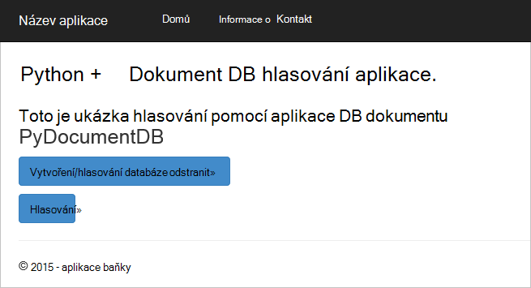


## <a name="database-tutorial-prerequisites"></a>Výuková požadavky databáze

Před postupujte podle pokynů v tomto článku, se ujistěte, jestli máte nainstalovat následující:

- Účet Azure active. Pokud nemáte účet, můžete vytvořit bezplatný účet zkušební v jenom pár minut. Podrobnosti najdete v tématu [Bezplatnou zkušební verzi Azure](https://azure.microsoft.com/pricing/free-trial/).
- [Visual Studio 2013](http://www.visualstudio.com/) nebo vyšší, nebo [Visual Studio Express](), což je bezplatná verze. Pokyny v tomto kurzu jsou určena konkrétně Visual Studio 2015. 
- Nástroje Python for Visual Studio z [GitHub](http://microsoft.github.io/PTVS/). Tento kurz používá Python nástroje pro a 2015. 
- Azure Python SDK for Visual Studio, verze 2,4 nebo vyšší poskytuje společnost [azure.com](https://azure.microsoft.com/downloads/). Microsoft Azure SDK jsme použili pro Python 2.7.
- Python 2.7 z [python.org][2]. Jsme použili Python 2.7.11. 

> [AZURE.IMPORTANT] Pokud instalujete Python 2.7 poprvé, nezapomeňte v okně přizpůsobení Python 2.7.11 vybrat **Přidat python.exe cestu**.
> 
>    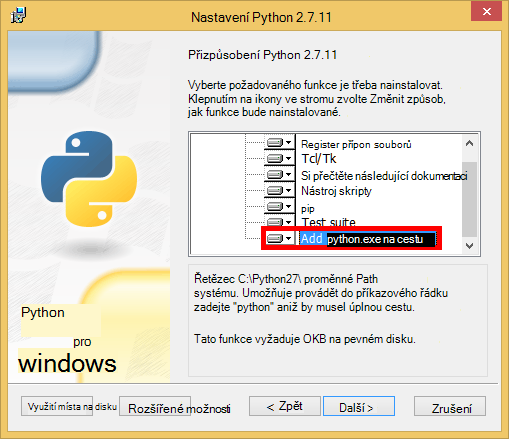

- Microsoft Visual C++ kompilátoru pro Python 2.7 z [Webu služby Stažení softwaru][3].

## <a name="step-1-create-a-documentdb-database-account"></a>Krok 1: Vytvoření účtu DocumentDB databáze

Začneme tím, že vytvoření účtu DocumentDB. Pokud už máte nastavený účet, můžete přejít ke [Krok 2: vytvoření nové webové aplikace Python baňky](#step-2:-create-a-new-python-flask-web-application).

[AZURE.INCLUDE [documentdb-create-dbaccount](../../includes/documentdb-create-dbaccount.md)]

<br/>
Teď můžeme provede jednotlivými postup vytvoření nové webové aplikace Python baňky z důvodu nahoru.

## <a name="step-2-create-a-new-python-flask-web-application"></a>Krok 2: Vytvoření nové webové aplikace Python baňky

1. Ve Visual Studiu, v nabídce **soubor** přejděte na **Nový**a potom klikněte na **projekt**.

    Zobrazí se dialogové okno **Nový projekt** .

2. V levém podokně rozbalte **šablony** a potom **Python**a potom klikněte na **Web**. 

3. Vyberte **Baňky Web projektu** v v prostředním podokně, klikněte na **název** pole Typ **kurz**a potom klikněte na **OK**. Nezapomeňte, že by měl být názvy balíčků Python malá písmena, podle popisu v [Styl Průvodce pro kód Python](https://www.python.org/dev/peps/pep-0008/#package-and-module-names).

    Tato nově Python baňky je webové aplikace vývoj rozhraní, které můžete vytvářet webových aplikací v Python rychleji.

    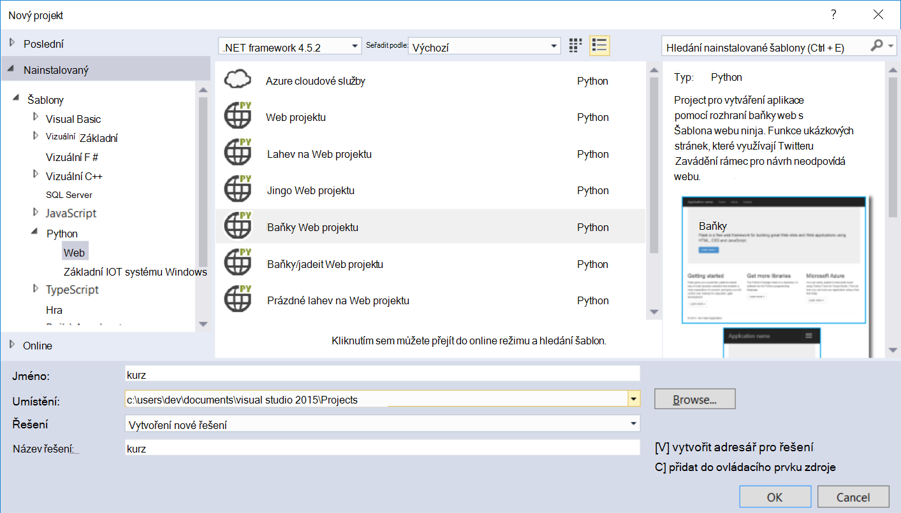

4. V okně **Python Tools for Visual Studio** klikněte na **instalovat do virtuálního prostředí**. 

    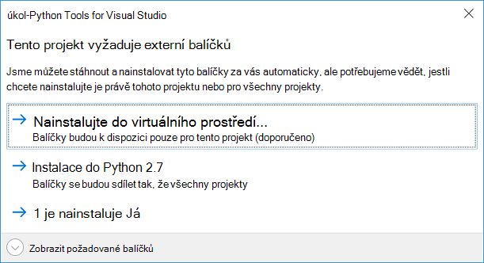

5. V okně **Přidat virtuální prostředí** můžete přijmout výchozí hodnoty a používali Python 2.7 jako základní prostředí PyDocumentDB aktuálně nepodporuje Python 3.x a potom klikněte na **vytvořit**. Nastaví požadované prostředí virtuální Python plánu projektu.

    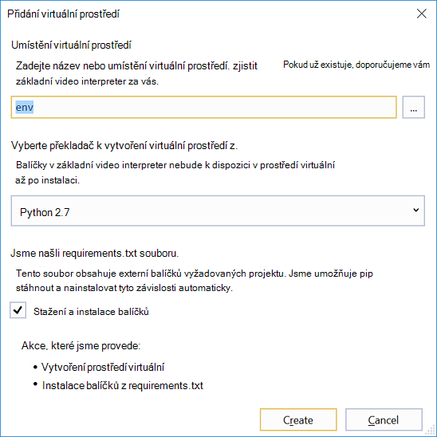

    Zobrazí v okně výstupu `Successfully installed Flask-0.10.1 Jinja2-2.8 MarkupSafe-0.23 Werkzeug-0.11.5 itsdangerous-0.24 'requirements.txt' was installed successfully.` při prostředí úspěšně nainstalovaný.

## <a name="step-3-modify-the-python-flask-web-application"></a>Krok 3: Úprava Python baňky webovou aplikaci

### <a name="add-the-python-flask-packages-to-your-project"></a>Přidání balíčků Python baňky do projektu

Po nastavení projektu musíte přidat vyžadované balíčky baňky do projektu, včetně pydocumentdb, Python balíček pro DocumentDB.

1. V Průzkumníku otevřete soubor s názvem **requirements.txt** a nahraďte obsah takto:

        flask==0.9
        flask-mail==0.7.6
        sqlalchemy==0.7.9
        flask-sqlalchemy==0.16
        sqlalchemy-migrate==0.7.2
        flask-whooshalchemy==0.55a
        flask-wtf==0.8.4
        pytz==2013b
        flask-babel==0.8
        flup
        pydocumentdb>=1.0.0

2. Uložte soubor **requirements.txt** . 
3. V Průzkumníku **Obálka** pravým tlačítkem klikněte na tlačítko **instalovat z requirements.txt**.

    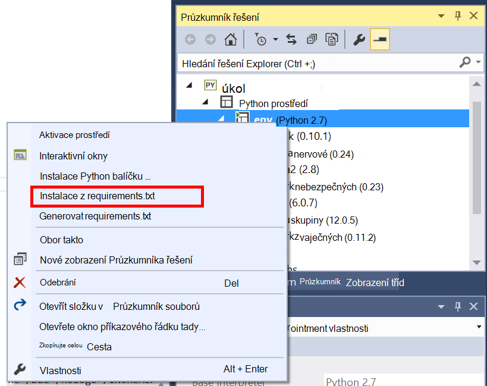

    Po úspěšném instalaci se zobrazí v okně výstupu takto:

        Successfully installed Babel-2.3.2 Tempita-0.5.2 WTForms-2.1 Whoosh-2.7.4 blinker-1.4 decorator-4.0.9 flask-0.9 flask-babel-0.8 flask-mail-0.7.6 flask-sqlalchemy-0.16 flask-whooshalchemy-0.55a0 flask-wtf-0.8.4 flup-1.0.2 pydocumentdb-1.6.1 pytz-2013b0 speaklater-1.3 sqlalchemy-0.7.9 sqlalchemy-migrate-0.7.2

    > [AZURE.NOTE] V některých případech může zobrazit chyba instalace v okně výstupu. V takovém případě zaškrtněte, pokud chyba související s vyčištění. Někdy nezdaří vyčištění, ale instalace nebude úspěšná (posun nahoru v okně výstupu k ověření). Můžete zkontrolovat, že instalace ověřením [virtuální prostředí](#verify-the-virtual-environment). Pokud instalace se nezdařila, ale je ověření úspěšné, je na tlačítko OK.

### <a name="verify-the-virtual-environment"></a>Ověření virtuální prostředí

Podívejme se ujistěte, všechno správně nainstalovaný.

1. Vytvoření řešení podržením klávesy **Ctrl**+**Shift**+**B**.
2. Po úspěšném sestavení začněte webu stisknutím klávesy **F5**. Spustí vývojový server baňky a spustí se webový prohlížeč. Byste měli vidět na následující stránce.

    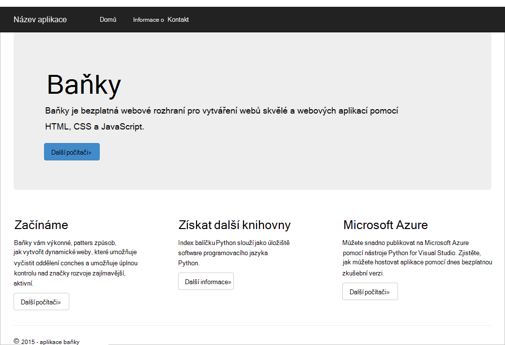

3. Zastavení ladění webu stisknutím kombinace kláves **Shift**+**F5** ve Visual Studiu.

### <a name="create-database-collection-and-document-definitions"></a>Vytvoření databáze, shromažďování a definice dokumentu

Teď Vytvoření hlasování aplikace přidáním nové soubory a aktualizací ostatním.

1. V Průzkumníku klikněte pravým tlačítkem myši na **kurz** projekt, klikněte na tlačítko **Přidat**a potom klikněte na **Nová položka**. Vyberte **Prázdný soubor Python** a zadejte název souboru **forms.py**.  
2. Přidejte následující kód forms.py soubor a potom soubor uložte.

```python
from flask.ext.wtf import Form
from wtforms import RadioField

class VoteForm(Form):
    deploy_preference  = RadioField('Deployment Preference', choices=[
        ('Web Site', 'Web Site'),
        ('Cloud Service', 'Cloud Service'),
        ('Virtual Machine', 'Virtual Machine')], default='Web Site')
```


### <a name="add-the-required-imports-to-viewspy"></a>Přidání požadovaných importy views.py

1. V Průzkumníku rozbalte složku **kurz** a otevřete soubor **views.py** . 
2. Přidejte následující importujte příkazů do horní části souboru **views.py** , a pak soubor uložit. Tyto importovat PythonSDK DocumentDB společnosti a balíčků baňky.

    ```python
    from forms import VoteForm
    import config
    import pydocumentdb.document_client as document_client
    ```


### <a name="create-database-collection-and-document"></a>Vytvoření databáze, shromažďování a dokumentu

- Zůstaňte v **views.py**přidáte následující kód na konci souboru. To má na starosti vytváření databáze využívá formulář. Odstranění všech existující kód v **views.py**. Jednoduše to připojí na konec.

```python
@app.route('/create')
def create():
    """Renders the contact page."""
    client = document_client.DocumentClient(config.DOCUMENTDB_HOST, {'masterKey': config.DOCUMENTDB_KEY})

    # Attempt to delete the database.  This allows this to be used to recreate as well as create
    try:
        db = next((data for data in client.ReadDatabases() if data['id'] == config.DOCUMENTDB_DATABASE))
        client.DeleteDatabase(db['_self'])
    except:
        pass

    # Create database
    db = client.CreateDatabase({ 'id': config.DOCUMENTDB_DATABASE })

    # Create collection
    collection = client.CreateCollection(db['_self'],{ 'id': config.DOCUMENTDB_COLLECTION })

    # Create document
    document = client.CreateDocument(collection['_self'],
        { 'id': config.DOCUMENTDB_DOCUMENT,
          'Web Site': 0,
          'Cloud Service': 0,
          'Virtual Machine': 0,
          'name': config.DOCUMENTDB_DOCUMENT 
        })

    return render_template(
       'create.html',
        title='Create Page',
        year=datetime.now().year,
        message='You just created a new database, collection, and document.  Your old votes have been deleted')
```

> [AZURE.TIP] Metoda **CreateCollection** má volitelné **RequestOptions** jako třetí parametr. Lze použít k určení typu nabízejí kolekce. Pokud je zadána žádná hodnota offerType, pak kolekci se vytvoří pomocí výchozího typu nabízejí. Další informace o typech nabízejí DocumentDB najdete v článku [výkon úrovně v DocumentDB](documentdb-performance-levels.md).


### <a name="read-database-collection-document-and-submit-form"></a>Přečtěte si databáze, kolekce, dokument a odeslat formulář

- Zůstaňte v **views.py**přidejte následující kód konci souboru. To má na starosti nastavení formuláře čtení databáze, shromažďování a dokumentů. Odstranění všech existující kód v **views.py**. Jednoduše to připojí na konec.

```python
@app.route('/vote', methods=['GET', 'POST'])
def vote(): 
    form = VoteForm()
    replaced_document ={}
    if form.validate_on_submit(): # is user submitted vote  
        client = document_client.DocumentClient(config.DOCUMENTDB_HOST, {'masterKey': config.DOCUMENTDB_KEY})

        # Read databases and take first since id should not be duplicated.
        db = next((data for data in client.ReadDatabases() if data['id'] == config.DOCUMENTDB_DATABASE))

        # Read collections and take first since id should not be duplicated.
        coll = next((coll for coll in client.ReadCollections(db['_self']) if coll['id'] == config.DOCUMENTDB_COLLECTION))

        # Read documents and take first since id should not be duplicated.
        doc = next((doc for doc in client.ReadDocuments(coll['_self']) if doc['id'] == config.DOCUMENTDB_DOCUMENT))

        # Take the data from the deploy_preference and increment our database
        doc[form.deploy_preference.data] = doc[form.deploy_preference.data] + 1
        replaced_document = client.ReplaceDocument(doc['_self'], doc)

        # Create a model to pass to results.html
        class VoteObject:
            choices = dict()
            total_votes = 0

        vote_object = VoteObject()
        vote_object.choices = {
            "Web Site" : doc['Web Site'],
            "Cloud Service" : doc['Cloud Service'],
            "Virtual Machine" : doc['Virtual Machine']
        }
        vote_object.total_votes = sum(vote_object.choices.values())

        return render_template(
            'results.html', 
            year=datetime.now().year, 
            vote_object = vote_object)

    else :
        return render_template(
            'vote.html', 
            title = 'Vote',
            year=datetime.now().year,
            form = form)
```


### <a name="create-the-html-files"></a>Vytváření souborů ve formátu HTML

1. V Průzkumníku ve složce **kurz** klikněte pravým tlačítkem myši na složku **šablony** , klikněte na tlačítko **Přidat**a potom klikněte na **Nová položka**. 
2. Vyberte **Stránku HTML**a potom do pole Název zadejte **create.html**. 
3. Opakujte kroky 1 a 2 a vytvořit dva další soubory ve formátu HTML: results.html a vote.html.
4. Přidejte následující kód **create.html** v `<body>` prvek. Zobrazí zprávu s informacemi o tom, že jsme vytvořili novou databázi, shromažďování a dokumentů.

    ```html
    
    
    <h2>{{ title }}.</h2>
    <h3>{{ message }}</h3>
    <p><a href="{{ url_for('vote') }}" class="btn btn-primary btn-large">Vote &raquo;</a></p>
    
    ```

5. Přidejte následující kód **results.html** v `<body`> prvek. Zobrazuje výsledky hlasování.

    ```html
    
    
    <h2>Results of the vote</h2>
        <br />
        
    
    <div class="row">
        <div class="col-sm-5">{{choice}}</div>
            <div class="col-sm-5">
                <div class="progress">
                    <div class="progress-bar" role="progressbar" aria-valuenow="{{vote_object.choices[choice]}}" aria-valuemin="0" aria-valuemax="{{vote_object.total_votes}}" style="width: {{(vote_object.choices[choice]/vote_object.total_votes)*100}}%;">
                                {{vote_object.choices[choice]}}
                </div>
            </div>
            </div>
    </div>
    
    
    <br />
    <a class="btn btn-primary" href="{{ url_for('vote') }}">Vote again?</a>
    
    ```

6. Přidejte následující kód **vote.html** v `<body`> prvek. Zobrazí hlasování a přijme hlasů. K registraci hlasů ovládací prvek předána views.py kde jsme rozpozná cast hlasování a příslušným způsobem přidat dokument.

    ```html
    
    
    <h2>What is your favorite way to host an application on Azure?</h2>
    <form action="" method="post" name="vote">
        {{form.hidden_tag()}}
            {{form.deploy_preference}}
            <button class="btn btn-primary" type="submit">Vote</button>
    </form>
    
    ```

7. Do složky **šablony** nahraďte obsah **index.html** takto. To slouží jako cílovou stránku aplikace.
    
    ```html
    
    
    <h2>Python + DocumentDB Voting Application.</h2>
    <h3>This is a sample DocumentDB voting application using PyDocumentDB</h3>
    <p><a href="{{ url_for('create') }}" class="btn btn-primary btn-large">Create/Clear the Voting Database &raquo;</a></p>
    <p><a href="{{ url_for('vote') }}" class="btn btn-primary btn-large">Vote &raquo;</a></p>
    
    ```

### <a name="add-a-configuration-file-and-change-the-initpy"></a>Přidání konfiguračního souboru a změňte \_ \_inicializace\_\_.py

1. V Průzkumníku klikněte pravým tlačítkem **kurz** projektu, klikněte na **Přidat**, klikněte na **Nová položka**, vyberte **Prázdné Python soubor**a potom zadejte název souboru **config.py**. Konfigurační soubor je potřeba formuláře v baňky. Můžete ji použijete k poskytování tajné klíče. Tento klíč není potřeba pro účely tohoto návodu přes.

2. Přidejte následující kód config.py, budete muset změnit hodnoty **DOCUMENTDB\_hostitele** a **DOCUMENTDB\_klíč** v dalším kroku.

    ```python
    CSRF_ENABLED = True
    SECRET_KEY = 'you-will-never-guess'
    
    DOCUMENTDB_HOST = 'https://YOUR_DOCUMENTDB_NAME.documents.azure.com:443/'
    DOCUMENTDB_KEY = 'YOUR_SECRET_KEY_ENDING_IN_=='
    
    DOCUMENTDB_DATABASE = 'voting database'
    DOCUMENTDB_COLLECTION = 'voting collection'
    DOCUMENTDB_DOCUMENT = 'voting document'
    ```

3. [Azure portál](https://portal.azure.com/)přejděte na zásuvné **klíče** po kliknutí na **Procházet**, **DocumentDB účty**, poklikejte na název účtu použít a potom klikněte na tlačítko **klíčů** v oblasti **Essentials** . V zásuvné **klíče** hodnotu **URI** zkopírovat a vložit ho do souboru **config.py** jako hodnotu **DOCUMENTDB\_hostitele** vlastnost. 
4. Zpět na portálu Azure v zásuvné **klíče** zkopírujte hodnotu **Sekundární klíč**nebo **Primární klíč** a vložte ho **config.py** soubor jako hodnotu **DOCUMENTDB\_klíč** vlastnost.
5. V ** \_ \_inicializace\_\_.py** soubor, přidejte následující řádek. 

        app.config.from_object('config')

    Tak, že obsah souboru:

    ```python
    from flask import Flask
    app = Flask(__name__)
    app.config.from_object('config')
    import tutorial.views
    ```

6. Po přidání všech souborů, Průzkumník řešení by měl vypadat takto:

    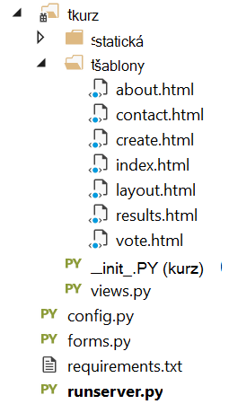


## <a name="step-4-run-your-web-application-locally"></a>Krok 4: Místně webové aplikace

1. Vytvoření řešení podržením klávesy **Ctrl**+**Shift**+**B**.
2. Po úspěšném sestavení začněte webu stisknutím klávesy **F5**. Následující byste měli vidět na obrazovce.

    

3. Klikněte na **Vytvořit nebo zrušit databázi hlasování** generovat databázi.

    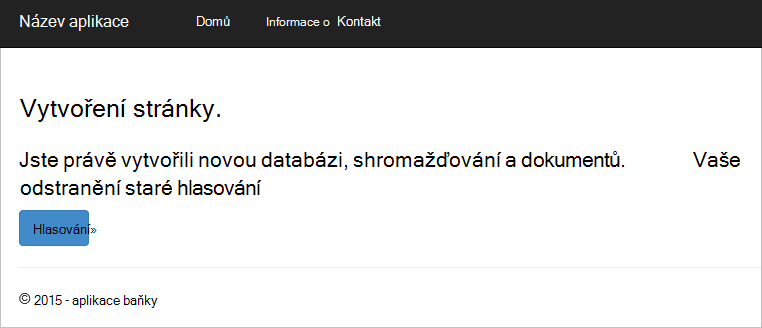

4. Potom klikněte na **hlasování** a vyberte požadovanou možnost.

    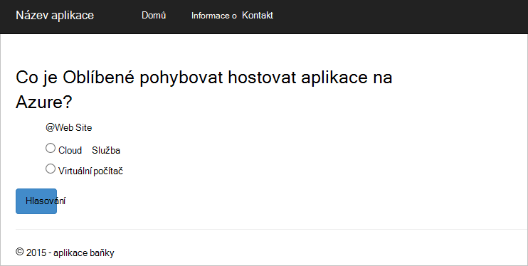

5. Pro každý hlasování, které můžete odevzdat zvýší odpovídající čítač.

    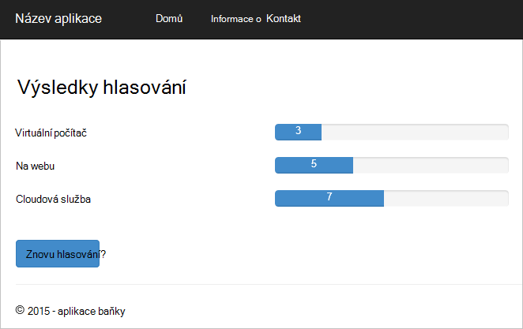

6. Zastavení ladění projektu stisknutím kombinace kláves Shift + F5.

## <a name="step-5-deploy-the-web-application-to-azure-websites"></a>Krok 5: Nasazení webové aplikace na weby Azure

Teď, když máte kompletní aplikaci funguje zařízení správně proti DocumentDB, ukážeme, do kterých se nasadí to Azure weby.

1. Klikněte pravým tlačítkem myši na projekt v Průzkumníku řešení (ujistěte se, že nejste spuštěné ji místně) a vyberte **Publikovat**.  

    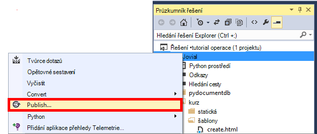

2. V okně **Publikovat Web** vyberte **Microsoft Azure webové aplikace**a potom na tlačítko **Další**.

    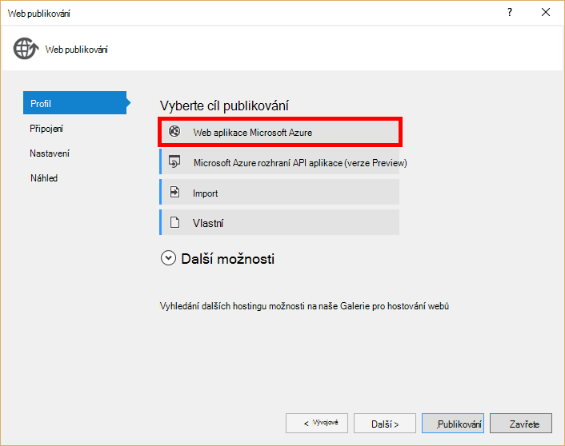

3. V okně **Microsoft Azure webové aplikace okna** klikněte na **Nový**.

    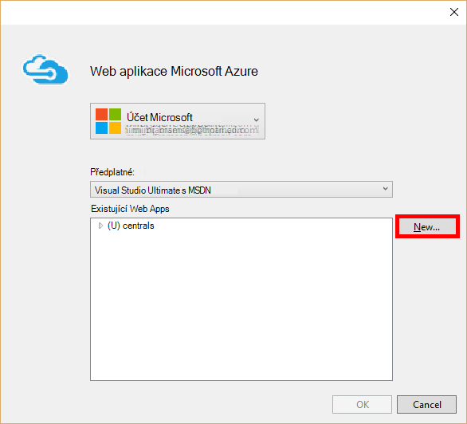

4. V okně **vytvořit web na Microsoft Azure** zadejte **název webové aplikace**, **plán služeb aplikací**, **Skupina zdroje**a **oblast**a potom klikněte na **vytvořit**.

    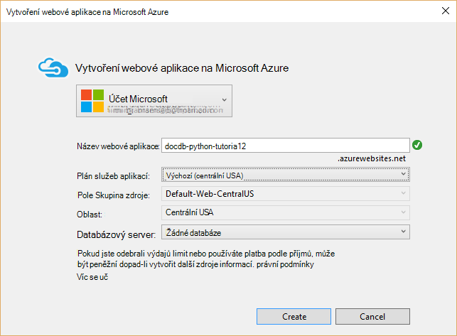

5. V okně **Publikovat Web** klikněte na **Publikovat**.

    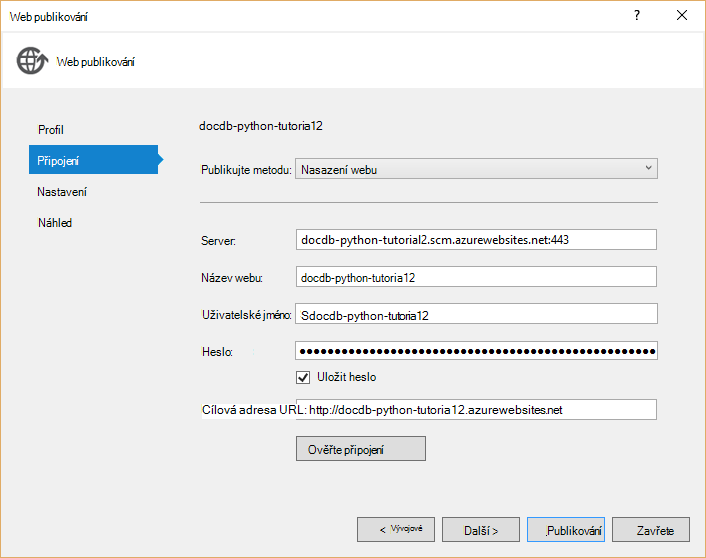

3. Ve chvíli Visual Studio dokončete publikování webové aplikace a spuštění prohlížeče, kde navíc přehledně uvidíte po ruce práce spuštěné v Azure?

## <a name="troubleshooting"></a>Řešení potíží

Pokud to je první Python spuštěné v počítači, zajistit, že následující složky (nebo rovnocenný instalace umístění) jsou součástí proměnná PATH:

    C:\Python27\site-packages;C:\Python27\;C:\Python27\Scripts;

Pokud dojde k chybě na stránku hlasování a názvem projektu, než **kurz**, ujistěte se, že ** \_ \_inicializace\_\_.py** odkazuje na název správné projektu v řádku: `import tutorial.view`.

## <a name="next-steps"></a>Další kroky

Blahopřejeme! Jenom dokončení první Python webové aplikace pomocí Azure DocumentDB a publikované na Azure weby.

Budeme aktualizovat a vylepšovat v tomto tématu často založené na svůj názor.  Jakmile jste dokončili kurz, přejděte prosím pomocí hlasovací tlačítka v horní a dolní části této stránky a nezapomeňte svůj názor na co, který chcete zobrazit vylepšili. Pokud byste chtěli nás kontaktovat přímo, neváhejte zahrnout e-mailové adresy komentáře.

Pokud chcete přidat další funkce webové aplikace, prohlédněte si rozhraní API k dispozici v [DocumentDB Python SDK](documentdb-sdk-python.md).

Další informace o Azure Visual Studia a Python, naleznete v článku [Středisko pro vývojáře Python](https://azure.microsoft.com/develop/python/). 

Další kurzy Python baňky, najdete v článku [světě baňky Mega – kurz, část I: Dobrý den,!](http://blog.miguelgrinberg.com/post/the-flask-mega-tutorial-part-i-hello-world). 

  [Visual Studio Express]: http://www.visualstudio.com/products/visual-studio-express-vs.aspx
  [2]: https://www.python.org/downloads/windows/
  [3]: https://www.microsoft.com/download/details.aspx?id=44266
  [Microsoft Web Platform Installer]: http://www.microsoft.com/web/downloads/platform.aspx
  [Azure portal]: http://portal.azure.com
