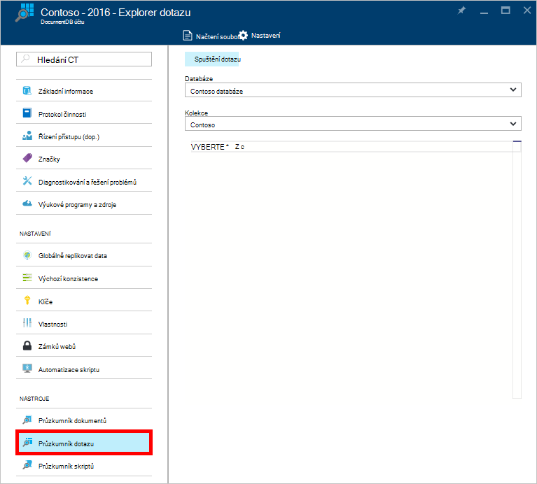
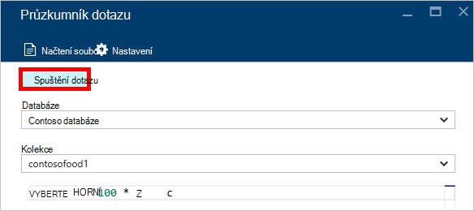
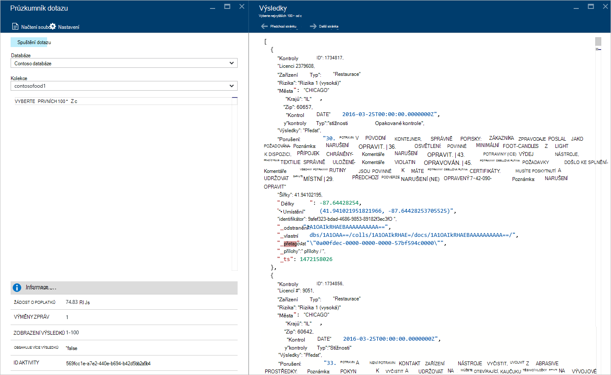
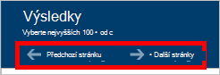
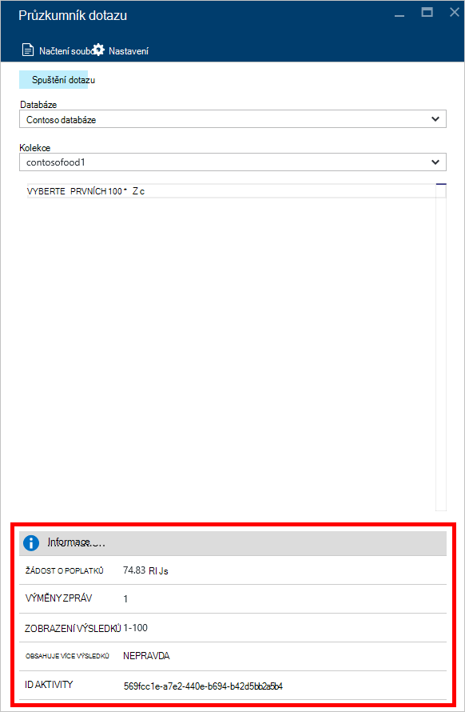
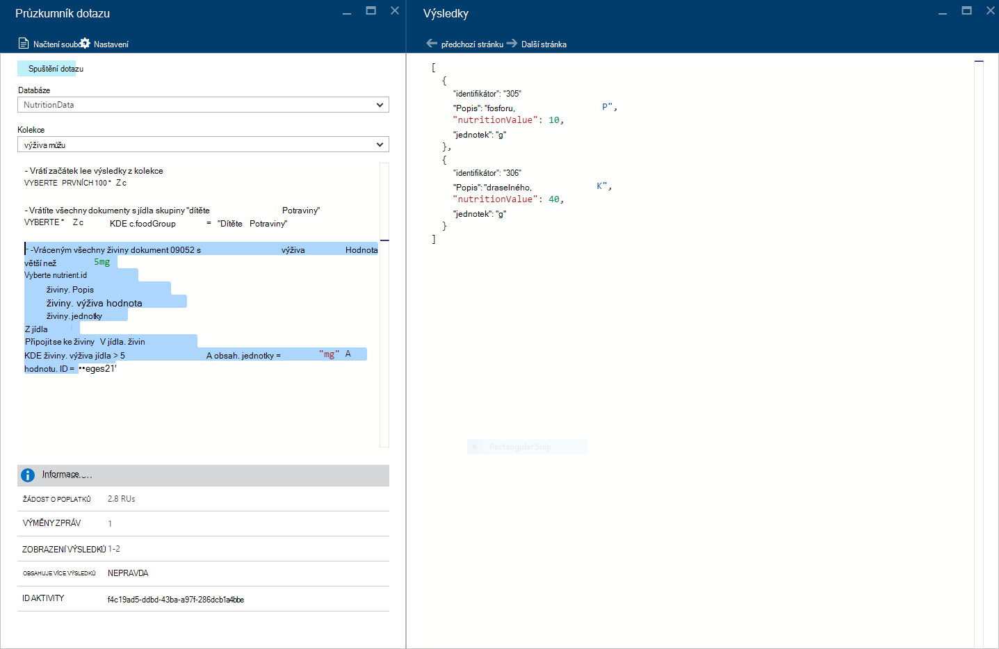
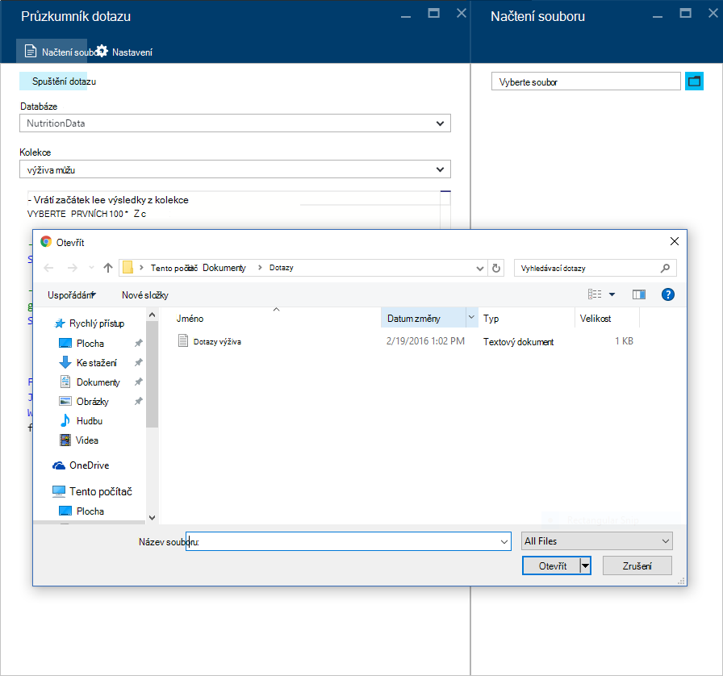
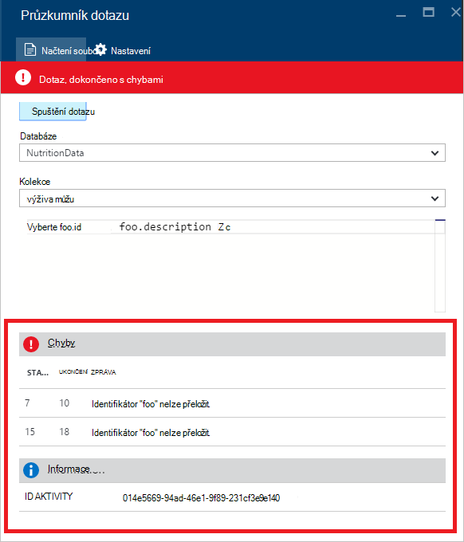

<properties
    pageTitle="Průzkumník DocumentDB dotaz: SQL editoru dotazů | Microsoft Azure"
    description="Informace o podokně dotaz DocumentDB editoru dotazů SQL Azure portálu pro psaní dotazy SQL a systémem proti kolekce NoSQL DocumentDB."
    keywords="psaní dotazy sql editoru dotazů sql"
    services="documentdb"
    authors="kirillg"
    manager="jhubbard"
    editor="monicar"
    documentationCenter=""/>

<tags
    ms.service="documentdb"
    ms.workload="data-services"
    ms.tgt_pltfrm="na"
    ms.devlang="na"
    ms.topic="article"
    ms.date="08/30/2016"
    ms.author="kirillg"/>

# Psaní, úpravy a spouštění dotazů SQL pro DocumentDB pomocí Průzkumníka dotazu 

Tento článek obsahuje přehled o podokně dotaz [Microsoft Azure DocumentDB](https://azure.microsoft.com/services/documentdb/) Azure portálu nástroj, který umožňuje psaní, úpravy a kontrolovat dotazy SQL [DocumentDB kolekce](documentdb-create-collection.md).

1. Na portálu Azure v Jumpbar klikněte na **DocumentDB (NoSQL)**. Pokud **DocumentDB (NoSQL)** není zobrazená, klikněte na **Další služby** a potom klikněte na **DocumentDB (NoSQL)**.

2. V nabídce zdrojů klikněte na položku **Průzkumník dotazu**. 

    

3. V zásuvné **Explorer dotazu** vyberte **databází** a **kolekcí** dotazu z rozevíracích seznamů a zadejte spustit dotaz. 

    Rozevírací seznamy **databází** a **kolekcí** již předem vyplněna v závislosti na kontextu, ve kterém spuštění Průzkumníka dotazu. 

    Výchozí dotaz `SELECT TOP 100 * FROM c` je k dispozici.  Můžete přijmout výchozího dotazu nebo vytvoření vlastního dotazu pomocí jazyka SQL dotazu podle [dotaz SQL zobrazený cheaty listu](documentdb-sql-query-cheat-sheet.md) nebo v článku [dotaz SQL zobrazený a syntaxe jazyka SQL](documentdb-sql-query.md) .

    Klepnutím na tlačítko Zobrazit výsledky **spuštění dotazu** .

    

4. **Výsledky** zásuvné zobrazí výstup dotazu. 

    

## Práce s výsledky

Ve výchozím nastavení Průzkumníka dotaz vrátí výsledky v sady 100.  Pokud váš dotaz vrací víc než 100 výsledky, jednoduše příkazy **Další stránka** a **Předchozí stránka** procházení sadu výsledků.

Pro úspěšné dotazy v **informačním** podokně obsahuje metriky třeba požadavek poplatků číslo zaokrouhlit cesty dotazu, sadu výsledků aktuálně zobrazovaly, a jestli jsou další výsledky, které lze přistupovat prostřednictvím příkaz **Další stránky** , jako jsme zmínili dříve.

## Použití víc dotazů

Pokud používáte víc dotazů a chcete rychle přepnout mezi nimi, zadejte všechny dotazy v textovém poli dotazu zásuvné **Explorer dotaz** a pak vyberte tu, kterou chcete spustit a klepnutím na tlačítko Zobrazit výsledky **spuštění dotazu** .

## Přidání dotazů ze souboru do editoru dotazů SQL

Můžete načíst obsah existujícího souboru pomocí příkazu **Načtení souboru** .

## Poradce při potížích s

Pokud dokončení dotazu s chybami dotazu Průzkumník zobrazuje seznam chyb, které vám mohou pomoci při řešení potíží úsilí.

## Spouštění dotazů mimo portál DocumentDB SQL

Průzkumník dotazu na portálu Azure je právě způsobů kontrolovat DocumentDB dotazy SQL. Můžete taky spustit dotazy SQL pomocí [Rozhraní REST API](https://msdn.microsoft.com/library/azure/dn781481.aspx) nebo [klienta SDK](documentdb-sdk-dotnet.md). Další informace o použití těchto postupů najdete v článku [dotazů spouštěním SQL](documentdb-sql-query.md#executing-sql-queries)

## Další kroky

Další informace o DocumentDB SQL gramatiky podporované v Průzkumníku dotazu, najdete v článku [dotaz SQL zobrazený a syntaxe jazyka SQL](documentdb-sql-query.md) nebo vytisknout [dotaz SQL zobrazený cheaty listu](documentdb-sql-query-cheat-sheet.md).
Může taky líbit experimentování s [Hřišť dotazu](https://www.documentdb.com/sql/demo) , kde můžete otestovat, dotazy online pomocí datovou sadu vzorku.
