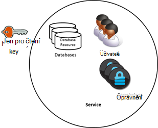
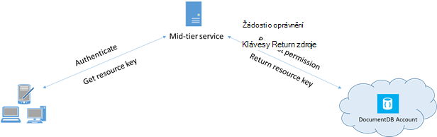

<properties 
    pageTitle="Zjistěte, jak zajistit přístup k datům v DocumentDB | Microsoft Azure" 
    description="Informace o přístupu ovládací prvek koncepty DocumentDB, včetně hlavní klíče, klíče jen pro čtení, uživatelé a oprávnění." 
    services="documentdb" 
    authors="kiratp" 
    manager="jhubbard" 
    editor="monicar" 
    documentationCenter=""/>

<tags 
    ms.service="documentdb" 
    ms.workload="data-services" 
    ms.tgt_pltfrm="na" 
    ms.devlang="na" 
    ms.topic="article" 
    ms.date="09/19/2016" 
    ms.author="kipandya"/>

# Přístup k datům DocumentDB zabezpečení

Tento článek obsahuje přehled o zabezpečení přístup k datům uloženým v [Aplikaci Microsoft Azure DocumentDB](https://azure.microsoft.com/services/documentdb/).

Po přečtení přehled, byste měli odpovězte na následující otázky:  

-   Jaké hlavní klíče DocumentDB?
-   Jaké jsou klávesy DocumentDB jen pro čtení?
-   Jaké jsou DocumentDB zdroje tokeny?
-   Jak použiju DocumentDB uživatelé a oprávnění zajistit přístup k datům DocumentDB?

## DocumentDB přístup ovládací prvek koncepty

DocumentDB poskytuje prvotřídní koncepty k řízení přístupu k prostředkům DocumentDB.  Pro účely tohoto tématu DocumentDB zdroje seskupeny do dvou kategorií:

- Prostředky pro správu
    - Účet
    - Databáze
    - Uživatel
    - Oprávnění
- Použití zdrojů
    - Kolekce
    - Nabídka
    - Dokument
    - Přílohy
    - Uložená procedura
    - Aktivační událost
    - Funkce definované uživatelem

V rámci tyto dvě kategorie DocumentDB podporuje tři typy osoby řízení přístupu: účtu správce, správce jen pro čtení a uživatel databáze.  Oprávnění pro každé osoby řízení přístupu jsou:
 
- Účet správce: plný přístup ke všem zdrojů (pro správu a aplikace) v rámci dané DocumentDB účtu.
- Správce jen pro čtení: jen pro čtení přístup ke všem zdrojů (pro správu a aplikace v rámci dané DocumentDB účtu. 
- Uživatel databáze: DocumentDB uživatele zdroje přidružený k určité skupiny DocumentDB databáze zdrojů (například kolekce dokumenty, skripty).  Může být jeden nebo více zdrojů uživatele přidružené danou databázi a jednotlivé uživatele zdroje mohou mít jeden nebo více oprávnění přidružená.

Pomocí výše uvedeného kategoriích a prostředků na paměti model řízení přístupu DocumentDB definuje tři typy konstrukce přístup:

- Hlavní klíče: při vytvoření účtu DocumentDB vytvořené dva hlavní klíče (primárních a sekundárních).  Klávesy povolit přístup pro všechny zdroje v rámci účtu DocumentDB úplné správu.

- Jen pro čtení klíče: při vytvoření účtu DocumentDB vytvořené dva jen pro čtení klíče (primárních a sekundárních).  Klávesy umožňují přístup jen pro čtení pro všechny zdroje v rámci DocumentDB účtu.

- Tokeny zdroje: token zdroje je přidružená k prostředku DocumentDB oprávnění a zaznamenává vztah mezi uživatelem databáze a oprávnění k tomuto uživateli má pro konkrétní aplikaci zdroje DocumentDB (například kolekce, dokumentu).

## Práce s klávesami DocumentDB předlohy a jen pro čtení

Jak jsme zmínili dříve, DocumentDB hlavní klíče poskytují úplné oprávněními pro všechny zdroje v rámci DocumentDB účtu, zatímco klíče jen pro čtení umožňují přístup pro čtení pro všechny zdroje v rámci účtu.  Následující fragment kódu ukazuje, jak používat účet DocumentDB koncového bodu a hlavní klíč k instanci DocumentClient a vytvořte novou databázi. 

    //Read the DocumentDB endpointUrl and authorization keys from config.
    //These values are available from the Azure Classic Portal on the DocumentDB Account Blade under "Keys".
    //NB > Keep these values in a safe and secure location. Together they provide Administrative access to your DocDB account.
    
    private static readonly string endpointUrl = ConfigurationManager.AppSettings["EndPointUrl"];
    private static readonly SecureString authorizationKey = ToSecureString(ConfigurationManager.AppSettings["AuthorizationKey"]);
        
    client = new DocumentClient(new Uri(endpointUrl), authorizationKey);
    
    // Create Database
    Database database = await client.CreateDatabaseAsync(
        new Database
        {
            Id = databaseName
        });

## Základní informace o DocumentDB zdroje tokenů

Používáte token zdroje (vytvořením DocumentDB uživatelé a oprávnění) Pokud chcete poskytnutí přístupu k prostředkům ve vašem účtu DocumentDB klientovi, který není důvěryhodný s klávesou předlohy. Hlavní klíče DocumentDB zahrnout jak primárních a sekundárních klíč, z nichž každá uděluje přístup pro správu pro váš účet a všechny zdroje v nich. Vystavení buď hlavní klíče otevře svůj účet, abyste možnost škodlivý nebo nedbalostním použití. 

Podobně DocumentDB jen pro čtení klíče poskytují přístup pro čtení pro všechny zdroje - kromě oprávnění zdrojů, samozřejmě – v rámci DocumentDB účtu a se nedají použít k poskytnutí podrobnějších přístupu k určité DocumentDB zdroje.

DocumentDB zdroje tokeny poskytují bezpečných alternativy, která umožňuje klientům číst, psaní a odstraňovat zdrojů ve vašem účtu DocumentDB podle oprávnění, která jste udělena a bez nutnosti předlohy nebo číst jenom klíčové.

Tady je typické návrh vzorek kterým tokeny zdroje mohou požadavku, vygenerování a předávány klientům:

1. Služba polovině vrstvy nastavenou a bude předávat mobilní aplikace ke sdílení fotografie uživatele.
2. Služba polovině vrstvy má hlavní klíč účtu DocumentDB.
3. Aplikace fotky je nainstalovaná na mobilních zařízeních koncového uživatele. 
4. Při přihlášení zavádí aplikaci fotografie identita uživatele ke službě polovině osy. Tento postup vytvoření identity je čistě aplikace.
5. Jakmile je vytvořeno identitu požadavky služeb poloviny osy oprávnění na základě identity.
6. Služba polovině vrstvy odešle token zdroje zpět aplikaci v telefonu.
7. Aplikaci v telefonu můžete dál používat token zdroje přímo přístup k prostředkům DocumentDB s oprávněními definována token zdroje a intervalu povolené na základě token zdroje. 
8. Když skončí platnost token zdroje, dostanou následující požadavky 401 neoprávněným výjimku.  V tomto okamžiku aplikaci v telefonu znovu vytvoří identitu a žádosti token nového zdroje.

## Práce s DocumentDB uživatelé a oprávnění
Uživatele zdroje DocumentDB souvisí s databází DocumentDB.  Každou databázi může obsahovat žádný nebo více uživatelů DocumentDB.  Následující fragment kódu ukazuje, jak vytvořit zdroj DocumentDB uživatele.

    //Create a user.
    User docUser = new User
    {
        Id = "mobileuser"
    };

    docUser = await client.CreateUserAsync(UriFactory.CreateDatabaseUri("db"), docUser);

> [AZURE.NOTE] Každý uživatel DocumentDB má PermissionsLink vlastnost, která slouží k načtení seznamu oprávnění přidružená k uživatele.

Zdroj oprávnění DocumentDB souvisí s uživatelem DocumentDB.  Každý uživatel může obsahovat žádný nebo více DocumentDB oprávnění.  Prostředek oprávnění poskytuje přístup k tokenu zabezpečení, který uživatel potřebuje při pokusu o přístup k prostředku dané aplikace.
Existují dvě úrovně přístupu k dispozici, které může být součástí zdrojem oprávnění:

- Vše: Má uživatel oprávnění k úplnému na zdroje
- Čtení: Uživatel může číst pouze obsah zdroje, ale nemůže provést zapsat, operace aktualizace nebo odstranění na zdroje.

> [AZURE.NOTE] Chcete-li spustit DocumentDB uložené procedury uživatel musí mít všechna oprávnění v kolekci ve kterém se spustí uložená procedura.

Následující fragment kódu ukazuje, jak vytvořit zdroj oprávnění, číst token zdroje zdroje oprávnění a přiřadit oprávnění k uživateli vytvořili výše.

    // Create a permission.
    Permission docPermission = new Permission
    {
        PermissionMode = PermissionMode.Read,
        ResourceLink = documentCollection.SelfLink,
        Id = "readperm"
    };
            
  docPermission = očekávat klienta. CreatePermissionAsync (UriFactory.CreateUserUri ("db", "uživatel"), docPermission) Console.WriteLine (docPermission.Id + "má token:" + docPermission.Token);
  
Pokud zadaná klíč oddílu pro kolekci a oprávnění kolekce dokumentu a přílohy musí taky patří ResourcePartitionKey kromě ResourceLink.

Abyste mohli snadno získat všechny zdroje oprávnění spojené s určitým uživatelem, DocumentDB využívá k dispozici oprávnění kanálu sociální sítě pro každý objekt uživatele.  Následující fragment kódu ukazuje, jak načíst oprávnění přidružené k uživateli vytvořili výše, sestavit seznam oprávnění a vytvořit nové DocumentClient jménem uživatele.

    //Read a permission feed.
    FeedResponse<Permission> permFeed = await client.ReadPermissionFeedAsync(
      UriFactory.CreateUserUri("db", "myUser"));

    List<Permission> permList = new List<Permission>();
      
    foreach (Permission perm in permFeed)
    {
        permList.Add(perm);
    }
            
    DocumentClient userClient = new DocumentClient(new Uri(endpointUrl), permList);

> [AZURE.TIP] Tokeny zdroje mít výchozí platné časového rozpětí 1 hodina.  Životnost tokenů však může být explicitně zadán, maximální hodnota 5 hodin.

## Další kroky

- Další informace o DocumentDB, klikněte [sem](http://azure.com/docdb).
- Další informace o správě předlohy a jen pro čtení, klikněte [sem](documentdb-manage-account.md).
- Pokud chcete zjistit, jak vytvářet DocumentDB se tak mohli ověřovat tokeny, klikněte na [zde](https://msdn.microsoft.com/library/azure/dn783368.aspx)
 
