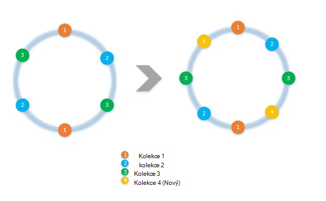
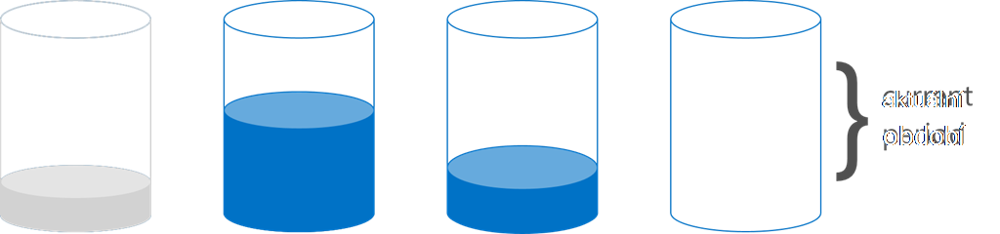

<properties 
    pageTitle="Jak implementovat klienta straně rozdělení s SDK | Microsoft Azure" 
    description="Naučte se používat SDK DocumentDB Azure dat a směrování požadavky oddílu (shard) do různých víc kolekcí" 
    services="documentdb" 
    authors="arramac" 
    manager="jhubbard" 
    editor="cgronlun" 
    documentationCenter=""/>

<tags 
    ms.service="documentdb" 
    ms.workload="data-services" 
    ms.tgt_pltfrm="na" 
    ms.devlang="na" 
    ms.topic="article" 
    ms.date="10/27/2016" 
    ms.author="arramac"/>

# <a name="how-to-partition-data-using-client-side-support-in-documentdb"></a>Jak se oddíly dat v DocumentDB pomocí podporu na straně klienta

Azure DocumentDB podporuje [Automatické rozdělení kolekcí](documentdb-partition-data.md). Můžou ale nastat použití případech, kdy je užitečné pořádku nebo barev ovládat rozdělení chování. Pokud chcete snížit často používaný kód potřebný k rozdělování úkolů, jsme jste přidali funkce .NET, Node.js a Java SDK, která usnadňuje vytváření aplikací, které jsou diagramů s měřítky se v několika kolekcích.

V tomto článku jsme se podívejte se na třídy a rozhraní v .NET SDK a jak je můžete používat k vývoji aplikací oddílů. Další SDK jako Java, Node.js a Python podporu podobné metody a rozhraní klienta rozdělení.

## <a name="client-side-partitioning-with-the-documentdb-sdk"></a>Klientské rozdělení s DocumentDB SDK

Před jsme Prozkoumat důkladněji do oddílů, Pojďme recap některé základní koncepty DocumentDB, které se vztahují k rozdělení. Každý účet Azure DocumentDB databáze obsahuje sadu databází, každá obsahuje víc kolekcí, z nichž každá obsahuje uložené procedury aktivačních událostí, funkce definované uživatelem a dokumenty související přílohy. Kolekce lze jedním oddílem nebo oddíly sami a s následujícími vlastnostmi:

- Kolekce nabízejí izolace výkonu. Proto je výhoda v řazení podobné dokumenty v rámci stejné kolekce. Například pro dat časové řady, můžete umístit data pro minulý měsíc, která je často dotazu v rámci kolekce s vyšší výkon zřizování že starší data je umístěn v rámci kolekce s nízkou zřizování výkon.
- KYSELINY transakce tedy uložené procedury a aktivace nemůže zahrnovat kolekce. V rámci jeden oddíl klíčové hodnoty v rámci kolekce je omezené transakce.
- Kolekce nebudou vynucovat schéma, takže je můžete používat JSON dokumentů stejného typu nebo různé typy.

Od verze [1.5.x SDK DocumentDB Azure](documentdb-sdk-dotnet.md), můžete provádět operace dokumentů přímo u databáze. Interně [DocumentClient](https://msdn.microsoft.com/library/azure/microsoft.azure.documents.client.documentclient.aspx) používá PartitionResolver, který jste zadali databáze do žádosti o směrování do příslušné kolekce.

>[AZURE.NOTE] [Serverový rozdělení](documentdb-partition-data.md) zavedený REST API 2015 12-16 a SDK 1.6.0+ deprecates přístup překládání klientských oddíl pro případy použití jednoduchého. Rozdělení klientských však je flexibilnější a umožňuje určit výkonu izolace mezi klíči oddílů, určit stupeň paralelismu při čtení výsledky z více oddílů a používat oblast/prostorové rozdělení přístupy srovnání hash.

Jednotlivé třídy PartitionResolver je v .NET konkrétní provádění [IPartitionResolver](https://msdn.microsoft.com/library/azure/microsoft.azure.documents.client.ipartitionresolver.aspx) rozhraní, které má tři způsoby – [GetPartitionKey](https://msdn.microsoft.com/library/azure/microsoft.azure.documents.client.ipartitionresolver.getpartitionkey.aspx), [ResolveForCreate](https://msdn.microsoft.com/library/azure/microsoft.azure.documents.client.ipartitionresolver.resolveforcreate.aspx) a [ResolveForRead](https://msdn.microsoft.com/library/azure/microsoft.azure.documents.client.ipartitionresolver.resolveforread.aspx). Dotazy LINQ a ReadFeed iterátorů použijte metodu ResolveForRead interně iterace všechny kolekce, které odpovídají klíč oddílu žádosti. Podobně vytvořte operací použijte metodu ResolveForCreate ke směrování vytvoří na pravý oddíl. Žádné změny potřebných pro nahradit, odstranit a číst od používají dokumenty, které již obsahují odkaz na odpovídající kolekci.

SDK obsahuje taky dvě třídy, které podporují dva kanonický rozdělení technik, algoritmus hash a rozsah vyhledávání pomocí [HashPartitionResolver](https://msdn.microsoft.com/library/azure/microsoft.azure.documents.partitioning.hashpartitionresolver.aspx) a [RangePartitionResolver](https://msdn.microsoft.com/library/azure/mt126047.aspx). Tyto třídy umožňuje snadno přidat Logika rozdělování aplikaci.  

## <a name="add-partitioning-logic-and-register-the-partitionresolver"></a>Přidání logiky rozdělení a zaregistrovat PartitionResolver 

Tady je fragment znázorňující, jak vytvořit [HashPartitionResolver](https://msdn.microsoft.com/library/azure/microsoft.azure.documents.partitioning.hashpartitionresolver.aspx) a zaregistrovat s DocumentClient pro danou databázi.

```cs
// Create some collections to partition data.
DocumentCollection collection1 = await client.CreateDocumentCollectionAsync(...);
DocumentCollection collection2 = await client.CreateDocumentCollectionAsync(...);

// Initialize a HashPartitionResolver using the "UserId" property and the two collection self-links.
HashPartitionResolver hashResolver = new HashPartitionResolver(
    u => ((UserProfile)u).UserId, 
    new string[] { collection1.SelfLink, collection2.SelfLink });

// Register the PartitionResolver with the database.
this.client.PartitionResolvers[database.SelfLink] = hashResolver;

```

## <a name="create-documents-in-a-partition"></a>Vytváření dokumentů v oddílu  

Po registraci PartitionResolver můžete provádět vytvoří a dotazech přímo v databázi, jak je ukázáno v následujícím příkladu. V tomto příkladu SDK používá PartitionResolver extrahovat ID uživatele, hash ho a pak použijte tuto hodnotu Pokud chcete směrovat operace vytvoření správné kolekce.

```cs
Document johnDocument = await this.client.CreateDocumentAsync(
    database.SelfLink, new UserProfile("J1", "@John", Region.UnitedStatesEast));
Document ryanDocument = await this.client.CreateDocumentAsync(
    database.SelfLink, new UserProfile("U4", "@Ryan", Region.AsiaPacific, UserStatus.AppearAway));
```

## <a name="create-queries-against-partitions"></a>Vytvoření dotazů oddíly  

Můžete dotaz metodou [CreateDocumentQuery](https://msdn.microsoft.com/library/azure/microsoft.azure.documents.linq.documentqueryable.createdocumentquery.aspx) předáním v databázi a klíč oddílu. Dotaz vrátí jednu sadu výsledků přes všechny kolekce v databázi, které namapovat na klíč oddílu.  

```cs
// Query for John's document by ID - uses PartitionResolver to restrict the query to the partitions 
// containing @John. Again the query uses the database self link, and relies on the hash resolver 
// to route the appropriate collection.
var query = this.client.CreateDocumentQuery<UserProfile>(
    database.SelfLink, null, partitionResolver.GetPartitionKey(johnProfile))
    .Where(u => u.UserName == "@John");
johnProfile = query.AsEnumerable().FirstOrDefault();
```

## <a name="create-queries-against-all-collections-in-the-database"></a>Vytvoření dotazů všechny kolekce v databázi 

Můžete taky dotazu všechny kolekce v databázi a umožňuje zobrazit výčet výsledky, jak zobrazit pod, tak, že vynechání klíčové argument oddíl.

```cs
// Query for all "Available" users. Here since there is no partition key, the query is serially executed 
// across each partition/collection and returns a single result-set. 
query = this.client.CreateDocumentQuery<UserProfile>(database.SelfLink)
    .Where(u => u.Status == UserStatus.Available);
foreach (UserProfile activeUser in query)
{
    Console.WriteLine(activeUser);
}
```

## <a name="hash-partition-resolver"></a>Překládání oddíl hash
Pomocí rozdělení hash, mají přiřazenou oddíly založené na hodnotu funkce hash umožňuje rovnoměrně distribuovat žádosti a dat v několika oddílů. Tento přístup je běžně používaných oddílu dat vyrobeno spotřebované množství ze velký počet různých klientů nebo je užitečné pro ukládání profily, položky katalogu a telemetrickými daty IoT ("Internet z věci"). Rozdělení hash slouží také DocumentDB na straně serveru rozdělení podpora v rámci kolekce.

**Hash Partitioning:**


Jednoduchý hash rozdělení schéma v kolekcích *N* bude mít všechny dokumenty, výpočet *hash(d) mod N* rozhodnout, jaký byl umístěn v kolekci. Ale problém s touto jednoduchou technikou, nefunguje dobře při přidávání nové kolekce nebo odebírání kolekce musel téměř všechna data, která chcete získat reshuffled. [Konzistentní algoritmus hash] (http://citeseerx.ist.psu.edu/viewdoc/summary?doi=10.1.1.23.3738) je známý algoritmus prostředních to implementací hash schéma, které slouží k minimalizaci množství přesun dat požadovaný při přidávání a odebírání kolekcí.

Třídy [HashPartitionResolver](https://msdn.microsoft.com/library/azure/microsoft.azure.documents.partitioning.hashpartitionresolver.aspx) používá použití logických operátorů k vytvoření konzistentního hash vyzvánění přes funkci hash podle rozhraní [IHashGenerator](https://msdn.microsoft.com/library/azure/microsoft.azure.documents.partitioning.ihashgenerator.aspx) . Ve výchozím nastavení HashPartitionResolver používá funkci hash MD5, ale můžete to zjistit zaměnit s hash implementace. HashPartitionResolver interně vytvoří 16 hash nebo "virtuální uzlech" vyzvánění hash pro každou kolekci za účelem dosažení více rovnoměrné rozdělení dokumentů v kolekcích, ale toto číslo obchodu vypnout dat šikmost obsahovat hodnotu výpočtu straně klienta se může lišit.

**Konzistentní algoritmus hash s HashPartitionResolver:**


## <a name="range-partition-resolver"></a>Překládání oblasti oddílu

V oblasti rozdělení, mají přiřazenou oddíly, podle toho zda klíč oddílu v určitém rozsahu. Tato funkce se obvykle používá pro rozdělení s vlastnostmi časové razítko (například eventTime mezi 1 dubna 2015 a 14 dubna 2015). Třídy [RangePartitionResolver](https://msdn.microsoft.com/library/azure/mt126047.aspx) slouží ke správě mapování mezi oblasti\<T\> a kolekce automatické propojení. 

[Oblast\<T\> ](https://msdn.microsoft.com/library/azure/mt126048.aspx) je jednoduchý třída, která spravuje oblastí všechny typy implementující IComparable\<T\> a IEquatable\<T\> jako řetězce nebo čísla. Pro čtení a vytvoří, můžete předat libovolného oblast a překladač identifikuje všechny kolekce candidate identifikací oblasti oddíly, které se protíná s požadovaný rozsah. Tato funkce může být užitečné při provádění dotazů rozsah dat časové řady.

**Oblast rozdělení:**  

  

Zvláštní případ oblast rozdělení je, když oblast je jenom jednu samostatné hodnotu, někdy se jí říká "vyhledávání rozdělení". Tato funkce je obvykle používá k rozdělování podle regionů (například oddílu Skandinávie obsahuje Norsko, Dánsko a Švédsko) nebo k rozdělování klienti v aplikaci více klienta.

## <a name="samples"></a>Vzorky 

Podívejte se na [projekt DocumentDB rozdělení vzorky Github](https://github.com/Azure/azure-documentdb-dotnet/tree/287acafef76ad223577759b0170c8f08adb45755/samples/code-samples/Partitioning) obsahující fragmenty kódu o tom, jak používat tyto PartitionResolvers a rozšíření je implementovat vlastní překládání na tvar případy konkrétní použití, například následující: 

* Jak zadat výraz libovolný lambda pro GetPartitionKey a použijte ji k provedení složeného klíče rozdělení nebo jinak oddíl různé typy objektů.
* Jak vytvořit jednoduchý [LookupPartitionResolver](https://github.com/Azure/azure-documentdb-dotnet/blob/287acafef76ad223577759b0170c8f08adb45755/samples/code-samples/Partitioning/Partitioners/LookupPartitionResolver.cs) používající ruční vyhledávací tabulky provádět rozdělení. Tento způsob je běžně používané v rozdělení založené na samostatné hodnoty jako oblast, ID klienta nebo aplikaci název.
* Jak vytvořit [ManagedPartitionResolver](https://github.com/Azure/azure-documentdb-dotnet/blob/287acafef76ad223577759b0170c8f08adb45755/samples/code-samples/Partitioning/Partitioners/ManagedHashPartitionResolver.cs) vytvoří kolekce automaticky na základě šablony, který definuje schéma pojmenování, IndexingPolicy a uložené procedury, které je potřeba registrován proti nové kolekce.
* Jak vytvořit schéma bez [SpilloverPartitionResolver](https://github.com/Azure/azure-documentdb-dotnet/blob/287acafef76ad223577759b0170c8f08adb45755/samples/code-samples/Partitioning/Partitioners/SpilloverPartitionResolver.cs) , jednoduše, vytvoří se nové kolekce staré kolekce zaplnit.
* Jak serializovat a deserializovat váš stav PartitionResolver jako JSON, aby mohli sdílet mezi procesy a přes vypnutí. Můžete uchovávat tyto konfigurace souborů se změnami a dokonce i do kolekce DocumentDB.
* Třída [DocumentClientHashPartitioningManager](https://github.com/Azure/azure-documentdb-dotnet/blob/287acafef76ad223577759b0170c8f08adb45755/samples/code-samples/Partitioning/Util/DocumentClientHashPartitioningManager.cs) pro dynamické přidávání a odstraňování oddílů k databázi oddíly podle konzistentní algoritmus hash. Interně používá [TransitionHashPartitionResolver](https://github.com/Azure/azure-documentdb-dotnet/blob/287acafef76ad223577759b0170c8f08adb45755/samples/code-samples/Partitioning/Partitioners/TransitionHashPartitionResolver.cs) pro čtení směrování a data zapisuje v průběhu migrace pomocí jedné ze čtyř režimy - číst ze starého rozdělení schématu (ReadCurrent), novou (ReadNext) sloučit výsledky z obou (ReadBoth) nebo není k dispozici v průběhu migrace (žádné).

Vzorky jsou otevřít zdroj a doporučujeme odesílat žádosti o Vložit s příspěvky, které by mohly využít ostatní DocumentDB vývojáři. Získáte [příspěvek pokyny](https://github.com/Azure/azure-documentdb-net/blob/master/Contributing.md) pro informace o tom, jak přispívat.  

>[AZURE.NOTE] Vytvoří kolekce jsou sazba omezené DocumentDB, aby některé ukázkové metody ukazuje tato část může trvat několik minut.

##<a name="faq"></a>NEJČASTĚJŠÍ DOTAZY
**Podporuje DocumentDB rozdělení straně serveru?**

Ano, DocumentDB podporuje [serverovou rozdělení](documentdb-partition-data.md). DocumentDB podporuje také klientských rozdělení prostřednictvím překládání klientských oddíl pro pokročilejší případy použití.

**Kdy mám používat serverovou porovnání klientských oddílů?**
Pro většinu případy použití doporučujeme použití serverovou rozdělení od zpracovává úkoly správy rozdělení data a směrování žádosti. Ale potřebujete-li oblast, kterou oddílů nebo máte případu specializované použití pro výkon izolace mezi různé hodnoty klíče oddílu, pak rozdělení straně klienta může být nejlepším řešením.

**Jak přidat nebo odebrat kolekce pro svůj schématu rozdělení oddílů?**

Podívejte se na provádění DocumentClientHashPartitioningManager v aplikaci project ukázky příklad způsob implementace oddílů.

**Jak zachovat nebo sdílet s ostatními klienty rozdělení konfiguraci?**

Můžete serializovat stavu rozdělovač jako JSON a obsahují konfigurace souborů se změnami nebo dokonce v rámci kolekce DocumentDB. Podívejte se na metodu RunSerializeDeserializeSample v projektu ukázky příklad.

**Jak zřetězení různých způsobech oddílů?**

Zřetězení PartitionResolvers implementací vlastní IPartitionResolver interně používající jeden nebo více existující překládání. Podívejte se na TransitionHashPartitionResolver v projektu ukázky příklad.

##<a name="references"></a>Odkazy
* [Serverový oddílů v DocumentDB](documentdb-partition-data.md)
* [DocumentDB kolekcích a výkonu úrovně](documentdb-performance-levels.md)
* [Rozdělení ukázky na Github](https://github.com/Azure/azure-documentdb-dotnet/tree/287acafef76ad223577759b0170c8f08adb45755/samples/code-samples/Partitioning)
* [DocumentDB .NET SDK následující dokumentaci pro MSDN](https://msdn.microsoft.com/library/azure/dn948556.aspx)
* [DocumentDB .NET vzorky](https://github.com/Azure/azure-documentdb-net)
* [Limity DocumentDB](documentdb-limits.md)
* [Tipy pro DocumentDB Blog na výkon](https://azure.microsoft.com/blog/2015/01/20/performance-tips-for-azure-documentdb-part-1-2/)
 
