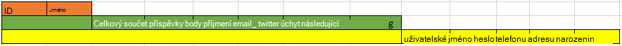

<properties 
    pageTitle="Návrh vzorek DocumentDB: sociálních médií aplikace | Microsoft Azure" 
    description="Zjistěte víc o vzorek návrhu pro sociální sítě využití úložiště flexibilní DocumentDB a další služby Azure." 
    keywords="sociální média aplikace"
    services="documentdb" 
    authors="ealsur" 
    manager="jhubbard" 
    editor="" 
    documentationCenter=""/>

<tags 
    ms.service="documentdb" 
    ms.workload="data-services" 
    ms.tgt_pltfrm="na" 
    ms.devlang="na" 
    ms.topic="article" 
    ms.date="09/27/2016" 
    ms.author="mimig"/>

# Přejdete sociální s DocumentDB

Žijí v datových propojeny společnosti znamená, že nastane okamžik v životnost se stanete jejím součástí **sociálních sítí**. Použijeme sociálních sítí pro komunikaci s přáteli, kolegy, rodinou nebo někdy Naše touha nasdílet tělesně společné zájmy.

Jako inženýrů nebo vývojáři jsme může mít zajímalo jak tyto sítě ukládat a propojení dat, nebo může mít byl úkol i k vytvoření nebo architektonické nové sociálních sítí pro konkrétní volné místo na trh sami sobě. Kdy nastane velký otázku: uložení tato data?

Předpokládejme, že vytváření nových a lesklý sociální síti, kde můžete naše uživatelé zveřejňují příspěvky články související média jako obrázky, videa nebo dokonce hudbu. Uživatelé mohou komentovat příspěvků a odeslání body pro hodnocení. Bude informační kanál příspěvky, které uživatelé uvidí a moct pracovat s na cílovou stránku hlavní web. To není zvuk opravdu složité (nejdříve), ale za účelem zjednodušení Pojďme zastavit tam (společnost Microsoft může delve do vlastních uživatelských kanálů ovlivňují relace, ale překračuje cíl v tomto článku).

Ano jak to jsme ukládat a kde?

V mnoha je mohl prostředí na SQL databáze nebo mít přinejmenším pojmu [relační modelování dat](https://en.wikipedia.org/wiki/Relational_model) a můžete svádět k spuštění výkresu přibližně takto:

 

Dokonale normalizovanou a přidávání nějakých datová struktura … které nemá měřítko. 

Nezobrazí mě nepovede, můžu jste spolupracovali SQL databáze, všechny život, jsou skvělé, ale jako platforem vzorku, praxe a software není dokonalý pro každý scénář.

Proč není SQL tou nejlepší volbou v tomto scénáři? Podívejme se na strukturu jednoho příspěvek, pokud chtěli zobrazit tento příspěvek z webu nebo aplikace, že bude potřeba udělat dotaz se... zobrazíte jeden jednoho příspěvek, teď obrázek toku příspěvků, které dynamicky načíst a zobrazují se na obrazovce a může se zobrazit kde budu chci jen 8 JOIN (!).

Může samozřejmě používáme ABC instance serveru SQL s dost power vyřešit tisíce dotazů pomocí těchto mnoho spojení a bude předávat náš obsah, ale skutečně, proč jsme může při jednodušší řešení existuje?

## NoSQL cest

Existuje jinak diagram databází, které můžete [Spustit na Azure](http://neo4j.com/developer/guide-cloud-deployment/#_windows_azure) , ale nejsou levný a vyžadovat IaaS služby (infrastruktury jako služba, virtuálních počítačích hlavně) a údržba. Budu cíl tohoto článku nižší náklady řešení, která budou fungovat většina scénářích spuštěných pro databázi NoSQL na Azure [DocumentDB](https://azure.microsoft.com/services/documentdb/). Použijete-li [NoSQL](https://en.wikipedia.org/wiki/NoSQL) způsob uložení dat ve formátu JSON a použitím [denormalization](https://en.wikipedia.org/wiki/Denormalization)naše dříve složitých příspěvek je možné převést na jeden [dokument](https://en.wikipedia.org/wiki/Document-oriented_database):

    {
        "id":"ew12-res2-234e-544f",
        "title":"post title",
        "date":"2016-01-01",
        "body":"this is an awesome post stored on NoSQL",
        "createdBy":User,
        "images":["http://myfirstimage.png","http://mysecondimage.png"],
        "videos":[
            {"url":"http://myfirstvideo.mp4", "title":"The first video"},
            {"url":"http://mysecondvideo.mp4", "title":"The second video"}
        ],
        "audios":[
            {"url":"http://myfirstaudio.mp3", "title":"The first audio"},
            {"url":"http://mysecondaudio.mp3", "title":"The second audio"}
        ]
    }

A lze jej získat s jediného dotazu a žádný spojení. Toto je mnohem víc rychle a jednoduše a budget-wise, vyžaduje menší počet zdrojů dosáhnout lepší výsledky.

Azure DocumentDB umožňuje zajistit všechny vlastnosti indexovaných s jeho [Automatické indexování](documentdb-indexing.md), které můžete i [Přizpůsobit](documentdb-indexing-policies.md). Přístup uvolnit schématu umožňuje ukládat dokumenty s rozdílnými a dynamické struktury, možná zítra chceme příspěvky zobrazíte seznam kategorií nebo hashtags spojené s nimi, DocumentDB zpracuje nové dokumenty s přidanými atributy s žádné další řešení vyžadované us.

Komentáře v příspěvku můžete považovány za právě další příspěvky nadřazené vlastnost (zjednodušuje naše mapování objekt). 

    {
        "id":"1234-asd3-54ts-199a",
        "title":"Awesome post!",
        "date":"2016-01-02",
        "createdBy":User2,
        "parent":"ew12-res2-234e-544f"
    }

    {
        "id":"asd2-fee4-23gc-jh67",
        "title":"Ditto!",
        "date":"2016-01-03",
        "createdBy":User3,
        "parent":"ew12-res2-234e-544f"
    }

A mohou být uloženy všechny sociální interakce na samostatný objekt jako čítače:

    {
        "id":"dfe3-thf5-232s-dse4",
        "post":"ew12-res2-234e-544f",
        "comments":2,
        "likes":10,
        "points":200
    }

Vytváření kanálů je právě vytváření dokumentů, které můžou obsahovat seznam příspěvek ID následujícími znaky dané relevance pořadí:

    [
        {"relevance":9, "post":"ew12-res2-234e-544f"},
        {"relevance":8, "post":"fer7-mnb6-fgh9-2344"},
        {"relevance":7, "post":"w34r-qeg6-ref6-8565"}
    ]

Může máme "nejnovější" toku příspěvky seřazené podle datum vytvoření "nejprodávanějších" toku tyto příspěvky s více to se mi líbí za posledních 24 hodin, můžeme může i implementovat vlastní toku pro jednotlivé uživatele na základě postupu jako sledující a zájmy a pořád bude seznam příspěvků. Je předmětem k vytváření seznamů, ale zůstanou nerušený výkonu čtení. Jakmile jsme získat jednu z těchto seznamů, jsme vydávat jediného dotazu DocumentDB pomocí doplňku [operátor IN](documentdb-sql-query.md#where-clause) získat stránky příspěvků najednou.

Podávání datových proudů může vytvořené pomocí [Aplikace služby Azure](https://azure.microsoft.com/services/app-service/) procesy na pozadí: [Webjobs](../app-service-web/web-sites-create-web-jobs.md). Po vytvoření příspěvku zpracování na pozadí je možné spouštět pomocí [Úložišti Azure](https://azure.microsoft.com/services/storage/) [fronty](../storage/storage-dotnet-how-to-use-queues.md) a Webjobs spouštěný pomocí [Azure Webjobs SDK](../app-service-web/websites-dotnet-webjobs-sdk.md)provádění šíření příspěvek do datových proudů na základě vlastní vlastní postupu. 

Odložené způsobem použití stejné techniky pro vytvoření postupně konzistentní prostředí můžete zpracování bodů a líbí na příspěvek.

Které ho sledují jsou trickier. DocumentDB má omezení velikosti dokumentu 512Kb, můžete si myslet, že o ukládání sledující jako dokumentu s konci tuto strukturu:

    {
        "id":"234d-sd23-rrf2-552d",
        "followersOf": "dse4-qwe2-ert4-aad2",
        "followers":[
            "ewr5-232d-tyrg-iuo2",
            "qejh-2345-sdf1-ytg5",
            //...
            "uie0-4tyg-3456-rwjh"
        ]
    }

To vašem případě mohlo fungovat uživatele s několika tisíců sledující, ale pokud některé celebrit spojí naše pořadí postupně bude přístup přístupů zakončení velikosti dokumentu.

Chcete-li tento problém vyřešit, můžete použít smíšených přístup. V rámci dokumentu statistiky uživatelů můžeme mohou být uloženy počet sledující:

    {
        "id":"234d-sd23-rrf2-552d",
        "user": "dse4-qwe2-ert4-aad2",
        "followers":55230,
        "totalPosts":452,
        "totalPoints":11342
    }

A skutečné grafu sledující mohou být uloženy na úložiště tabulek Azure pomocí [rozšíření](https://github.com/richorama/AzureStorageExtensions#azuregraphstore) , která umožňuje jednoduché "A-takto B" ukládání a vyhledávání. Tímto způsobem jsme delegáta načítání proces přesné sledující seznamu (pokud ji potřebujeme) úložiště tabulek Azure, ale pro rychlé čísla vyhledávání jsme opakujte provádění funkce DocumentDB.

## "Žebřík" vzorku a dat. duplikace

Jak možná jste si všimli JSON dokumentu, který odkazuje na příspěvek, se vyskytuje víckrát uživatele. A je byste měli mít uhodnout doprava, že to znamená, že informace, které představuje uživatel uveden tento denormalization může být součástí víc než jednom místě.

Aby bylo možné rychlejší dotazů, jsme vzniknou dat. duplikace. S tomu straně je to, že pokud některé akcí uživatele změny dat, potřebujeme najít všechny aktivity mu někdy nebyla a aktualizovat všechny. Není zvuk velmi praktické, vpravo?

Graf databází řešení vlastní výzvu, budeme vyřešit tak, že identifikují atributy klíč uživatele znázorňující v aplikaci pro každou činnost. Pokud nám vizuálně zobrazit příspěvek v aplikaci a zobrazit jenom poznámkové bloky předmětů jméno a obrázek, proč uložit všechna data uživatele v atributu "createdBy"? Pokud pro každý z komentářů ukážeme jenom obrázek uživatele, jsme skutečnosti nepotřebujete zbytek jeho informace. Které přichází něco že volání "žebřík vzorek" na přehrát.

Podívejme se informace o uživatelích jako příklad:

    {
        "id":"dse4-qwe2-ert4-aad2",
        "name":"John",
        "surname":"Doe",
        "address":"742 Evergreen Terrace",
        "birthday":"1983-05-07",
        "email":"john@doe.com",
        "twitterHandle":"@john",
        "username":"johndoe",
        "password":"some_encrypted_phrase",
        "totalPoints":100,
        "totalPosts":24
    }
    
Pohledem na tyto informace jsme rychle zjistit tedy důležitých informací a které není, čímž vytvoříte "Žebříku":

Nejmenší krok se nazývá UserChunk minimální druh informací, který identifikuje uživatele a slouží k dat. duplikace. Zmenšení velikosti duplicitní data jenom informací "ukážeme", jsme snížit možnost rozsáhlé aktualizace.

V prostředním kroku je místo toho možnost uživatel, je celé data, která se použije na většině závislé na výkon dotazy na DocumentDB, přístup a kritické. Zahrnuje informace představované UserChunk.

Mřížku nejřidší je uživatel rozšířit. Obsahuje všechny informace o důležitých uživateli plus jiná data, která nevyžaduje skutečně rychle číst nebo jeho použití případné (třeba proces přihlášení). Tato data mohou být uloženy mimo DocumentDB v databázi SQL Azure nebo úložiště tabulek Azure.

Proč byste měli jsme rozdělení uživatele a dokonce ukládat tyto informace na různých místech? Protože prostor úložiště v DocumentDB [není nekonečné](documentdb-limits.md) a od výkonu bod zobrazení, tím větší dokumenty, costlier dotazy. Zachovat dokumenty slim s ty správné informace a udělejte svoje dotazy závislé na výkon sociální sítě a obsahují další dodatečné informace pro případné scénáře jako celé profilu úpravy přihlášení, a to i dolování dat pro použití technologie pro analýzu a iniciativy velký Data. Jsme skutečně nezáleží, pokud jsou data shromažďování pro dolování dat pomaleji protože běží v databázi SQL Azure, můžeme mít týkají přes naše uživatelé mají rychlé a slim prostředí. Uživatele, uložený na DocumentDB, by vypadal takto:

    {
        "id":"dse4-qwe2-ert4-aad2",
        "name":"John",
        "surname":"Doe",
        "username":"johndoe"
        "email":"john@doe.com",
        "twitterHandle":"@john"
    }

A vypadat příspěvku:

    {
        "id":"1234-asd3-54ts-199a",
        "title":"Awesome post!",
        "date":"2016-01-02",
        "createdBy":{
            "id":"dse4-qwe2-ert4-aad2",
            "username":"johndoe"
        }
    }

A pokud úpravy vznikne místo, kam jedné atributy bloku dat bude to mít vliv, je snadné vyhledání problémového dokumenty pomocí dotazů, které přejděte na položku indexované atributy (vyberte * od odešle p WHERE p.createdBy.id == "edited_user_id") a následně aktualizováním bloky.

## Do vyhledávacího pole

Uživatelé vygeneruje naštěstí velké množství obsahu. Abychom měli poskytnout možnost vyhledat a podívejte se na obsah, který nemusí být přímo v jejich obsahu datových proudů možná protože jsme nepostupujte podle tvůrci a možná jsme jenom snažíte najít, že staré příspěvek kroků 6 měsíci.

Naštěstí a vzhledem k tomu používáme Azure DocumentDB, můžeme jednoduše implementovat vyhledávacího webu pomocí [hledání Azure](https://azure.microsoft.com/services/search/) několika minut a i bez zadání jeden řádek kód (jiné než očividně, proces hledání a uživatelské rozhraní).

Proč je to tak snadno?

Azure hledání implementuje volají [indexování](https://msdn.microsoft.com/library/azure/dn946891.aspx), procesy na pozadí, které připojit v úložištích dat a automagically přidat, aktualizovat nebo odebrat objekty indexy. Podporují [ [indexování databáze SQL Azure](https://blogs.msdn.microsoft.com/kaevans/2015/03/06/indexing-azure-sql-database-with-azure-search/), objekty BLOB Azure indexování](../search/search-howto-indexing-azure-blob-storage.md) a naštěstí [Azure DocumentDB indexování](../documentdb/documentdb-search-indexer.md). Přechod informace z DocumentDB Azure hledání jednoduchých, jako obou úložiště informace ve formátu JSON jsme stačí, když chcete [vytvořit náš Index](../search/search-create-index-portal.md) a mapování, které atributy z našich dokumentů chceme indexovaných a který je, během několika minut (závisí na velikosti naše data), budou k dispozici prohledávat na doporučené řešení vyhledávací jako služba ve cloudové infrastruktury náš obsah. 

Další informace o hledání Azure můžete navštívit [Hitchhiker na Průvodce hledání](https://blogs.msdn.microsoft.com/mvpawardprogram/2016/02/02/a-hitchhikers-guide-to-search/).

## Základní znalostí

Po uložení tento obsah, který roste a roste každý den, může nalezeny označována mysli: jak se tento toku informací z mých uživatelů?

Odpověď je jednoduchá: práce a informace z tohoto umístění.

Ale co jsme Další informace? Několik snadno jako příklad lze uvést [myšlenkou analýzy](https://en.wikipedia.org/wiki/Sentiment_analysis)obsahu doporučení podle předvoleb uživatele nebo i automatické obsahu moderátorovi, který zajišťuje, že veškerého obsahu zveřejněné naše sociální sítě je bezpečný pro rodinu.

Teď jste připojili objevila, budete nejspíš by podle vás potřebujete některé aplikace PhotoDraw v jiné vědecké matematické extrahovat tyto příklady a informace z jednoduchého databáze a soubory, ale by se nepovedlo.

[Výukové počítače azure](https://azure.microsoft.com/services/machine-learning/), část [Cortana Intelligence sadu](https://www.microsoft.com/en/server-cloud/cortana-analytics-suite/overview.aspx), je plně spravovaných cloudové služby, které můžete vytvořit pracovní postupy pomocí algoritmů simple rozhraní a přetažením kódu vlastní algoritmy [R](https://en.wikipedia.org/wiki/R_(programming_language)) nebo použít některé už vytvořené a je připraven k použití rozhraní API, jako: [Text analýzy](https://gallery.cortanaanalytics.com/MachineLearningAPI/Text-Analytics-2), [Obsahu moderátorovi](https://www.microsoft.com/moderator) nebo [doporučení](https://gallery.cortanaanalytics.com/MachineLearningAPI/Recommendations-2).

Pokud chcete dosáhnout podobnému sledu výukové počítače, jsme pomocí [Jezera dat Azure](https://azure.microsoft.com/services/data-lake-store/) jedí informace z různých zdrojů a pomocí [U SQL](https://azure.microsoft.com/documentation/videos/data-lake-u-sql-query-execution/) zpracování údajů a vygenerovat výstup, který můžete zpracovány službou Azure počítače výukové.

K dispozici další možností je použití [Kognitivní služeb společnosti Microsoft](https://www.microsoft.com/cognitive-services) k analýze naše obsah uživatelů; pouze můžete nám jasné, že je lepší (přes analýzu, co jsou psát pomocí [Rozhraní API analýzy Text](https://www.microsoft.com/cognitive-services/en-us/text-analytics-api)), ale jsme lze zjistit nechtěné nebo zdokonaleným obsahu a podle toho jednejte pomocí [Rozhraní API zrakem počítače](https://www.microsoft.com/cognitive-services/en-us/computer-vision-api). Kognitivní služby zahrnují hodně mimo pole řešení, které nevyžadují jakémkoli počítači výukové znalostí používat.

## Uzavření

Tento článek se snaží některé osvětlily do alternativy vytvoření sociálních sítí úplně s nízkou náklady služby Azure a poskytování skvělých výsledků podporou využívání vícevrstvou úložiště řešení a data distribuce s názvem "Žebřík".

Pravdy je, že je bez silver odrážek pro tento typ scénáře, je součinnosti vytvořené kombinací skvělé služby, které umožňují vytvářet skvělé prostředí: rychlost a čitateli Azure DocumentDB skvělé sociální aplikaci intelligence za prvotřídní hledání řešení jako Azure hledání flexibilitu služby Azure aplikace k hostiteli včetně aplikací bez ohledu na jazyk, ale procesy na pozadí výkonné a rozbalitelných Azure úložiště a databáze SQL Azure uložení sešitu velká množství dat a analytická power Azure počítače výukové vytvořit znalosti a měřítka, který může poskytovat názory na naše procesy a nám správné uživatelům poskytovat správný obsah.

## Další kroky

Přečtěte si přečtěte článek [modelování dat v DocumentDB](documentdb-modeling-data.md) modelování dat. Pokud jste zúčastněnými v ostatních případech použít pro DocumentDB, přečtěte si téma [běžné DocumentDB případy použití](documentdb-use-cases.md).

Nebo si zobrazte další informace o DocumentDB pomocí následujících [DocumentDB Naučná stezka](https://azure.microsoft.com/documentation/learning-paths/documentdb/).
