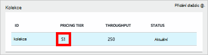
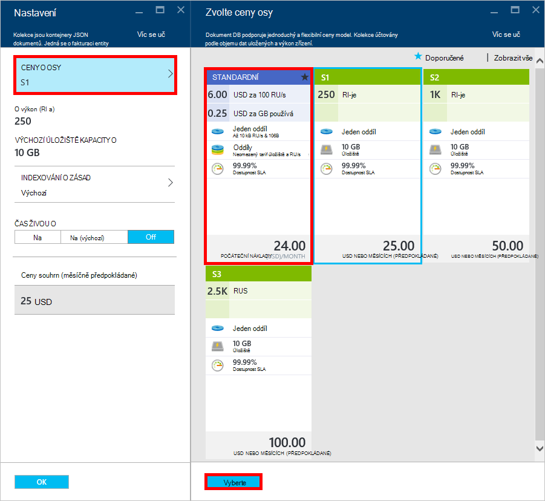
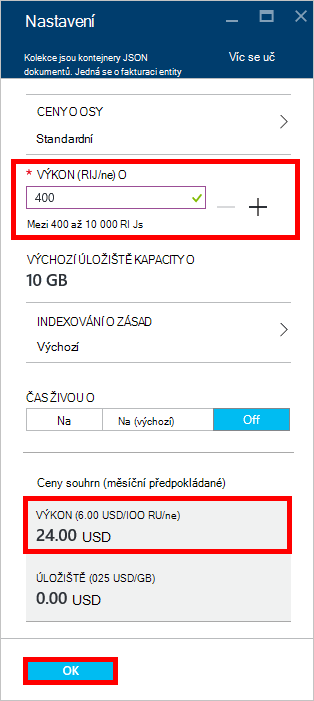
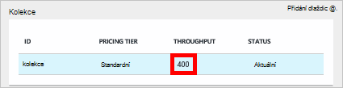

<properties 
    pageTitle="Supercharge účtu DocumentDB S1 | Microsoft Azure" 
    description="Výhodou lepší výkon ve vašem účtu DocumentDB S1 tím, že pár jednoduchých změn na portálu Azure." 
    services="documentdb" 
    authors="mimig1" 
    manager="jhubbard" 
    editor="monicar" 
    documentationCenter=""/>

<tags 
    ms.service="documentdb" 
    ms.workload="data-services" 
    ms.tgt_pltfrm="na" 
    ms.devlang="na" 
    ms.topic="article" 
    ms.date="08/25/2016" 
    ms.author="mimig"/>

# Supercharge účtu DocumentDB

Tento postup umožní využít výhod lepší výkon pro váš účet Azure DocumentDB S1. S malým žádné další nákladů můžete zvýšit výkon svůj stávající S1 účet z 250 [RU/s](documentdb-request-units.md) 400 RU/s nebo více!  

> [AZURE.VIDEO changedocumentdbcollectionperformance]

## Změna uživatelské výkon na portálu Azure

1. V prohlížeči přejděte na [**portál Azure**](https://portal.azure.com). 
2. Klikněte na tlačítko **Procházet** -> **DocumentDB (NoSQL)**a pak vyberte DocumentDB účet, který chcete upravit.   
3. V **databázích** lens vyberte databázi, kterou chcete upravit a vyberte kolekce s cenových osy S1 v zásuvné **databázi** .

      

4. V zásuvné **kolekce** klikněte na **Další**a potom klikněte na **Nastavení**.   
5. V **Nastavení** zásuvné klikněte **Ceny osy** a zjistíte, že je zobrazena měsíční odhadu nákladů pro každý plán. V zásuvné **Zvolit ceny vrstva** klikněte na **Standardní**a potom klikněte na Uložit uložte změnu textu **Vyberte** .

      

6. Po návratu do zásuvné **Nastavení** **Ceny osy** se změní na **Standardní** a zobrazí se pole **výkon (RU/ne)** s výchozí hodnotou 400. Klikněte na **OK** uložte provedené změny. 

    > [AZURE.NOTE] Můžete nastavit výkon mezi 400 až 10 000 [požádat o jednotky](../articles/documentdb/documentdb-request-units.md)/second (RU/ne). **Ceny souhrnu** v dolní části stránky se automaticky aktualizuje poskytnout odhad nákladů na měsíční.
    
    

8. Zpět na zásuvné **databáze** můžete ověřit přeplňované výkon kolekce. 

    

Další informace o změnách týkající se výkonu definované uživatelem a předdefinovaných najdete v blogovém příspěvku [DocumentDB: všechno, co byste měli vědět o používání nové ceny možnosti](https://azure.microsoft.com/blog/documentdb-use-the-new-pricing-options-on-your-existing-collections/).

## Další kroky

Pokud se rozhodnete, že budete potřebovat další výkon (větší než 10 000 RU/s) nebo další úložiště (větší než 10GB) můžete vytvořit kolekci oddílů. Vytvoření kolekce rozdělený najdete v tématu [vytvoření kolekce](documentdb-create-collection.md).