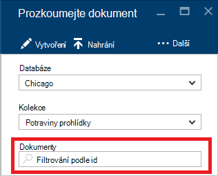

<properties
    pageTitle="Průzkumník dokumentů DocumentDB, chcete-li zobrazit JSON | Microsoft Azure"
    description="Informace o podokně dokumentu DocumentDB Azure portálu nástrojů zobrazit JSON, upravit, vytvořit a nahrát dokumenty JSON s DocumentDB, databázi NoSQL dokumentu."
        keywords="zobrazení json"
    services="documentdb"
    authors="kirillg"
    manager="jhubbard"
    editor="monicar"
    documentationCenter=""/>

<tags
    ms.service="documentdb"
    ms.workload="data-services"
    ms.tgt_pltfrm="na"
    ms.devlang="na"
    ms.topic="article"
    ms.date="08/30/2016"
    ms.author="kirillg"/>

# Zobrazit, upravit, vytvořit a uložit dokumenty JSON pomocí Průzkumníka DocumentDB dokumentu

Tento článek obsahuje přehled o podokně dokumentu [Microsoft Azure DocumentDB](https://azure.microsoft.com/services/documentdb/) Azure portálu nástroj, který umožňuje zobrazit, upravit, vytvoření, nahrát a filtrovat dokumenty JSON s DocumentDB. 

Všimněte si, že Průzkumník dokumentů není povolený DocumentDB účtů s podporou protokolu MongoDB. Tato stránka bude aktualizovat, když je tato funkce zapnutá.

## Spuštění Průzkumník dokumentů

1. Na portálu Azure v Jumpbar klikněte na **DocumentDB (NoSQL)**. Pokud **DocumentDB (NoSQL)** není zobrazená, klikněte na **Další služby** a potom klikněte na **DocumentDB (NoSQL)**.

2. Vyberte název účtu. 

3. V nabídce zdrojů klikněte na položku **Průzkumník dokumentu**. 
 
    

    V **Dokumentu Explorer** zásuvné rozevíracích seznamů **databází** a **kolekcí** předem vyplněné v závislosti na kontextu, ve kterém je spuštěn Průzkumník dokumentů. 

## Vytvoření dokumentu

1. [Spusťte Průzkumníka dokumentu](#launch-document-explorer).

2. V zásuvné **Průzkumník dokumentů** klikněte na **Vytvořit dokument**. 

    Minimální fragment JSON je k dispozici v zásuvné **dokumentu** .

    

2. V **dokumentu** zásuvné zadejte nebo vložte obsah JSON dokument, který chcete vytvořit a klikněte na tlačítko **Uložit** potvrďte svůj dokument shromažďování podle zásuvné **Průzkumník dokumentů** a databáze.

    

    > [AZURE.NOTE] Pokud nezadáte vlastnost "id", pak dokument Explorer automaticky přidá vlastnost id a vygeneruje GUID jako hodnotu id.

    Pokud už máte data z JSON soubory, MongoDB SQL serveru, soubory CSV, úložiště tabulek Azure, Amazon DynamoDB, HBase, nebo z jiných kolekcí DocumentDB společnosti DocumentDB slouží [Nástroje pro migraci dat](documentdb-import-data.md) lze rychle importovat data.

## Úprava dokumentu

1. [Spusťte Průzkumníka dokumentu](#launch-document-explorer).

2. Úprava existujícího dokumentu, vyberte ji v zásuvné **Průzkumník dokumentů** , otevření dokumentu v zásuvné **dokument** a klepněte na tlačítko **Uložit**.

    

    Pokud při úpravě dokumentu a zjistíte, že chcete-li zrušit aktuální sadu úpravy, jednoduše klikněte na **Zrušit** v **dokumentu** zásuvné, potvrďte kliknutím na zahodit a znovu načte předchozí stavu dokumentu.

    

## Odstranění dokumentu

1. [Spusťte Průzkumníka dokumentu](#launch-document-explorer).

2. Vyberte dokument v **Průzkumníku dokumentu**, klikněte na **Odstranit**a pak ho potvrďte odstranění. Po potvrzení, dokument okamžitě odstraní ze seznamu Průzkumník dokumentů.

    

## Práce s dokumenty JSON

Průzkumník dokumentů ověří, že všechny nové nebo upravit dokument obsahuje platné JSON.  Můžete dokonce chyby JSON zobrazení tak, že umístíte ukazatel myši nad nesprávné části zobrazení podrobností o chybě ověření.

Průzkumník dokumentů navíc zabrání ukládání dokumentu s obsahem neplatné JSON.

Nakonec Průzkumník dokumentů umožňuje snadno zobrazit vlastnosti systému aktuálně načtený dokument kliknutím na příkaz **Vlastnosti** .

> [AZURE.NOTE] Vlastnost časové razítko (_ts) interně tvaru epocha čas, ale Průzkumník dokumentů zobrazí hodnotu v GMT formátu čitelného.

## Filtrovat dokumenty
Průzkumník dokumentů podporuje několik možností navigace a Upřesnit nastavení.

Ve výchozím nastavení dokumentu načtení k prvních 100 dokumentům v kolekci vybrané podle jejich vytvořené kalendářních dat od od nejstaršího po nejnovější.  Načítání dalších dokumentů (po dávkách 100) tak, že vyberete možnost **načíst více** v dolní části zásuvné Průzkumník dokumentů. Můžete které dokumenty načíst pomocí příkazu **Filtr** .

1. [Spusťte Průzkumníka dokumentu](#launch-document-explorer).

2. V horní části zásuvné **Průzkumník dokumentů** klikněte na **Filtr**.  

    
  
3.  Nastavení filtru se zobrazí pod panelu s příkazy. V nastavení filtru poskytují klauzuli WHERE a/nebo klauzule Order a potom klikněte na **Filtr**.

    

    Průzkumník dokumentů automaticky aktualizovalo výsledky dokumentů, které vyhovují dotaz filtru. Přečtěte si další informace o gramatiky DocumentDB SQL v [dotazu SQL a syntaxe jazyka SQL](documentdb-sql-query.md) článku nebo tisk kopie [dotaz SQL zobrazený cheaty listu](documentdb-sql-query-cheat-sheet.md).

    **Shromažďování** a **databáze** rozevírací seznamy lze snadno změnit kolekci odkud dokumenty jsou aktuálně zobrazujete aniž byste museli zavřete a znovu spusťte Průzkumníka dokumentu.  

    Průzkumník dokumentů taky podporuje filtrování podle jejich vlastnost id aktuálně načtené sady dokumentů.  V okně Filtr dokumenty podle pole id tu jednoduše napište.

    

    Výsledky v podokně dokumentu seznamu jsou filtrovány podle zadaných kritérií.

    

    > [AZURE.IMPORTANT] Průzkumník dokumentů filtr funkce pouze filtry ***současné době*** načetl sady dokumentů a neprovádí dotaz na kolekci aktuálně vybrané.

4. Abyste mohli aktualizovat seznam dokumentů načtena Průzkumníkem dokumentu, klikněte na **Aktualizovat** v horní části zásuvné.

    

## Hromadné přidání dokumentů

Průzkumník dokumentů podporuje hromadné požití jeden nebo více existující JSON dokumenty, až 100 souborů JSON za operace nahrávání.  

1. [Spusťte Průzkumníka dokumentu](#launch-document-explorer).

2. Spustit proces nahrát, klepněte na tlačítko **Uložit dokument**.

    

    Otevře se zásuvné **Odeslat dokument** . 

2. Klikněte na tlačítko Procházet a otevřete okno Průzkumníka souborů, vyberte jeden nebo více dokumentů JSON nahrát, klepněte na tlačítko **Otevřít**.

    

    > [AZURE.NOTE] Průzkumník dokumentů v současné době podporuje až 100 JSON dokumenty na jednotlivé nahrát operaci.

3. Až budete spokojeni s výběr, klikněte na tlačítko **Odeslat** .  Dokumenty se automaticky přidají do mřížky Průzkumník dokumentů a odeslání výsledků se zobrazí v průběhu operace. Chyby importu jsou vykázaného za jednotlivé soubory.

    

4. Po dokončení operace můžete zvolit do jiného 100 dokumenty nahrát.

## Práce s dokumenty JSON mimo portálu

Průzkumník dokumentů na portálu Azure je jediným způsob, jak pracovat s dokumenty v DocumentDB. Můžete taky s dokumenty dá pracovat pomocí [Rozhraní REST API](https://msdn.microsoft.com/library/azure/mt489082.aspx) nebo [klienta SDK](documentdb-sdk-dotnet.md). Například kód najdete v článku [příklady .NET SDK dokumentu](documentdb-dotnet-samples.md#document-examples) a [Příklady Node.js SDK dokumentu](documentdb-nodejs-samples.md#document-examples).

Pokud potřebujete k importu nebo migrace souborů z jiného zdroje (JSON soubory, MongoDB, SQL Server, CSV souborů, tabulky Azure úložiště, Amazon DynamoDB nebo HBase), můžete rychle data importovat do DocumentDB DocumentDB [Nástroje pro migraci dat](documentdb-import-data.md) .

## Poradce při potížích s

**Příznak**: Průzkumník dokumentů vrátí **nebyly nalezeny žádné dokumenty**.

**Řešení**: Ujistěte se, že jste vybrali správný předplatného, databáze kolekce, do kterého byly vloženy dokumenty. Také zkontrolujte, že pracujete v rámci kvót výkon. Pokud pracujete na vaše maximální výkon úrovně a dosáhnout toho, aby omezena, Ztlumením využití aplikace k ovládání v části maximální výkon kvóty kolekce.

**Vysvětlení**: na portálu je poznamenat do jiného volání shromažďování a DocumentDB databáze. Pokud žádostech jsou jsou aktuálně omezena kvůli hovorů ze samostatné aplikace, portálu mohou také sníží, způsobují zdroje pozor, abyste se zobrazí na portálu. Tento problém vyřešit, adresa příčinu použití vysoce výkonných a pak aktualizujte portálu zásuvné. Informace o tom, jak měřit a nižší výkon použití najdete v části [výkon](documentdb-performance-tips.md#throughput) článku [výkonu](documentdb-performance-tips.md) .

## Další kroky

Další informace o DocumentDB SQL gramatiky podporované v Průzkumníku dokument, najdete v článku [dotaz SQL zobrazený a syntaxe jazyka SQL](documentdb-sql-query.md) nebo vytisknout [dotaz SQL zobrazený cheaty listu](documentdb-sql-query-cheat-sheet.md).

[Naučná stezka](https://azure.microsoft.com/documentation/learning-paths/documentdb/) je také užitečné zdroje pro vás jak Další informace o DocumentDB. 
