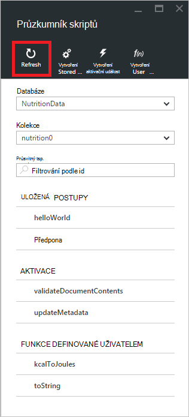

<properties
    pageTitle="DocumentDB skript Průzkumníku editoru jazyka JavaScript | Microsoft Azure"
    description="Informace o podokně skript DocumentDB nástroj Azure portálu pro správu DocumentDB serverovou programovací artefakty včetně uložené procedury, aktivačních událostí a funkcí definovaných uživatelem."
    keywords="editor jazyka JavaScript"
    services="documentdb"
    authors="kirillg"
    manager="jhubbard"
    editor="monicar"
    documentationCenter=""/>

<tags
    ms.service="documentdb"
    ms.workload="data-services"
    ms.tgt_pltfrm="na"
    ms.devlang="na"
    ms.topic="article"
    ms.date="08/30/2016"
    ms.author="kirillg"/>

# Vytvoření a spuštění uložené procedury aktivačních událostí a pomocí Průzkumníka skript DocumentDB funkcí definovaných uživatelem

Tento článek obsahuje přehled [Microsoft Azure DocumentDB](https://azure.microsoft.com/services/documentdb/) Průzkumník skript, který je editor jazyka JavaScript v portálu Azure, který umožňuje zobrazit a spustit DocumentDB serverovou programovací artefakty včetně uložené procedury, aktivačních událostí a funkcí definovaných uživatelem. Přečtěte si další informace o DocumentDB serverovou programování v článku [aktivačních událostí databáze, uložené procedury a funkce definované uživatelem](documentdb-programming.md) .

## Spuštění Průzkumník skriptů

1. Na portálu Azure v Jumpbar klikněte na **DocumentDB (NoSQL)**. Pokud **DocumentDB účty** není zobrazená, klikněte na **Další služby** a klikněte na **DocumentDB (NoSQL)**.

2. V nabídce zdrojů klikněte na položku **Průzkumník skriptu**.

    
 
    **Shromažďování** a **databáze** rozevírací seznamy jsou předem vyplněné v závislosti na kontextu, ve kterém spuštění Průzkumník skriptů.  Například pokud spuštění z databáze zásuvné aktuální databáze je předem vyplněna.  Pokud spuštění z kolekce zásuvné je aktuální kolekci předem vyplněna.

4.  Umožňuje snadno změnit kolekci odkud skripty jsou aktuálně zobrazujete aniž byste museli zavřete a znovu spusťte Průzkumníka skript **databáze** a **kolekce** rozevírací seznamy.  

5. Průzkumník skriptů podporuje také filtrování aktuálně načtené sadu skripty podle jejich id vlastnosti.  Jednoduše napište do pole Filtr a výsledky v seznamu Průzkumník skriptů jsou filtrovány podle zadaných kritérií.

    

    > [AZURE.IMPORTANT] Průzkumník skriptů filtrování funkce pouze filtry ze sady ***aktuálně*** načíst skripty a automaticky neaktualizuje aktuálně vybranou kolekci.

5. Abyste mohli aktualizovat seznam skriptů načíst Průzkumníkem skript, jednoduše klikněte na příkaz **Aktualizovat** v horní části zásuvné.

    

## Vytvářet, prohlížet a upravovat uložené procedury, aktivačních událostí a funkcí definovaných uživatelem

Průzkumník skriptů umožňuje snadno provádět operace CRUD DocumentDB serverovou programovací artefakty.  

- Vytvořit skript, jednoduše klikněte na příslušné vytvořit příkaz Průzkumník skriptů zadejte id, zadejte obsah skript a klikněte na **Uložit**.

    

- Při vytváření aktivační událost, musíte taky zadáte operaci typ signálu a aktivační signál aktivační událost

    

- Chcete-li zobrazit skript, jednoduše klikněte skript, které vás zajímají.

    

- Úprava skriptu, jednoduše proveďte požadované změny v JavaScriptu editor a klikněte na **Uložit**.

    

- Zrušit změny čekající na vyřízení skript, jednoduše klikněte na příkaz **Zrušit** .

    

- Průzkumník skriptů umožňuje snadno zobrazit vlastnosti systému aktuálně načtené skriptu po kliknutí na příkaz **Vlastnosti** .

    

    > [AZURE.NOTE] Vlastnost časové razítko (_ts) interně tvaru epocha čas, ale Průzkumník skriptů zobrazí hodnotu v GMT formátu čitelného.

- Pokud chcete odstranit skript, vyberte je v Průzkumník skriptů a klikněte na příkaz **Odstranit** .

    

- Potvrďte odstranění kliknutím na tlačítko **Ano** nebo -li akci odstranění po kliknutí na **žádný**.

    

## Spuštění uložené procedury

> [AZURE.WARNING] Spuštění uložené procedury v Průzkumníku skript ještě nepodporuje Collections straně oddíly serveru. Další informace Navštěvujte blog o [Partitioning a měřítko DocumentDB](documentdb-partition-data.md).

Průzkumník skriptů umožňuje provádět uložené procedury serverovou z portálu Microsoft Azure.

- Při otevírání nového zásuvné postup vytvoření uložené, výchozí skript (*Předpona*) předtím zadali. Chcete-li spustit *předponu* nebo vlastní skript, přidejte *id* a *vstupů*. Všechny vstupy uložené procedury, které podporují více parametrů, musí být v rámci určené (například *["foo", "panel"]*).

    

- Spuštění uložené procedury, jednoduše klikněte na příkaz **Uložit a spouštět** podokna script editor.

    > [AZURE.NOTE] Příkaz **Uložit a spouštět** uloží uloženou procedurou před spuštěním, což znamená, že dojde k přepsání dříve uložené verzi uložená procedura.

- Spuštění úspěšné uložená procedura budou mít stav *úspěšně uloží a spouštět uložené procedury* a vrácených výsledků se zobrazí v podokně *výsledků* .

    

- Pokud spuštění dojde k chybě, chyba se zobrazí v podokně *výsledků* .

    

## Práce s skripty mimo portálu

Průzkumník skriptů Azure portálu je jediným způsob, jak pracovat s uložené procedury aktivačních událostí a funkcí definovaných uživatelem v DocumentDB. Můžete taky spolupracovat s skriptů pomocí rozhraní REST API a [klienta SDK](documentdb-sdk-dotnet.md). Dokumentace rozhraní REST API obsahuje ukázky pro práci s [uložené procedury pomocí ZBÝVAJÍCÍ](https://msdn.microsoft.com/library/azure/mt489092.aspx) [pomocí ZBÝVAJÍCÍ funkce definované uživatelem](https://msdn.microsoft.com/library/azure/dn781481.aspx)a [ZBÝVAJÍCÍ pomocí aktivačních událostí](https://msdn.microsoft.com/library/azure/mt489116.aspx). Ukázky jsou rovněž k dispozici zobrazující jak [pracovat s skriptů pomocí C#](documentdb-dotnet-samples.md#server-side-programming-examples) a [práce s skriptů pomocí Node.js](documentdb-nodejs-samples.md#server-side-programming-examples).

## Další kroky

Další informace o DocumentDB serverovou programování v článku [uložené procedury, databáze aktivačními událostmi a funkce definované uživatelem](documentdb-programming.md) .

[Naučná stezka](https://azure.microsoft.com/documentation/learning-paths/documentdb/) je také užitečné zdroje pro vás jak Další informace o DocumentDB.  
