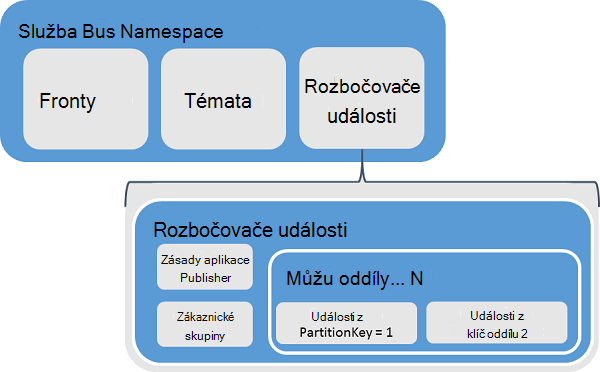
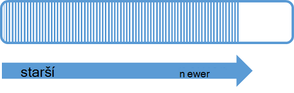
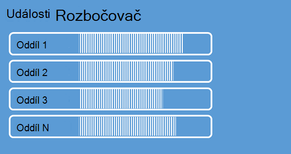
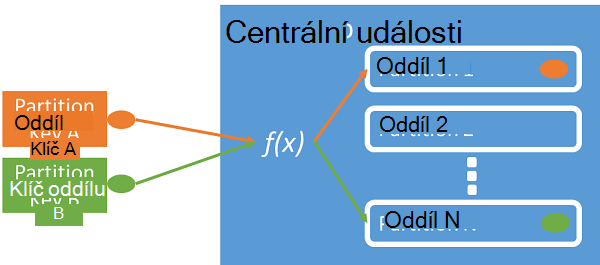
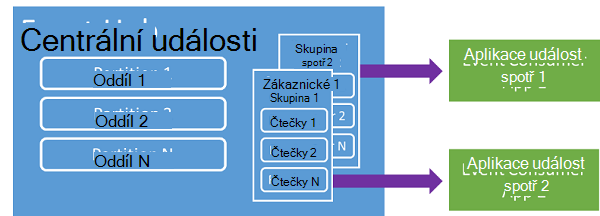
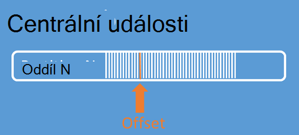
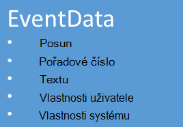

<properties 
    pageTitle="Základní informace o Azure události rozbočovače | Microsoft Azure"
    description="Úvod a základní informace o rozbočovače Azure události."
    services="event-hubs"
    documentationCenter="na"
    authors="sethmanheim"
    manager="timlt"
    editor="" />
<tags 
    ms.service="event-hubs"
    ms.devlang="na"
    ms.topic="get-started-article"
    ms.tgt_pltfrm="na"
    ms.workload="na"
    ms.date="08/16/2016"
    ms.author="sethm" />

# Přehled Azure rozbočovače události

Poskytovat prostředí adaptivní zákazníků nebo ke zlepšení produkty prostřednictvím nepřetržitý zpětnou vazbu a automatické telemetrie, aby byla mnoho moderní řešení. Tato řešení jsou před sebou na výzvu bezpečně a problémy se spolehlivým zpracování velké množství informací z mnoha souběžné vydavatelé. Microsoft Azure události rozbočovače je služba spravovaných platformy, která poskytuje základ pro příjem ve velkém rozsahu dat v široká škála scénáře. Příklady scénářů jsou chování sledování v mobilních aplikacích, přenosu informací z webové serverové farmy, událostí v hra snímku v konzole her nebo telemetrickými daty odebrané průmyslové počítače nebo připojení vozidla. Běžné roli, který se přehrává rozbočovače událostí v architektury řešení je, že funguje jako "přední dveří" pro událost kanálu, někdy označovány jako *ingestor události*. Událost ingestor je součást nebo službu, které najdete mezi vydavatelé událostí a příjemci události oddělit výrobní tok událost z spotřebu tyto události.

Azure rozbočovače událostí je události zpracování služba, která poskytuje událostí a telemetrie průniku do cloudu v rozsáhlé měřítku s nízkou latence a vysoký spolehlivosti. Tato služba použít s jinými službami podřízené je užitečné v aplikaci přístrojového vybavení, uživatelské prostředí nebo pracovního postupu zpracování a scénáře Internet věcí (IoT). Událost rozbočovače poskytuje proudu zpráv zpracování funkce a když rozbočovači události je podobný fronty a témata entitu, má vlastnosti, které jsou velmi liší od tradiční enterprise zasílání zpráv. Pole organizace zpráv běžně nevyžadují sofistikované funkce, například řazení, nepoužívaných písma, transakce podpory a silných doručení záruky, při dominantní znepokojení pro příjem události vysoký výkon a zpracování flexibilitu pro datové proudy události. Proto funkce události rozbočovače lišit služby Bus témata v tom, že jsou důrazně tendenční vysoký výkon a zpracování scénáře události. Jako takové rozbočovače události není provedení některých zpráv funkcí, které jsou k dispozici pro témata. Pokud potřebujete tyto možnosti, témata zůstat optimální voleb.

Rozbočovači události se vytvoří na úrovni události rozbočovače názvů, podobně jako služby Bus fronty a témata. Událost rozbočovače používá jako jeho primární rozhraní API AMQP a HTTP. Na následujícím obrázku vidíte vztah mezi rozbočovače událostí a Bus služby.

## Přehled

Událost rozbočovače poskytuje datových proudů prostřednictvím vzorek rozdělený příjemce zprávy. Fronty a témata použití [Soutěží spotř](https://msdn.microsoft.com/library/dn568101.aspx) modelu ve kterém se každý uživatel pokusí přečíst ze stejné fronty nebo zdroje. Tato konkurence pro zdroje nakonec výsledkem složitostí i limity měřítko pro toku zpracování aplikací. Událost rozbočovače používá rozdělený spotř vzorek ve kterém každého příjemce pouze čte dílčí nebo oddílu proudu zpráv. Tento způsob umožňuje vodorovné měřítko pro zpracování události a poskytuje další zaměřené toku funkce, které nejsou k dispozici ve frontách a témata.

### Oddíly

Oddíl je uspořádaných sekvenci událostí uloženy v centrální události. Při doručení novější události, se přidají do konce tomto pořadí. Oddíl můžete považovat za "Potvrdit protokol."

Oddíly uchovávání dat nakonfigurované uchovávání informací čas, který je nastavený na úrovni Centrální události. Toto nastavení se použije na všechny oddíly v případě centrální. Na základě času; vypršení platnosti události Nemůžete odstranit explicitně je. Rozbočovači události obsahuje více oddílů. Každý oddíl je nezávislý a obsahuje vlastní řadu data. Oddíly v důsledku toho často zvětšit podle různých sazeb.

Počet oddílů není zadán na událost centrální údaje o času vytvoření a musí obsahovat 2 až 32 (výchozí hodnota je 4). Oddíly jsou mechanismus data organizace a další související s stupeň podřízené paralelismu podle jinými programy než události rozbočovače výkonu. Díky volba počet oddílů v rozbočovači události přímo související s počet souběžné čteček, kterou budete chtít mít. Po vytvoření události centrální počet oddílů není možné změnit; byste měli vědět toto číslo z hlediska dlouhodobé očekávané měřítko. Limit 32 oddíl můžete zvýšit kontaktováním Bus služby.

A oddíly se můžou posílat přímo, že je vhodné Vyhněte se odesílání dat do určité oddíly. Místo toho můžete vyšší úroveň konstrukce zavedená v části [vydavatele události](#event-publisher) a [Zásada publikování](#capacity-and-security) .

V kontextu rozbočovače události zprávy se označují jako *data události*. Data události obsahuje textu události, uživatel definované kontejneru a různých metadata o událost jako je třeba jeho posun v oddílu a číslo posloupnosti proudu. Oddíly budou vyplněna posloupnost data události.

## Vydavatele události

Všechny osoba, která odešle události nebo dat k rozbočovači událostí je *vydavatele události*. Vydavatelé události můžete publikovat události pomocí HTTPS nebo AMQP 1.0. Vydavatelé událostí pomocí token přidružení sdílené podpis aplikace Access (zabezpečení) identifikují k rozbočovači událostí a může mít jedinečný identitu nebo používat běžné přidružení zabezpečení token, podle toho, požadavky scénáře.

Další informace o práci s přidružením zabezpečení najdete v článku [Sdílené ověřování přístupu k podpisu Bus služby](../service-bus-messaging/service-bus-shared-access-signature-authentication.md).

### Běžné úlohy aplikace publisher

Tato část popisuje běžné úkoly pro vydavatele události.

#### Získání tokenu přidružení zabezpečení

Podpis sdílené aplikace Access (přidružení) je mechanismus ověřování pro rozbočovače události. Služba Bus poskytuje zásady přidružení zabezpečení na úrovni Centrální událostí a obor názvů. Token přidružení zabezpečení je generováno z klíče přidružení zabezpečení a je algoritmus hash SHA adresy URL, zakódovaný v určitém formátu. Nazvanou podle této klíč (zásady) a tokenu, služby Bus obnovit algoritmus hash a tedy ověření odesílatele. Za normálních okolností tokeny přidružení zabezpečení pro událost vydavatele vzniká pouze **Odeslat** oprávněním pro rozbočovači zvláštní událost. Tato adresa URL mechanismus tokenu přidružení zabezpečení je základ pro identifikaci Publisheru zavedená v Publisheru zásad. Další informace o práci s přidružením zabezpečení najdete v článku [Sdílené ověřování přístupu k podpisu Bus služby](../service-bus-messaging/service-bus-shared-access-signature-authentication.md).

#### Publikování zvláštní události

Můžete publikovat události prostřednictvím AMQP 1.0 nebo HTTPS. Služba Bus poskytuje [EventHubClient](https://msdn.microsoft.com/library/microsoft.servicebus.messaging.eventhubclient.aspx) třídu pro publikování události k rozbočovači události klientů .NET. U ostatních runtimes a platformy můžete použít libovolný AMQP 1.0 klientů, jako je [Apache Qpid](http://qpid.apache.org/). Můžete publikovat události jednotlivě nebo dávce. Jedinou publikaci (instanci data události) může obsahovat maximálně 256KB, bez ohledu na to, zda je jedné události nebo listu. Publikování události větší než výsledkem je chyba. Je nejvhodnější pro vydavatele neví oddílů v Centru událostí a zadat pouze *oddílů klíč* (zavedená v další části) nebo identitu prostřednictvím jejich token přidružení zabezpečení.

Možnost použití AMQP nebo HTTPS závisí na scénáře použití. AMQP vyžaduje zřízení trvalý obousměrný socket kromě přenosová zabezpečení na úrovni (TLS) nebo SSL/TLS. To může být nákladná operace z hlediska v síti, ale jenom se stane na začátku relaci AMQP. Protokol HTTPS v má nižší počáteční režijních, ale nároky vyžaduje další protokol SSL pro každý požadavek. Pro vydavatele, kteří často publikovat události nabízí AMQP významné úspor výkon, zpoždění a výkon.

### Klíč oddílu

Klíč oddílu je hodnota, která slouží k mapování příchozí data události do určité oddíly za účelem uspořádání dat. Klíč oddílu je hodnotu zadanou odesílatele předaný rozbočovači události. Zpracuje se pomocí funkce statické hash, výsledek vytvoří přiřazení oddíl. Pokud nezadáte klíč oddílu při publikování události, použije se kruhového přiřazení. Při použití kláves oddíl, vydavatele události známa pouze klíč oddílu není oddíl, ke kterému jsou publikované události. Oddělení klíče a oddílu insulates odesílatele z znáte příliš o podřízené zpracování a ukládání událostí. Oddíl klíče jsou důležité pro uspořádání dat pro příjem zpracování, ale jsou zásadně vliv na to, oddíly sami. Na zařízení nebo uživatele jedinečné identity vypadá správného klíč, ale další atributy například zeměpisná oblast můžete taky použít k seskupení souvisejících událostí do jeden oddíl. Následující obrázek znázorňuje odesílatelé události pomocí kláves oddíl Připnutí do oddílů.

Událost rozbočovače zaručuje doručení všech událostí sdílení stejné hodnoty klíče oddílu v pořadí a do stejného oddílu. Je důležité Pokud oddíl klíče slouží zásadám publisher popsané v následující části, pak identitu vydavatele a hodnoty klíče oddíl musí odpovídat. V opačném dojde k chybě.

### Příjemce událostí

Entita, který načítá data událost z rozbočovači událostí je uživatel události. Všechny příjemci události číst toku události prostřednictvím oddílů ve skupině příjemce. Každý oddíl by měl mít jenom jeden aktivní čtečka souborů současně. Všechny události rozbočovače spotřebitele připojení prostřednictvím relace AMQP 1.0 doručované události Jakmile budou k dispozici. Klient nemusí hlasování dat dostupnosti.

#### Zákaznické skupiny

Mechanismus publikovat nebo přihlášení k odběru událostí rozbočovače aktivované prostřednictvím spotř skupin. Skupina příjemce je zobrazení (stav, umístění nebo posun) celé centrum události. Spotř skupinám povolit více náročný aplikací pro každý máte před sebou samostatném zobrazení proudu událostí a číst tok nezávisle na sobě svým vlastním tempem a s vlastní odsazení. V toku zpracování architektura každý podřízený aplikace rovná skupinu příjemce. Pokud chcete k zápisu dat události dlouhodobé úložiště, aplikace Redaktor úložiště je skupina příjemce. Zpracování složitých události je prováděn jiný, samostatné spotř skupiny. Oddíly můžete přistupovat pouze prostřednictvím skupiny příjemce. V centrální událostí je vždy výchozí skupiny příjemce a můžete vytvořit maximálně 20 skupiny spotř standardní osy události centrální.

Následující příklady názvů URI spotř skupiny:

    //<my namespace>.servicebus.windows.net/<event hub name>/<Consumer Group #1>
    //<my namespace>.servicebus.windows.net/<event hub name>/<Consumer Group #2>

Následující obrázek znázorňuje příjemci události v rámci skupin, příjemce.

#### Posun toku

Posun je pozice události v oddílu. Posun si můžete představit jako kurzor straně klienta. Posun je bajt číslování události. Díky uživatel události (čtečka) můžete určit bodu v případě můžete vysílat datovými proudy odkud chtějí začít číst události. Posun můžete určit časové razítko nebo jako posun hodnotu. Klienty zodpovídají pro ukládání vlastní hodnoty odsazení mimo službu rozbočovače události.

V oddílu včetně každou událost posun. Tento posun používá spotřebitele zobrazíte umístění v pořadí událostí pro daný oddíl. Pořadová čísla lze předat centru událost jako buď číslo nebo hodnotu časového razítka při čtení připojení.

#### Kontrola

*Kontrola* je proces prodloužením doby čteček označení nebo potvrdit jejich umístění v posloupnosti události oddíl. Kontrola odpovídá příjemce a dojde na základě za oddíl v rámci skupiny příjemce. To znamená, že pro každou skupinu spotř každý oddíl čtečka musí mít přehled aktuální pozici v případě můžete vysílat datovými proudy a můžete informovat služby, když považuje za toku dat dokončení. Pokud čtečky odpojí z oddílu, když ho znovu připojí čtení na kontrolní bod, která byla dříve odeslána poslední čtečkou tohoto oddílu v dané skupině spotř, nebude zahájen. Když čtečka připojí, předá tento posun události centrální umístění, kam chcete si přečíst. Tímto způsobem můžete kontrola na obou události označit jako "dokončeného" podřízené aplikacemi a stanovit odolnost proti chybám v případě selhání mezi čteček na různých počítačích. Protože události data se zachovají intervalu uchovávání informací zadaná v době, kdy se vytvoří centru události, je možné se vraťte do starší data zadáním nižší posun od tento proces vytváření kontrolních bodů. Pomocí této mechanismus kontrola umožňuje odolnost proti chybám převzetí a přehrání toku řízeného událostí.

#### Běžné úkoly příjemce

Tato část popisuje běžné úkoly příjemci události rozbočovače událost nebo čtenáři. Všechny události rozbočovače spotřebitele připojení prostřednictvím AMQP 1.0. AMQP 1.0 je relace a rozpoznání stavu obousměrnou komunikaci kanálu. Každý oddíl má relaci odkaz AMQP 1.0, který usnadňuje transport události odděleny oddíl.

##### Připojení k oddílu

Abyste mohli využívat události z rozbočovači události, musíte příjemce připojit k oddílu. Jak jsme zmínili dříve, je vždy přístup k oddílům prostřednictvím spotř skupiny. Jako součást modelu rozdělený příjemce třeba jenom jeden čtení aktivní v oddílu v daném čase v rámci skupiny příjemce. Při připojování přímo do oddílů použít předmětem mechanismus k koordinaci čtečka připojení k určité oddíly, je obvyklé. Tímto způsobem je možné pro každý oddíl ve skupině spotř mít jenom jeden aktivní čtečka souborů. Správa umístění v pořadí čtení je důležité úkol, který je dosáhnout kontrola. Tato funkce je zjednodušené pomocí třídy [EventProcessorHost](https://msdn.microsoft.com/library/microsoft.servicebus.messaging.eventprocessorhost.aspx) pro klienty .NET. [EventProcessorHost](https://msdn.microsoft.com/library/microsoft.servicebus.messaging.eventprocessorhost.aspx) agenta inteligentní příjemce a je popsán v další části.

##### Přečtěte si události

Po otevření AMQP 1.0 relace a odkaz pro konkrétní oddíl události jsou doručeny klientovi AMQP 1.0 službou rozbočovače události. Tento mechanismy umožňuje vyšší výkon a latence nižší než na základě vyžádané mechanismy například HTTP GET. Při události odeslány klientovi, pokaždé události dat obsahuje důležité metadata například posun a pořadí číslo, které se používají usnadnit kontrola pro řadu událostí.

Je zodpovědný za správu Tento posun tak, že nejlepší umožňuje Správa průběhu zpracování proudu.

## Funkce a zabezpečení

Událost rozbočovače je velmi scalable paralelní architektura pro průniku proudu. Jako takové existuje několik klíčových aspektů potřeba zvážit při pro změnu velikosti a stejné měřítko řešení založené na rozbočovače události. První tyto možnosti řízení kapacita nazývá *výkon jednotky*, popsané v následující části.

### Výkon jednotky

Výkon objemu události rozbočovače řídí výkon jednotky. Výkon jsou předem počet zakoupených kusů jednotky kapacity. Výběru jednoho výkon patří:

- Průniku: Až 1 MB na druhou nebo 1000 události sekundu.

- Výstupní: Až 2 MB na druhé.

Průniku omezena na kapacitu poskytovanou počet jednotek výkon zakoupili. Odesílání dat nad tento částka za následek výjimce "Překročená kvóta". Tato hodnota je buď 1 MB na druhou nebo 1000 události sekundu nastane nejdřív. Výstupní nevytvoří omezení výjimek, ale je omezené množství přenos dat podle jednotky placené výkon: 2 MB sekundu jednotkové výkon. Pokud dostáváte publikování výjimky sazba nebo čekáte zobrazíte vyšší výstupní zkontrolujte kolik jednotek výkon jste zakoupili pro názvů, ve kterém byl vytvořen centru události. Získat další výkon jednotky, můžete upravit nastavení na stránce **obory názvů** na kartu **Měřítko** [Azure klasické portálu][]. Můžete taky toto nastavení změníte pomocí rozhraní API Azure.

Oddíly jsou koncept organizace dat, jsou výkon jednotky čistě kapacita koncept. Výkon jednotky se vám účtovat poplatky za hodinu a jsou předem placené. Jakmile zakoupili, je výkon jednotky faktura nejméně jednu hodinu. Až 20 výkon můžete pro událost rozbočovače názvů zakoupených kusů a neexistuje účet Azure maximálně 20 výkon jednotky. Tyto výkon jednotky jsou sdíleny všechny události rozbočovače v dané názvů.

Výkon jednotky jsou zřízení na nejlepší plánování řízené úsilí základna a nemusí být k dispozici okamžité koupit. Pokud požadujete konkrétní kapacity, je vhodné koupit tyto výkon jednotky předem. Pokud požadujete víc než 20 výkon jednotky, můžete kontaktovat podporu Azure zakoupit více jednotkám výkon na základě potvrzení v blocích 20 až první 100 výkon jednotky. Kromě toho můžete také koupit bloky 100 jednotek výkon.

Je vhodné pečlivě zůstatek výkon jednotky a oddíly k dosažení optimálního měřítko s rozbočovače události. Jeden oddíl obsahuje maximální měřítko jeden výkon jednotky. Počet jednotek, výkon by měla být větší nebo rovnu počet oddílů v centrální události.

Podrobné informace o cenách, najdete v článku [Ceny rozbočovače události](https://azure.microsoft.com/pricing/details/event-hubs/).

### Zásady aplikace Publisher

Událost rozbočovače umožňuje podrobného publikum nemůže ovládat vydavatelé události prostřednictvím *zásad aplikace publisher*. Zásady Publisheru jsou je sada funkcí běhu usnadňující velkého množství vydavatelé nezávisle na událost. Publisher zásady je definována vydavatele při publikování události k rozbočovači událostí pomocí následující mechanismus jedinečný identifikátor:

    //<my namespace>.servicebus.windows.net/<event hub name>/publishers/<my publisher name>

Nemáte Publisheru názvy předem můžete vytvářet, ale musí odpovídat tokenu přidružení zabezpečení při publikování na událost, za účelem zajištění identit nezávislé aplikace publisher. Další informace o přidružení zabezpečení najdete v článku [Sdílené ověřování přístupu k podpisu Bus služby](../service-bus-messaging/service-bus-shared-access-signature-authentication.md). Při použití zásad Publisheru, **PartitionKey** hodnotu nastavenou na název aplikace publisher. Pracovat správně, musí odpovídat tyto hodnoty.

## Souhrn

Azure rozbočovače události poskytuje hyper měřítko událostí a telemetrie zpracování služba, která se dá použít pro běžné workflow aplikace a uživatel sledování ve všech velkém měřítku. Umožňuje poskytovat publikovat přihlášením možnosti s nízkou latence a ve velkém měřítku obrovské, událostí rozbočovače sloužit jako "zapnuté rozsah" pro velké Data. Identity na základě Publisheru a seznamy odvolaných jsou tyto možnosti rozšířeného do obvyklé scénáře Internet věci. Další informace o rozpracování událost rozbočovače aplikací najdete v článku [Průvodce programováním rozbočovače události](event-hubs-programming-guide.md).

## Další kroky

Teď, když jste se naučili události rozbočovače koncepty, můžete na přesouvat v následujících případech:

- Začínáme s [kurz rozbočovače události].
- Kompletní [Ukázková aplikace, který využívá rozbočovače události].

[Azure klasické portálu]: http://manage.windowsazure.com
[Kurz rozbočovače události]: event-hubs-csharp-ephcs-getstarted.md
[Ukázka aplikace, která používá rozbočovače události]: https://code.msdn.microsoft.com/windowsazure/Service-Bus-Event-Hub-286fd097
