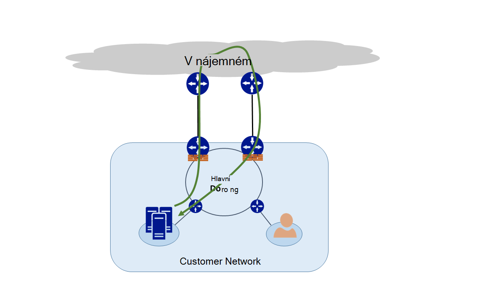
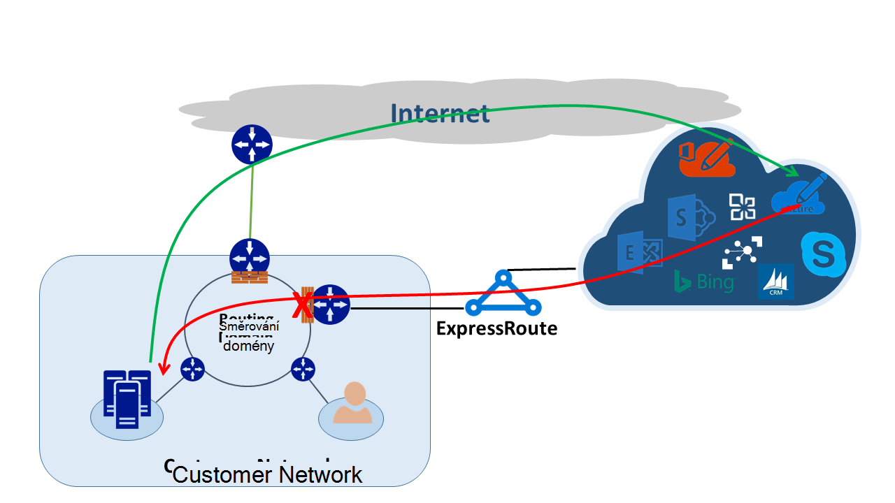
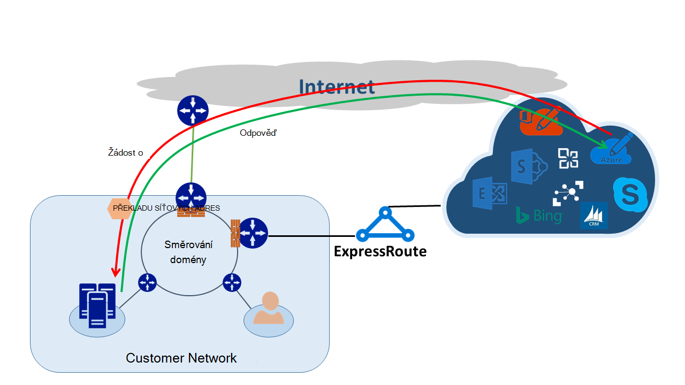

<properties
   pageTitle="Asymetrické směrování | Microsoft Azure"
   description="Tento článek vás provede problémů, které zákazníka může čelit asymetrické směrování v síti, která má více odkazů do cíle."
   documentationCenter="na"
   services="expressroute"
   authors="osamazia"
   manager="carmonm"
   editor=""/>
<tags
   ms.service="expressroute"
   ms.devlang="na"
   ms.topic="get-started-article"
   ms.tgt_pltfrm="na"
   ms.workload="infrastructure-services"
   ms.date="10/10/2016"
   ms.author="osamazia"/>

# Asymetrické směrování s více síťových cest

Tento článek vysvětluje, jak dopředu a vraťte se, že v síti může trvat různé trasy existenci více cest mezi sítě zdrojové a cílové.

Je důležité dva principech porozumět asymetrické směrování. Reprodukujte efekt více síťových cest. Druhý se, jak zařízení, jako třeba bránu firewall, aby stavu. Tyto typy zařízení se označují jako stavové zařízení. Kombinace tyto dva faktory vytvoří scénáře v síť, ve které stavové zařízení nezobrazí přenosy protože stavové zařízení nebyl rozpoznán, budou návštěvníci pocházejí samotném zařízení.

## Více síťových cest

Pokud podnikové sítě obsahuje jenom jeden odkaz na Internetu prostřednictvím jejich poskytovatele služeb Internetu, prochází všechny přenosy z Internetu a stejnou cestu. Často společnosti zakoupit více obvody jako nadbytečné cesty zlepšit provozu sítě. Důvody tohoto chování, je možné, že přenos přejde mimo síti a k Internetu, procházející jeden odkaz a zpáteční přenosy prochází jiný odkaz. Toto je známý jako asymetrické směrování. V asymetrické směrování obráceném v síti, která bude jinou cestu z původního toku.

I když dojde k především na Internetu, asymetrické směrování také platí pro jiné kombinace více cest. Použije, například cesty k Internetu i soukromé cestu přejděte se stejným cílem a více soukromé cesty, která se stejným cílem.

Každý směrovači tím, zdrojem do cíle, vypočítá nejlepší cestu pro dosažení cíle. Směrovači určení nejlepší možné cestu je založeno na dva hlavní faktory:

-   Směrování mezi externími sítěmi vychází z směrovací protokol ohraničení brány (BGP Protocol). BGP trvá inzerce z sousední a spustí pomocí několika jednoduchých kroků k určení nejlepší cestu do zamýšleného cíle. Uloží nejlepší cestu tabulkách.
-   Délka masky podsítě přidružené trasu vlivů cest. Pokud směrovačem obdrží více inzerce stejné IP adresy, ale s různých masek podsítí, směrovači dává přednost reklamní s maskou delší podsítě, protože se má za konkrétnější směrování.

## Stavová zařízení

Směrovači vyhledejte záhlaví IP paketu účely směrování. Některá zařízení vypadat i hlubší uvnitř paketů. Podívejte se obvykle tato zařízení Layer4 (Transmission Control Protocol nebo TCP; nebo protkol UDP nebo UDP) nebo dokonce Layer7 záhlaví (aplikace Layer). Tyto typy zařízení jsou zabezpečení zařízení nebo optimalizace šířky pásma zařízení. 

Brána firewall je běžným příkladem stavové zařízení. Brána firewall povolit nebo odepřít paket projít jeho rozhraní podle různých polí, například podle protokolu TCP/UDP portů a adresa URL záhlaví. Tato úroveň inspekci paketů umístí se při velkém zatížení zařízení zpracování. Aby se zvýšil výkon, bránu firewall zkontroluje, zda obsahuje prvního paketu tok. Pokud dovoloval paketu pokračovat, bude toku informací v tabulce stavu. Všechny následující pakety týkající se tohoto toku jsou povoleny založené na první určení. Paket, který je součástí existující toku může zahltit bránu firewall. Pokud brána firewall žádné původní stav informace o tom, bránu firewall vynechává paketu.

## Asymetrické směrování s ExpressRoute

Když se připojíte společnosti Microsoft prostřednictvím Azure ExpressRoute, změny sítě takto:

-   Máte více vazeb mezi společnosti Microsoft. Jeden odkaz je stávající připojení k Internetu a druhý spočívá ve využití ExpressRoute. Některé vysílání Microsoftu může přejít prostřednictvím Internetu, ale vrátit prostřednictvím ExpressRoute nebo naopak.
-   Dostáváte konkrétnější IP adresy prostřednictvím ExpressRoute. Ano pro přenosy v síti Microsoftu služby nabízených prostřednictvím ExpressRoute směrovači vždy používat pouze ExpressRoute.

Abyste porozuměli efekt, který tyto dvě změny v síti, dále se podívejme některé scénáře. Jako příklad máte jenom jednu okruh k Internetu a používání všechny služby společnosti Microsoft prostřednictvím Internetu. Přenosy v síti Microsoft a zpět projde stejný odkaz Internet a projde přes bránu firewall. Brána firewall záznamů tok a uvidí prvního paketu vrácené pakety jsou povoleny protože tok nachází v tabulce stavu.

Potom zapněte ExpressRoute a používání služeb společnosti Microsoft prostřednictvím ExpressRoute. Další služby od Microsoftu jsou spotřebované množství přes Internet. U svého okraje, který je spojený s ExpressRoute nasadíte samostatné bránu firewall. Microsoft oznamuje konkrétnější předpony k síti prostřednictvím ExpressRoute pro konkrétní služby. Infrastruktura směrování zvolí ExpressRoute jako upřednostňovaný cesty pro tyto předpony. Pokud vaše veřejné adresy IP společnosti Microsoft nejsou reklamní přes ExpressRoute, Microsoft informuje uživatele o pomocí veřejné adresy IP přes Internet. Přeposílání přenosy v síti společnosti Microsoft používá ExpressRoute a obráceném přenosy od společnosti Microsoft používá na Internetu. Při bránu firewall na okraji uvidí paket odpověď pro toku, který nedokáže najít v tabulce stavu, zruší zpáteční přenosy.

Pokud se rozhodnete sdělit nám fondu překladu adres stejné síti ExpressRoute a pro Internet, zobrazí se podobnými problémy s klienty v síti na soukromé IP adres. Žádosti o služby, jako třeba Windows Update přejít prostřednictvím Internetu, protože instalační program IP adres pro tyto služby prostřednictvím ExpressRoute. Však zpáteční přenosy vracejí prostřednictvím ExpressRoute. Pokud společnost Microsoft obdrží IP adresu se stejnou maskou podsítě z Internetu a ExpressRoute, dává přednost ExpressRoute přes Internet. Pokud bránu firewall nebo jiné stavové zařízení, která je na okraj sítě a protilehlé ExpressRoute žádný předchozího informace o řízení toku, vynechává pakety patřícími do s tokem.

## Asymetrické směrování řešení

Máte dvě možnosti hlavním účelem vyřešení problému asymetrické směrování. Reprodukujte pomocí směrování a druhý je pomocí založené na zdrojích překladu síťových adres (SNAT).

### Směrování

Ujistěte se, aby veřejné adresy IP oznámeny odpovídající rozsáhlým sítě WAN odkazy. Například pokud chcete použít na Internetu pro přenos s ověřováním a ExpressRoute pro přenos pošty, neměli přístupné IP adres veřejné Active Directory Federation Services (AD FS) přes ExpressRoute. Podobně nezapomeňte vystavit místního serveru AD FS IP adres, které po ExpressRoute obdrží směrovači. Trasy přijaté přes ExpressRoute jsou konkrétnější, aby upřednostňovaný cesty pro přenos s ověřováním provádět ExpressRoute společnosti Microsoft. To způsobí, že asymetrické směrování.

Pokud chcete používat ExpressRoute pro ověřování, ujistěte se, že jsou reklamní veřejnou IP adresy služby AD FS přes ExpressRoute bez NAT. Tímto způsobem, pochází od společnosti Microsoft a přejde na místní server AD FS přejde myší ExpressRoute. Vrácení adres zákazníků společnosti Microsoft používá ExpressRoute, protože je upřednostňované postupu přes Internet.

### Na základě zdroj překladu síťových adres

Dalším způsobem řešení asymetrické směrování problémy je pomocí SNAT. Například jste to ještě zprostředkovávat veřejnou IP adresu serveru místní přenos protokol SMTP (Simple Mail) ExpressRoute vzhledem k tomu, kterou chcete použít Internet pro tento typ komunikace. Žádost o, pochází s Microsoft a potom přejde na váš server SMTP místní projde na Internetu. Můžete SNAT příchozí žádosti o interní IP adresu. Zpětné přenos ze serveru SMTP půjde okraj brány (které slouží překladu síťových adres) ne prostřednictvím ExpressRoute. Vrácení přenosy přejde přes Internet.

## Asymetrické směrování zjišťování

Traceroute je nejlepší způsob, abyste měli jistotu, že přenosy v síti procházení očekávané cestu. Pokud budete chtít přenosy z místního serveru SMTP Microsoft umožní cestu Internet, očekávaných traceroute má server SMTP Office 365. Výsledek ověří, že sítě směrem k Internetu a ne směrem k ExpressRoute skutečně opouští přenosy.
