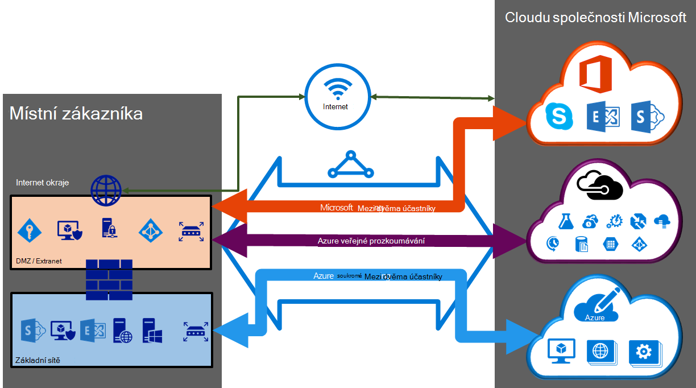

<properties 
   pageTitle="ExpressRoute obvody a směrování domény | Microsoft Azure"
   description="Tato stránka obsahuje přehled ExpressRoute obvody a směrování domény."
   documentationCenter="na"
   services="expressroute"
   authors="cherylmc"
   manager="carmonm"
   editor=""/>
<tags 
   ms.service="expressroute"
   ms.devlang="na"
   ms.topic="article" 
   ms.tgt_pltfrm="na"
   ms.workload="infrastructure-services" 
   ms.date="10/10/2016"
   ms.author="cherylmc"/>

# ExpressRoute obvody a směrování domén

 Musíte objednejte *okruhem ExpressRoute* pro připojení místní infrastruktury společnosti Microsoft prostřednictvím poskytovatele připojení. Následující obrázek obsahuje logické zastoupení propojení mezi sítě WAN a Microsoft.

## Obvody ExpressRoute

*ExpressRoute okruh* představuje logické spojení mezi místním infrastrukturu a cloudovým službám společnosti Microsoft prostřednictvím poskytovatele připojení. Můžete řadit více ExpressRoute obvody. Každý okruh může být ve stejném nebo jiném oblastech a můžete být připojeni k jejich místní prostřednictvím různých připojení poskytovatelů. 

Obvody ExpressRoute není namapovat fyzické entity. Okruh jedinečně identifikovány standardní GUID místo toho jako služby klíč (s klávesami). Klíč služby je jediný druh informací mezi Microsoft poskytovatel připojení a můžete. Klávesu s není tajná z bezpečnostních důvodů. Existuje 1:1 mapování mezi ExpressRoute obvodů a klávesu s.

ExpressRoute okruh můžete mít až tři nezávislé peerings: Azure veřejné, Azure soukromé a Microsoft. Každý prozkoumávání je pár prvků nezávisle na BGP relací z nich nakonfigurovány redundantně dostupnost. Existuje 1: n (1 < = N < = 3) mapování mezi ExpressRoute obvodu a směrování domény. ExpressRoute okruh může mít libovolnou barevnou, dvě nebo všechny tři peerings povolené za ExpressRoute okruh.
 
Každý okruh má pevné šířky pásma (50 MB / 100 MB /, 200 MB /, 500 MB /, 1 GB/s, 10 GB/s) a namapovala zprostředkovatele připojení a peering umístění. Šířka pásma vyberete být sdíleny všechny peerings okruhem. 

### Kvóty, omezení a omezení

Výchozí kvóty a omezení platí pro každý ExpressRoute okruh. Podívejte se na stránce [předplatné Azure a omezení služby, kvót a omezení](../azure-subscription-service-limits.md) aktuální informace o kvótách.

## ExpressRoute směrování domén

ExpressRoute okruh má víc směrování domén přidružená: Azure veřejné, Azure soukromé a Microsoft. Každé směrování domény nakonfigurovaný stejně na pár prvků směrovači (aktivní nebo sdílení zatížení konfigurace) vysoké dostupnosti. Azure services jsou zařazené *Azure veřejné* a *soukromé Azure* představují IP adres schémata.

### Soukromé prozkoumávání

Azure výpočet služeb, zejména virtuálních počítačích (IaaS) a cloudovým službám (PaaS) nasazené v síti virtuální jde připojit přes soukromé peering domény. Soukromé peering doménu je považován za důvěryhodné rozšíření základní sítě do Microsoft Azure. Můžete nastavit obousměrné připojení mezi páteřní síť a Azure virtuálních sítí (VNets). Tento prozkoumávání umožňuje připojit se k virtuálních počítačích a cloudových služeb přímo na soukromých IP adres.  

Více než jedné sítě virtuální můžete připojit k soukromé peering domény. Zkontrolujte [stránku nejčastější dotazy týkající se](expressroute-faqs.md) informace o limitech a omezení. Navštivte stránku [Azure předplatné a omezení služby, kvót a omezeními](../azure-subscription-service-limits.md) pro aktuální informace na omezení.  Podívejte se na stránku [směrování](expressroute-routing.md) podrobné informace o konfiguraci směrování.

### Veřejné prozkoumávání

Služeb, jako je úložišti Azure SQL databáze a weby nabídnuta na veřejnou IP adres. Soukromé připojením ke službám na veřejnou IP adresy, včetně virtuální cloudové služby, až veřejné peering směrování domény. Můžete připojit veřejné peering domény pro váš DMZ a připojení ke všem službám Azure na jejich veřejnou IP adres z vaší sítě WAN bez nutnosti připojení přes internet. 

Připojení je vždy zahájená z vaší sítě WAN ke službám Microsoft Azure. Služby Microsoft Azure nebude moct zahájit připojení do sítě pomocí tohoto postupu domény. Po povolení veřejné prozkoumávání budete moct připojit ke všem službám Azure. Jsme nepovolují selektivně vyberte služby, u kterých jsme inzerce trasy. Můžete si prohlédnete seznam předpon, kterou jsme pro vás inzerce prostřednictvím prozkoumávání na stránce [Microsoft Azure Datacentra rozsahy IP adres](http://www.microsoft.com/download/details.aspx?id=41653) . Na stránce se aktualizuje týdně.

Můžete definovat vlastní směrování filtry v síti používat jenom trasy, které potřebujete. Podívejte se na stránku [směrování](expressroute-routing.md) podrobné informace o konfiguraci směrování. Můžete definovat vlastní směrování filtry v síti používat jenom trasy, které potřebujete. 

Naleznete na [stránku nejčastější dotazy](expressroute-faqs.md) Další informace o službách podporované prostřednictvím veřejné peering směrování domény. 
 
### Prozkoumávání společnosti Microsoft

[AZURE.INCLUDE [expressroute-office365-include](../../includes/expressroute-office365-include.md)]

Prostřednictvím Microsoft prozkoumávání budou připojení na všechny ostatní Microsoft online services (například služby Office 365). Jsme povolit obousměrné připojení mezi cloudovým službám prostřednictvím Microsoft peering směrování domény vaší sítě WAN a Microsoft. Je třeba připojit ke cloudovým službám společnosti Microsoft jenom přes veřejnou IP adresy, které vlastníte vy nebo váš poskytovatel připojení a je nutné splnit všechna definovaný pravidla. Zobrazit stránku [požadavky ExpressRoute](expressroute-prerequisites.md) pro další informace.

Podívejte se na [stránku nejčastější dotazy](expressroute-faqs.md) pro další informace o službách podporované náklady a podrobnosti o konfiguraci. V seznamu poskytovatelů připojení nabízející prozkoumávání podpory společnosti Microsoft najdete na stránce [Umístění ExpressRoute](expressroute-locations.md) informace.

## Směrování porovnání domény

Následující tabulka srovnává tři směrování domény.

||**Soukromé prozkoumávání**|**Veřejné prozkoumávání**|**Prozkoumávání společnosti Microsoft**|
|---|---|---|---|
|**Max. podporované na prozkoumávání # předpony**|4000 ve výchozím nastavení 10 000 s ExpressRoute Premium|200|200|
|**Rozsahy IP adres podporované**|Libovolná platná adresa IPv4 v rámci vaší sítě WAN.|Adresy IPv4 vlastněná vy nebo váš poskytovatel připojení.|Adresy IPv4 vlastněná vy nebo váš poskytovatel připojení.|
|**JAKO číslo požadavky**|Soukromé a veřejné jako čísla. Musíte být vlastníkem veřejnosti jako číslo, pokud se rozhodnete sdělit nám jednu. | Soukromé a veřejné jako čísla. Však musí potvrdit vlastnictví veřejných IP adres.| Soukromé a veřejné jako čísla. Však musí potvrdit vlastnictví veřejných IP adres.|
|**Směrování adres IP rozhraní**|RFC1918 a veřejnou IP adres|IP adresy registrované pro vás v směrování Registry.| IP adresy registrované pro vás v směrování Registry.|
|**Podpora MD5 Hash**| Ano|Ano|Ano|

Můžete povolit jednu nebo víc z těchto směrování domén jako součást jejich ExpressRoute okruh. Můžete mít směrování domény umístění na stejném VPN, pokud chcete sloučit do jedné směrování domény. Je možné umístit na různých směrování domén, podobně jako v diagramu. Doporučená konfigurace je, že soukromé prozkoumávání je připojené přímo k páteřní síť a veřejných a Microsoft prozkoumávání odkazy připojeni k vaší DMZ.
 
Pokud se rozhodnete všechny tři peering relace, musíte mít tři dvojice BGP relací (jeden pár u jednotlivých peering typů). Relace dvojice BGP poskytují vysoce dostupné odkaz. Pokud se připojujete prostřednictvím vrstvy 2 připojení poskytovatelů, bude zodpovědný za konfiguraci a správě směrování. Další informace kontrolou [pracovní postupy](expressroute-workflows.md) pro nastavení ExpressRoute.

## Další kroky

- Najděte poskytovatele služeb. Najdete v článku [poskytovatelé ExpressRoute a umístění](expressroute-locations.md).
- Ujistěte se, že jsou splněné všechny předpoklady. V tématu [požadavky ExpressRoute](expressroute-prerequisites.md).
- Konfigurace připojení k ExpressRoute.
    - [Vytvoření ExpressRoute okruh](expressroute-howto-circuit-classic.md)
    - [Konfigurace směrování (okruh peerings)](expressroute-howto-routing-classic.md)
    - [Odkaz VNet ExpressRoute obvodu](expressroute-howto-linkvnet-classic.md)
